# AI Design: ChatGPT → Desain → Google Flow

> Panduan ringkas untuk membuat brief, gambar, storyboard, dan video AI secara bertahap. Prompt dibuat pendek agar mudah dipahami, disalin, dan direvisi.

## Mulai Cepat

1. Pilih proyek pada [Peta Proyek](#peta-proyek).
2. Siapkan referensi: produk, karakter, logo, dan data resmi.
3. Jalankan prompt ChatGPT secara berurutan: **Brief → Rencana → Prompt Produksi → QC**.
4. Untuk video, lanjutkan ke [Workflow ChatGPT → Google Flow](#workflow-chatgpt--google-flow).
5. Finalkan teks, logo, harga, tanggal, kontak, dan audio di aplikasi editing.

> [!IMPORTANT]
> Ganti semua teks `[GANTI: ...]`. Jangan mengirim placeholder mentah ke ChatGPT atau Flow.

## Prinsip Prompt Ringkas

Prompt yang efektif tidak harus panjang. Gunakan enam bagian ini:

```text
TUJUAN: hasil yang ingin dibuat.
REFERENSI: fungsi setiap gambar atau data.
LOCK: bagian yang tidak boleh berubah.
ARAH KREATIF: audiens, pesan, gaya, dan format.
OUTPUT: bentuk jawaban yang diminta.
LARANGAN: kesalahan yang harus dihindari.
```

Gunakan satu prompt untuk satu keputusan. Jangan meminta brief, script, storyboard, dan video final sekaligus.

## Optimalisasi ChatGPT

### 1. Mulai dengan konteks proyek

```text
Anda adalah creative strategist dan AI design engineer.

Proyek: [GANTI: nama proyek].
Tujuan: [GANTI: awareness/edukasi/penjualan/event].
Audiens: [GANTI: target audiens].
Platform: [GANTI: Instagram/TikTok/YouTube/Form].
Output akhir: [GANTI: poster/video/storyboard/komik].

Gunakan hanya data dan referensi yang saya berikan. Tandai informasi yang
belum pasti; jangan mengarang klaim, harga, tanggal, atau identitas brand.
Jawab ringkas dalam bahasa Indonesia.
```

Lanjutkan dalam percakapan yang sama agar ChatGPT mempertahankan konteks. Buat percakapan baru jika proyek atau brand berubah.

### 2. Beri nama setiap referensi

```text
Image 1 = master produk.
Image 2 = master karakter.
Image 3 = logo resmi.
Image 4 = referensi lokasi atau mood.

Prioritas: identitas produk/karakter > logo > storyboard > mood.
```

### 3. Minta output terstruktur

Gunakan tabel untuk brief dan shot plan. Gunakan blok kode hanya untuk prompt yang akan dipindahkan ke tool lain.

### 4. Kunci hasil yang sudah disetujui

```text
Brief ini disetujui. Jadikan sebagai sumber kebenaran proyek.
Jangan mengubah PRODUCT LOCK, CHARACTER LOCK, data resmi, atau CTA kecuali
saya meminta secara eksplisit.
```

### 5. Revisi satu masalah sekali jalan

```text
Perbaiki hanya: [GANTI: satu masalah].
Lokasi masalah: [GANTI: scene/shot/panel].
Pertahankan: [GANTI: bagian yang sudah benar].
Jangan mendesain ulang elemen lain.
```

## Referensi Visual Fondasi

Gunakan visual berikut sebagai referensi cepat. Klik gambar untuk membukanya dalam ukuran penuh.

| Workflow desain konten | Delapan gaya visual |
|---|---|
| <a href="media/image19.jpeg">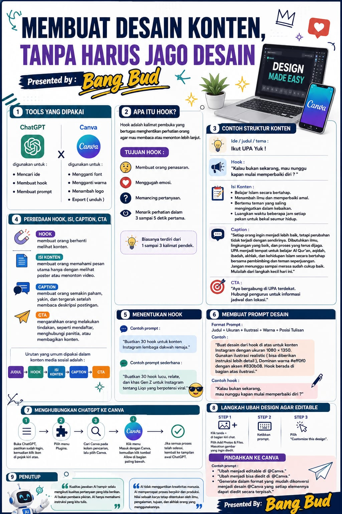</a> | <a href="media/image20.jpeg">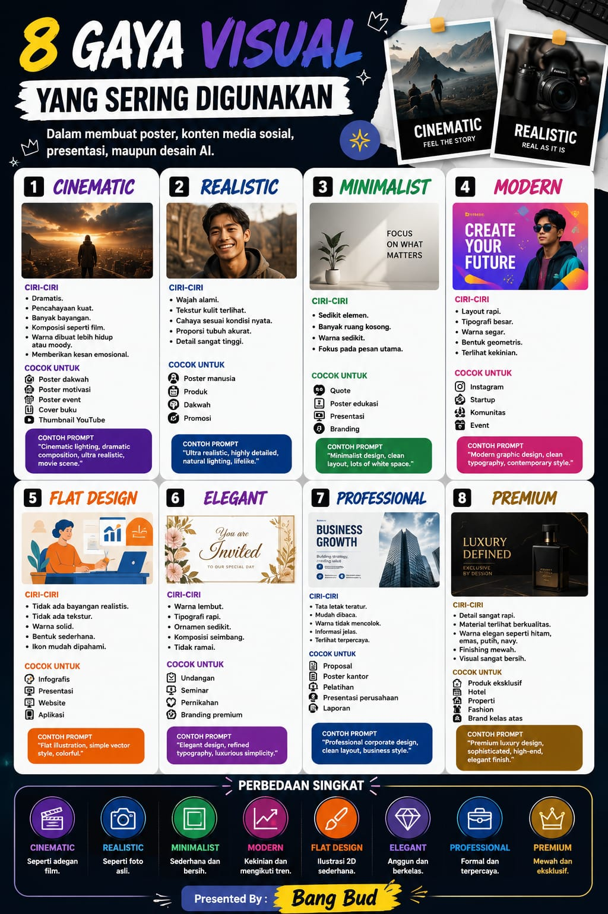</a> |
| **Kata kunci kualitas gambar** | **Kode warna HEX** |
| <a href="media/image21.jpeg">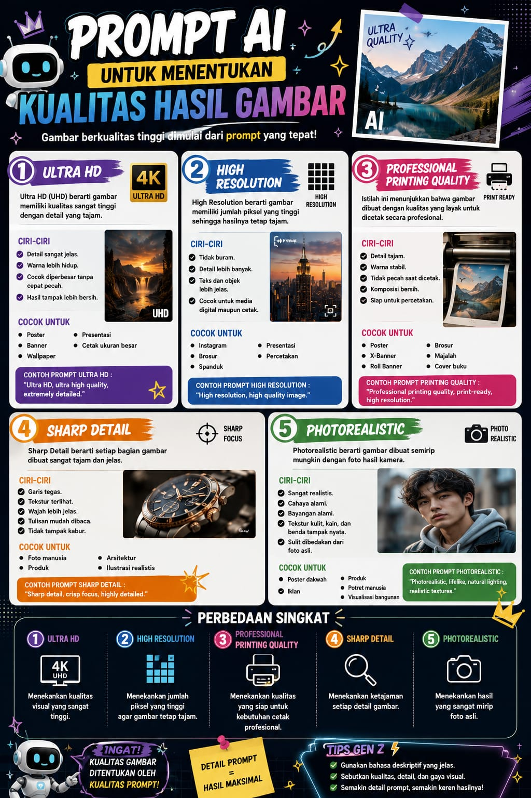</a> | <a href="media/image22.jpeg">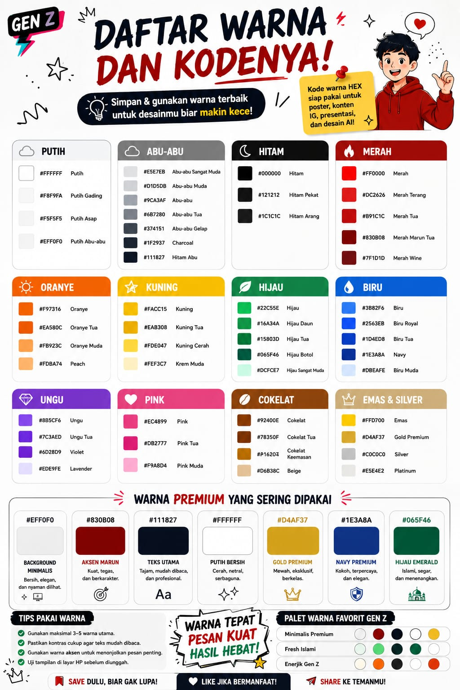</a> |
| **Kombinasi palet warna** | |
| <a href="media/image23.jpeg">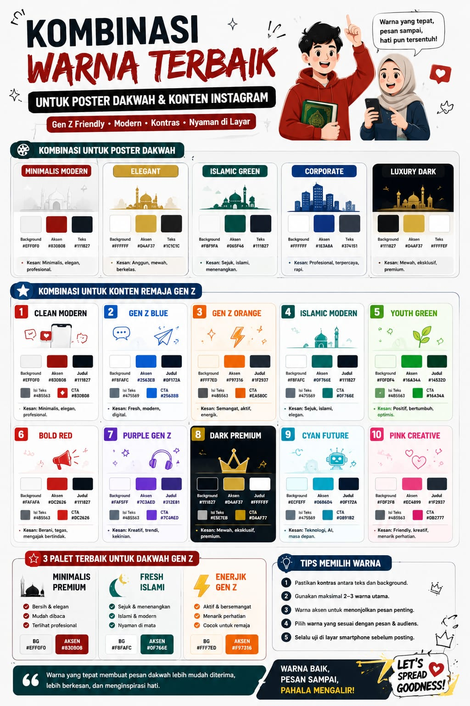</a> | |

## Prompt Inti ChatGPT

### P1 — Analisis dan Brief

```text
Analisis referensi proyek ini.

Pisahkan:
1. Fakta yang terlihat atau terverifikasi.
2. Asumsi kreatif yang aman.
3. Data yang harus dikonfirmasi.

Buat brief ringkas berisi: tujuan, audiens, pesan utama, gaya, format,
PRODUCT/CHARACTER LOCK, batas klaim, dan kriteria QC.
Output maksimal 1 tabel dan 10 poin.
```

### P2 — Ide dan Pilihan Arah

```text
Berdasarkan brief yang disetujui, buat 5 creative angle.
Untuk setiap angle tulis: hook, ide visual, manfaat, dan risiko.
Rekomendasikan 1 angle terbaik beserta alasan singkat.
Jangan mengubah bagian yang sudah dikunci.
```

### P3 — Prompt Gambar

```text
Buat satu prompt gambar siap salin berdasarkan brief dan angle terpilih.

Wajib memuat: subjek, aksi, komposisi, gaya, lighting, palet, rasio,
negative space, LOCK, dan negative prompt.
Teks/logo final akan ditempel manual.
Output hanya satu blok kode; tanpa penjelasan tambahan.
```

### P4 — Script dan Shot Plan Video

```text
Buat script dan shot plan video [GANTI: durasi] detik, rasio [GANTI: rasio].

Gunakan brief dan angle yang disetujui. Hook harus muncul pada 0–2 detik.
Satu shot hanya memiliki satu aksi utama.
Tampilkan tabel: waktu, tujuan shot, visual, aksi, camera, VO/teks, audio,
dan continuity lock. Akhiri dengan CTA.
```

### P5 — Storyboard

```text
Ubah shot plan yang disetujui menjadi storyboard production sheet.

Setiap panel harus memuat: timecode, framing, aksi, arah kamera, dialog/VO,
audio, dan continuity. Pertahankan produk/karakter dari master reference.
Rasio [GANTI: rasio]. Jangan menambahkan scene baru.
```

### P6 — Paket Handoff ke Google Flow

```text
Ubah shot plan yang disetujui menjadi paket Google Flow.

Buat:
1. Master continuity lock maksimal 6 baris.
2. Satu prompt natural-language untuk setiap klip/scene.
3. Daftar reference yang harus diunggah pada setiap klip.
4. First frame dan end frame yang diharapkan.
5. Checklist QC per klip.

Setiap prompt scene harus memuat: subject lock, lokasi, satu aksi utama,
camera, lighting, audio cue, ending frame, dan negative prompt.
Jangan gunakan JSON. Outputkan setiap prompt dalam blok kode terpisah agar
mudah disalin ke Flow.
```

## Workflow ChatGPT → Google Flow

Gunakan alur ini untuk semua proyek video. Nama menu, model, durasi, dan fitur dapat berubah mengikuti akun serta versi Flow.

### A. Siapkan di ChatGPT

1. Jalankan P1 dan koreksi fakta.
2. Jalankan P2, lalu setujui satu creative angle.
3. Jalankan P4 dan periksa total durasi.
4. Jalankan P5 bila membutuhkan storyboard visual.
5. Jalankan P6 untuk menghasilkan prompt Flow per klip.
6. Simpan paket: brief, master reference, shot plan, VO, prompt scene, dan checklist QC.

### B. Generate di Google Flow

1. Buat project baru dan pilih output video.
2. Atur rasio sesuai shot plan: umumnya `9:16` untuk Reels/Shorts atau `16:9` untuk landscape.
3. Pilih model dan durasi yang tersedia. Mulai dengan satu hasil uji, bukan banyak variasi.
4. Unggah reference sesuai daftar dari ChatGPT. Utamakan master produk/karakter yang bersih.
5. Generate **satu scene atau satu aksi utama per klip**.
6. Tempel prompt scene dari P6. Jangan tempel seluruh brief atau semua scene sekaligus.
7. Jika fitur frame tersedia, gunakan first frame untuk identitas awal dan end frame untuk transisi ke klip berikutnya.
8. Review klip terhadap continuity lock sebelum lanjut ke scene berikutnya.
9. Unduh klip yang lolos QC, lalu susun, beri VO, musik, logo, dan teks di editor.

> [!TIP]
> Prompt natural-language adalah default yang paling mudah dipindahkan ke Flow. JSON pada panduan lama hanya berguna sebagai dokumentasi internal, bukan format wajib untuk kolom prompt Flow.

### Template Prompt Scene untuk Flow

```text
SCENE [GANTI: nomor] — [GANTI: nama scene], [GANTI: durasi] detik, [GANTI: rasio].

REFERENCE: gunakan [GANTI: nama file] sebagai master [produk/karakter].
LOCK: pertahankan [GANTI: identitas, warna, bentuk, pakaian, logo].
SETTING: [GANTI: lokasi, waktu, mood, lighting].
ACTION: [GANTI: satu aksi utama].
CAMERA: [GANTI: framing dan satu camera movement].
AUDIO CUE: [GANTI: ambience/SFX; VO ditambahkan saat editing].
END FRAME: [GANTI: kondisi akhir untuk menyambung scene berikutnya].

NEGATIVE: no identity drift, no product deformation, no extra limbs,
no flicker, no random text, no logo mutation, no camera jitter, no watermark.
```

### Jika Hasil Flow Bermasalah

```text
Bandingkan hasil Flow ini dengan master reference dan continuity lock.
Sebutkan maksimal 3 error paling penting. Setelah itu tulis ulang prompt scene
secara lebih pendek untuk memperbaiki error tersebut tanpa mengubah komposisi,
aksi, dan elemen yang sudah benar.
```

## Peta Proyek

| No. | Proyek | Output | Template utama |
|---:|---|---|---|
| 01 | Iklan Sepatu — PVN Taehyung Blue | Flyer + video 10 detik | P1–P6 |
| 02 | Iklan Mainan — Doll Catcher | Video 10 detik | P1, P2, P4–P6 |
| 03 | Iklan Squishy — NeeDoh Nice Cube | Video satisfying 10 detik | P1, P2, P4–P6 |
| 04 | Marketplace — POP SAN Water Slime | Foto + video produk | P1–P6 |
| 05 | Iklan Produk Tanpa Model | Video 10 detik | P1, P4–P6 |
| 06 | Flyer Event → Header Google Form | Flyer + header | P1–P3 |
| 07 | Edukasi Sains Anak — Pelangi | Video 3 scene | P1, P4–P6 |
| 08 | Edukasi Keselamatan — Gempa | Video 3 scene | P1, P4–P6 |
| 09 | Berita Viral Claymation | Video 3 scene | P1, P4–P6 |
| 10 | Animasi Nara & Kiko | Video 3 scene | P1, P4–P6 |
| 11 | Storytelling/Biografi Kartun 2D | Video multi-scene | P1, P4–P6 |
| 12 | AI Influencer & Character Sheet | Character reference | P1–P3 |
| 13 | Video Event Berseri | Video multi-scene | P1, P4–P6 |
| 14 | Komik/Manga dari Brief Event | Komik satu halaman | P1–P3 |

## Panduan Per Proyek

### 01 — Iklan Sepatu

- **Lock:** warna upper, stripe, laces, outsole, silhouette, dan logo.
- **ChatGPT:** P1 → P2 → P3 untuk flyer; P4 → P5 → P6 untuk video.
- **Flow:** buat 5 klip: reveal box, detail, on-feet, walking hero, CTA beauty shot.
- **QC:** outsole dan stripe tidak berubah; klaim produk harus terverifikasi.

| Master reference produk | Contoh storyboard 9:16 |
|---|---|
| <a href="media/image1.png">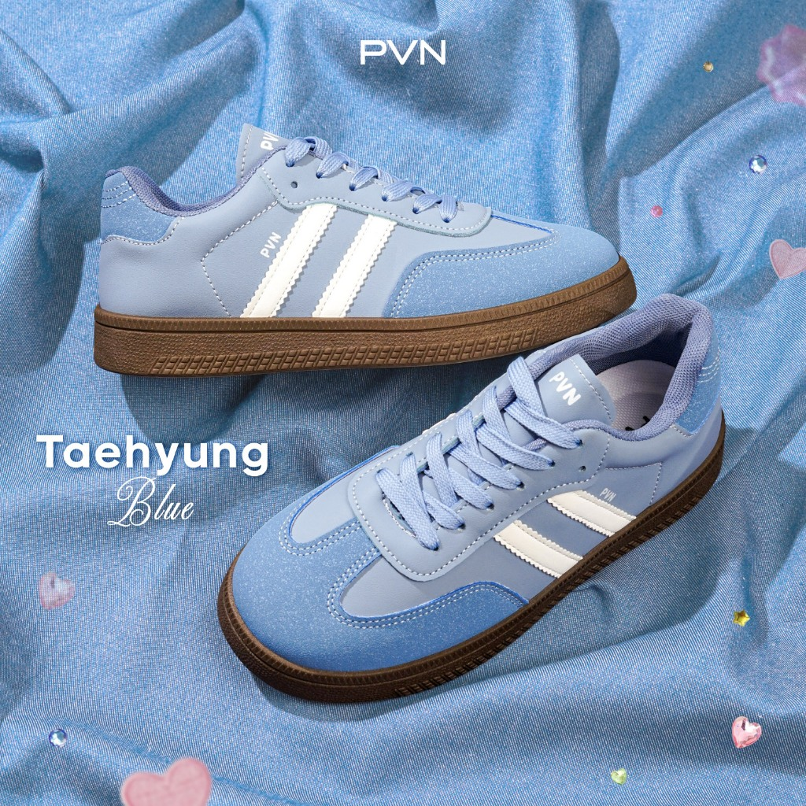</a> | <a href="media/image2.png">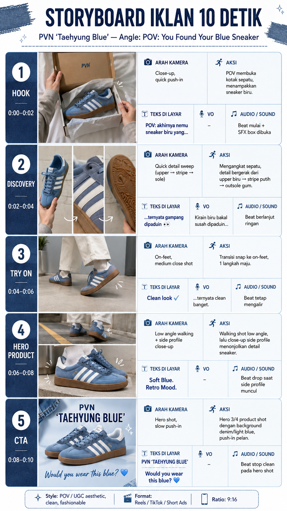</a> |

### 02 — Doll Catcher

- **Lock:** bentuk mesin, warna, kontrol, claw, chute, hadiah, dan mekanisme.
- **ChatGPT:** P1 → P2 → P4 → P5 → P6.
- **Flow:** pecah menjadi reveal, insert control, claw action, prize drop, hero ending.
- **QC:** mekanisme logis; claw dan tombol tidak bertambah atau berubah posisi.

### 03 — NeeDoh Nice Cube

- **Lock:** bentuk kubus, warna, material visual, deformasi, dan slow-rise recovery.
- **ChatGPT:** tekankan macro shot, tactile action, dan foley pada P4/P6.
- **Flow:** satu aksi per klip: press, full squeeze, release, recovery, lineup.
- **QC:** produk tidak meleleh, bocor, atau berubah menjadi material keras.

| Master reference produk | Contoh storyboard satisfying |
|---|---|
| <a href="media/image3.png">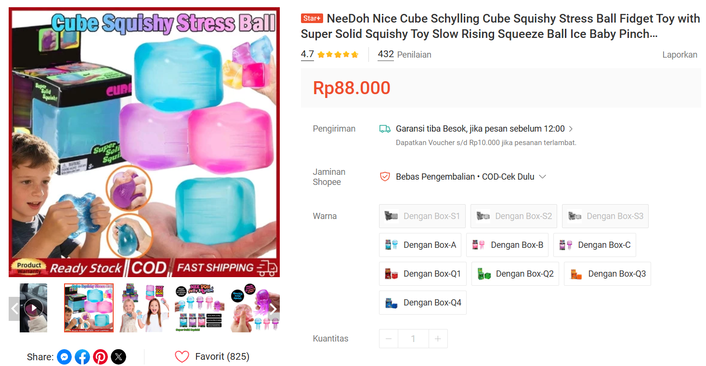</a> | <a href="media/image4.png">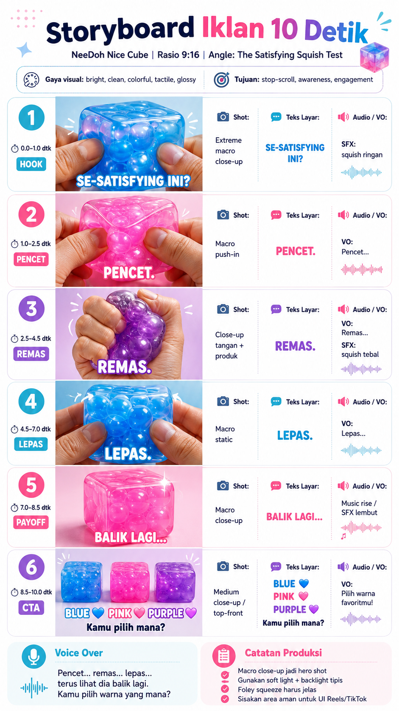</a> |

### 04 — POP SAN Water Slime

- **Lock:** cup, label, warna varian, jelly cube, dan skala produk.
- **ChatGPT:** pada P1 pisahkan fakta listing, klaim penjual, dan data belum pasti.
- **Flow:** generate varian hero, texture action, detail jelly cube, lalu lineup CTA.
- **QC:** jangan membuat sertifikasi, keamanan, atau manfaat yang tidak terverifikasi.

<p align="center"><a href="media/image5.png">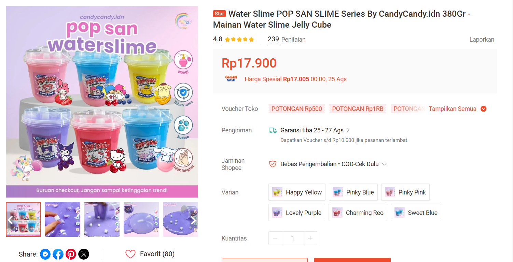</a></p>

*Referensi visual produk dan varian POP SAN Water Slime.*

### 05 — Iklan Produk Tanpa Model

- **Lock:** bentuk, bahan visual, warna, label, dan proporsi produk.
- **ChatGPT:** pada P4 larang manusia dan tangan; gunakan hero/detail/motion/CTA.
- **Flow:** buat klip product-only dengan turntable, macro, controlled motion, dan hero shot.
- **QC:** tidak ada manusia, floating parts, perubahan logo, atau material flicker.

### 06 — Flyer Event dan Header Google Form

- **ChatGPT:** P1 → P2 → P3 untuk key visual dengan negative space.
- **Finalisasi:** tempel ulang judul, tanggal, lokasi, kontak, QR, dan logo secara manual.
- **Adaptasi:** ubah komposisi ke `1600×400`; jangan sekadar crop flyer portrait.
- **QC:** semua data acara terbaca dan sama dengan sumber resmi.

<p align="center"><a href="media/image6.png">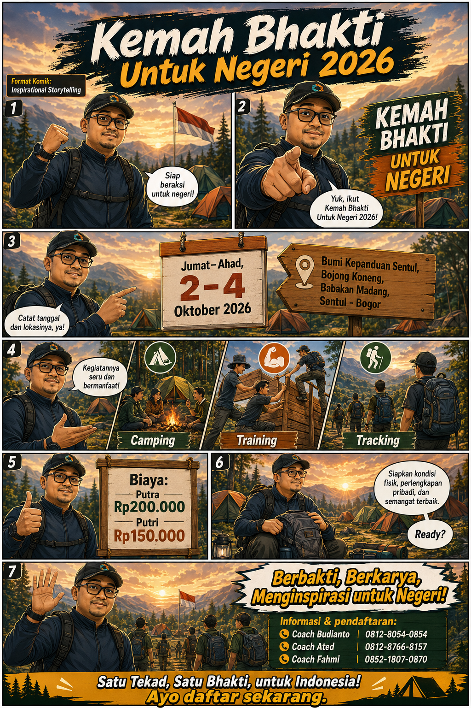</a></p>

*Contoh visual event; data resmi dan tipografi tetap difinalkan manual.*

### 07 — Edukasi Sains Anak

- **Lock:** desain, usia, pakaian, warna, skala, dan sifat setiap karakter.
- **ChatGPT:** verifikasi konsep sains; P4 membagi hook, penjelasan, dan takeaway.
- **Flow:** generate satu scene per klip; gunakan end frame sebagai bridge scene berikutnya.
- **QC:** penjelasan sains benar, karakter stabil, dan visual sesuai usia.

| Storyboard tiga scene | Character sheet Mimi |
|---|---|
| <a href="media/image7.png">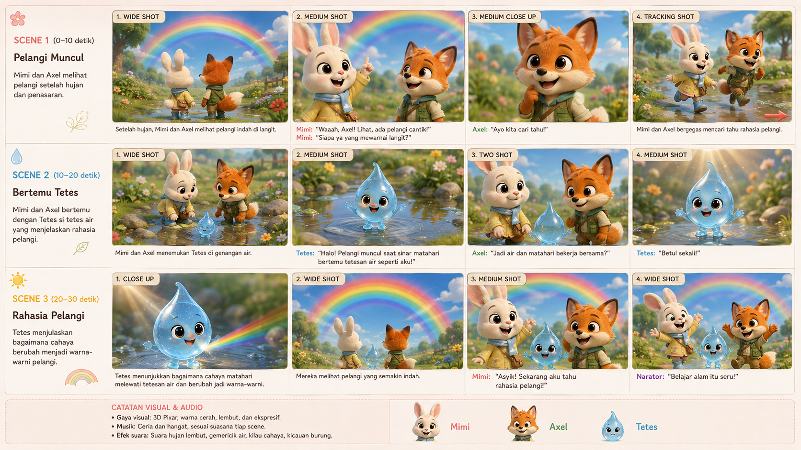</a> | <a href="media/image8.png">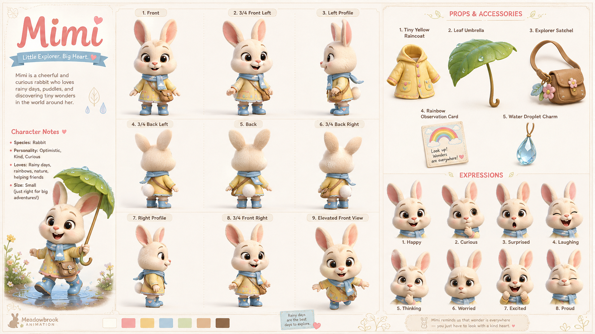</a> |
| **Character sheet Axel** | **Character sheet Tetes** |
| <a href="media/image9.png">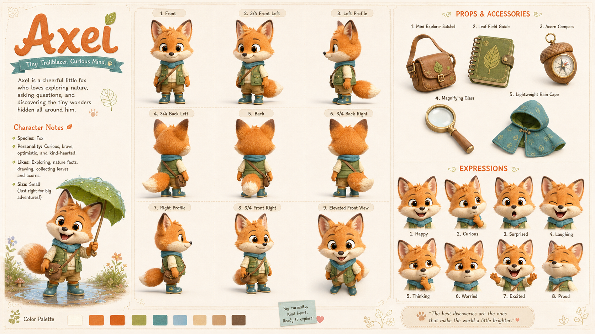</a> | <a href="media/image10.png">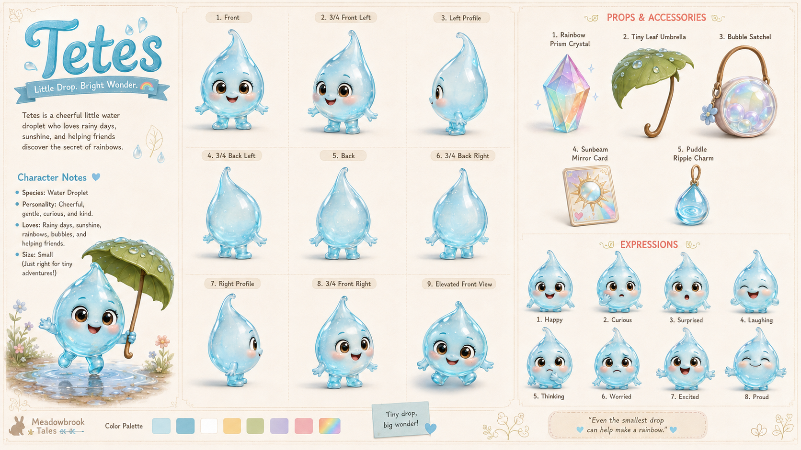</a> |

### 08 — Edukasi Keselamatan Gempa

- **Lock:** karakter, ruang, meja kokoh, dan gaya claymation.
- **ChatGPT:** validasi urutan keselamatan sebelum P4 dan P6.
- **Flow:** scene 1 tanda gempa, scene 2 merunduk–berlindung–berpegangan, scene 3 menuju area aman setelah guncangan berhenti.
- **QC:** jangan menampilkan tindakan berbahaya, kepanikan, atau keluar saat guncangan aktif.

<p align="center"><a href="media/image11.png">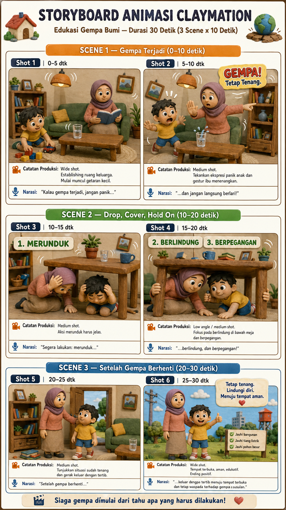</a></p>

*Contoh storyboard vertikal edukasi keselamatan gempa.*

### 09 — Berita Viral Claymation

- **Lock:** fakta, sumber, angka, status verifikasi, dan identitas visual reporter.
- **ChatGPT:** P1 wajib memisahkan fakta, klaim viral, dan klarifikasi.
- **Flow:** hook viral, klarifikasi, lalu takeaway; teks angka ditempel di editor.
- **QC:** hindari fitnah, angka salah, dan visual yang menyatakan klaim belum terverifikasi sebagai fakta.

<p align="center"><a href="media/image12.png">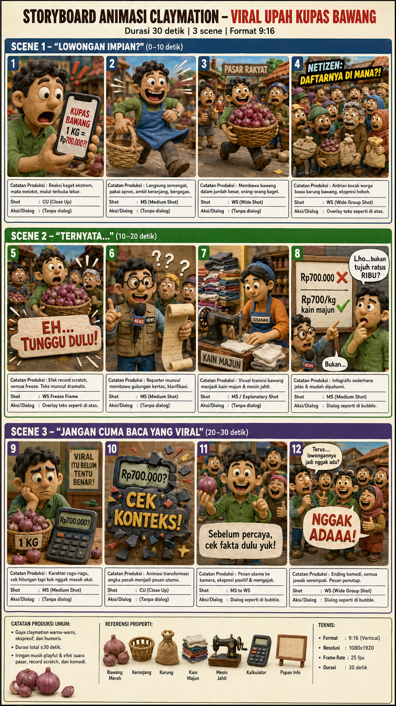</a></p>

*Contoh storyboard berita viral: hook, klarifikasi, dan takeaway editorial.*

### 10 — Animasi Nara & Kiko

- **Lock:** character sheet, aksesori, proporsi, palet, dan emotional arc.
- **ChatGPT:** P4 membagi masalah, dukungan teman, keberanian, dan resolusi.
- **Flow:** satu scene emosional per klip; gunakan reference karakter yang sama setiap kali.
- **QC:** ekspresi berkembang logis dan tidak ada character drift.

| Storyboard cerita | Character sheet Nara |
|---|---|
| <a href="media/image13.png">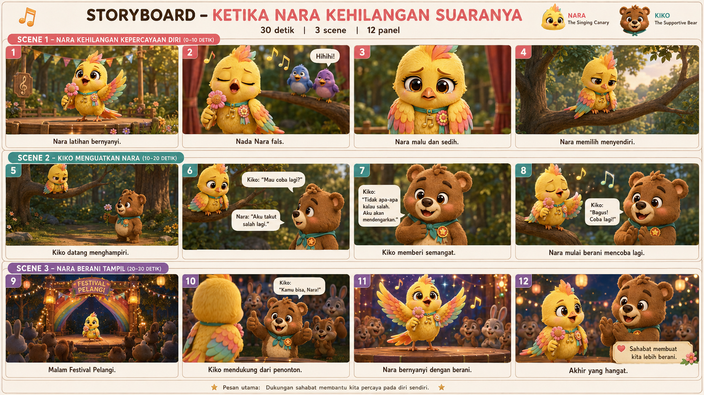</a> | <a href="media/image14.png">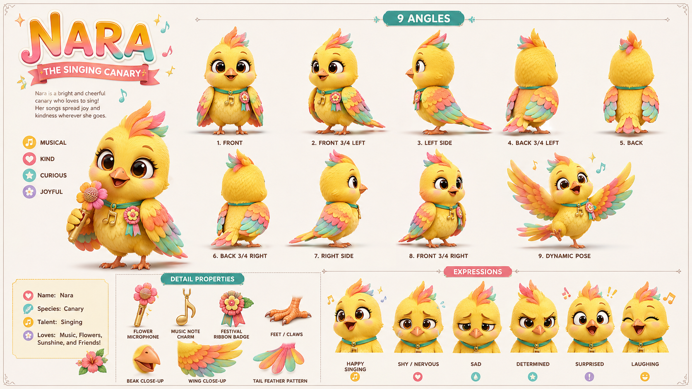</a> |
| **Character sheet Kiko** | |
| <a href="media/image15.png">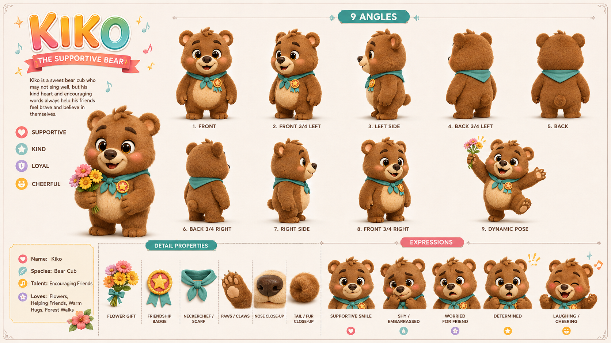</a> | |

### 11 — Storytelling/Biografi Kartun 2D

- **Lock:** wajah, usia, kostum, era, dan gaya ilustrasi 2D.
- **ChatGPT:** pecah naskah menjadi scene pendek; satu fakta atau beat per scene.
- **Flow:** generate per scene, pertahankan first/end frame, lalu rangkai di editor.
- **QC:** urutan fakta, waktu, dan identitas tokoh konsisten.

### 12 — AI Influencer & Character Sheet

- **Lock:** wajah, usia, warna kulit, mata, rambut, proporsi, dan ciri khas.
- **ChatGPT:** P1 menetapkan identity lock; P3 membuat front/side/back, ekspresi, dan detail.
- **QC:** tidak ada age drift, face morphing, atau perubahan ciri identitas.

<p align="center"><a href="media/image16.png">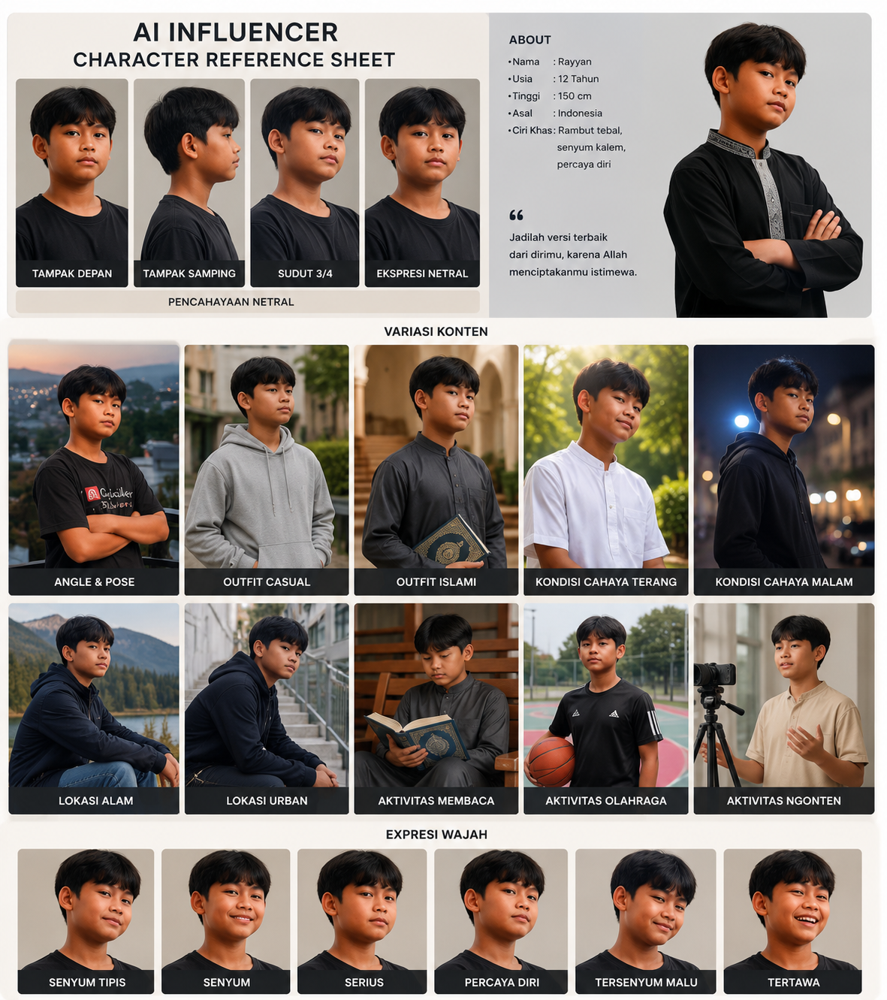</a></p>

*Contoh character reference sheet untuk menjaga identity lock.*

### 13 — Video Event Berseri

- **Lock:** master character sheet, logo, outfit, lokasi, dan urutan scene.
- **ChatGPT:** P6 harus menghasilkan continuity lock yang sama untuk semua klip.
- **Flow:** generate scene berurutan; gunakan end frame klip sebelumnya sebagai referensi klip berikutnya bila fitur tersedia.
- **QC:** bandingkan setiap klip dengan master sebelum melanjutkan.

<p align="center"><a href="media/image17.png">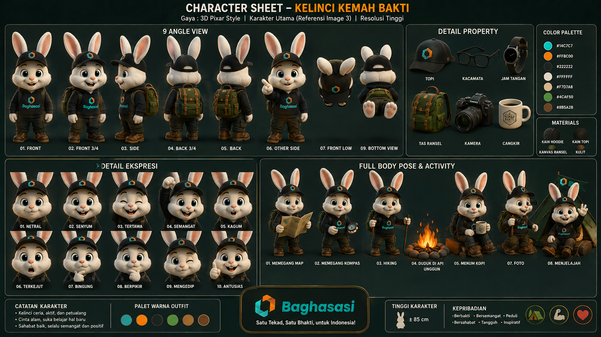</a></p>

*Master character sheet sebagai referensi identitas untuk seluruh scene.*

### 14 — Komik/Manga Event

- **Lock:** identitas tokoh, data acara, hook, CTA, dan arah baca.
- **ChatGPT:** P1 → P2 → P3; minta panel plan sebelum prompt gambar final.
- **Finalisasi:** dialog, tanggal, lokasi, kontak, dan logo ditempel ulang di editor.
- **QC:** wajah dikenali, panel mudah dibaca, dan data acara benar.

<p align="center"><a href="media/image18.png">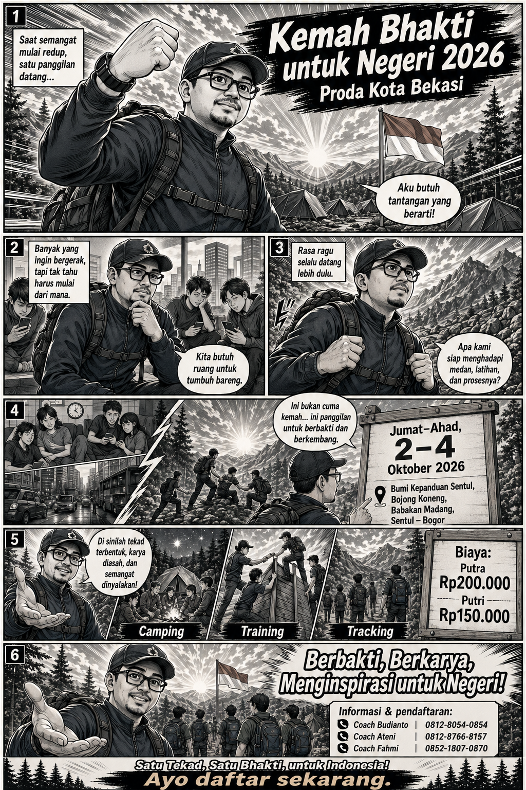</a></p>

*Contoh manga event; hook, CTA, dan data acara harus tetap dikunci.*

## Checklist QC Universal

- [ ] Fakta, klaim, angka, tanggal, dan CTA sudah diverifikasi.
- [ ] Produk/karakter sama dengan master reference.
- [ ] Logo, pakaian, warna, dan aksesori tidak berubah.
- [ ] Anatomi, physics, gerakan, dan continuity terlihat logis.
- [ ] Tidak ada typo, random text, flicker, watermark, atau deformasi.
- [ ] Rasio, resolusi, durasi, dan safe area sesuai platform.
- [ ] Teks kritikal dan logo final sudah dipasang manual.
- [ ] Audio tidak menutupi voice-over.

## Struktur Folder

```text
PROJECT_NAME/
├── 00_BRIEF/
├── 01_REFERENCE/
├── 02_SCRIPT_STORYBOARD/
├── 03_PROMPTS/
├── 04_FLOW_GENERATIONS/
├── 05_APPROVED_CLIPS/
├── 06_FINAL_EDIT/
└── 07_ARCHIVE/
```

Gunakan versi file, misalnya `PROJECT_SC02_FLOW_PROMPT_v03.txt` dan `PROJECT_SC02_APPROVED_v02.mp4`.

## Catatan Akhir

ChatGPT membantu berpikir, menyusun, dan memeriksa; generator gambar/video membantu produksi; editor tetap menjadi tempat finalisasi presisi. Simpan brief dan lock yang sudah disetujui sebagai sumber kebenaran sampai proyek selesai.
