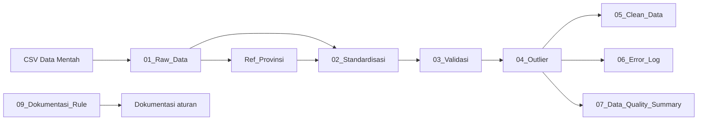

# Tutorial Data Cleansing dengan Power Query pada Excel

## Studi Kasus Data Panel IKAD

## 0. Etika Pengolahan Data: Menjaga Raw Data sebagai Artefak Asli

Dalam setiap proses pengolahan data, **raw data harus diperlakukan sebagai artefak asli yang bersifat tetap (immutable)**. Artinya, file sumber seperti `02_ikad_panel_5016_dirty_cleansing.csv` **tidak boleh diubah, diedit, ditimpa, atau disimpan ulang** selama proses data cleansing. Seluruh koreksi, standardisasi, validasi, deduplikasi, penanganan missing value, dan penyesuaian outlier harus dilakukan pada lapisan pengolahan yang terpisah, misalnya melalui query Power Query.

Prinsip ini penting karena raw data merupakan bukti awal mengenai kondisi data ketika pertama kali diterima. Apabila file sumber diubah langsung, organisasi akan kehilangan jejak mengenai nilai asli, bentuk kesalahan yang ditemukan, dan dasar perubahan yang dilakukan. Hal tersebut dapat mengurangi transparansi, menyulitkan proses audit, serta membuat hasil analisis sulit direproduksi oleh pihak lain.

### Prinsip yang harus diterapkan

1. **Jangan mengedit raw data secara langsung.**  
   Hindari memperbaiki ejaan, menghapus baris, mengganti nilai kosong, mengubah tipe data, atau menghapus duplikasi langsung pada file CSV sumber.

2. **Gunakan Power Query sebagai lapisan transformasi.**  
   File raw hanya dibaca sebagai sumber. Semua perubahan dicatat sebagai tahapan pada panel **Applied Steps**, sehingga proses cleansing dapat ditelusuri dan dijalankan ulang.

3. **Pisahkan data berdasarkan lapisan pengolahan.**  
   Gunakan struktur yang jelas, misalnya:

   ```text
   01_Raw_Data          -> representasi data sumber tanpa koreksi substantif
   02_Standardisasi     -> perbaikan format dan penyeragaman nilai
   03_Validasi          -> pemeriksaan aturan kualitas data
   04_Outlier           -> identifikasi dan perlakuan nilai ekstrem
   05_Clean_Data        -> data akhir yang siap dianalisis
   ```

4. **Pertahankan nilai asli ketika membuat nilai hasil cleansing.**  
   Jika suatu nilai perlu diperbaiki, sebaiknya nilai asli tetap tersedia dan hasil perbaikannya ditempatkan pada kolom baru, misalnya `Provinsi_Asli` dan `Provinsi_Standar`, atau `Kemiskinan_pct` dan `Kemiskinan_pct_Clean`. Pendekatan ini menjaga keterlacakan perubahan.

5. **Dokumentasikan setiap aturan perubahan.**  
   Setiap transformasi harus mempunyai alasan yang jelas, seperti aturan bisnis, referensi kode wilayah, batas nilai yang diperbolehkan, metode deteksi outlier, dan kebijakan penanganan duplikasi. Dalam workbook hasil praktik, dokumentasi tersebut dapat ditempatkan pada query `09_Dokumentasi_Rule`.

6. **Simpan file hasil sebagai artefak yang berbeda.**  
   Jangan menyimpan hasil cleansing dengan menimpa file sumber. Gunakan nama dan lokasi yang berbeda, misalnya:

   ```text
   raw/02_ikad_panel_5016_dirty_cleansing.csv
   processed/ikad_panel_standardized.xlsx
   output/ikad_panel_clean.csv
   ```

7. **Jaga keterlacakan dan kemampuan reproduksi.**  
   Simpan informasi mengenai nama file sumber, tanggal penerimaan, lokasi sumber, versi query, dan tanggal pemrosesan. Untuk kebutuhan audit yang lebih ketat, file raw dapat disimpan sebagai **read-only** dan dilengkapi nilai hash/checksum untuk membuktikan bahwa file tidak berubah.

> **Aturan utama:** Power Query boleh membaca dan mentransformasikan representasi data, tetapi file raw sebagai artefak sumber harus tetap utuh. Kesalahan pada raw data bukan dihapus dari sejarah, melainkan diperbaiki melalui tahapan transformasi yang transparan, terdokumentasi, dan dapat direproduksi.

---

Tutorial ini menggunakan **satu-satunya file praktik**, yaitu:

```text
02_ikad_panel_5016_dirty_cleansing.csv
```

Pengguna diasumsikan memulai dari **workbook Excel kosong** dan membangun seluruh query Power Query dari awal. Tidak ada workbook query siap pakai yang perlu dibuka atau diedit ketika praktik.

---

## 1. Tujuan Tutorial

Setelah mengikuti tutorial ini, pengguna dapat:

- mengimpor data CSV ke Power Query;
- melakukan cleansing melalui antarmuka Power Query tanpa menulis kode M;
- menetapkan tipe data dengan benar;
- membersihkan spasi, karakter tersembunyi, dan kapitalisasi teks;
- menstandardisasi nama provinsi, wilayah, dan triwulan;
- mendeteksi nilai kosong, nilai tidak valid, duplikasi, dan outlier;
- membuat nilai hasil cleansing tanpa menghilangkan data asli;
- menghasilkan tabel data bersih, error log, dan ringkasan kualitas data;
- memperbarui seluruh hasil hanya dengan perintah **Refresh All**.

---

### Dua jalur belajar yang tersedia

Tutorial ini menyediakan dua jalur yang menghasilkan alur pengolahan yang sama:

| Jalur | Cara bekerja | Cocok untuk |
|---|---|---|
| **Jalur Pemula—tanpa menulis kode M** | Menggunakan menu seperti **Transform**, **Replace Values**, **Conditional Column**, **Group By**, **Merge Queries**, **Remove Duplicates**, dan **Filter Rows**. | Peserta yang belum memahami bahasa M atau pemrograman. |
| **Jalur Teknis—menggunakan kode M** | Menggunakan **Custom Column**, formula bar, fungsi, dan **Advanced Editor**. | Peserta yang membutuhkan proses lebih ringkas, dinamis, dan mudah digunakan ulang. |

> **Catatan istilah:** Dalam Power Query, setiap proses tetap disimpan sebagai sebuah *query*. Istilah **tanpa query** dalam konteks pembelajaran ini dimaknai sebagai **tanpa menulis kode query/M secara manual**. Peserta cukup menggunakan antarmuka grafis, sedangkan Excel membuat kode dan daftar **Applied Steps** secara otomatis.

---

## 2. Gambaran Data Mentah

File CSV memiliki karakteristik berikut:

| Informasi | Nilai |
|---|---:|
| Jumlah baris data | 5.016 |
| Jumlah kolom | 40 |
| Jumlah provinsi | 38 |
| Periode | 1993–2025 |
| ID observasi unik | 4.951 |
| ID yang muncul lebih dari sekali | 60 ID |
| Baris yang termasuk duplikat | 125 baris |

Beberapa masalah yang terdapat pada data mentah antara lain:

- penulisan nama provinsi berbeda, misalnya `Aceh`, `ACEH`, `aceh`, dan ` Aceh `;
- penulisan wilayah berbeda, misalnya `Sumatera`, `SUMATERA`, dan `sumatera`;
- format triwulan tidak konsisten, misalnya `Q1`, `q2`, `1`, `TW-I`, kosong, dan `Q5`;
- nilai kosong pada sejumlah indikator;
- nilai negatif pada NPL, Kredit/PDRB, dan DPK/PDRB;
- duplikasi `ID_Observasi`;
- nilai ekstrem pada variabel `Kemiskinan_pct`.

### Ringkasan masalah yang terdeteksi

| Masalah | Jumlah baris |
|---|---:|
| Missing pada Kemiskinan, Urbanisasi, atau NPL | 545 |
| Nilai tidak valid berdasarkan aturan bisnis | 25 |
| Outlier Kemiskinan dengan metode IQR | 209 |
| Baris dengan ID duplikat | 125 |
| Perubahan format teks/triwulan yang diperlukan | sekitar 825 |

> Jumlah setiap jenis masalah tidak dapat langsung dijumlahkan karena satu baris dapat memiliki lebih dari satu masalah.

---

## 3. Arsitektur Query

Alur cleansing yang akan dibangun adalah sebagai berikut:



### Fungsi setiap query

| Query | Fungsi |
|---|---|
| `01_Raw_Data` | Membaca CSV, mempromosikan header, dan menetapkan tipe data. |
| `Ref_Provinsi` | Membentuk tabel referensi kode provinsi, nama provinsi, dan wilayah standar. |
| `02_Standardisasi` | Membersihkan nama kolom dan teks, lalu melakukan mapping provinsi dan wilayah. |
| `03_Validasi` | Memberikan status dan flag missing, invalid, format, serta duplikat. |
| `04_Outlier` | Menghitung IQR, memberi flag outlier, dan membuat nilai winsorized. |
| `05_Clean_Data` | Memilih satu record terbaik per ID dan menghasilkan data akhir. |
| `06_Error_Log` | Menampilkan hanya baris yang mempunyai masalah kualitas data. |
| `07_Data_Quality_Summary` | Menghitung jumlah dan persentase setiap masalah. |
| `09_Dokumentasi_Rule` | Menyimpan dokumentasi aturan cleansing dan justifikasinya. |

---

## 4. Kondisi Awal dan Catatan Teknis

Pada awal praktik, siapkan hanya file berikut:

```text
02_ikad_panel_5016_dirty_cleansing.csv
```

Jangan membuka file CSV tersebut untuk memperbaiki nilai secara manual. Excel hanya digunakan untuk membuat workbook baru yang menyimpan koneksi, langkah transformasi, dan hasil cleansing. File CSV tetap berfungsi sebagai artefak sumber yang tidak berubah.

### 4.1 Tipe data desimal harus dibaca dengan benar

File CSV menggunakan titik sebagai tanda desimal, misalnya:

```text
49.69
15.33
5.45
```

Kolom-kolom tersebut harus menggunakan tipe `Decimal Number` atau `type number` dengan locale `English (United States)`/`en-US`. Jangan mengubahnya menjadi `Whole Number` atau `Int64.Type`.

Contoh kesalahan parsing:

| Nilai pada CSV | Nilai yang terbaca salah |
|---:|---:|
| `49.69` | `4969` |
| `15.33` | `1533` |
| `5.45` | `545` |

Kesalahan locale atau tipe data dapat menyebabkan hampir seluruh data dianggap invalid, meskipun nilai aslinya benar.

### 4.2 Pemisahan file yang disarankan

Gunakan struktur folder sederhana berikut:

```text
Latihan_Power_Query/
├── raw/
│   └── 02_ikad_panel_5016_dirty_cleansing.csv
└── workbook/
    └── Tutorial_Cleansing_IKAD.xlsx
```

File dalam folder `raw` tidak diubah. Workbook pada folder `workbook` menyimpan seluruh query dan hasil pengolahan.

---

# BAGIAN A — MEMBANGUN ALUR POWER QUERY DARI FILE CSV

## 5. Membuat Workbook Latihan

1. Buka **Microsoft Excel Desktop**.
2. Pilih **Blank workbook** atau **Buku kerja kosong**.
3. Pilih **File → Save As**.
4. Simpan workbook dengan nama, misalnya:

   ```text
   Tutorial_Cleansing_IKAD.xlsx
   ```

5. Jangan membuka dan menyimpan ulang file CSV. File CSV hanya akan dipanggil sebagai sumber melalui Power Query.

> Power Query pada Excel Desktop Windows mempunyai fitur yang lebih lengkap dibandingkan Excel versi web.

---

## 6. Memulai Power Query dari File CSV

Power Query dapat dibuka melalui **Get Data** atau **Launch Power Query Editor**. Pada praktik ini belum ada query yang tersedia, sehingga pengguna harus membuat koneksi baru ke file CSV.

### 6.1 Cara utama: melalui Get Data

1. Pada workbook Excel kosong, pilih tab **Data**.
2. Klik **Get Data**.
3. Pilih **From File → From Text/CSV**.
4. Pilih file:

   ```text
   02_ikad_panel_5016_dirty_cleansing.csv
   ```

5. Pada jendela pratinjau, pastikan:
   - **File Origin/Encoding** menggunakan UTF-8 atau `65001`;
   - **Delimiter** menggunakan koma atau **Comma**;
   - baris pertama terlihat sebagai nama kolom;
   - nilai desimal masih terlihat seperti `49.69`, bukan `4969`.
6. Klik **Transform Data**, bukan **Load**.
7. Jendela **Power Query Editor** akan terbuka.

### 6.2 Cara alternatif: melalui Launch Power Query Editor

Pada versi Excel yang menyediakan menu tersebut:

1. Pilih tab **Data**.
2. Klik **Get Data → Launch Power Query Editor**.
3. Pada Power Query Editor, pilih **Home → New Source**.
4. Pilih **File → Text/CSV**.
5. Pilih file `02_ikad_panel_5016_dirty_cleansing.csv`.
6. Pastikan delimiter, encoding, dan tampilan desimal sudah benar.
7. Klik **OK** atau **Transform Data**.

> Nama menu dapat sedikit berbeda antarversi Excel. Prinsipnya tetap sama: buat **New Source** dari file **Text/CSV**, bukan mengedit query yang sudah tersedia.

### 6.3 Mengganti nama query sumber

1. Pada panel **Queries** di sebelah kiri, klik kanan query yang baru dibuat.
2. Pilih **Rename**.
3. Ubah namanya menjadi:

   ```text
   01_Raw_Data
   ```

Query `01_Raw_Data` merupakan representasi file sumber di dalam Power Query. Perubahan pada query tidak mengubah file CSV asli.

---

## 7. Menyiapkan Query `01_Raw_Data`

### 7.1 Mempromosikan baris pertama sebagai header

Apabila header belum terbaca otomatis:

1. Pilih tab **Home** atau **Transform**.
2. Klik **Use First Row as Headers**.
3. Pastikan nama kolom seperti `ID_Observasi`, `Tahun`, `Provinsi`, dan `Kemiskinan_pct` tampil sebagai header.

### 7.2 Menghapus langkah tipe data otomatis yang keliru

Power Query biasanya menambahkan langkah `Changed Type` secara otomatis. Periksa langkah tersebut pada panel **Applied Steps**.

Apabila kolom desimal berubah menjadi whole number atau menghasilkan error:

1. Klik tanda **X** di sebelah langkah `Changed Type` untuk menghapusnya.
2. Tetapkan tipe data kembali secara eksplisit menggunakan locale yang sesuai.

### 7.3 Menetapkan tipe data melalui antarmuka

Untuk kolom bilangan bulat seperti `Tahun`, `Urutan_Waktu`, `Kode_Provinsi`, dan `Jumlah_Penduduk`:

1. Pilih kolom.
2. Klik ikon tipe data pada header.
3. Pilih **Whole Number**.

Untuk kolom indikator yang mempunyai angka desimal:

1. Pilih satu atau beberapa kolom.
2. Pilih **Transform → Data Type → Using Locale...**.
3. Atur:
   - **Data Type:** Decimal Number;
   - **Locale:** English (United States).
4. Klik **OK**.

### 7.4 Alternatif: menggunakan Advanced Editor

1. Pilih query `01_Raw_Data`.
2. Pilih **Home → Advanced Editor**.
3. Ganti kode dengan kode berikut.
4. Sesuaikan alamat pada `File.Contents` dengan lokasi file CSV di komputer.

```powerquery
let
    Source = Csv.Document(
        File.Contents("D:\Latihan_Power_Query\raw\02_ikad_panel_5016_dirty_cleansing.csv"),
        [
            Delimiter = ",",
            Columns = 40,
            Encoding = 65001,
            QuoteStyle = QuoteStyle.Csv
        ]
    ),

    #"Promoted Headers" =
        Table.PromoteHeaders(
            Source,
            [PromoteAllScalars = true]
        ),

    #"Changed Type" =
        Table.TransformColumnTypes(
            #"Promoted Headers",
            {
                {"ID_Observasi", type text},
                {"Periode", type text},
                {"Tahun", Int64.Type},
                {"Triwulan", type text},
                {"Urutan_Waktu", Int64.Type},
                {"Kode_Provinsi", Int64.Type},
                {"Provinsi", type text},
                {"Wilayah", type text},
                {"Jumlah_Penduduk", Int64.Type},
                {"Urbanisasi_pct", type number},
                {"Kemiskinan_pct", type number},
                {"Penetrasi_Internet_pct", type number},
                {"Literasi_Keuangan_pct", type number},
                {"Rekening_per_1000_Penduduk", type number},
                {"Pertumbuhan_Rekening_qoq_pct", type number},
                {"Titik_Layanan_per_100rb_Penduduk", type number},
                {"ATM_per_100rb_Penduduk", type number},
                {"Kantor_Bank_per_100rb_Penduduk", type number},
                {"Kredit_terhadap_PDRB_pct", type number},
                {"DPK_terhadap_PDRB_pct", type number},
                {"Transaksi_Digital_pct", type number},
                {"Pertumbuhan_Transaksi_Digital_qoq_pct", type number},
                {"Pinjaman_Fintech_per_Kapita_juta", type number},
                {"NPL_pct", type number},
                {"Shock_Ekonomi", type text},
                {"Dimensi_Ketersediaan", type number},
                {"Dimensi_Penggunaan", type number},
                {"Dimensi_Kedalaman", type number},
                {"IKAD_Simulasi", type number},
                {"Kategori_IKAD", type text},
                {"IKAD_Lag_1", type number},
                {"IKAD_Lag_4", type number},
                {"IKAD_Rata_Rata_4Q", type number},
                {"Pertumbuhan_IKAD_qoq_pct", type number},
                {"Pertumbuhan_IKAD_yoy_pct", type number},
                {"IKAD_Berikutnya", type number},
                {"Kategori_IKAD_Berikutnya", type text},
                {"Perubahan_IKAD_Berikutnya", type number},
                {"Target_Peningkatan_IKAD", type number},
                {"Status_Data", type text}
            },
            "en-US"
        )
in
    #"Changed Type"
```

### 7.5 Memeriksa hasil impor

Sebelum membuat query berikutnya, periksa beberapa nilai:

- jumlah kolom harus **40**;
- `Urbanisasi_pct` harus tampil sekitar `27` sampai `87`;
- `Kemiskinan_pct` harus tampil sekitar `9` sampai `28`;
- `NPL_pct` umumnya berupa angka satu atau dua digit;
- nilai `49.69` tidak boleh berubah menjadi `4969`;
- ikon tipe data kolom desimal harus menunjukkan **Decimal Number**.

Apabila hasil belum benar, perbaiki query sumber terlebih dahulu. Jangan melanjutkan ke tahap standardisasi sebelum parsing data benar.

---

## 8. Membuat Struktur Query dari Awal

Setelah `01_Raw_Data` benar, buat query lanjutan menggunakan **Reference**. Reference membuat query baru yang bergantung pada hasil query sebelumnya tanpa menduplikasi seluruh langkah sumber.

### 8.1 Membuat query standardisasi

1. Klik kanan `01_Raw_Data`.
2. Pilih **Reference**.
3. Ganti nama query baru menjadi:

   ```text
   02_Standardisasi
   ```

### 8.2 Membuat query validasi

1. Klik kanan `02_Standardisasi`.
2. Pilih **Reference**.
3. Ganti nama menjadi:

   ```text
   03_Validasi
   ```

### 8.3 Membuat query outlier

1. Klik kanan `03_Validasi`.
2. Pilih **Reference**.
3. Ganti nama menjadi:

   ```text
   04_Outlier
   ```

### 8.4 Membuat query output

Buat tiga reference dari `04_Outlier`:

| Query baru | Sumber reference | Fungsi |
|---|---|---|
| `05_Clean_Data` | `04_Outlier` | Data akhir setelah deduplikasi dan pemilihan nilai clean. |
| `06_Error_Log` | `04_Outlier` | Daftar baris yang mempunyai masalah kualitas data. |
| `07_Data_Quality_Summary` | `04_Outlier` | Ringkasan jumlah dan persentase masalah. |

### 8.5 Membuat query referensi provinsi

Query `Ref_Provinsi` dapat dibuat dengan dua cara:

- membuat reference dari `01_Raw_Data`, lalu menyisakan kolom kode, provinsi, dan wilayah; atau
- menggunakan tabel referensi resmi yang dibuat pada workbook.

Cara kedua lebih direkomendasikan dan dijelaskan pada **Tahap 4 — Membuat Referensi Provinsi**.

### 8.6 Membuat query dokumentasi aturan

1. Pilih **Home → New Source → Other Sources → Blank Query**.
2. Ganti nama menjadi:

   ```text
   09_Dokumentasi_Rule
   ```

3. Query ini dapat diisi dengan tabel aturan, dasar validasi, metode penanganan, dan catatan audit.

Struktur query akhir yang akan dibangun:

```text
01_Raw_Data
├── Ref_Provinsi
└── 02_Standardisasi
    └── 03_Validasi
        └── 04_Outlier
            ├── 05_Clean_Data
            ├── 06_Error_Log
            └── 07_Data_Quality_Summary
09_Dokumentasi_Rule
```

> Setelah membuat nama dan dependensi query, lanjutkan transformasi pada Bagian B secara berurutan. Query tidak harus langsung dimuat ke worksheet pada tahap ini.

---

## 9. Menyimpan Query Sumber sebagai Connection Only

Agar data mentah tidak langsung memenuhi worksheet:

1. Pilih **Home → Close & Load → Close & Load To...**.
2. Untuk query `01_Raw_Data`, pilih **Only Create Connection**.
3. Lakukan hal yang sama untuk query perantara setelah selesai dibuat.
4. Simpan workbook.

Apabila opsi **Close & Load To...** tidak muncul:

1. Pilih **Close & Load** terlebih dahulu.
2. Di Excel, buka **Data → Queries & Connections**.
3. Klik kanan nama query.
4. Pilih **Load To...**.
5. Pilih **Only Create Connection**.

Query output `05_Clean_Data`, `06_Error_Log`, dan `07_Data_Quality_Summary` akan dimuat sebagai tabel setelah seluruh langkah transformasi selesai.

---

# BAGIAN B — JALUR PEMULA TANPA MENULIS KODE M

Bagian ini ditujukan bagi peserta yang belum dapat melakukan coding. Seluruh transformasi dibuat dengan tombol pada Power Query Editor. Peserta **tidak perlu membuka Advanced Editor** dan tidak perlu mengetik formula M.

Power Query tetap mencatat seluruh tindakan pada panel **Applied Steps**. Dengan demikian, metode ini tetap transparan, dapat di-*refresh*, dan tidak mengubah file CSV asli.

## B.1 Ringkasan Alur Tanpa Coding

| Tahap | Menu utama yang digunakan | Hasil |
|---|---|---|
| Impor sumber | **Data → Get Data → From Text/CSV** | `01_Raw_Data` |
| Membersihkan teks | **Transform → Format → Clean/Trim/Capitalize Each Word** | Teks lebih konsisten |
| Menyimpan nilai asli | **Duplicate Column** | Kolom audit seperti `Provinsi_Asli` |
| Menormalkan triwulan | **Add Column → Conditional Column** | `Triwulan_Standar` |
| Standardisasi provinsi | **Reference, Remove Duplicates, Merge Queries** | Nama provinsi dan wilayah standar |
| Validasi | **Conditional Column** | Status missing dan invalid |
| Duplikasi | **Group By, Merge Queries, Conditional Column** | `Flag_Duplikat` |
| Outlier | **Conditional Column** dengan batas IQR latihan | `Flag_Outlier` dan nilai winsorized |
| Jumlah masalah | **Add Column → Statistics → Sum** | `Jumlah_Flag_Masalah` |
| Data bersih | **Sort, Filter Rows, Remove Duplicates** | `05_Clean_Data` |
| Error log | **Reference dan Filter Rows** | `06_Error_Log` |
| Ringkasan kualitas | **Load to Table/PivotTable** | Rekap jumlah dan persentase masalah |

### Prinsip kerja jalur pemula

1. Selalu mulai dari query hasil **Reference**, bukan mengedit file CSV.
2. Pertahankan kolom asli sebelum melakukan standardisasi.
3. Gunakan kolom status dan flag; jangan langsung menghapus baris bermasalah.
4. Periksa hasil setiap langkah melalui pratinjau data dan **Column Quality**.
5. Beri nama setiap langkah pada **Applied Steps** agar mudah dipahami.

---

## B.2 Mengaktifkan Data Profiling

Data profiling membantu peserta melihat kualitas kolom tanpa membuat formula.

1. Buka Power Query Editor.
2. Pilih tab **View**.
3. Aktifkan:
   - **Column quality**;
   - **Column distribution**;
   - **Column profile**.
4. Pada bagian bawah Power Query Editor, ubah profiling dari **Based on top 1000 rows** menjadi **Based on entire data set**.

Informasi yang dapat dilihat:

- persentase **Valid**, **Error**, dan **Empty**;
- jumlah nilai berbeda dan nilai unik;
- nilai minimum, maksimum, rata-rata, serta distribusi data;
- nilai yang paling sering muncul.

> Data profiling hanya membantu pemeriksaan. Fitur ini tidak menggantikan aturan bisnis dan tidak mengubah data.

---

## B.3 Menyiapkan `01_Raw_Data` Tanpa Coding

Gunakan langkah pada Bagian A untuk mengimpor CSV. Pada query `01_Raw_Data`, lakukan hanya transformasi teknis yang diperlukan agar data dapat dibaca dengan benar.

### Menetapkan tipe data

1. Pilih kolom teks seperti `ID_Observasi`, `Periode`, `Triwulan`, `Provinsi`, dan `Wilayah`.
2. Klik ikon tipe data pada header, lalu pilih **Text**.
3. Pilih kolom bilangan bulat seperti `Tahun`, `Urutan_Waktu`, `Kode_Provinsi`, dan `Jumlah_Penduduk`.
4. Pilih tipe **Whole Number**.
5. Pilih seluruh kolom indikator desimal.
6. Pilih **Transform → Data Type → Using Locale...**.
7. Atur:
   - **Data Type:** Decimal Number;
   - **Locale:** English (United States).
8. Klik **OK**.

### Memberi nama langkah

Pada panel **Applied Steps**:

1. Klik kanan sebuah langkah.
2. Pilih **Rename**.
3. Gunakan nama yang menjelaskan tindakan, misalnya:
   - `Header Dipromosikan`;
   - `Tipe Data Bilangan Bulat`;
   - `Tipe Data Desimal en-US`.

Penamaan ini memudahkan peserta memahami proses tanpa membaca kode M.

---

## B.4 Membersihkan Teks pada `02_Standardisasi`

### B.4.1 Menyimpan nilai asli

1. Pilih query `02_Standardisasi`.
2. Klik kanan kolom `Provinsi`.
3. Pilih **Duplicate Column**.
4. Ubah nama hasil duplikasi menjadi `Provinsi_Asli`.
5. Duplikasi kolom `Wilayah` dan ubah namanya menjadi `Wilayah_Asli`.
6. Duplikasi kolom `Triwulan` dan ubah namanya menjadi `Triwulan_Asli`.

Kolom asli tersebut tidak diubah dan digunakan sebagai jejak audit.

### B.4.2 Membersihkan spasi dan karakter tersembunyi

Untuk kolom `Provinsi`, `Wilayah`, `Triwulan`, `ID_Observasi`, dan `Periode`:

1. Pilih kolom yang akan dibersihkan. Gunakan `Ctrl` untuk memilih beberapa kolom.
2. Pilih **Transform → Format → Clean**.
3. Pilih **Transform → Format → Trim**.

Untuk `Provinsi` dan `Wilayah`:

4. Pilih **Transform → Format → Capitalize Each Word**.

Untuk `Triwulan`:

5. Pilih **Transform → Format → UPPERCASE**.

Contoh hasil:

| Nilai awal | Setelah Clean/Trim/Format |
|---|---|
| ` ACEH ` | `Aceh` |
| `sumatera` | `Sumatera` |
| ` q2 ` | `Q2` |

> Nama seperti `DKI Jakarta` dapat berubah menjadi `Dki Jakarta`. Nama akhir tetap harus diambil dari tabel referensi, bukan langsung dari hasil **Capitalize Each Word**.

### B.4.3 Alternatif: Column From Examples

Untuk transformasi pola sederhana, peserta juga dapat menggunakan fitur berbasis contoh:

1. Pilih kolom sumber, misalnya `Provinsi` atau `Periode`.
2. Pilih **Add Column → Column From Examples → From Selection**.
3. Ketik dua atau tiga contoh hasil yang diinginkan.
4. Power Query akan mencoba mengenali pola dan mengisi baris lainnya.
5. Periksa nilai hasil pada beberapa bagian data, terutama variasi yang tidak digunakan sebagai contoh.
6. Klik **OK** hanya apabila pola yang disarankan sudah benar.

Fitur ini cocok untuk membersihkan pola teks yang konsisten, tetapi tidak boleh digunakan untuk menebak aturan bisnis. Untuk nama provinsi resmi dan klasifikasi wilayah, tetap gunakan tabel referensi.

---

## B.5 Menormalkan Triwulan dengan Conditional Column

Buat kolom baru tanpa formula M:

1. Pilih **Add Column → Conditional Column**.
2. Isi **New column name** dengan `Triwulan_Standar`.
3. Buat aturan berikut secara berurutan.

| Kolom | Operator | Nilai | Output |
|---|---|---|---|
| `Triwulan` | equals | `Q1` | `Q1` |
| `Triwulan` | equals | `1` | `Q1` |
| `Triwulan` | equals | `I` | `Q1` |
| `Triwulan` | equals | `TW-I` | `Q1` |
| `Triwulan` | equals | `Q2` | `Q2` |
| `Triwulan` | equals | `2` | `Q2` |
| `Triwulan` | equals | `II` | `Q2` |
| `Triwulan` | equals | `TW-II` | `Q2` |
| `Triwulan` | equals | `Q3` | `Q3` |
| `Triwulan` | equals | `3` | `Q3` |
| `Triwulan` | equals | `III` | `Q3` |
| `Triwulan` | equals | `TW-III` | `Q3` |
| `Triwulan` | equals | `Q4` | `Q4` |
| `Triwulan` | equals | `4` | `Q4` |
| `Triwulan` | equals | `IV` | `Q4` |
| `Triwulan` | equals | `TW-IV` | `Q4` |

4. Pada bagian **Else**, pilih **Select a column**, kemudian pilih `Triwulan`.
5. Klik **OK**.

Dengan pilihan tersebut, nilai tidak dikenal seperti `Q5` tetap dipertahankan agar dapat ditandai sebagai invalid. Nilai tidak langsung dihapus atau diubah diam-diam.

### Membuat status triwulan

1. Pilih **Add Column → Conditional Column**.
2. Beri nama `Status_Triwulan`.
3. Atur:
   - jika `Triwulan_Standar` equals `(null)`/kosong → `Missing`;
   - jika `Triwulan_Standar` sama dengan `Q1` → `Valid`;
   - *else if* sama dengan `Q2` → `Valid`;
   - *else if* sama dengan `Q3` → `Valid`;
   - *else if* sama dengan `Q4` → `Valid`;
   - **Else** → `Invalid`.

Pada sebagian versi Excel, nilai kosong dipilih sebagai **(null)**; pada versi lain, kolom nilai dibiarkan kosong. Periksa pratinjau hasil. Jika dialog tidak dapat mengenali null, gunakan filter **(null)** untuk pemeriksaan missing dan tetap pertahankan nilai kosong pada error log.

---

## B.6 Membuat `Ref_Provinsi` dengan Menu Power Query

1. Klik kanan query `01_Raw_Data`.
2. Pilih **Reference**.
3. Ubah nama query menjadi `Ref_Provinsi`.
4. Pilih kolom `Kode_Provinsi`, `Provinsi`, dan `Wilayah`.
5. Pilih **Home → Remove Columns → Remove Other Columns**.
6. Pilih kolom `Provinsi` dan `Wilayah`.
7. Gunakan:
   - **Transform → Format → Clean**;
   - **Transform → Format → Trim**;
   - **Transform → Format → Capitalize Each Word**.
8. Urutkan `Kode_Provinsi` dari kecil ke besar.
9. Pilih kolom `Kode_Provinsi`.
10. Pilih **Home → Remove Rows → Remove Duplicates**.
11. Ubah nama:
    - `Provinsi` menjadi `Provinsi_Standar`;
    - `Wilayah` menjadi `Wilayah_Standar`.

> Referensi ini hanya digunakan untuk latihan. Untuk pekerjaan resmi, gunakan master kode provinsi yang sah dan terverifikasi.

---

## B.7 Menggabungkan Referensi Provinsi Tanpa Coding

1. Kembali ke query `02_Standardisasi`.
2. Pilih **Home → Merge Queries**.
3. Pada tabel pertama, klik kolom `Kode_Provinsi`.
4. Pada tabel kedua, pilih `Ref_Provinsi`, lalu klik `Kode_Provinsi`.
5. Pada **Join Kind**, pilih **Left Outer**.
6. Klik **OK**.
7. Pada kolom hasil merge, klik ikon **Expand**.
8. Pilih:
   - `Provinsi_Standar`;
   - `Wilayah_Standar`.
9. Hilangkan centang **Use original column name as prefix**.
10. Klik **OK**.

### Membuat status standardisasi

1. Pilih **Add Column → Conditional Column**.
2. Beri nama `Status_Standardisasi`.
3. Buat aturan:

| Kondisi | Output |
|---|---|
| `Provinsi_Standar` is null | `Provinsi Tidak Dikenali` |
| `Provinsi_Asli` is null | `Nama Provinsi Kosong` |
| `Provinsi_Asli` does not equal `Provinsi_Standar` | `Nama Provinsi Dikoreksi` |
| `Wilayah_Asli` is null | `Nama Wilayah Kosong` |
| `Wilayah_Asli` does not equal `Wilayah_Standar` | `Nama Wilayah Dikoreksi` |
| Else | `Sesuai` |

Untuk membandingkan dengan kolom lain pada bagian nilai, ubah pilihan dari **Enter a value** menjadi **Select a column**. Apabila opsi tersebut tidak tersedia pada versi Excel yang digunakan, pilih **Add Column → Column From Examples → From All Columns**, isi beberapa contoh status, lalu periksa formula yang dihasilkan dan seluruh hasil kolom sebelum melanjutkan.

### Membuat `Flag_Format`

1. Pilih **Add Column → Conditional Column**.
2. Beri nama `Flag_Format`.
3. Jika `Status_Standardisasi` **does not equal** `Sesuai`, beri output `1`.
4. **Else** beri output `0`.
5. Ubah tipe kolom menjadi **Whole Number**.

---

## B.8 Membuat Status Validasi Numerik dengan Conditional Column

Lakukan pada query `03_Validasi`.

> Untuk mendeteksi nilai kosong pada dialog **Conditional Column**, pilih operator **equals** dan nilai **(null)**. Pada sebagian versi Excel, kolom nilai cukup dibiarkan kosong. Selalu periksa pratinjau agar nilai null tidak berubah menjadi teks `"null"`.

### B.8.1 Status urbanisasi

1. Pilih **Add Column → Conditional Column**.
2. Beri nama `Status_Urbanisasi`.
3. Buat aturan:
   - `Urbanisasi_pct` is null → `Missing`;
   - `Urbanisasi_pct` is less than `0` → `Invalid: Negatif`;
   - `Urbanisasi_pct` is greater than `100` → `Invalid: Di atas 100%`;
   - **Else** → `Valid`.

### B.8.2 Status kemiskinan

Ulangi langkah yang sama dan beri nama `Status_Kemiskinan`:

- null → `Missing`;
- kurang dari 0 → `Invalid: Negatif`;
- lebih dari 100 → `Invalid: Di atas 100%`;
- selain itu → `Valid`.

### B.8.3 Status NPL

Buat `Status_NPL`:

- null → `Missing`;
- kurang dari 0 → `Invalid: Negatif`;
- lebih dari 100 → `Invalid: Di atas 100%`;
- selain itu → `Valid`.

### B.8.4 Status Kredit/PDRB

Buat `Status_Kredit_PDRB`:

- null → `Missing`;
- kurang dari 0 → `Invalid: Negatif`;
- lebih dari 100 → `Warning: Di atas 100%`;
- selain itu → `Valid`.

### B.8.5 Status DPK/PDRB

Buat `Status_DPK_PDRB`:

- null → `Missing`;
- kurang dari 0 → `Invalid: Negatif`;
- selain itu → `Valid`.

> Rasio di atas 100 tidak selalu salah. Status harus mengikuti definisi indikator dan aturan bisnis, bukan sekadar bentuk angkanya.

---

## B.9 Membuat Flag Missing dan Invalid Tanpa Formula

### B.9.1 `Flag_Missing`

1. Pilih **Add Column → Conditional Column**.
2. Beri nama `Flag_Missing`.
3. Buat kondisi pertama: jika `Status_Urbanisasi` equals `Missing`, output `1`.
4. Klik **Add Clause** untuk membuat kondisi *else if* berikutnya.
5. Tambahkan secara berurutan:
   - jika `Status_Kemiskinan` equals `Missing`, output `1`;
   - jika `Status_NPL` equals `Missing`, output `1`.
6. Isi **Else** dengan `0`.
7. Ubah tipe menjadi **Whole Number**.

Walaupun dialog menampilkannya sebagai rangkaian *if–else if*, hasilnya setara dengan logika OR karena setiap kondisi missing menghasilkan nilai `1`.

### B.9.2 `Flag_Invalid`

1. Pilih **Add Column → Conditional Column**.
2. Beri nama `Flag_Invalid`.
3. Buat kondisi pertama: jika `Status_Urbanisasi` begins with `Invalid`, output `1`.
4. Klik **Add Clause**, lalu tambahkan kondisi *else if* berikut dengan output yang sama-sama `1`:
   - `Status_Kemiskinan` begins with `Invalid`;
   - `Status_NPL` begins with `Invalid`;
   - `Status_Kredit_PDRB` begins with `Invalid`;
   - `Status_DPK_PDRB` begins with `Invalid`;
   - `Status_Triwulan` equals `Invalid`.
5. Isi **Else** dengan `0`.
6. Ubah tipe menjadi **Whole Number**.

### Perlakuan nilai invalid untuk peserta pemula

Untuk jalur tanpa coding, pendekatan paling aman adalah **tidak menimpa nilai invalid**. Pertahankan nilai asli, beri status dan flag, lalu:

- masukkan baris tersebut ke `06_Error_Log`; atau
- filter `Flag_Invalid = 0` pada output analisis yang mensyaratkan data valid.

Pendekatan ini lebih mudah diaudit dibandingkan mengganti nilai secara otomatis tanpa aturan yang jelas.

---

## B.10 Mendeteksi Duplikasi dengan Group By

Buat query pembantu `Ref_Duplikat`.

1. Klik kanan `02_Standardisasi`.
2. Pilih **Reference**.
3. Ubah nama menjadi `Ref_Duplikat`.
4. Pilih kolom `ID_Observasi`.
5. Pilih **Home → Remove Columns → Remove Other Columns**.
6. Pilih **Home → Group By**.
7. Atur:
   - **Group by:** `ID_Observasi`;
   - **New column name:** `Jumlah_Kemunculan`;
   - **Operation:** Count Rows.
8. Klik **OK**.

> Gunakan sumber `02_Standardisasi`, bukan `03_Validasi`, agar tidak terbentuk circular dependency ketika hasil `Ref_Duplikat` digabungkan ke `03_Validasi`.

Gabungkan kembali ke query `03_Validasi`:

1. Pilih query `03_Validasi`.
2. Pilih **Home → Merge Queries**.
3. Gabungkan `ID_Observasi` dengan `ID_Observasi` pada `Ref_Duplikat`.
4. Pilih **Left Outer**.
5. Expand `Jumlah_Kemunculan`.
6. Tambahkan **Conditional Column** bernama `Flag_Duplikat`:
   - jika `Jumlah_Kemunculan` lebih besar dari `1` → `1`;
   - **Else** → `0`.
7. Ubah tipe menjadi **Whole Number**.

Query `Ref_Duplikat` cukup disimpan sebagai **Connection Only**.

---

## B.11 Mendeteksi Outlier Tanpa Menulis Kode M

Antarmuka standar Power Query tidak menyediakan tombol langsung untuk menghitung **Q1**, **Q3**, dan **IQR** secara dinamis. Karena itu, jalur pemula menggunakan batas yang telah dihitung untuk file latihan ini:

| Komponen | Nilai |
|---|---:|
| Q1 | 16,68 |
| Q3 | 19,9225 |
| Batas bawah | 11,81625 |
| Batas atas | 24,78625 |

### Membuat `Flag_Outlier`

Pada query `04_Outlier`:

1. Pilih **Add Column → Conditional Column**.
2. Beri nama `Flag_Outlier`.
3. Buat aturan:
   - jika `Kemiskinan_pct` equals `(null)` → `0`;
   - jika `Kemiskinan_pct` is less than `11.81625` → `1`;
   - jika `Kemiskinan_pct` is greater than `24.78625` → `1`;
   - **Else** → `0`.
4. Ubah tipe menjadi **Whole Number**.

Gunakan tanda desimal sesuai pengaturan regional Excel. Jika `11.81625` tidak diterima, masukkan `11,81625`; pastikan hasil pratinjau tetap bertipe angka, bukan teks.

### Membuat nilai winsorized

1. Pilih **Add Column → Conditional Column**.
2. Beri nama `Kemiskinan_pct_Winsor`.
3. Atur:
   - jika `Kemiskinan_pct` is less than `11.81625` → `11.81625`;
   - jika `Kemiskinan_pct` is greater than `24.78625` → `24.78625`;
   - **Else** → pilih **Select a column**, lalu `Kemiskinan_pct`.
4. Ubah tipe menjadi **Decimal Number**.

Apabila nilai kosong berubah menjadi error, tambahkan kondisi paling awal `Kemiskinan_pct is null` dan biarkan output kosong/null sesuai opsi yang tersedia pada versi Excel.

### Batasan jalur tanpa coding

Batas `11.81625` dan `24.78625` hanya berlaku untuk dataset latihan yang sedang digunakan. Jika isi CSV berubah, batas harus dihitung ulang.

Alternatif bagi peserta pemula:

1. muat data valid ke worksheet;
2. hitung Q1 dan Q3 menggunakan fungsi Excel `QUARTILE.INC`;
3. hitung batas bawah dan batas atas pada worksheet;
4. perbarui angka pada **Conditional Column**.

Untuk perhitungan IQR yang otomatis mengikuti setiap refresh, gunakan kode M pada Bagian C.

---

## B.12 Menghitung Jumlah Masalah dengan Menu Statistics

Agar satu baris dapat diketahui mempunyai berapa masalah:

1. Pada query `04_Outlier`, pilih kolom:
   - `Flag_Missing`;
   - `Flag_Invalid`;
   - `Flag_Outlier`;
   - `Flag_Duplikat`;
   - `Flag_Format`.
2. Pilih **Add Column → Statistics → Sum**.
3. Ubah nama kolom hasil menjadi `Jumlah_Flag_Masalah`.
4. Pastikan tipe datanya **Whole Number**.

Apabila menu **Statistics → Sum** tidak tersedia pada versi Excel tertentu, jumlahkan flag secara bertahap melalui **Add Column → Standard → Add**.

### Membuat `Flag_Bermasalah`

1. Pilih **Add Column → Conditional Column**.
2. Beri nama `Flag_Bermasalah`.
3. Jika `Jumlah_Flag_Masalah` lebih besar dari `0`, beri output `1`.
4. **Else** beri output `0`.

---

## B.13 Membuat `05_Clean_Data` Tanpa Coding

1. Klik kanan query `04_Outlier`.
2. Pilih **Reference**.
3. Ubah nama menjadi `05_Clean_Data`.
4. Urutkan `Jumlah_Flag_Masalah` dari kecil ke besar.
5. Urutkan `Urutan_Waktu` dari kecil ke besar sebagai aturan tambahan.
6. Pilih kolom `ID_Observasi`.
7. Pilih **Home → Remove Rows → Remove Duplicates**.

Dengan cara tersebut, record dengan jumlah masalah lebih sedikit ditempatkan lebih dahulu sebelum duplikasi dihapus.

### Menentukan tingkat kebersihan output

Pilih salah satu kebijakan berikut.

**Kebijakan A—konservatif:**

- pertahankan baris missing dan outlier;
- pertahankan seluruh kolom flag;
- gunakan `Kemiskinan_pct_Winsor` untuk analisis yang membutuhkan perlakuan outlier;
- filter hanya `Flag_Invalid = 0`.

**Kebijakan B—ketat:**

- filter `Flag_Missing = 0`;
- filter `Flag_Invalid = 0`;
- gunakan nilai winsorized;
- pertahankan satu record per `ID_Observasi`.

> Kebijakan pemilihan data harus ditentukan sebelum analisis dan dicatat pada dokumentasi aturan. Jangan menghapus data hanya untuk memperbaiki tampilan hasil.

### Catatan deduplikasi

Pengurutan dan **Remove Duplicates** melalui antarmuka cocok untuk latihan. Untuk proses produksi yang membutuhkan hasil deterministik dan aturan prioritas kompleks, gunakan metode kode M pada Bagian C serta tambahkan sumber/tanggal pembaruan sebagai pemecah seri.

---

## B.14 Membuat `06_Error_Log` Tanpa Coding

1. Klik kanan query `04_Outlier`.
2. Pilih **Reference**.
3. Ubah nama menjadi `06_Error_Log`.
4. Klik filter pada `Flag_Bermasalah`.
5. Pilih hanya nilai `1`.
6. Pertahankan kolom identitas, nilai asli, kolom status, dan seluruh flag.
7. Opsional: pindahkan kolom berikut ke bagian depan:
   - `ID_Observasi`;
   - `Periode`;
   - `Provinsi_Asli`;
   - `Provinsi_Standar`;
   - `Jumlah_Flag_Masalah`.

Pada jalur tanpa coding, tidak wajib membuat satu kolom teks `Daftar_Masalah`. Kolom status seperti `Status_Urbanisasi`, `Status_NPL`, dan `Status_Standardisasi` sudah menunjukkan masalah secara lebih rinci.

---

## B.15 Membuat Ringkasan Kualitas Tanpa Coding

Cara paling mudah bagi peserta pemula adalah menggunakan hasil Power Query sebagai tabel, kemudian membuat PivotTable atau ringkasan formula di Excel.

### Opsi 1—PivotTable

1. Muat query `04_Outlier` ke worksheet sementara atau ke **Data Model**.
2. Pilih **Insert → PivotTable**.
3. Masukkan ke bagian **Values**:
   - `ID_Observasi` dan ubah menjadi **Count**;
   - `Flag_Missing` sebagai **Sum**;
   - `Flag_Invalid` sebagai **Sum**;
   - `Flag_Outlier` sebagai **Sum**;
   - `Flag_Duplikat` sebagai **Sum**;
   - `Flag_Format` sebagai **Sum**;
   - `Flag_Bermasalah` sebagai **Sum**.
4. Ubah nama field menjadi nama yang mudah dipahami, misalnya `Total Baris`, `Missing`, dan `Invalid`.
5. Buat persentase di samping PivotTable dengan membagi setiap jumlah masalah dengan `Total Baris`.

### Opsi 2—Formula Excel pada tabel hasil load

Misalkan tabel hasil diberi nama `tblQuality`, gunakan formula terstruktur seperti:

```excel
=ROWS(tblQuality[ID_Observasi])
=SUM(tblQuality[Flag_Missing])
=SUM(tblQuality[Flag_Invalid])
=SUM(tblQuality[Flag_Outlier])
=SUM(tblQuality[Flag_Duplikat])
=SUM(tblQuality[Flag_Format])
=SUM(tblQuality[Flag_Bermasalah])
```

Persentase dapat dihitung dengan:

```excel
=Jumlah_Masalah/Total_Baris
```

Format hasil sebagai **Percentage**.

> PivotTable dan formula Excel akan dihitung ulang setelah query di-*refresh*. Namun, pastikan tabel sumber telah selesai diperbarui sebelum membaca ringkasan.

---

## B.16 Mengatur Load pada Jalur Tanpa Coding

Simpan query perantara sebagai **Connection Only**:

- `01_Raw_Data`;
- `Ref_Provinsi`;
- `Ref_Duplikat`;
- `02_Standardisasi`;
- `03_Validasi`;
- `04_Outlier`.

Muat sebagai tabel:

- `05_Clean_Data`;
- `06_Error_Log`;
- `04_Outlier` hanya apabila diperlukan untuk PivotTable/ringkasan kualitas.

Langkah:

1. Pilih **Home → Close & Load → Close & Load To...**.
2. Pilih **Only Create Connection** untuk query perantara.
3. Pilih **Table** untuk query output.
4. Setelah kembali ke Excel, pilih **Data → Refresh All**.

---

## B.17 Checklist Jalur Tanpa Coding

- [ ] File CSV tidak diedit atau disimpan ulang.
- [ ] Query sumber dibuat melalui **Get Data**.
- [ ] Tipe desimal menggunakan locale `English (United States)`.
- [ ] Nilai asli telah diduplikasi sebelum standardisasi.
- [ ] Clean dan Trim diterapkan pada kolom teks.
- [ ] Triwulan dinormalkan dengan **Conditional Column**.
- [ ] Provinsi digabungkan dengan `Ref_Provinsi` melalui **Merge Queries**.
- [ ] Status missing dan invalid dibuat dengan **Conditional Column**.
- [ ] Jumlah kemunculan ID dihitung dengan **Group By**.
- [ ] Outlier diberi flag menggunakan batas IQR latihan.
- [ ] Jumlah flag dihitung menggunakan **Statistics → Sum**.
- [ ] Data bersih dan error log dibuat melalui **Reference**.
- [ ] Ringkasan kualitas dibuat melalui PivotTable atau formula Excel.
- [ ] Semua hasil diperiksa kembali setelah **Refresh All**.

---

## B.18 Perbandingan Jalur Pemula dan Jalur Kode M

| Aspek | Jalur antarmuka/tanpa coding | Jalur kode M |
|---|---|---|
| Kemudahan awal | Lebih mudah dipelajari | Membutuhkan pemahaman formula dan fungsi |
| Transparansi | Terlihat melalui Applied Steps | Terlihat melalui Applied Steps dan kode |
| Standardisasi sederhana | Sangat sesuai | Sangat sesuai |
| Validasi berbasis kondisi | Dapat menggunakan Conditional Column | Lebih ringkas dan fleksibel |
| Normalisasi banyak variasi | Membutuhkan banyak aturan klik | Dapat dibuat sebagai fungsi reusable |
| IQR dinamis | Tidak tersedia langsung; batas perlu diperbarui | Dapat dihitung otomatis setiap refresh |
| Penyusunan daftar masalah | Lebih mudah mempertahankan beberapa kolom status | Dapat menggabungkan seluruh masalah menjadi satu teks |
| Deduplikasi kompleks | Terbatas pada sort dan remove duplicates | Dapat menggunakan aturan prioritas yang lebih kuat |
| Cocok untuk produksi | Cocok untuk alur sederhana | Lebih cocok untuk alur besar dan berulang |

> Rekomendasi pembelajaran: mulai dari jalur antarmuka agar peserta memahami logika cleansing. Setelah memahami fungsi setiap langkah, lanjutkan ke kode M untuk otomatisasi yang lebih dinamis.

---

# BAGIAN C — PENJELASAN TEKNIS DAN KODE M (OPSIONAL)

## 10. Tahap 1 — Membersihkan Nama Kolom

Pada query `02_Standardisasi`, nama kolom dibersihkan menggunakan:

```powerquery
Table.TransformColumnNames(
    Source,
    each Text.Trim(Text.Clean(_))
)
```

Fungsi yang digunakan:

| Fungsi | Kegunaan |
|---|---|
| `Text.Clean` | Menghapus karakter kontrol atau karakter tidak tercetak. |
| `Text.Trim` | Menghapus spasi di awal dan akhir teks. |

Contoh:

```text
" Provinsi "  →  "Provinsi"
```

---

## 11. Tahap 2 — Menyimpan Nilai Asli

Sebelum nama provinsi dan wilayah dibersihkan, query membuat salinan:

- `Provinsi_Asli`
- `Wilayah_Asli`

Tujuannya agar perubahan tetap dapat diaudit.

Melalui antarmuka Power Query:

1. Klik kanan kolom `Provinsi`.
2. Pilih **Duplicate Column**.
3. Ubah nama menjadi `Provinsi_Asli`.
4. Lakukan hal yang sama untuk `Wilayah`.

Prinsip yang dianjurkan adalah:

> Jangan langsung menimpa data asli apabila perubahan perlu ditelusuri atau dipertanggungjawabkan.

---

## 12. Tahap 3 — Membersihkan Isi Kolom Teks

### 12.1 ID dan periode

```powerquery
Text.Trim(Text.Clean(Text.From(_)))
```

### 12.2 Triwulan

Query awal hanya menggunakan `Text.Upper`. Agar format seperti `q2`, `1`, dan `TW-I` dapat benar-benar distandardisasi, gunakan fungsi berikut.

```powerquery
(x as any) as nullable text =>
let
    Raw =
        if x = null then
            null
        else
            Text.Upper(Text.Trim(Text.Clean(Text.From(x)))),

    TanpaKata =
        if Raw = null then
            null
        else
            Text.Trim(
                Text.Replace(
                    Text.Replace(Raw, "TRIWULAN", ""),
                    "TW-",
                    ""
                )
            ),

    Hasil =
        if TanpaKata = null or TanpaKata = "" then null
        else if List.Contains({"Q1", "1", "I"}, TanpaKata) then "Q1"
        else if List.Contains({"Q2", "2", "II"}, TanpaKata) then "Q2"
        else if List.Contains({"Q3", "3", "III"}, TanpaKata) then "Q3"
        else if List.Contains({"Q4", "4", "IV"}, TanpaKata) then "Q4"
        else Raw
in
    Hasil
```

Fungsi tersebut dapat dibuat sebagai query kosong bernama `fxNormalisasiTriwulan`, kemudian dipanggil pada kolom `Triwulan`.

Contoh hasil:

| Nilai awal | Hasil |
|---|---|
| `q2` | `Q2` |
| `1` | `Q1` |
| `TW-I` | `Q1` |
| kosong | `null` |
| `Q5` | tetap `Q5`, kemudian ditandai invalid |

### 12.3 Provinsi dan wilayah

```powerquery
Text.Proper(Text.Trim(Text.Clean(Text.From(_))))
```

Contoh:

| Nilai awal | Hasil sementara |
|---|---|
| ` ACEH ` | `Aceh` |
| `sumatera` | `Sumatera` |
| `SUMATERA UTARA` | `Sumatera Utara` |

> `Text.Proper` dapat mengubah singkatan seperti `DKI` menjadi `Dki`. Oleh karena itu, nama akhir sebaiknya tetap berasal dari tabel referensi resmi.

---

## 13. Tahap 4 — Membuat Referensi Provinsi

Query `Ref_Provinsi` menggunakan tiga kolom:

- `Kode_Provinsi`
- `Provinsi_Standar`
- `Wilayah_Standar`

### 13.1 Membentuk `Ref_Provinsi` dari file CSV

Karena pada awal praktik hanya tersedia file CSV, bentuk tabel referensi sementara dari `01_Raw_Data`:

1. Klik kanan query `01_Raw_Data`.
2. Pilih **Reference**.
3. Ganti nama query menjadi `Ref_Provinsi`.
4. Pilih hanya kolom:
   - `Kode_Provinsi`;
   - `Provinsi`;
   - `Wilayah`.
5. Pilih kolom `Provinsi` dan `Wilayah`, lalu gunakan **Transform → Format → Clean**.
6. Gunakan **Transform → Format → Trim**.
7. Gunakan **Transform → Format → Capitalize Each Word** sebagai normalisasi sementara.
8. Urutkan `Kode_Provinsi` dari kecil ke besar.
9. Pilih kolom `Kode_Provinsi`, lalu pilih **Home → Remove Rows → Remove Duplicates**.
10. Ubah nama kolom:
    - `Provinsi` menjadi `Provinsi_Standar`;
    - `Wilayah` menjadi `Wilayah_Standar`.

Contoh kode M:

```powerquery
let
    Source = #"01_Raw_Data",
    #"Selected Columns" = Table.SelectColumns(
        Source,
        {"Kode_Provinsi", "Provinsi", "Wilayah"}
    ),
    #"Cleaned Text" = Table.TransformColumns(
        #"Selected Columns",
        {
            {"Provinsi", each if _ = null then null else Text.Proper(Text.Trim(Text.Clean(Text.From(_)))), type text},
            {"Wilayah", each if _ = null then null else Text.Proper(Text.Trim(Text.Clean(Text.From(_)))), type text}
        }
    ),
    #"Sorted Rows" = Table.Sort(
        #"Cleaned Text",
        {{"Kode_Provinsi", Order.Ascending}}
    ),
    #"Removed Duplicates" = Table.Distinct(
        #"Sorted Rows",
        {"Kode_Provinsi"}
    ),
    #"Renamed Columns" = Table.RenameColumns(
        #"Removed Duplicates",
        {
            {"Provinsi", "Provinsi_Standar"},
            {"Wilayah", "Wilayah_Standar"}
        }
    )
in
    #"Renamed Columns"
```

> Referensi yang dibentuk dari raw data bersifat sementara. Setelah tersedia master data wilayah yang resmi, gantilah sumber `Ref_Provinsi` dengan master tersebut agar nama singkatan dan klasifikasi wilayah tidak bergantung pada variasi dalam data mentah.

### 13.2 Opsi yang lebih kuat: tabel referensi resmi

Apabila kemudian tersedia daftar referensi resmi, buat tabel tersebut secara manual di Excel, misalnya:

| Kode_Provinsi | Provinsi_Standar | Wilayah_Standar |
|---:|---|---|
| 11 | Aceh | Sumatera |
| 31 | DKI Jakarta | Jawa |
| 34 | DI Yogyakarta | Jawa |
| 51 | Bali | Bali dan Nusa Tenggara |

Ubah tabel tersebut menjadi Excel Table dan beri nama `tblRefProvinsi`.

Query referensinya:

```powerquery
let
    Source = Excel.CurrentWorkbook(){[Name="tblRefProvinsi"]}[Content],
    #"Changed Type" = Table.TransformColumnTypes(
        Source,
        {
            {"Kode_Provinsi", Int64.Type},
            {"Provinsi_Standar", type text},
            {"Wilayah_Standar", type text}
        }
    )
in
    #"Changed Type"
```

Keuntungan tabel referensi resmi:

- nama singkatan tetap benar;
- tidak bergantung pada nilai pertama dalam data mentah;
- mudah diperiksa dan diperbarui;
- lebih kuat untuk proses audit.

---

## 14. Tahap 5 — Merge dengan Referensi Provinsi

Pada query `02_Standardisasi`, lakukan **Left Outer Join**:

| Tabel utama | Tabel referensi |
|---|---|
| `Kode_Provinsi` | `Kode_Provinsi` |

Langkah melalui antarmuka:

1. Pilih query `02_Standardisasi`.
2. Pilih **Home → Merge Queries**.
3. Pilih query `Ref_Provinsi`.
4. Klik kolom `Kode_Provinsi` pada kedua tabel.
5. Pilih **Left Outer**.
6. Klik **OK**.
7. Expand kolom hasil merge.
8. Pilih `Provinsi_Standar` dan `Wilayah_Standar`.

Kode M yang digunakan:

```powerquery
Table.NestedJoin(
    #"Clean Text",
    {"Kode_Provinsi"},
    Ref_Provinsi,
    {"Kode_Provinsi"},
    "Ref_Provinsi",
    JoinKind.LeftOuter
)
```

---

## 15. Tahap 6 — Membuat Status Standardisasi

Contoh kategori status:

| Kondisi | Status |
|---|---|
| Kode tidak ditemukan pada referensi | Provinsi Tidak Dikenali |
| Nama provinsi kosong | Nama Provinsi Kosong |
| Nama provinsi berbeda dengan referensi | Nama Provinsi Dikoreksi |
| Wilayah kosong | Nama Wilayah Kosong |
| Wilayah berbeda dengan referensi | Nama Wilayah Dikoreksi |
| Seluruhnya sesuai | Sesuai |

### Catatan terhadap logika standardisasi

Apabila nilai dibandingkan setelah `Text.Lower` dan `Text.Trim`, perbedaan kapitalisasi dan spasi dapat dianggap **Sesuai**, meskipun sebenarnya telah terjadi perubahan format.

Agar setiap perubahan tercatat, gunakan perbandingan nilai asli secara tepat:

```powerquery
if [Provinsi_Asli] <> [Provinsi_Standar] then
    "Nama Provinsi Dikoreksi"
else if [Wilayah_Asli] <> [Wilayah_Standar] then
    "Nama Wilayah Dikoreksi"
else
    "Sesuai"
```

Apabila ingin mengabaikan spasi tetapi tetap mencatat kapitalisasi, lakukan normalisasi sesuai kebijakan organisasi.

---

## 16. Tahap 7 — Validasi Nilai Numerik

Query `03_Validasi` membuat status untuk beberapa indikator.

### 16.1 Urbanisasi

| Kondisi | Status |
|---|---|
| null | Missing |
| kurang dari 0 | Invalid: Negatif |
| lebih dari 100 | Invalid: Di atas 100% |
| 0 sampai 100 | Valid |

Contoh custom column:

```powerquery
let
    Nilai = try Number.From([Urbanisasi_pct]) otherwise null
in
    if Nilai = null then "Missing"
    else if Nilai < 0 then "Invalid: Negatif"
    else if Nilai > 100 then "Invalid: Di atas 100%"
    else "Valid"
```

### 16.2 Kemiskinan

Aturan yang disarankan sama dengan persentase urbanisasi:

```powerquery
let
    Nilai = try Number.From([Kemiskinan_pct]) otherwise null
in
    if Nilai = null then "Missing"
    else if Nilai < 0 then "Invalid: Negatif"
    else if Nilai > 100 then "Invalid: Di atas 100%"
    else "Valid"
```

### 16.3 NPL

| Kondisi | Perlakuan |
|---|---|
| null | Pertahankan null dan beri status Missing |
| kurang dari 0 | Tandai invalid dan ubah nilai clean menjadi null |
| lebih dari 100 | Tandai invalid |
| 0 sampai 100 | Pertahankan |

Kolom `NPL_pct` asli tetap disimpan untuk audit. Nilai hasil cleansing ditempatkan pada `NPL_pct_Clean`.

```powerquery
let
    Nilai = try Number.From([NPL_pct]) otherwise null
in
    if Nilai = null or Nilai < 0 then null
    else Nilai
```

### 16.4 Kredit terhadap PDRB

| Kondisi | Status |
|---|---|
| null | Missing |
| kurang dari 0 | Invalid |
| lebih dari 100 | Warning, tetapi masih mungkin secara ekonomi |
| lainnya | Valid |

### 16.5 DPK terhadap PDRB

| Kondisi | Status |
|---|---|
| null | Missing |
| kurang dari 0 | Invalid |
| 0 atau lebih | Valid |

Nilai di atas 100 tidak otomatis salah karena rasio DPK terhadap PDRB dapat melebihi 100.

---

## 17. Tahap 8 — Membuat Flag Missing

Pada tutorial ini, flag missing menggunakan tiga variabel utama:

- `Kemiskinan_pct`
- `Urbanisasi_pct`
- `NPL_pct`

```powerquery
if
    List.Contains(
        {
            try [Kemiskinan_pct] otherwise null,
            try [Urbanisasi_pct] otherwise null,
            try [NPL_pct] otherwise null
        },
        null
    )
then 1
else 0
```

Arti flag:

| Nilai | Arti |
|---:|---|
| 0 | Ketiga variabel terisi |
| 1 | Minimal satu variabel kosong |

---

## 18. Tahap 9 — Membuat Flag Invalid

`Flag_Invalid = 1` apabila ditemukan salah satu kondisi berikut:

- Urbanisasi kurang dari 0 atau lebih dari 100;
- Kemiskinan kurang dari 0 atau lebih dari 100;
- NPL kurang dari 0 atau lebih dari 100;
- Kredit/PDRB bernilai negatif;
- DPK/PDRB bernilai negatif;
- triwulan bukan `Q1`, `Q2`, `Q3`, atau `Q4`, apabila aturan triwulan dimasukkan ke validasi.

Contoh struktur kode:

```powerquery
let
    Urbanisasi = try Number.From([Urbanisasi_pct]) otherwise null,
    Kemiskinan = try Number.From([Kemiskinan_pct]) otherwise null,
    NPL = try Number.From([NPL_pct]) otherwise null,
    KreditPDRB = try Number.From([Kredit_terhadap_PDRB_pct]) otherwise null,
    DPKPDRB = try Number.From([DPK_terhadap_PDRB_pct]) otherwise null
in
    if
        (Urbanisasi <> null and (Urbanisasi < 0 or Urbanisasi > 100))
        or (Kemiskinan <> null and (Kemiskinan < 0 or Kemiskinan > 100))
        or (NPL <> null and (NPL < 0 or NPL > 100))
        or (KreditPDRB <> null and KreditPDRB < 0)
        or (DPKPDRB <> null and DPKPDRB < 0)
    then 1
    else 0
```

---

## 19. Tahap 10 — Mendeteksi Duplikasi

### 19.1 Menghitung jumlah kemunculan ID

Gunakan **Group By** berdasarkan `ID_Observasi`:

```powerquery
Table.Group(
    Source,
    {"ID_Observasi"},
    {
        {
            "Jumlah_Kemunculan",
            each Table.RowCount(_),
            Int64.Type
        }
    }
)
```

### 19.2 Menggabungkan hasil ke data utama

Lakukan merge berdasarkan `ID_Observasi`, kemudian expand `Jumlah_Kemunculan`.

### 19.3 Membuat flag duplikat

```powerquery
if [Jumlah_Kemunculan] > 1 then 1 else 0
```

Pada data mentah terdapat:

- 60 ID yang muncul lebih dari sekali;
- 125 baris yang termasuk kelompok duplikat.

---

## 20. Tahap 11 — Mendeteksi Outlier dengan Metode IQR

Query `04_Outlier` menggunakan variabel `Kemiskinan_pct`.

### 20.1 Rumus IQR

```text
IQR = Q3 - Q1
Batas bawah = Q1 - 1,5 × IQR
Batas atas  = Q3 + 1,5 × IQR
```

Berdasarkan angka desimal yang dibaca dengan benar, hasil pendekatan pada data ini adalah:

| Komponen | Nilai |
|---|---:|
| Q1 | 16,68 |
| Q3 | 19,9225 |
| IQR | 3,2425 |
| Batas bawah | 11,81625 |
| Batas atas | 24,78625 |

Nilai kemiskinan di bawah batas bawah atau di atas batas atas diberi `Flag_Outlier = 1`.

### 20.2 Kode Power Query

```powerquery
let
    Source = #"03_Validasi",

    NilaiValid =
        List.RemoveNulls(
            List.Transform(
                Table.Column(Source, "Kemiskinan_pct"),
                each try Number.From(_) otherwise null
            )
        ),

    Q1 =
        if List.Count(NilaiValid) > 0
        then List.Percentile(NilaiValid, 0.25)
        else null,

    Q3 =
        if List.Count(NilaiValid) > 0
        then List.Percentile(NilaiValid, 0.75)
        else null,

    IQR =
        if Q1 = null or Q3 = null
        then null
        else Q3 - Q1,

    BatasBawah =
        if IQR = null then null
        else Q1 - 1.5 * IQR,

    BatasAtas =
        if IQR = null then null
        else Q3 + 1.5 * IQR
in
    Source
```

Pada query `04_Outlier`, tambahkan:

- `Batas_Bawah_Kemiskinan`;
- `Batas_Atas_Kemiskinan`;
- `Flag_Outlier`;
- `Kemiskinan_pct_Winsor`.

---

## 21. Tahap 12 — Winsorization

Winsorization tidak menghapus baris outlier. Nilai ekstrem dibatasi pada nilai ambang.

Aturannya:

| Kondisi | Nilai winsorized |
|---|---:|
| Nilai di bawah batas bawah | Batas bawah |
| Nilai di atas batas atas | Batas atas |
| Nilai di dalam rentang | Nilai asli |
| Nilai null | null |

Kode:

```powerquery
let
    x = try Number.From([Kemiskinan_pct]) otherwise null
in
    if x = null then null
    else if BatasBawah = null or BatasAtas = null then x
    else if x < BatasBawah then BatasBawah
    else if x > BatasAtas then BatasAtas
    else x
```

> Pertahankan `Kemiskinan_pct` asli dan tambahkan `Kemiskinan_pct_Winsor`. Pendekatan ini lebih aman karena nilai asli tidak hilang.

---

## 22. Tahap 13 — Menentukan Record Terbaik saat Deduplikasi

Query `05_Clean_Data` menghitung:

```powerquery
Jumlah_Flag_Masalah =
    Flag_Missing
    + Flag_Invalid
    + Flag_Outlier
    + Flag_Duplikat
    + Flag_Format
```

Kemudian data diurutkan berdasarkan:

1. `Jumlah_Flag_Masalah` dari kecil ke besar;
2. `Urutan_Waktu` dari kecil ke besar.

Setelah itu dilakukan:

```powerquery
Table.Distinct(
    #"Sorted Rows",
    {"ID_Observasi"}
)
```

Dengan demikian, satu record dengan jumlah masalah paling sedikit dipertahankan untuk setiap ID.

### Catatan metodologis

Apabila dua record duplikat mempunyai jumlah flag yang sama, perlu ditentukan aturan tambahan, misalnya:

- pilih record dengan jumlah kolom terisi paling banyak;
- pilih record dengan tanggal pembaruan terbaru;
- pilih record dari sumber data yang paling otoritatif;
- pilih record dengan `Status_Data` terbaik.

---

## 23. Tahap 14 — Membuat Error Log

Query `06_Error_Log` membuat kolom `Daftar_Masalah`.

```powerquery
Text.Combine(
    List.RemoveNulls(
        {
            if [Flag_Missing] = 1 then "Missing value" else null,
            if [Flag_Invalid] = 1 then "Nilai invalid" else null,
            if [Flag_Outlier] = 1 then "Outlier IQR" else null,
            if [Flag_Duplikat] = 1 then "ID duplikat" else null,
            if [Flag_Format] = 1 then "Format/nama dikoreksi" else null
        }
    ),
    "; "
)
```

Setelah itu, filter hanya baris yang mempunyai minimal satu flag bernilai 1.

---

## 24. Tahap 15 — Membuat Data Quality Summary

Query `07_Data_Quality_Summary` menghitung jumlah flag dengan pola berikut:

```powerquery
TotalBaris = Table.RowCount(Source),
Missing = List.Sum(List.RemoveNulls(Table.Column(Source, "Flag_Missing"))),
Invalid = List.Sum(List.RemoveNulls(Table.Column(Source, "Flag_Invalid"))),
Outlier = List.Sum(List.RemoveNulls(Table.Column(Source, "Flag_Outlier"))),
Duplikat = List.Sum(List.RemoveNulls(Table.Column(Source, "Flag_Duplikat"))),
Format = List.Sum(List.RemoveNulls(Table.Column(Source, "Flag_Format")))
```

Baris bermasalah dihitung berdasarkan kondisi OR, bukan penjumlahan flag:

```powerquery
Bermasalah =
    Table.RowCount(
        Table.SelectRows(
            Source,
            each
                [Flag_Missing] = 1
                or [Flag_Invalid] = 1
                or [Flag_Outlier] = 1
                or [Flag_Duplikat] = 1
                or [Flag_Format] = 1
        )
    )
```

Persentase:

```powerquery
Jumlah / TotalBaris
```

Setelah perbaikan pembacaan desimal dan pencatatan perubahan format, hasil indikatif adalah:

| Metrik | Jumlah | Persentase |
|---|---:|---:|
| Total baris | 5.016 | 100,00% |
| Baris bersih | sekitar 3.421 | 68,20% |
| Baris bermasalah | sekitar 1.595 | 31,80% |
| Flag missing | 545 | 10,87% |
| Flag invalid | 25 | 0,50% |
| Flag outlier | 209 | 4,17% |
| Flag duplikat | 125 | 2,49% |
| Flag format | sekitar 825 | 16,45% |

> Nilai `Flag_Format` bergantung pada kebijakan perbandingan. Jika perbedaan kapitalisasi dan spasi diabaikan, jumlahnya dapat menjadi lebih kecil atau bahkan nol.

---

# BAGIAN D — PENGATURAN LOAD DAN REFRESH

## 25. Mengatur Query agar Tidak Semua Dimuat ke Worksheet

Query perantara sebaiknya menggunakan **Connection Only** agar workbook hasil latihan lebih ringan.

### Query yang disarankan sebagai Connection Only

- `01_Raw_Data`
- `Ref_Provinsi`
- `02_Standardisasi`
- `03_Validasi`
- `04_Outlier`
- `09_Dokumentasi_Rule`, apabila dokumentasi tidak perlu dimuat sebagai tabel query

### Query yang dimuat sebagai tabel

- `05_Clean_Data`
- `06_Error_Log`
- `07_Data_Quality_Summary`

Cara mengatur:

1. Klik kanan query pada panel **Queries & Connections**.
2. Pilih **Load To...**.
3. Pilih salah satu:
   - **Only Create Connection**; atau
   - **Table → Existing Worksheet/New Worksheet**.

---

## 26. Memperbarui Data Baru

Apabila CSV diperbarui tetapi struktur kolom tidak berubah:

1. Simpan CSV baru dengan nama dan lokasi yang sama.
2. Buka workbook `Tutorial_Cleansing_IKAD.xlsx`.
3. Pilih **Data → Refresh All**.
4. Periksa:
   - jumlah baris pada `07_Data_Quality_Summary`;
   - error pada panel Queries & Connections;
   - perubahan jumlah baris pada `05_Clean_Data`;
   - daftar masalah baru pada `06_Error_Log`.

Power Query akan menjalankan ulang seluruh proses tanpa mengulangi cleansing secara manual.

---

## 27. Menggunakan Folder sebagai Sumber Data Dinamis

Apabila file CSV berubah nama secara berkala, misalnya setiap bulan, gunakan sumber dari folder:

1. Pilih **Data → Get Data → From File → From Folder**.
2. Pilih folder penyimpanan data.
3. Filter nama file atau pilih file terbaru.
4. Gunakan fungsi `Excel.Workbook` atau `Csv.Document` pada binary file yang dipilih.

Contoh memilih file CSV terbaru:

```powerquery
let
    Source = Folder.Files("D:\Latihan_Power_Query"),
    #"Filtered CSV" =
        Table.SelectRows(
            Source,
            each [Extension] = ".csv"
        ),
    #"Sorted Files" =
        Table.Sort(
            #"Filtered CSV",
            {{"Date modified", Order.Descending}}
        ),
    LatestFile = #"Sorted Files"{0}[Content],
    CSV = Csv.Document(
        LatestFile,
        [Delimiter = ",", Encoding = 65001, QuoteStyle = QuoteStyle.Csv]
    )
in
    CSV
```

---

# BAGIAN E — QUALITY CHECK

## 28. Checklist Pemeriksaan setelah Refresh

Gunakan checklist berikut setiap kali data diperbarui.

### Pemeriksaan sumber

- [ ] Jumlah kolom tetap 40.
- [ ] Header terbaca pada baris pertama.
- [ ] Encoding UTF-8 tidak merusak karakter.
- [ ] Nilai desimal tidak berubah menjadi ribuan.
- [ ] Tidak muncul error `DataFormat.Error`.

### Pemeriksaan standardisasi

- [ ] Seluruh kode provinsi ditemukan pada referensi.
- [ ] Nama provinsi akhir konsisten.
- [ ] Nama wilayah akhir konsisten.
- [ ] Triwulan hanya berisi Q1–Q4 atau null yang sudah diberi flag.
- [ ] Nilai asli tetap tersedia untuk audit.

### Pemeriksaan validasi

- [ ] Nilai persentase berada pada rentang yang logis.
- [ ] NPL negatif menjadi null pada kolom hasil cleansing.
- [ ] Nilai rasio di atas 100 tidak otomatis dianggap invalid tanpa dasar bisnis.
- [ ] Missing value tidak diisi secara otomatis tanpa metode yang disetujui.

### Pemeriksaan output

- [ ] `05_Clean_Data` hanya mempunyai satu baris per ID.
- [ ] `06_Error_Log` hanya berisi baris bermasalah.
- [ ] `07_Data_Quality_Summary` konsisten dengan error log.
- [ ] Total baris bersih dan bermasalah sama dengan total baris sumber.

---

## 29. Kesalahan Umum dan Solusinya

### 29.1 Nilai 49.69 berubah menjadi 4969

**Penyebab:** kolom desimal diubah menjadi integer atau locale salah.

**Solusi:** gunakan `type number` dan locale `en-US`.

---

### 29.2 Formula.Firewall

**Penyebab:** Power Query menggabungkan sumber dengan tingkat privasi yang berbeda.

**Solusi:**

1. buka **Data Source Settings**;
2. samakan tingkat privasi sumber;
3. hindari menggabungkan sumber publik dan organisasi tanpa kebijakan yang jelas.

---

### 29.3 File tidak ditemukan

Pesan yang umum:

```text
DataSource.Error: Could not find file
```

**Solusi:** edit langkah `Source` pada `01_Raw_Data` dan pilih ulang lokasi CSV.

---

### 29.4 Query menghasilkan 0 baris bersih

Periksa:

- tipe data numerik;
- locale desimal;
- logika `Flag_Invalid`;
- nilai batas IQR;
- apakah seluruh baris salah ditandai akibat kesalahan parsing.

Pada kondisi tersebut, penyebab yang paling mungkin adalah angka desimal terbaca sebagai angka ribuan.

---

### 29.5 `Flag_Format` selalu 0

**Penyebab:** nilai asli dan standar dibandingkan setelah sama-sama diubah menjadi lowercase dan di-trim.

**Solusi:** tentukan kebijakan:

- bandingkan nilai secara exact apabila setiap koreksi harus tercatat; atau
- bandingkan nilai setelah normalisasi apabila perbedaan kapitalisasi tidak dianggap masalah.

---

### 29.6 DKI Jakarta berubah menjadi Dki Jakarta

**Penyebab:** penggunaan `Text.Proper`.

**Solusi:** gunakan tabel referensi resmi dan ambil nama akhir dari kolom `Provinsi_Standar`.

---

## 30. Praktik Terbaik

1. **Pisahkan raw data dan clean data.** Jangan mengubah CSV asli.
2. **Pertahankan nilai asli.** Buat kolom baru untuk nilai hasil cleansing.
3. **Dokumentasikan aturan.** Setiap perubahan harus mempunyai alasan.
4. **Gunakan referensi resmi.** Jangan membentuk master data hanya dari data yang kotor.
5. **Gunakan flag.** Hindari langsung menghapus data bermasalah.
6. **Gunakan Connection Only untuk query perantara.** Workbook menjadi lebih ringan.
7. **Gunakan locale secara eksplisit.** Terutama untuk angka desimal dan tanggal.
8. **Periksa hasil setelah Refresh All.** Refresh yang sukses belum tentu menghasilkan data yang benar.
9. **Gunakan error log untuk tindak lanjut.** Error log merupakan daftar pekerjaan perbaikan sumber.
10. **Hindari imputasi tanpa dasar metodologis.** Missing value sebaiknya tetap null sampai metode disetujui.

---

## 31. Ringkasan Proses

```text
1. Pertahankan 02_ikad_panel_5016_dirty_cleansing.csv sebagai artefak raw yang tidak diubah.
2. Buka workbook Excel kosong dan simpan sebagai Tutorial_Cleansing_IKAD.xlsx.
3. Pilih Data → Get Data → From File → From Text/CSV.
4. Pilih file CSV, lalu klik Transform Data.
5. Ubah nama query menjadi 01_Raw_Data.
6. Pastikan 40 kolom terbaca dan tipe desimal menggunakan type number dengan locale en-US.
7. Buat query lanjutan menggunakan Reference: 02_Standardisasi, 03_Validasi, dan 04_Outlier.
8. Pilih jalur belajar:
   - **jalur antarmuka**, menggunakan Clean, Trim, Conditional Column, Group By, Merge Queries, Statistics, Filter, dan Remove Duplicates; atau
   - **jalur kode M**, menggunakan Custom Column, fungsi, dan Advanced Editor.
9. Buat output 05_Clean_Data, 06_Error_Log, dan ringkasan kualitas data.
10. Buat Ref_Provinsi, Ref_Duplikat, dan 09_Dokumentasi_Rule sesuai kebutuhan.
11. Terapkan standardisasi teks, validasi, duplikasi, outlier, dan winsorization tanpa mengubah raw data.
12. Atur query perantara sebagai Connection Only.
13. Muat query output ke worksheet dan lakukan Data → Refresh All.
14. Periksa hasil menggunakan checklist kualitas data.
```

---

## 32. Kesimpulan

Power Query memungkinkan proses data cleansing dibangun dari satu file CSV secara terstruktur, transparan, dapat diaudit, dan dapat dijalankan ulang. Pengguna memulai dari workbook Excel kosong, mengimpor CSV melalui **Get Data** atau **Launch Power Query Editor**, lalu membuat rangkaian query sumber, standardisasi, validasi, deteksi outlier, data bersih, error log, dan ringkasan kualitas data. Peserta pemula dapat menyelesaikan sebagian besar proses melalui menu grafis seperti **Conditional Column**, **Group By**, **Merge Queries**, dan **Remove Duplicates**, tanpa menulis kode M.

Raw data tidak pernah diperbaiki secara langsung. Seluruh perubahan hanya terjadi pada lapisan query, sehingga kondisi awal data tetap tersedia sebagai artefak dan setiap transformasi dapat ditelusuri melalui **Applied Steps**. Hal teknis paling penting adalah memastikan kolom desimal menggunakan `type number` dengan locale `en-US`. Setelah seluruh query selesai dibuat, proses dapat dijalankan ulang melalui **Refresh All** tanpa mengulangi cleansing secara manual.
