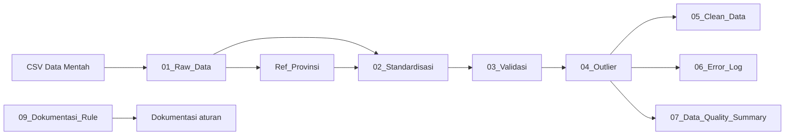

# Tutorial Data Cleansing dengan Power Query pada Excel

## Studi Kasus Data Panel IKAD

## 0. Etika Pengolahan Data: Menjaga Raw Data sebagai Artefak Asli

Dalam setiap proses pengolahan data, **raw data harus diperlakukan sebagai artefak asli yang bersifat tetap (immutable)**. Artinya, file sumber seperti `02_ikad_panel_5016_dirty_cleansing.csv` **tidak boleh diubah, diedit, ditimpa, atau disimpan ulang** selama proses data cleansing. Seluruh koreksi, standardisasi, validasi, deduplikasi, penanganan missing value, dan penyesuaian outlier harus dilakukan pada lapisan pengolahan yang terpisah, misalnya melalui query Power Query.

Prinsip ini penting karena raw data merupakan bukti awal mengenai kondisi data ketika pertama kali diterima. Apabila file sumber diubah langsung, organisasi akan kehilangan jejak mengenai nilai asli, bentuk kesalahan yang ditemukan, dan dasar perubahan yang dilakukan. Hal tersebut dapat mengurangi transparansi, menyulitkan proses audit, serta membuat hasil analisis sulit direproduksi oleh pihak lain.

### Prinsip yang harus diterapkan

1. **Jangan mengedit raw data secara langsung.**  
   Hindari memperbaiki ejaan, menghapus baris, mengganti nilai kosong, mengubah tipe data, atau menghapus duplikasi langsung pada file CSV sumber.

2. **Gunakan Power Query sebagai lapisan transformasi.**  
   File raw hanya dibaca sebagai sumber. Semua perubahan dicatat sebagai tahapan pada panel **Applied Steps**, sehingga proses cleansing dapat ditelusuri dan dijalankan ulang.

3. **Pisahkan data berdasarkan lapisan pengolahan.**  
   Gunakan struktur yang jelas, misalnya:

   ```text
   01_Raw_Data          -> representasi data sumber tanpa koreksi substantif
   02_Standardisasi     -> perbaikan format dan penyeragaman nilai
   03_Validasi          -> pemeriksaan aturan kualitas data
   04_Outlier           -> identifikasi dan perlakuan nilai ekstrem
   05_Clean_Data        -> data akhir yang siap dianalisis
   ```

4. **Pertahankan nilai asli ketika membuat nilai hasil cleansing.**  
   Jika suatu nilai perlu diperbaiki, sebaiknya nilai asli tetap tersedia dan hasil perbaikannya ditempatkan pada kolom baru, misalnya `Provinsi_Asli` dan `Provinsi_Standar`, atau `Kemiskinan_pct` dan `Kemiskinan_pct_Clean`. Pendekatan ini menjaga keterlacakan perubahan.

5. **Dokumentasikan setiap aturan perubahan.**  
   Setiap transformasi harus mempunyai alasan yang jelas, seperti aturan bisnis, referensi kode wilayah, batas nilai yang diperbolehkan, metode deteksi outlier, dan kebijakan penanganan duplikasi. Dalam workbook ini, dokumentasi tersebut dapat ditempatkan pada query `09_Dokumentasi_Rule`.

6. **Simpan file hasil sebagai artefak yang berbeda.**  
   Jangan menyimpan hasil cleansing dengan menimpa file sumber. Gunakan nama dan lokasi yang berbeda, misalnya:

   ```text
   raw/02_ikad_panel_5016_dirty_cleansing.csv
   processed/ikad_panel_standardized.xlsx
   output/ikad_panel_clean.csv
   ```

7. **Jaga keterlacakan dan kemampuan reproduksi.**  
   Simpan informasi mengenai nama file sumber, tanggal penerimaan, lokasi sumber, versi query, dan tanggal pemrosesan. Untuk kebutuhan audit yang lebih ketat, file raw dapat disimpan sebagai **read-only** dan dilengkapi nilai hash/checksum untuk membuktikan bahwa file tidak berubah.

> **Aturan utama:** Power Query boleh membaca dan mentransformasikan representasi data, tetapi file raw sebagai artefak sumber harus tetap utuh. Kesalahan pada raw data bukan dihapus dari sejarah, melainkan diperbaiki melalui tahapan transformasi yang transparan, terdokumentasi, dan dapat direproduksi.

---

Tutorial ini disusun berdasarkan dua file berikut:

1. `02_ikad_panel_5016_dirty_cleansing.csv` — data mentah yang masih mengandung masalah kualitas data.
2. `Query Cleansing.xlsx` — workbook Excel yang berisi rangkaian query Power Query untuk standardisasi, validasi, deteksi outlier, deduplikasi, error log, dan ringkasan kualitas data.

---

## 1. Tujuan Tutorial

Setelah mengikuti tutorial ini, pengguna dapat:

- mengimpor data CSV ke Power Query;
- menetapkan tipe data dengan benar;
- membersihkan spasi, karakter tersembunyi, dan kapitalisasi teks;
- menstandardisasi nama provinsi, wilayah, dan triwulan;
- mendeteksi nilai kosong, nilai tidak valid, duplikasi, dan outlier;
- membuat nilai hasil cleansing tanpa menghilangkan data asli;
- menghasilkan tabel data bersih, error log, dan ringkasan kualitas data;
- memperbarui seluruh hasil hanya dengan perintah **Refresh All**.

---

## 2. Gambaran Data Mentah

File CSV memiliki karakteristik berikut:

| Informasi | Nilai |
|---|---:|
| Jumlah baris data | 5.016 |
| Jumlah kolom | 40 |
| Jumlah provinsi | 38 |
| Periode | 1993–2025 |
| ID observasi unik | 4.951 |
| ID yang muncul lebih dari sekali | 60 ID |
| Baris yang termasuk duplikat | 125 baris |

Beberapa masalah yang terdapat pada data mentah antara lain:

- penulisan nama provinsi berbeda, misalnya `Aceh`, `ACEH`, `aceh`, dan ` Aceh `;
- penulisan wilayah berbeda, misalnya `Sumatera`, `SUMATERA`, dan `sumatera`;
- format triwulan tidak konsisten, misalnya `Q1`, `q2`, `1`, `TW-I`, kosong, dan `Q5`;
- nilai kosong pada sejumlah indikator;
- nilai negatif pada NPL, Kredit/PDRB, dan DPK/PDRB;
- duplikasi `ID_Observasi`;
- nilai ekstrem pada variabel `Kemiskinan_pct`.

### Ringkasan masalah yang terdeteksi

| Masalah | Jumlah baris |
|---|---:|
| Missing pada Kemiskinan, Urbanisasi, atau NPL | 545 |
| Nilai tidak valid berdasarkan aturan bisnis | 25 |
| Outlier Kemiskinan dengan metode IQR | 209 |
| Baris dengan ID duplikat | 125 |
| Perubahan format teks/triwulan yang diperlukan | sekitar 825 |

> Jumlah setiap jenis masalah tidak dapat langsung dijumlahkan karena satu baris dapat memiliki lebih dari satu masalah.

---

## 3. Arsitektur Query

Alur cleansing dalam workbook adalah sebagai berikut:



### Fungsi setiap query

| Query | Fungsi |
|---|---|
| `01_Raw_Data` | Membaca CSV, mempromosikan header, dan menetapkan tipe data. |
| `Ref_Provinsi` | Membentuk tabel referensi kode provinsi, nama provinsi, dan wilayah standar. |
| `02_Standardisasi` | Membersihkan nama kolom dan teks, lalu melakukan mapping provinsi dan wilayah. |
| `03_Validasi` | Memberikan status dan flag missing, invalid, format, serta duplikat. |
| `04_Outlier` | Menghitung IQR, memberi flag outlier, dan membuat nilai winsorized. |
| `05_Clean_Data` | Memilih satu record terbaik per ID dan menghasilkan data akhir. |
| `06_Error_Log` | Menampilkan hanya baris yang mempunyai masalah kualitas data. |
| `07_Data_Quality_Summary` | Menghitung jumlah dan persentase setiap masalah. |
| `09_Dokumentasi_Rule` | Menyimpan dokumentasi aturan cleansing dan justifikasinya. |

---

## 4. Koreksi Penting Sebelum Menggunakan Workbook

### 4.1 Sumber file masih menggunakan alamat komputer pembuat

Query `01_Raw_Data` pada workbook menggunakan alamat absolut seperti berikut:

```text
D:\OneDrive - Kemenkeu\@ SITP\2026\DIKLAT\DATA ANALYTICS\Data\02_ikad_panel_5016_dirty_cleansing.csv
```

Alamat tersebut harus diubah agar menunjuk ke lokasi CSV pada komputer pengguna.

### 4.2 Tipe data desimal pada query sumber harus diperbaiki

Pada query awal, banyak kolom desimal ditetapkan sebagai `Int64.Type`. Akibatnya, nilai dengan tanda desimal titik dapat dibaca secara salah.

Contoh kesalahan yang tersimpan pada workbook:

| Nilai CSV | Nilai yang terbaca salah |
|---:|---:|
| `49.69` | `4969` |
| `15.33` | `1533` |
| `5.45` | `545` |

Dampaknya adalah hampir seluruh baris ditandai invalid. Ringkasan yang tersimpan pada workbook menunjukkan 5.015 dari 5.016 baris invalid, padahal hasil pembacaan desimal yang benar hanya menghasilkan sekitar 25 baris invalid berdasarkan aturan yang digunakan.

**Perbaikannya:** gunakan `type number` untuk kolom desimal dan gunakan locale `en-US`, karena file CSV memakai titik sebagai pemisah desimal.

---

# BAGIAN A — MENGGUNAKAN WORKBOOK YANG SUDAH TERSEDIA

## 5. Menyiapkan File

1. Buat satu folder kerja, misalnya:

   ```text
   D:\Latihan_Power_Query\
   ```

2. Letakkan kedua file dalam folder yang sama:

   ```text
   D:\Latihan_Power_Query\02_ikad_panel_5016_dirty_cleansing.csv
   D:\Latihan_Power_Query\Query Cleansing.xlsx
   ```

3. Buka file `Query Cleansing.xlsx` menggunakan Microsoft Excel Desktop.

> Power Query pada Excel Desktop Windows mempunyai fitur yang lebih lengkap dibandingkan Excel versi web.

---

## 6. Membuka Power Query Editor

1. Pilih tab **Data**.
2. Klik **Queries & Connections**.
3. Pada panel sebelah kanan, klik kanan query `01_Raw_Data`.
4. Pilih **Edit**.
5. Jendela **Power Query Editor** akan terbuka.

Di panel kiri akan terlihat query:

- `01_Raw_Data`
- `02_Standardisasi`
- `03_Validasi`
- `04_Outlier`
- `05_Clean_Data`
- `06_Error_Log`
- `07_Data_Quality_Summary`
- `09_Dokumentasi_Rule`
- `Ref_Provinsi`

---

## 7. Memperbaiki Query `01_Raw_Data`

### 7.1 Membuka Advanced Editor

1. Pilih query `01_Raw_Data`.
2. Pilih tab **Home**.
3. Klik **Advanced Editor**.
4. Ganti kode lama dengan kode berikut.
5. Ubah bagian `File.Contents` sesuai lokasi file CSV.

```powerquery
let
    Source = Csv.Document(
        File.Contents("D:\Latihan_Power_Query\02_ikad_panel_5016_dirty_cleansing.csv"),
        [
            Delimiter = ",",
            Columns = 40,
            Encoding = 65001,
            QuoteStyle = QuoteStyle.Csv
        ]
    ),

    #"Promoted Headers" =
        Table.PromoteHeaders(
            Source,
            [PromoteAllScalars = true]
        ),

    #"Changed Type" =
        Table.TransformColumnTypes(
            #"Promoted Headers",
            {
                {"ID_Observasi", type text},
                {"Periode", type text},
                {"Tahun", Int64.Type},
                {"Triwulan", type text},
                {"Urutan_Waktu", Int64.Type},
                {"Kode_Provinsi", Int64.Type},
                {"Provinsi", type text},
                {"Wilayah", type text},
                {"Jumlah_Penduduk", Int64.Type},
                {"Urbanisasi_pct", type number},
                {"Kemiskinan_pct", type number},
                {"Penetrasi_Internet_pct", type number},
                {"Literasi_Keuangan_pct", type number},
                {"Rekening_per_1000_Penduduk", type number},
                {"Pertumbuhan_Rekening_qoq_pct", type number},
                {"Titik_Layanan_per_100rb_Penduduk", type number},
                {"ATM_per_100rb_Penduduk", type number},
                {"Kantor_Bank_per_100rb_Penduduk", type number},
                {"Kredit_terhadap_PDRB_pct", type number},
                {"DPK_terhadap_PDRB_pct", type number},
                {"Transaksi_Digital_pct", type number},
                {"Pertumbuhan_Transaksi_Digital_qoq_pct", type number},
                {"Pinjaman_Fintech_per_Kapita_juta", type number},
                {"NPL_pct", type number},
                {"Shock_Ekonomi", type text},
                {"Dimensi_Ketersediaan", type number},
                {"Dimensi_Penggunaan", type number},
                {"Dimensi_Kedalaman", type number},
                {"IKAD_Simulasi", type number},
                {"Kategori_IKAD", type text},
                {"IKAD_Lag_1", type number},
                {"IKAD_Lag_4", type number},
                {"IKAD_Rata_Rata_4Q", type number},
                {"Pertumbuhan_IKAD_qoq_pct", type number},
                {"Pertumbuhan_IKAD_yoy_pct", type number},
                {"IKAD_Berikutnya", type number},
                {"Kategori_IKAD_Berikutnya", type text},
                {"Perubahan_IKAD_Berikutnya", type number},
                {"Target_Peningkatan_IKAD", type number},
                {"Status_Data", type text}
            },
            "en-US"
        )
in
    #"Changed Type"
```

### 7.2 Alasan penggunaan `en-US`

File CSV memakai format desimal seperti:

```text
49.69
15.33
5.45
```

Locale `en-US` membaca titik sebagai tanda desimal. Apabila locale yang digunakan menganggap titik sebagai pemisah ribuan, angka dapat berubah menjadi `4969`, `1533`, dan `545`.

### 7.3 Pemeriksaan hasil

Setelah kode diterapkan, periksa beberapa nilai:

- `Urbanisasi_pct` harus tampil sekitar `27` sampai `87`;
- `Kemiskinan_pct` harus tampil sekitar `9` sampai `28`;
- `NPL_pct` umumnya berupa angka satu atau dua digit;
- jangan lanjut apabila nilai `49.69` masih tampil sebagai `4969`.

---

## 8. Menjalankan Seluruh Query

Setelah query sumber diperbaiki:

1. Klik **Home → Close & Load**.
2. Kembali ke Excel.
3. Pilih tab **Data**.
4. Klik **Refresh All**.
5. Tunggu sampai seluruh query selesai diperbarui.

Urutan dependensi akan dijalankan secara otomatis oleh Power Query.

---

## 9. Memeriksa Hasil Workbook

### 9.1 Sheet `05_Clean_Data`

Sheet ini merupakan hasil akhir cleansing. Proses yang dilakukan meliputi:

- menghitung total flag masalah;
- mengurutkan baris dari yang paling sedikit bermasalah;
- mempertahankan satu baris terbaik untuk setiap `ID_Observasi`;
- mengganti nama provinsi dan wilayah dengan nilai standar;
- mengganti `NPL_pct` dengan nilai NPL yang sudah dibersihkan;
- menambahkan `Status_Kualitas_Data`.

Status akhir yang digunakan:

| Jumlah flag | Status |
|---:|---|
| 0 | Bersih |
| 1 | Perlu Pemeriksaan Ringan |
| 2–3 | Perlu Pemeriksaan |
| Lebih dari 3 | Bermasalah Tinggi |

Jumlah baris akhir seharusnya mendekati jumlah ID unik, yaitu **4.951 baris**.

### 9.2 Sheet `06_Error_Log`

Sheet ini hanya memuat baris yang mempunyai minimal satu masalah:

- missing value;
- nilai invalid;
- outlier IQR;
- ID duplikat;
- format atau nama yang dikoreksi.

Kolom `Daftar_Masalah` menggabungkan seluruh masalah dalam satu teks, misalnya:

```text
Missing value; ID duplikat; Format/nama dikoreksi
```

Sheet ini dapat digunakan sebagai daftar kerja untuk verifikasi ke pemilik data.

### 9.3 Sheet `07_Data_Quality_Summary`

Sheet ini memberikan ringkasan:

- total baris;
- baris bersih;
- baris bermasalah;
- jumlah flag missing;
- jumlah flag invalid;
- jumlah flag outlier;
- jumlah flag duplikat;
- jumlah flag format.

> Nilai pada ringkasan baru dapat dipercaya setelah masalah tipe data pada `01_Raw_Data` diperbaiki.

### 9.4 Sheet `09_Dokumentasi_Rule`

Sheet ini berisi dokumentasi aturan kualitas data. Dokumentasi ini penting untuk:

- audit trail;
- konsistensi proses cleansing;
- persetujuan pemilik data;
- penjelasan alasan suatu nilai diubah atau dipertahankan.

---

# BAGIAN B — PENJELASAN SETIAP TAHAP CLEANSING

## 10. Tahap 1 — Membersihkan Nama Kolom

Pada query `02_Standardisasi`, nama kolom dibersihkan menggunakan:

```powerquery
Table.TransformColumnNames(
    Source,
    each Text.Trim(Text.Clean(_))
)
```

Fungsi yang digunakan:

| Fungsi | Kegunaan |
|---|---|
| `Text.Clean` | Menghapus karakter kontrol atau karakter tidak tercetak. |
| `Text.Trim` | Menghapus spasi di awal dan akhir teks. |

Contoh:

```text
" Provinsi "  →  "Provinsi"
```

---

## 11. Tahap 2 — Menyimpan Nilai Asli

Sebelum nama provinsi dan wilayah dibersihkan, query membuat salinan:

- `Provinsi_Asli`
- `Wilayah_Asli`

Tujuannya agar perubahan tetap dapat diaudit.

Melalui antarmuka Power Query:

1. Klik kanan kolom `Provinsi`.
2. Pilih **Duplicate Column**.
3. Ubah nama menjadi `Provinsi_Asli`.
4. Lakukan hal yang sama untuk `Wilayah`.

Prinsip yang dianjurkan adalah:

> Jangan langsung menimpa data asli apabila perubahan perlu ditelusuri atau dipertanggungjawabkan.

---

## 12. Tahap 3 — Membersihkan Isi Kolom Teks

### 12.1 ID dan periode

```powerquery
Text.Trim(Text.Clean(Text.From(_)))
```

### 12.2 Triwulan

Query awal hanya menggunakan `Text.Upper`. Agar format seperti `q2`, `1`, dan `TW-I` dapat benar-benar distandardisasi, gunakan fungsi berikut.

```powerquery
(x as any) as nullable text =>
let
    Raw =
        if x = null then
            null
        else
            Text.Upper(Text.Trim(Text.Clean(Text.From(x)))),

    TanpaKata =
        if Raw = null then
            null
        else
            Text.Trim(
                Text.Replace(
                    Text.Replace(Raw, "TRIWULAN", ""),
                    "TW-",
                    ""
                )
            ),

    Hasil =
        if TanpaKata = null or TanpaKata = "" then null
        else if List.Contains({"Q1", "1", "I"}, TanpaKata) then "Q1"
        else if List.Contains({"Q2", "2", "II"}, TanpaKata) then "Q2"
        else if List.Contains({"Q3", "3", "III"}, TanpaKata) then "Q3"
        else if List.Contains({"Q4", "4", "IV"}, TanpaKata) then "Q4"
        else Raw
in
    Hasil
```

Fungsi tersebut dapat dibuat sebagai query kosong bernama `fxNormalisasiTriwulan`, kemudian dipanggil pada kolom `Triwulan`.

Contoh hasil:

| Nilai awal | Hasil |
|---|---|
| `q2` | `Q2` |
| `1` | `Q1` |
| `TW-I` | `Q1` |
| kosong | `null` |
| `Q5` | tetap `Q5`, kemudian ditandai invalid |

### 12.3 Provinsi dan wilayah

```powerquery
Text.Proper(Text.Trim(Text.Clean(Text.From(_))))
```

Contoh:

| Nilai awal | Hasil sementara |
|---|---|
| ` ACEH ` | `Aceh` |
| `sumatera` | `Sumatera` |
| `SUMATERA UTARA` | `Sumatera Utara` |

> `Text.Proper` dapat mengubah singkatan seperti `DKI` menjadi `Dki`. Oleh karena itu, nama akhir sebaiknya tetap berasal dari tabel referensi resmi.

---

## 13. Tahap 4 — Membuat Referensi Provinsi

Query `Ref_Provinsi` menggunakan tiga kolom:

- `Kode_Provinsi`
- `Provinsi_Standar`
- `Wilayah_Standar`

### Cara yang digunakan pada workbook

1. Ambil data dari `01_Raw_Data`.
2. Bersihkan teks.
3. Pilih kolom kode provinsi, provinsi, dan wilayah.
4. Hapus duplikasi berdasarkan `Kode_Provinsi`.
5. Ubah nama kolom menjadi nama standar.

### Cara yang lebih direkomendasikan

Buat tabel referensi resmi secara manual di Excel, misalnya:

| Kode_Provinsi | Provinsi_Standar | Wilayah_Standar |
|---:|---|---|
| 11 | Aceh | Sumatera |
| 31 | DKI Jakarta | Jawa |
| 34 | DI Yogyakarta | Jawa |
| 51 | Bali | Bali dan Nusa Tenggara |

Ubah tabel tersebut menjadi Excel Table dan beri nama `tblRefProvinsi`.

Query referensinya:

```powerquery
let
    Source = Excel.CurrentWorkbook(){[Name="tblRefProvinsi"]}[Content],
    #"Changed Type" = Table.TransformColumnTypes(
        Source,
        {
            {"Kode_Provinsi", Int64.Type},
            {"Provinsi_Standar", type text},
            {"Wilayah_Standar", type text}
        }
    )
in
    #"Changed Type"
```

Keuntungan tabel referensi resmi:

- nama singkatan tetap benar;
- tidak bergantung pada nilai pertama dalam data mentah;
- mudah diperiksa dan diperbarui;
- lebih kuat untuk proses audit.

---

## 14. Tahap 5 — Merge dengan Referensi Provinsi

Pada query `02_Standardisasi`, lakukan **Left Outer Join**:

| Tabel utama | Tabel referensi |
|---|---|
| `Kode_Provinsi` | `Kode_Provinsi` |

Langkah melalui antarmuka:

1. Pilih query `02_Standardisasi`.
2. Pilih **Home → Merge Queries**.
3. Pilih query `Ref_Provinsi`.
4. Klik kolom `Kode_Provinsi` pada kedua tabel.
5. Pilih **Left Outer**.
6. Klik **OK**.
7. Expand kolom hasil merge.
8. Pilih `Provinsi_Standar` dan `Wilayah_Standar`.

Kode M yang digunakan:

```powerquery
Table.NestedJoin(
    #"Clean Text",
    {"Kode_Provinsi"},
    Ref_Provinsi,
    {"Kode_Provinsi"},
    "Ref_Provinsi",
    JoinKind.LeftOuter
)
```

---

## 15. Tahap 6 — Membuat Status Standardisasi

Contoh kategori status:

| Kondisi | Status |
|---|---|
| Kode tidak ditemukan pada referensi | Provinsi Tidak Dikenali |
| Nama provinsi kosong | Nama Provinsi Kosong |
| Nama provinsi berbeda dengan referensi | Nama Provinsi Dikoreksi |
| Wilayah kosong | Nama Wilayah Kosong |
| Wilayah berbeda dengan referensi | Nama Wilayah Dikoreksi |
| Seluruhnya sesuai | Sesuai |

### Catatan terhadap query workbook

Query yang tersedia membandingkan teks setelah `Text.Lower` dan `Text.Trim`. Akibatnya, perbedaan kapitalisasi dan spasi dapat dianggap **Sesuai**, meskipun sebenarnya terjadi perubahan.

Agar setiap perubahan tercatat, gunakan perbandingan nilai asli secara tepat:

```powerquery
if [Provinsi_Asli] <> [Provinsi_Standar] then
    "Nama Provinsi Dikoreksi"
else if [Wilayah_Asli] <> [Wilayah_Standar] then
    "Nama Wilayah Dikoreksi"
else
    "Sesuai"
```

Apabila ingin mengabaikan spasi tetapi tetap mencatat kapitalisasi, lakukan normalisasi sesuai kebijakan organisasi.

---

## 16. Tahap 7 — Validasi Nilai Numerik

Query `03_Validasi` membuat status untuk beberapa indikator.

### 16.1 Urbanisasi

| Kondisi | Status |
|---|---|
| null | Missing |
| kurang dari 0 | Invalid: Negatif |
| lebih dari 100 | Invalid: Di atas 100% |
| 0 sampai 100 | Valid |

Contoh custom column:

```powerquery
let
    Nilai = try Number.From([Urbanisasi_pct]) otherwise null
in
    if Nilai = null then "Missing"
    else if Nilai < 0 then "Invalid: Negatif"
    else if Nilai > 100 then "Invalid: Di atas 100%"
    else "Valid"
```

### 16.2 Kemiskinan

Aturan yang disarankan sama dengan persentase urbanisasi:

```powerquery
let
    Nilai = try Number.From([Kemiskinan_pct]) otherwise null
in
    if Nilai = null then "Missing"
    else if Nilai < 0 then "Invalid: Negatif"
    else if Nilai > 100 then "Invalid: Di atas 100%"
    else "Valid"
```

### 16.3 NPL

| Kondisi | Perlakuan |
|---|---|
| null | Pertahankan null dan beri status Missing |
| kurang dari 0 | Tandai invalid dan ubah nilai clean menjadi null |
| lebih dari 100 | Tandai invalid |
| 0 sampai 100 | Pertahankan |

Kolom `NPL_pct` asli tetap disimpan untuk audit. Nilai hasil cleansing ditempatkan pada `NPL_pct_Clean`.

```powerquery
let
    Nilai = try Number.From([NPL_pct]) otherwise null
in
    if Nilai = null or Nilai < 0 then null
    else Nilai
```

### 16.4 Kredit terhadap PDRB

| Kondisi | Status |
|---|---|
| null | Missing |
| kurang dari 0 | Invalid |
| lebih dari 100 | Warning, tetapi masih mungkin secara ekonomi |
| lainnya | Valid |

### 16.5 DPK terhadap PDRB

| Kondisi | Status |
|---|---|
| null | Missing |
| kurang dari 0 | Invalid |
| 0 atau lebih | Valid |

Nilai di atas 100 tidak otomatis salah karena rasio DPK terhadap PDRB dapat melebihi 100.

---

## 17. Tahap 8 — Membuat Flag Missing

Flag missing pada workbook menggunakan tiga variabel utama:

- `Kemiskinan_pct`
- `Urbanisasi_pct`
- `NPL_pct`

```powerquery
if
    List.Contains(
        {
            try [Kemiskinan_pct] otherwise null,
            try [Urbanisasi_pct] otherwise null,
            try [NPL_pct] otherwise null
        },
        null
    )
then 1
else 0
```

Arti flag:

| Nilai | Arti |
|---:|---|
| 0 | Ketiga variabel terisi |
| 1 | Minimal satu variabel kosong |

---

## 18. Tahap 9 — Membuat Flag Invalid

`Flag_Invalid = 1` apabila ditemukan salah satu kondisi berikut:

- Urbanisasi kurang dari 0 atau lebih dari 100;
- Kemiskinan kurang dari 0 atau lebih dari 100;
- NPL kurang dari 0 atau lebih dari 100;
- Kredit/PDRB bernilai negatif;
- DPK/PDRB bernilai negatif;
- triwulan bukan `Q1`, `Q2`, `Q3`, atau `Q4`, apabila aturan triwulan dimasukkan ke validasi.

Contoh struktur kode:

```powerquery
let
    Urbanisasi = try Number.From([Urbanisasi_pct]) otherwise null,
    Kemiskinan = try Number.From([Kemiskinan_pct]) otherwise null,
    NPL = try Number.From([NPL_pct]) otherwise null,
    KreditPDRB = try Number.From([Kredit_terhadap_PDRB_pct]) otherwise null,
    DPKPDRB = try Number.From([DPK_terhadap_PDRB_pct]) otherwise null
in
    if
        (Urbanisasi <> null and (Urbanisasi < 0 or Urbanisasi > 100))
        or (Kemiskinan <> null and (Kemiskinan < 0 or Kemiskinan > 100))
        or (NPL <> null and (NPL < 0 or NPL > 100))
        or (KreditPDRB <> null and KreditPDRB < 0)
        or (DPKPDRB <> null and DPKPDRB < 0)
    then 1
    else 0
```

---

## 19. Tahap 10 — Mendeteksi Duplikasi

### 19.1 Menghitung jumlah kemunculan ID

Gunakan **Group By** berdasarkan `ID_Observasi`:

```powerquery
Table.Group(
    Source,
    {"ID_Observasi"},
    {
        {
            "Jumlah_Kemunculan",
            each Table.RowCount(_),
            Int64.Type
        }
    }
)
```

### 19.2 Menggabungkan hasil ke data utama

Lakukan merge berdasarkan `ID_Observasi`, kemudian expand `Jumlah_Kemunculan`.

### 19.3 Membuat flag duplikat

```powerquery
if [Jumlah_Kemunculan] > 1 then 1 else 0
```

Pada data mentah terdapat:

- 60 ID yang muncul lebih dari sekali;
- 125 baris yang termasuk kelompok duplikat.

---

## 20. Tahap 11 — Mendeteksi Outlier dengan Metode IQR

Query `04_Outlier` menggunakan variabel `Kemiskinan_pct`.

### 20.1 Rumus IQR

```text
IQR = Q3 - Q1
Batas bawah = Q1 - 1,5 × IQR
Batas atas  = Q3 + 1,5 × IQR
```

Berdasarkan angka desimal yang dibaca dengan benar, hasil pendekatan pada data ini adalah:

| Komponen | Nilai |
|---|---:|
| Q1 | 16,68 |
| Q3 | 19,9225 |
| IQR | 3,2425 |
| Batas bawah | 11,81625 |
| Batas atas | 24,78625 |

Nilai kemiskinan di bawah batas bawah atau di atas batas atas diberi `Flag_Outlier = 1`.

### 20.2 Kode Power Query

```powerquery
let
    Source = #"03_Validasi",

    NilaiValid =
        List.RemoveNulls(
            List.Transform(
                Table.Column(Source, "Kemiskinan_pct"),
                each try Number.From(_) otherwise null
            )
        ),

    Q1 =
        if List.Count(NilaiValid) > 0
        then List.Percentile(NilaiValid, 0.25)
        else null,

    Q3 =
        if List.Count(NilaiValid) > 0
        then List.Percentile(NilaiValid, 0.75)
        else null,

    IQR =
        if Q1 = null or Q3 = null
        then null
        else Q3 - Q1,

    BatasBawah =
        if IQR = null then null
        else Q1 - 1.5 * IQR,

    BatasAtas =
        if IQR = null then null
        else Q3 + 1.5 * IQR
in
    Source
```

Query workbook kemudian menambahkan:

- `Batas_Bawah_Kemiskinan`;
- `Batas_Atas_Kemiskinan`;
- `Flag_Outlier`;
- `Kemiskinan_pct_Winsor`.

---

## 21. Tahap 12 — Winsorization

Winsorization tidak menghapus baris outlier. Nilai ekstrem dibatasi pada nilai ambang.

Aturannya:

| Kondisi | Nilai winsorized |
|---|---:|
| Nilai di bawah batas bawah | Batas bawah |
| Nilai di atas batas atas | Batas atas |
| Nilai di dalam rentang | Nilai asli |
| Nilai null | null |

Kode:

```powerquery
let
    x = try Number.From([Kemiskinan_pct]) otherwise null
in
    if x = null then null
    else if BatasBawah = null or BatasAtas = null then x
    else if x < BatasBawah then BatasBawah
    else if x > BatasAtas then BatasAtas
    else x
```

> Workbook tetap mempertahankan `Kemiskinan_pct` asli dan menambahkan `Kemiskinan_pct_Winsor`. Pendekatan ini lebih aman karena nilai asli tidak hilang.

---

## 22. Tahap 13 — Menentukan Record Terbaik saat Deduplikasi

Query `05_Clean_Data` menghitung:

```powerquery
Jumlah_Flag_Masalah =
    Flag_Missing
    + Flag_Invalid
    + Flag_Outlier
    + Flag_Duplikat
    + Flag_Format
```

Kemudian data diurutkan berdasarkan:

1. `Jumlah_Flag_Masalah` dari kecil ke besar;
2. `Urutan_Waktu` dari kecil ke besar.

Setelah itu dilakukan:

```powerquery
Table.Distinct(
    #"Sorted Rows",
    {"ID_Observasi"}
)
```

Dengan demikian, satu record dengan jumlah masalah paling sedikit dipertahankan untuk setiap ID.

### Catatan metodologis

Apabila dua record duplikat mempunyai jumlah flag yang sama, perlu ditentukan aturan tambahan, misalnya:

- pilih record dengan jumlah kolom terisi paling banyak;
- pilih record dengan tanggal pembaruan terbaru;
- pilih record dari sumber data yang paling otoritatif;
- pilih record dengan `Status_Data` terbaik.

---

## 23. Tahap 14 — Membuat Error Log

Query `06_Error_Log` membuat kolom `Daftar_Masalah`.

```powerquery
Text.Combine(
    List.RemoveNulls(
        {
            if [Flag_Missing] = 1 then "Missing value" else null,
            if [Flag_Invalid] = 1 then "Nilai invalid" else null,
            if [Flag_Outlier] = 1 then "Outlier IQR" else null,
            if [Flag_Duplikat] = 1 then "ID duplikat" else null,
            if [Flag_Format] = 1 then "Format/nama dikoreksi" else null
        }
    ),
    "; "
)
```

Setelah itu, filter hanya baris yang mempunyai minimal satu flag bernilai 1.

---

## 24. Tahap 15 — Membuat Data Quality Summary

Query `07_Data_Quality_Summary` menghitung jumlah flag dengan pola berikut:

```powerquery
TotalBaris = Table.RowCount(Source),
Missing = List.Sum(List.RemoveNulls(Table.Column(Source, "Flag_Missing"))),
Invalid = List.Sum(List.RemoveNulls(Table.Column(Source, "Flag_Invalid"))),
Outlier = List.Sum(List.RemoveNulls(Table.Column(Source, "Flag_Outlier"))),
Duplikat = List.Sum(List.RemoveNulls(Table.Column(Source, "Flag_Duplikat"))),
Format = List.Sum(List.RemoveNulls(Table.Column(Source, "Flag_Format")))
```

Baris bermasalah dihitung berdasarkan kondisi OR, bukan penjumlahan flag:

```powerquery
Bermasalah =
    Table.RowCount(
        Table.SelectRows(
            Source,
            each
                [Flag_Missing] = 1
                or [Flag_Invalid] = 1
                or [Flag_Outlier] = 1
                or [Flag_Duplikat] = 1
                or [Flag_Format] = 1
        )
    )
```

Persentase:

```powerquery
Jumlah / TotalBaris
```

Setelah perbaikan pembacaan desimal dan pencatatan perubahan format, hasil indikatif adalah:

| Metrik | Jumlah | Persentase |
|---|---:|---:|
| Total baris | 5.016 | 100,00% |
| Baris bersih | sekitar 3.421 | 68,20% |
| Baris bermasalah | sekitar 1.595 | 31,80% |
| Flag missing | 545 | 10,87% |
| Flag invalid | 25 | 0,50% |
| Flag outlier | 209 | 4,17% |
| Flag duplikat | 125 | 2,49% |
| Flag format | sekitar 825 | 16,45% |

> Nilai `Flag_Format` bergantung pada kebijakan perbandingan. Jika perbedaan kapitalisasi dan spasi diabaikan, jumlahnya dapat menjadi lebih kecil atau bahkan nol.

---

# BAGIAN C — PENGATURAN LOAD DAN REFRESH

## 25. Mengatur Query agar Tidak Semua Dimuat ke Worksheet

Query perantara sebaiknya menggunakan **Connection Only** agar workbook lebih ringan.

### Query yang disarankan sebagai Connection Only

- `01_Raw_Data`
- `Ref_Provinsi`
- `02_Standardisasi`
- `03_Validasi`
- `04_Outlier`
- `09_Dokumentasi_Rule`, apabila dokumentasi tidak perlu dimuat sebagai tabel query

### Query yang dimuat sebagai tabel

- `05_Clean_Data`
- `06_Error_Log`
- `07_Data_Quality_Summary`

Cara mengatur:

1. Klik kanan query pada panel **Queries & Connections**.
2. Pilih **Load To...**.
3. Pilih salah satu:
   - **Only Create Connection**; atau
   - **Table → Existing Worksheet/New Worksheet**.

---

## 26. Memperbarui Data Baru

Apabila CSV diperbarui tetapi struktur kolom tidak berubah:

1. Simpan CSV baru dengan nama dan lokasi yang sama.
2. Buka workbook.
3. Pilih **Data → Refresh All**.
4. Periksa:
   - jumlah baris pada `07_Data_Quality_Summary`;
   - error pada panel Queries & Connections;
   - perubahan jumlah baris pada `05_Clean_Data`;
   - daftar masalah baru pada `06_Error_Log`.

Power Query akan menjalankan ulang seluruh proses tanpa mengulangi cleansing secara manual.

---

## 27. Menggunakan Folder sebagai Sumber Data Dinamis

Apabila file CSV berubah nama secara berkala, misalnya setiap bulan, gunakan sumber dari folder:

1. Pilih **Data → Get Data → From File → From Folder**.
2. Pilih folder penyimpanan data.
3. Filter nama file atau pilih file terbaru.
4. Gunakan fungsi `Excel.Workbook` atau `Csv.Document` pada binary file yang dipilih.

Contoh memilih file CSV terbaru:

```powerquery
let
    Source = Folder.Files("D:\Latihan_Power_Query"),
    #"Filtered CSV" =
        Table.SelectRows(
            Source,
            each [Extension] = ".csv"
        ),
    #"Sorted Files" =
        Table.Sort(
            #"Filtered CSV",
            {{"Date modified", Order.Descending}}
        ),
    LatestFile = #"Sorted Files"{0}[Content],
    CSV = Csv.Document(
        LatestFile,
        [Delimiter = ",", Encoding = 65001, QuoteStyle = QuoteStyle.Csv]
    )
in
    CSV
```

---

# BAGIAN D — QUALITY CHECK

## 28. Checklist Pemeriksaan setelah Refresh

Gunakan checklist berikut setiap kali data diperbarui.

### Pemeriksaan sumber

- [ ] Jumlah kolom tetap 40.
- [ ] Header terbaca pada baris pertama.
- [ ] Encoding UTF-8 tidak merusak karakter.
- [ ] Nilai desimal tidak berubah menjadi ribuan.
- [ ] Tidak muncul error `DataFormat.Error`.

### Pemeriksaan standardisasi

- [ ] Seluruh kode provinsi ditemukan pada referensi.
- [ ] Nama provinsi akhir konsisten.
- [ ] Nama wilayah akhir konsisten.
- [ ] Triwulan hanya berisi Q1–Q4 atau null yang sudah diberi flag.
- [ ] Nilai asli tetap tersedia untuk audit.

### Pemeriksaan validasi

- [ ] Nilai persentase berada pada rentang yang logis.
- [ ] NPL negatif menjadi null pada kolom hasil cleansing.
- [ ] Nilai rasio di atas 100 tidak otomatis dianggap invalid tanpa dasar bisnis.
- [ ] Missing value tidak diisi secara otomatis tanpa metode yang disetujui.

### Pemeriksaan output

- [ ] `05_Clean_Data` hanya mempunyai satu baris per ID.
- [ ] `06_Error_Log` hanya berisi baris bermasalah.
- [ ] `07_Data_Quality_Summary` konsisten dengan error log.
- [ ] Total baris bersih dan bermasalah sama dengan total baris sumber.

---

## 29. Kesalahan Umum dan Solusinya

### 29.1 Nilai 49.69 berubah menjadi 4969

**Penyebab:** kolom desimal diubah menjadi integer atau locale salah.

**Solusi:** gunakan `type number` dan locale `en-US`.

---

### 29.2 Formula.Firewall

**Penyebab:** Power Query menggabungkan sumber dengan tingkat privasi yang berbeda.

**Solusi:**

1. buka **Data Source Settings**;
2. samakan tingkat privasi sumber;
3. hindari menggabungkan sumber publik dan organisasi tanpa kebijakan yang jelas.

---

### 29.3 File tidak ditemukan

Pesan yang umum:

```text
DataSource.Error: Could not find file
```

**Solusi:** edit langkah `Source` pada `01_Raw_Data` dan pilih ulang lokasi CSV.

---

### 29.4 Query menghasilkan 0 baris bersih

Periksa:

- tipe data numerik;
- locale desimal;
- logika `Flag_Invalid`;
- nilai batas IQR;
- apakah seluruh baris salah ditandai akibat kesalahan parsing.

Pada workbook awal, penyebab utamanya adalah angka desimal terbaca sebagai angka ribuan.

---

### 29.5 `Flag_Format` selalu 0

**Penyebab:** nilai asli dan standar dibandingkan setelah sama-sama diubah menjadi lowercase dan di-trim.

**Solusi:** tentukan kebijakan:

- bandingkan nilai secara exact apabila setiap koreksi harus tercatat; atau
- bandingkan nilai setelah normalisasi apabila perbedaan kapitalisasi tidak dianggap masalah.

---

### 29.6 DKI Jakarta berubah menjadi Dki Jakarta

**Penyebab:** penggunaan `Text.Proper`.

**Solusi:** gunakan tabel referensi resmi dan ambil nama akhir dari kolom `Provinsi_Standar`.

---

## 30. Praktik Terbaik

1. **Pisahkan raw data dan clean data.** Jangan mengubah CSV asli.
2. **Pertahankan nilai asli.** Buat kolom baru untuk nilai hasil cleansing.
3. **Dokumentasikan aturan.** Setiap perubahan harus mempunyai alasan.
4. **Gunakan referensi resmi.** Jangan membentuk master data hanya dari data yang kotor.
5. **Gunakan flag.** Hindari langsung menghapus data bermasalah.
6. **Gunakan Connection Only untuk query perantara.** Workbook menjadi lebih ringan.
7. **Gunakan locale secara eksplisit.** Terutama untuk angka desimal dan tanggal.
8. **Periksa hasil setelah Refresh All.** Refresh yang sukses belum tentu menghasilkan data yang benar.
9. **Gunakan error log untuk tindak lanjut.** Error log merupakan daftar pekerjaan perbaikan sumber.
10. **Hindari imputasi tanpa dasar metodologis.** Missing value sebaiknya tetap null sampai metode disetujui.

---

## 31. Ringkasan Proses

```text
1. Simpan CSV dan workbook dalam folder kerja.
2. Buka Query Cleansing.xlsx.
3. Buka Power Query Editor.
4. Perbaiki alamat file pada 01_Raw_Data.
5. Ubah kolom desimal menjadi type number dengan locale en-US.
6. Refresh seluruh query.
7. Periksa standardisasi provinsi, wilayah, dan triwulan.
8. Periksa flag missing, invalid, format, duplikat, dan outlier.
9. Gunakan 05_Clean_Data sebagai dataset analisis.
10. Gunakan 06_Error_Log untuk verifikasi masalah.
11. Gunakan 07_Data_Quality_Summary untuk pelaporan kualitas data.
12. Dokumentasikan setiap perubahan aturan pada 09_Dokumentasi_Rule.
```

---

## 32. Kesimpulan

Power Query memungkinkan proses data cleansing dibuat secara terstruktur, transparan, dapat diaudit, dan dapat dijalankan ulang. Pada studi kasus ini, proses dipisahkan menjadi query sumber, standardisasi, validasi, deteksi outlier, data bersih, error log, dan ringkasan kualitas data.

Hal paling penting sebelum menggunakan workbook adalah memperbaiki pembacaan tipe data desimal. Kolom desimal harus menggunakan `type number` dengan locale yang sesuai. Setelah koreksi tersebut, proses cleansing dapat digunakan secara berulang melalui perintah **Refresh All** tanpa membersihkan data secara manual dari awal.
