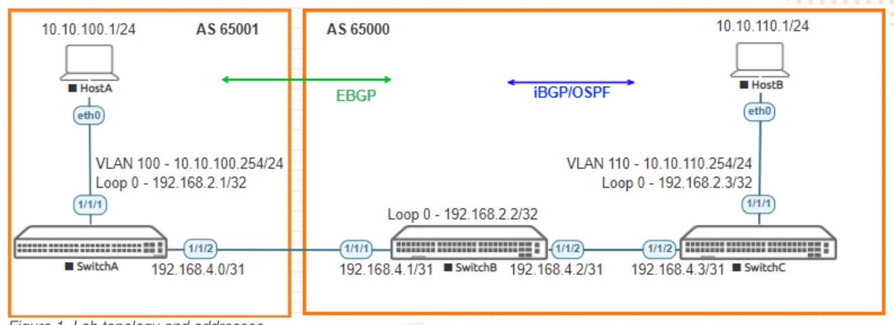

# Deploying basic BGP

> **Panduan praktik berbahasa Indonesia**  
> Sumber: `AOS-CX Simulator - Basic BGP Lab Guide.pdf`  
> Tingkat: **Menengah - OSPF sebagai IGP, iBGP, eBGP, dan route policy**

## 1. Modul ini belajar tentang apa?

Lab ini mengajarkan cara bertukar informasi route menggunakan **Border Gateway Protocol (BGP)**.

Topologi dibagi menjadi dua Autonomous System:

```text
AS 65001                         AS 65000
HostA - SwitchA  ← eBGP →  SwitchB ← iBGP → SwitchC - HostB
                                      ↑
                         OSPF menyediakan reachability loopback
```

Tujuan akhirnya adalah membuat HostA dan HostB yang berada pada AS berbeda dapat berkomunikasi, kemudian menerapkan kebijakan route untuk membatasi route tertentu. fileciteturn6file1

## 2. BGP digunakan untuk apa?

OSPF biasanya digunakan di dalam satu organisasi atau satu domain routing. BGP digunakan ketika kita perlu:

- bertukar route antar-Autonomous System;
- menerapkan kebijakan terhadap route;
- memilih jalur berdasarkan atribut seperti AS Path;
- melakukan multihoming;
- menghubungkan jaringan enterprise dengan provider;
- menjadi control plane pada teknologi seperti EVPN.

> **OSPF mencari jalur internal terbaik. BGP memilih dan mengendalikan route berdasarkan kebijakan.**

## 3. Tujuan pembelajaran

Setelah menyelesaikan lab, Anda mampu:

- memahami Autonomous System dan nomor AS;
- membedakan iBGP dan eBGP;
- menggunakan OSPF agar loopback BGP saling reachable;
- membentuk iBGP menggunakan alamat loopback;
- membentuk eBGP menggunakan alamat link langsung;
- mengiklankan jaringan dengan perintah `network`;
- membaca BGP summary dan BGP table;
- memahami fungsi `default-originate`;
- memahami AS Path sebagai pencegah loop;
- menerapkan prefix-list dan route-map;
- membedakan route filtering dengan packet filtering.

## 4. Gambaran topologi



### Peran perangkat

| Perangkat | AS | Peran |
|---|---:|---|
| **SwitchA** | 65001 | Edge router AS 65001 dan gateway HostA |
| **SwitchB** | 65000 | Border router AS 65000; eBGP ke A dan iBGP ke C |
| **SwitchC** | 65000 | Internal router AS 65000 dan gateway HostB |
| **HostA** | - | `10.10.100.1/24`, gateway `10.10.100.254` |
| **HostB** | - | `10.10.110.1/24`, gateway `10.10.110.254` |

### Tabel alamat

| Fungsi | Alamat |
|---|---|
| SwitchA-SwitchB | A `192.168.4.0/31`, B `192.168.4.1/31` |
| SwitchB-SwitchC | B `192.168.4.2/31`, C `192.168.4.3/31` |
| Loopback A | `192.168.2.1/32` |
| Loopback B | `192.168.2.2/32` |
| Loopback C | `192.168.2.3/32` |
| Jaringan HostA | `10.10.100.0/24` |
| Jaringan HostB | `10.10.110.0/24` |

## 5. Istilah penting

| Istilah | Penjelasan sederhana |
|---|---|
| **AS** | Sekumpulan router yang dikelola dengan kebijakan routing yang sama. |
| **ASN** | Nomor identitas Autonomous System, misalnya 65000. |
| **iBGP** | BGP antara router yang berada dalam AS yang sama. |
| **eBGP** | BGP antara router yang berada pada AS berbeda. |
| **BGP peer/neighbor** | Router yang dikonfigurasi manual untuk bertukar route BGP. |
| **NLRI** | Informasi prefix jaringan yang diiklankan BGP. |
| **AS Path** | Daftar AS yang dilewati sebuah route. |
| **Route-map** | Kebijakan untuk mengizinkan, menolak, atau memodifikasi route. |
| **Prefix-list** | Daftar prefix yang akan dicocokkan oleh kebijakan. |
| **IGP** | Protokol routing internal, pada lab ini menggunakan OSPF. |

## 6. Perbedaan iBGP dan eBGP

| Aspek | iBGP | eBGP |
|---|---|---|
| AS neighbor | Sama | Berbeda |
| Contoh lab | SwitchB-SwitchC | SwitchA-SwitchB |
| Alamat peer | Loopback | Interface langsung |
| Perlu IGP | Ya, untuk reachability loopback | Tidak pada link langsung |
| Fungsi | Menyebarkan route dalam AS | Bertukar route antar-AS |

## 7. Tahap 1 - Menyiapkan host dan interface

### HostA

```text
ip 10.10.100.1/24 10.10.100.254
```

### HostB

```text
ip 10.10.110.1/24 10.10.110.254
```

### SwitchA

```text
vlan 100
 description HostA VLAN

interface 1/1/1
 no shutdown
 no routing
 vlan access 100

interface 1/1/2
 no shutdown
 ip address 192.168.4.0/31

interface loopback 0
 ip address 192.168.2.1/32

interface vlan 100
 description To HostA
 ip address 10.10.100.254/24
```

### SwitchB

```text
interface 1/1/1
 no shutdown
 ip address 192.168.4.1/31

interface 1/1/2
 no shutdown
 ip address 192.168.4.2/31

interface loopback 0
 ip address 192.168.2.2/32
```

### SwitchC

```text
vlan 110
 description HostB VLAN

interface 1/1/1
 no shutdown
 no routing
 vlan access 110

interface 1/1/2
 no shutdown
 ip address 192.168.4.3/31

interface loopback 0
 ip address 192.168.2.3/32

interface vlan 110
 description To HostB
 ip address 10.10.110.254/24
```

Validasi koneksi langsung:

```text
show interface brief
show lldp neighbor-info

# Dari SwitchA
ping 192.168.4.1
ping 10.10.100.1

# Dari SwitchB
ping 192.168.4.3

# Dari SwitchC
ping 10.10.110.1
```

Jangan mulai BGP sebelum ping pada setiap link langsung berhasil.

## 8. Tahap 2 - Menggunakan OSPF sebagai IGP

iBGP antara SwitchB dan SwitchC menggunakan loopback. Agar loopback tersebut saling reachable, B dan C menjalankan OSPF.

### SwitchB

```text
router ospf 1
 router-id 192.168.2.2
 area 0.0.0.0

interface 1/1/2
 ip ospf 1 area 0.0.0.0
 ip ospf network point-to-point

interface loopback 0
 ip ospf 1 area 0.0.0.0
```

### SwitchC

```text
router ospf 1
 router-id 192.168.2.3
 area 0.0.0.0

interface 1/1/2
 ip ospf 1 area 0.0.0.0
 ip ospf network point-to-point

interface loopback 0
 ip ospf 1 area 0.0.0.0
```

Validasi:

```text
show ip ospf neighbors
show ip route ospf

# Dari SwitchB
ping 192.168.2.3

# Dari SwitchC
ping 192.168.2.2
```

Neighbor harus berstatus:

```text
FULL
```

> PDF menyebut `interface vlan 7` pada bagian OSPF, tetapi topologi dan konfigurasi sebenarnya menggunakan VLAN 110. Untuk membentuk iBGP, yang wajib diiklankan OSPF adalah link B-C dan loopback B/C.

## 9. Tahap 3 - Membentuk iBGP pada AS 65000

### SwitchB

```text
router bgp 65000
 bgp router-id 192.168.2.2
 neighbor 192.168.2.3 remote-as 65000
 neighbor 192.168.2.3 update-source loopback 0

 address-family ipv4 unicast
  neighbor 192.168.2.3 activate
  neighbor 192.168.2.3 default-originate
 exit-address-family
```

### SwitchC

```text
router bgp 65000
 bgp router-id 192.168.2.3
 neighbor 192.168.2.2 remote-as 65000
 neighbor 192.168.2.2 update-source loopback 0

 address-family ipv4 unicast
  neighbor 192.168.2.2 activate
  network 10.10.110.0/24
 exit-address-family
```

Validasi:

```text
show bgp ipv4 unicast summary
```

Target:

```text
Neighbor       Remote-AS   State
192.168.2.2    65000       Established
```

atau dari sisi SwitchB:

```text
192.168.2.3    65000       Established
```

### Mengapa memakai `update-source loopback 0`?

Neighbor dikonfigurasi menggunakan alamat loopback. Tanpa `update-source`, paket BGP dapat berasal dari alamat interface fisik dan tidak cocok dengan neighbor yang diharapkan.

### Mengapa SwitchB mengirim default route?

```text
neighbor 192.168.2.3 default-originate
```

SwitchC menerima default route menuju SwitchB. Dengan begitu, trafik menuju jaringan yang belum dikenal SwitchC dapat diteruskan ke border router B.

## 10. Syarat penting perintah `network`

BGP tidak otomatis mengiklankan prefix hanya karena perintah `network` ditulis.

```text
network 10.10.110.0/24
```

Prefix yang sama persis harus sudah ada di routing table.

Periksa:

```text
show ip route 10.10.110.0/24
show bgp ipv4 unicast
```

Karena SVI VLAN 110 aktif, jaringan `10.10.110.0/24` tersedia sebagai connected route dan dapat dimasukkan ke BGP.

## 11. Tahap 4 - Membentuk eBGP antara AS 65001 dan 65000

### SwitchA - AS 65001

```text
router bgp 65001
 bgp router-id 192.168.2.1
 neighbor 192.168.4.1 remote-as 65000

 address-family ipv4 unicast
  neighbor 192.168.4.1 activate
  network 10.10.100.0/24
 exit-address-family
```

### SwitchB - AS 65000

Tambahkan neighbor eBGP tanpa menghapus neighbor iBGP:

```text
router bgp 65000
 neighbor 192.168.4.0 remote-as 65001

 address-family ipv4 unicast
  neighbor 192.168.4.0 activate
 exit-address-family
```

Validasi:

```text
show bgp ipv4 unicast summary
show bgp ipv4 unicast
show ip route bgp
```

Pada SwitchB terdapat dua jenis neighbor:

```text
192.168.2.3 → iBGP, remote AS 65000
192.168.4.0 → eBGP, remote AS 65001
```

## 12. Menguji komunikasi antar-AS

Dari HostA:

```text
ping 10.10.110.1
```

Dari HostB:

```text
ping 10.10.100.1
```

Alur route HostA menuju HostB:

```text
HostA
→ gateway SwitchA
→ eBGP ke SwitchB
→ iBGP/route internal AS 65000
→ SwitchC
→ HostB
```

Periksa route secara bertahap:

```text
# SwitchA harus mengetahui 10.10.110.0/24
show ip route 10.10.110.0/24

# SwitchB harus mengetahui kedua jaringan
show bgp ipv4 unicast

# SwitchC harus mempunyai jalur/default menuju SwitchB
show ip route
```

## 13. Memahami AS Path

Ketika route `10.10.100.0/24` masuk dari AS 65001 ke AS 65000, BGP menambahkan AS 65001 ke atribut AS Path.

AS Path berguna untuk:

- melihat AS yang dilewati;
- membantu pemilihan jalur;
- mencegah loop.

Router akan menolak route yang AS Path-nya sudah berisi ASN miliknya sendiri.

## 14. Tahap 5 - Menerapkan route filtering

### Hal yang perlu diluruskan dari PDF

Contoh PDF mempunyai beberapa ketidakkonsistenan:

- penjelasan menyebut jaringan `8.1.1.0/24` dan `7.1.1.0/24`, sedangkan topologi memakai `10.10.100.0/24` dan `10.10.110.0/24`;
- contoh prefix-list menggunakan `10.10.110.1/32`, padahal BGP mengiklankan `10.10.110.0/24`;
- contoh memberi `deny` pada prefix-list lalu kembali `deny` pada route-map, sehingga logika pencocokannya mudah membingungkan;
- route-map tanpa sequence `permit` berikutnya dapat menolak semua route yang tidak cocok karena implicit deny.

Untuk pembelajaran yang lebih jelas, gunakan contoh berikut untuk menolak prefix HostB dari arah SwitchB ke SwitchA.

### SwitchA

```text
ip prefix-list BLOCK-HOSTB seq 10 permit 10.10.110.0/24

route-map FILTER-BGP-IN deny seq 10
 match ip address prefix-list BLOCK-HOSTB

route-map FILTER-BGP-IN permit seq 20

router bgp 65001
 address-family ipv4 unicast
  neighbor 192.168.4.1 route-map FILTER-BGP-IN in
 exit-address-family
```

Terapkan ulang kebijakan:

```text
clear bgp 192.168.4.1
```

Validasi:

```text
show bgp ipv4 unicast
show ip route 10.10.110.0/24
```

Route `10.10.110.0/24` seharusnya tidak lagi diterima SwitchA.

### Route filtering bukan firewall

Route-map BGP mengatur **route yang diterima atau diumumkan**, bukan memeriksa setiap paket seperti ACL/firewall.

Akibat route dihapus:

```text
SwitchA tidak mempunyai jalur ke 10.10.110.0/24
→ HostA tidak dapat mencapai HostB
```

Untuk memblokir paket berdasarkan source/destination secara langsung, gunakan ACL atau firewall, bukan hanya BGP policy.

## 15. Cara membaca BGP summary

```text
show bgp ipv4 unicast summary
```

| State | Arti |
|---|---|
| `Idle` | BGP belum memulai koneksi dengan benar. |
| `Connect` | Sedang membangun TCP. |
| `Active` | Gagal membangun TCP dan mencoba ulang. |
| `OpenSent/OpenConfirm` | Negosiasi BGP sedang berlangsung. |
| `Established` | Peering berhasil dan route dapat dipertukarkan. |

Jika kolom State menampilkan angka prefix, pada banyak platform itu juga menunjukkan session telah Established dan angka tersebut adalah jumlah prefix yang diterima. Pada output lab AOS-CX, status ditampilkan eksplisit sebagai `Established`.

## 16. Urutan troubleshooting BGP

```text
1. Interface up?
2. Ping alamat neighbor berhasil?
3. Untuk iBGP, loopback saling reachable melalui OSPF?
4. ASN lokal dan remote-as benar?
5. Alamat neighbor benar?
6. update-source loopback sudah ada?
7. Address-family diaktifkan?
8. Session Established?
9. Prefix ada tepat di routing table?
10. Prefix muncul di BGP table?
11. Route-map/prefix-list memblokir route?
```

Perintah utama:

```text
show interface brief
show ip route
show ip ospf neighbors
show bgp ipv4 unicast summary
show bgp ipv4 unicast
show running-config router bgp
show running-config route-map
```

## 17. Troubleshooting berdasarkan gejala

| Gejala | Penyebab umum |
|---|---|
| iBGP `Active` | Loopback neighbor tidak reachable atau update-source salah |
| eBGP `Active` | IP link langsung salah, remote-as salah, atau port down |
| Session Established tetapi tidak ada route | `network` belum ada atau prefix tidak ada tepat di routing table |
| Route ada di BGP table tetapi tidak di IP route | Ada route dengan preference lebih baik atau next-hop tidak reachable |
| SwitchB menerima route tetapi SwitchC tidak | iBGP belum aktif atau policy/default route bermasalah |
| Setelah route-map tidak berubah | BGP belum di-clear/refresh |
| Semua route hilang setelah route-map | Tidak ada sequence permit setelah rule deny |
| Host gagal ping tetapi switch bisa | Gateway host, return route, atau policy berbeda |

## 18. Checklist keberhasilan

- [ ] HostA dan HostB dapat ping gateway masing-masing.
- [ ] Link SwitchA-SwitchB dan SwitchB-SwitchC dapat ping langsung.
- [ ] OSPF B-C berstatus `FULL`.
- [ ] Loopback B dan C saling reachable.
- [ ] iBGP B-C berstatus `Established`.
- [ ] eBGP A-B berstatus `Established`.
- [ ] Prefix `10.10.100.0/24` ada di BGP.
- [ ] Prefix `10.10.110.0/24` ada di BGP.
- [ ] HostA dan HostB dapat saling ping sebelum filtering.
- [ ] Prefix HostB hilang dari SwitchA setelah policy diterapkan.
- [ ] Anda dapat menjelaskan perbedaan route policy dan packet ACL.

## 19. Pertanyaan latihan

1. Apa perbedaan iBGP dan eBGP?
2. Mengapa iBGP pada lab menggunakan loopback?
3. Mengapa OSPF diperlukan sebelum iBGP?
4. Apa fungsi `remote-as`?
5. Mengapa perintah `network` membutuhkan prefix yang sudah ada di routing table?
6. Apa fungsi `default-originate`?
7. Bagaimana AS Path mencegah loop?
8. Mengapa route-map memerlukan sequence permit setelah rule deny?
9. Apa perbedaan route filtering dan packet filtering?
10. Mengapa Basic BGP perlu dipahami sebelum VXLAN EVPN?

## 20. Ringkasan perintah

```text
show ip ospf neighbors
show ip route
show bgp ipv4 unicast summary
show bgp ipv4 unicast
show ip route bgp
clear bgp <neighbor>

router bgp <asn>
 bgp router-id <ip>
 neighbor <ip> remote-as <asn>
 neighbor <ip> update-source loopback 0
 address-family ipv4 unicast
  neighbor <ip> activate
  network <prefix>
```
