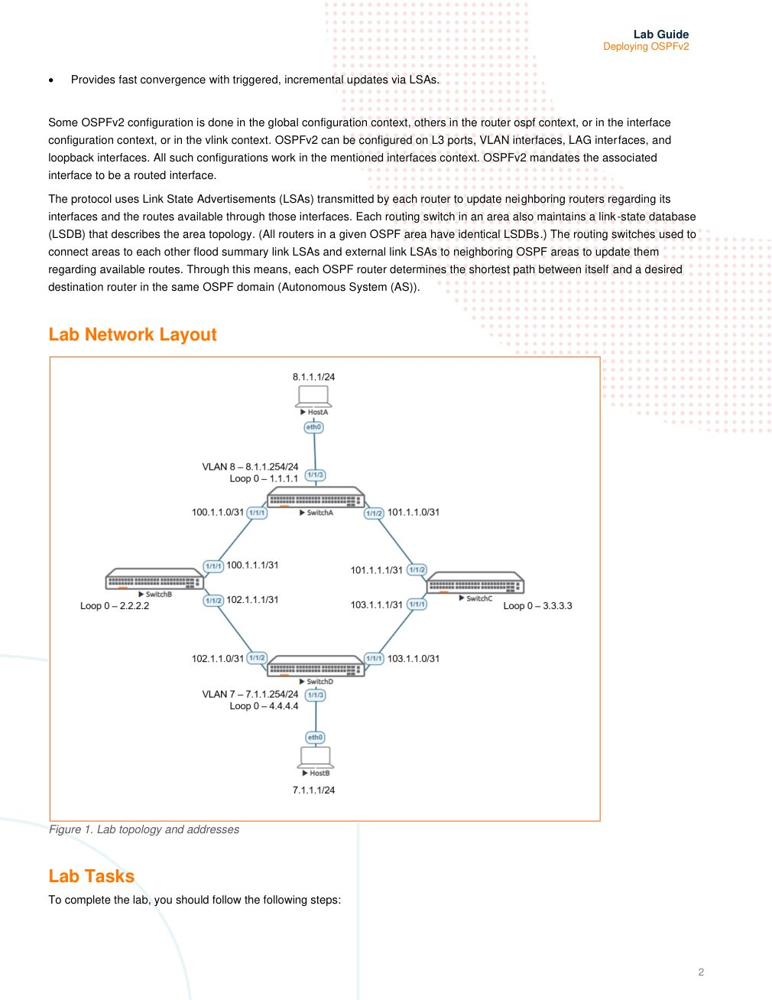

# Configuring OSPF on Aruba CX Switches

> **Versi Markdown untuk belajar**  
> Sumber: `AOS-CX Simulator - Deploying OSPF Lab Guide.pdf`  
> Tingkat: **Dasar - Routing OSPFv2**

## Cara menggunakan dokumen ini

1. Baca bagian **Ringkasan Belajar** dan **Konsep Inti** terlebih dahulu.
2. Buka gambar topologi dan tulis ulang alamat/interface pada catatan Anda.
3. Kerjakan lab mengikuti **Alur Praktik** tanpa langsung menyalin seluruh appendix.
4. Setelah setiap tahap, jalankan perintah pada **Validasi Keberhasilan**.
5. Gunakan bagian **Transkrip Lengkap PDF** ketika membutuhkan instruksi atau output asli.

## Ringkasan Belajar

Lab ini membangun fabric OSPF area 0 yang terdiri dari empat switch. Dua host pada subnet berbeda harus dapat saling berkomunikasi setelah adjacency dan routing OSPF terbentuk.

## Konsep Inti

| Konsep | Arti dalam lab |
|---|---|
| **OSPF process** | Instance OSPF lokal pada switch, misalnya process 1. |
| **Router ID** | Identitas unik OSPF; pada lab menggunakan alamat loopback. |
| **Area 0** | Backbone OSPF yang digunakan oleh seluruh link pada lab dasar. |
| **Point-to-point** | Network type yang sesuai untuk link langsung antar-switch. |
| **LSA/LSDB** | Informasi link-state dan basis data topologi yang dipakai menghitung shortest path. |
| **ECMP** | Beberapa jalur dengan biaya sama dapat digunakan untuk tujuan yang sama. |

## Topologi Lab



> Gambar di atas merupakan halaman 2 dari PDF asli. Perbesar gambar ketika mencatat nomor interface, alamat IP, VLAN, atau hubungan antarperangkat.

## Alur Praktik yang Disarankan

1. Konfigurasi HostA dan HostB beserta default gateway.
2. Konfigurasi routed link /31 antar-switch.
3. Buat loopback /32 sebagai router ID.
4. Buat VLAN dan SVI pada switch yang menghadap host.
5. Uji ping hanya ke perangkat directly connected.
6. Buat OSPF process 1 dan area 0 pada semua switch.
7. Aktifkan OSPF pada link, loopback, dan SVI host.
8. Pastikan adjacency FULL, route OSPF muncul, dan host dapat saling ping.

## Perintah Utama

```text
router ospf 1
 router-id 1.1.1.1
 area 0.0.0.0

interface 1/1/1
 ip ospf 1 area 0.0.0.0
 ip ospf network point-to-point

interface loopback 0
 ip ospf 1 area 0.0.0.0

show ip ospf neighbors
show ip ospf route
show ip route ospf
show ip ospf interface 1/1/1
ping <alamat-tujuan>
```

## Validasi Keberhasilan

- Seluruh link fisik dan protocol berstatus up.
- Setiap adjacency OSPF mencapai state `FULL`.
- Loopback dan subnet remote muncul sebagai route OSPF.
- HostA dapat ping HostB dan sebaliknya.
- Router ID pada setiap switch unik.

## Catatan Troubleshooting

- Jika perintah `hostname` atau `interface` ditolak, pastikan berada pada mode `configure terminal`.
- Lakukan troubleshooting berurutan: interface -> IP direct -> OSPF interface -> neighbor -> route -> end-to-end ping.
- Perintah konfigurasi harus dijalankan pada context yang benar; `show` dan `ping` dapat dijalankan dari beberapa context.

## Metode Belajar Aktif

Setelah konfigurasi berhasil, ulangi lab dengan sengaja membuat satu kesalahan, misalnya interface masih shutdown, alamat IP salah, VLAN/VNI tidak sesuai, area OSPF berbeda, atau neighbor belum diaktifkan. Temukan penyebabnya hanya dengan perintah `show`, kemudian catat:

- gejala yang terlihat;
- perintah pemeriksaan yang digunakan;
- akar masalah;
- konfigurasi perbaikan;
- hasil validasi setelah perbaikan.

---

# Transkrip Lengkap PDF

Bagian berikut mempertahankan isi PDF asli per halaman dalam blok teks. Tata letak tabel dan output CLI dipertahankan sebisa mungkin agar mudah dibandingkan dengan dokumen sumber.

<details>
<summary><strong>Halaman 1</strong></summary>

```text
Configuring OSPF on
Aruba CX Switches
IMPORTANT! THIS GUIDE ASSUMES THAT THE AOS-CX OVA HAS BEEN INSTALLED AND WORKS IN GNS3 OR EVE-NG. PLEASE
REFER TO GNS3/EVE-NG INITIAL SETUP LABS IF REQUIRED.
WRITE MEM SAVED CONFIGS DON’T IMPORT CORRECTLY, READER SHOULD COPY/PASTE LAB CONFIGS FROM APPENDIX
INTO LAB IF REQUIRED.
TABLE OF CONTENTS
Lab Objective.............................................................................................................................................. 1
Lab Overview.............................................................................................................................................. 1
Lab Network Layout.................................................................................................................................... 2
Lab Tasks................................................................................................................................................... 2
Task 1 – Lab Setup..................................................................................................................................... 3
Task 2 - Configure Host_A and Host_B ...................................................................................................... 3
Task 3 - Configure interfaces and verify direct connectivity......................................................................... 4
Task 4 - Configure OSPF............................................................................................................................ 5
Appendix – Complete Configurations.......................................................................................................... 8
Lab Objective
At the end of this workshop, you will be able to implement the fundamentals of deploying an OSPFv2 network based on Aruba
CX Switches. A successful deployment will show IPv4 HostA and IPv4 HostB have connectivity over the OSPF fabric.
Lab Overview
OSPFv2 is the IPv4 implementation of Open Shortest Path First protocol (OSPFv3 is the IPv6 implementation of this protocol). It
is a link-state based IGP (Interior Gateway Protocol) routing protocol. It is widely used with medium to large sized enterprise
networks.
The characteristics of OSPFv2 are:
• Provides a loop-free topology using SPF algorithm.
• Allows hierarchical routing using area 0 (backbone area) as the top of the hierarchy.
• Supports load balancing with equal cost routes for the same destination.
• OSPFv2 is a classless protocol and allows for a hierarchical design with VLSM (Variable Length Subnet
• Masking) and route summarization.
• Provides authentication of routing messages.
• Scales easily using the concept of OSPF areas.
```

</details>
<details>
<summary><strong>Halaman 2</strong></summary>

```text
• Provides fast convergence with triggered, incremental updates via LSAs.
Some OSPFv2 configuration is done in the global configuration context, others in the router ospf context, or in the interface
configuration context, or in the vlink context. OSPFv2 can be configured on L3 ports, VLAN interfaces, LAG interfaces, and
loopback interfaces. All such configurations work in the mentioned interfaces context. OSPFv2 mandates the associated
interface to be a routed interface.
The protocol uses Link State Advertisements (LSAs) transmitted by each router to update neighboring routers regarding its
interfaces and the routes available through those interfaces. Each routing switch in an area also maintains a link-state database
(LSDB) that describes the area topology. (All routers in a given OSPF area have identical LSDBs.) The routing switches used to
connect areas to each other flood summary link LSAs and external link LSAs to neighboring OSPF areas to update them
regarding available routes. Through this means, each OSPF router determines the shortest path between itself and a desired
destination router in the same OSPF domain (Autonomous System (AS)).
Lab Network Layout
Figure 1. Lab topology and addresses
Lab Tasks
To complete the lab, you should follow the following steps:
```

</details>
<details>
<summary><strong>Halaman 3</strong></summary>

```text
1. Lab set-up
2. Configure HostA and HostB
3. Configure switch to switch interfaces, loopbacks, and VLANs
4. Configure OSPFv2
5. Verify OSPF peering is up
6. Verify HostA to HostB connectivity
Notes:
• Accessing the lab tasks panel are not available when using the community edition. The Lab Guide is fully available use.
• Many commands, except ‘show’ & ‘ping’, are configuration commands and need to be entered in the proper switch
configuration mode. If a command does not work make sure you are in the right configuration context.
Task 1 – Lab Setup
• Start all the devices, including host and client
• Open each switch console and log in with user “admin” and no password
• Change all hostnames as shown in the topology:
hostname …
• On all devices, bring up required ports:
int 1/1/1-1/1/3
no shutdown
• Validate LLDP neighbors appear as expected
show lldp neighbor
SwitchB
SwitchB(config)# show lldp neighbor-info
LLDP Neighbor Information
=========================
Total Neighbor Entries : 2
Total Neighbor Entries Deleted : 0
Total Neighbor Entries Dropped : 0
Total Neighbor Entries Aged-Out : 0
LOCAL-PORT CHASSIS-ID PORT-ID PORT-DESC TTL SYS-NAME
------------------------------------------------------------------------------------------
1/1/1 08:00:09:1d:a2:66 1/1/1 1/1/1 120 SwitchA
1/1/2 08:00:09:23:64:e7 1/1/2 1/1/2 120 SwitchD
Task 2 - Configure Host_A and Host_B
• Apply the proper IP address and gateway to both Host_A and Host_B
HostA
ip 8.1.1.1/24 8.1.1.254
HostB
ip 7.1.1.1/24 7.1.1.254
• Verify with show ip
show ip
HostA
VPCS> sho ip
NAME : VPCS[1]
IP/MASK : 8.1.1.1/24
GATEWAY : 8.1.1.254
DNS :
```

</details>
<details>
<summary><strong>Halaman 4</strong></summary>

```text
MAC : 00:50:79:66:68:05
LPORT : 20000
RHOST:PORT : 127.0.0.1:30000
MTU : 1500
Task 3 - Configure interfaces and verify direct connectivity
• Configure switch interfaces and ensure direct connectivity works
• Apply proper IPv4 Addresses to all interfaces, including loopback
• On Switch A and C:
o Create Host facing VLAN/Interface
o Apply proper VLAN to host facing access interface
• Ensure direct connectivity works between each link
SwitchA
vlan 8
description HostA VLAN
interface 1/1/1
no shutdown
description To SwitchB
ip address 100.1.1.0/31
interface 1/1/2
no shutdown
description To SwitchC
ip address 101.1.1.0/31
interface 1/1/3
no shutdown
description Host Segment
no routing
vlan access 8
interface loopback 0
ip address 1.1.1.1/32
interface vlan 8
description To Host VLAN
ip address 8.1.1.254/24
SwitchB
interface 1/1/1
no shutdown
description To SwitchA
ip address 100.1.1.1/31
interface 1/1/2
no shutdown
description To SwitchD
ip address 102.1.1.1/31
interface loopback 0
ip address 2.2.2.2/32
SwitchC
interface 1/1/1
no shutdown
description To SwitchD
ip address 103.1.1.1/31
interface 1/1/2
no shutdown
description To SwitchA
ip address 101.1.1.1/31
interface loopback 0
ip address 3.3.3.3/32
SwitchD
vlan 7
```

</details>
<details>
<summary><strong>Halaman 5</strong></summary>

```text
description HostB VLAN
interface 1/1/1
no shutdown
description To SwitchC
ip address 103.1.1.0/31
interface 1/1/2
no shutdown
description To SwitchB
ip address 102.1.1.0/31
interface 1/1/3
no shutdown
description HostB Segment
no routing
vlan access 7
interface loopback 0
ip address 4.4.4.4/32
interface vlan 7
description To Host segment
ip address 7.1.1.254/24
SwitchA
SwitchA(config)# ping 2.2.2.2
connect: Network is unreachable
SwitchA(config)# ping 102.1.1.0
connect: Network is unreachable
SwitchA(config)# ping 100.1.1.1
PING 100.1.1.1 (100.1.1.1) 100(128) bytes of data.
108 bytes from 100.1.1.1: icmp_seq=1 ttl=64 time=5.80 ms
108 bytes from 100.1.1.1: icmp_seq=2 ttl=64 time=1.87 ms
108 bytes from 100.1.1.1: icmp_seq=3 ttl=64 time=1.90 ms
108 bytes from 100.1.1.1: icmp_seq=4 ttl=64 time=1.92 ms
108 bytes from 100.1.1.1: icmp_seq=5 ttl=64 time=1.78 ms
--- 100.1.1.1 ping statistics ---
5 packets transmitted, 5 received, 0% packet loss, time 4004ms
rtt min/avg/max/mdev = 1.781/2.658/5.809/1.577 ms
SwitchA(config)# ping 101.1.1.1
PING 101.1.1.1 (101.1.1.1) 100(128) bytes of data.
108 bytes from 101.1.1.1: icmp_seq=1 ttl=64 time=2.21 ms
108 bytes from 101.1.1.1: icmp_seq=2 ttl=64 time=2.24 ms
108 bytes from 101.1.1.1: icmp_seq=3 ttl=64 time=1.63 ms
108 bytes from 101.1.1.1: icmp_seq=4 ttl=64 time=1.87 ms
108 bytes from 101.1.1.1: icmp_seq=5 ttl=64 time=2.14 ms
--- 101.1.1.1 ping statistics ---
5 packets transmitted, 5 received, 0% packet loss, time 4004ms
rtt min/avg/max/mdev = 1.631/2.022/2.249/0.241 ms
Task 4 - Configure OSPF
• Create OSPF process 1 and area 0
• Create an OSPF IPv4 Router-ID (same as Loopback)
• Use OSPF point to point
• Ensure Loopback 0 and switch to switch interfaces are advertised into OSPF
• Ensure VLAN 7 interface on Switch D is advertised into OSPF
• Ensure VLAN 8 interface on Switch A is advertised into OSPF
```

</details>
<details>
<summary><strong>Halaman 6</strong></summary>

```text
• Verify OSPF peering is up
• Verify that HostA can reach HostB
SwitchA
router ospf 1
router-id 1.1.1.1
area 0.0.0.0
interface 1/1/1
ip ospf 1 area 0.0.0.0
ip ospf network point-to-point
interface 1/1/2
ip ospf 1 area 0.0.0.0
ip ospf network point-to-point
interface loopback 0
ip ospf 1 area 0.0.0.0
interface vlan 8
ip ospf 1 area 0.0.0.0
ip ospf network point-to-point
SwitchB
router ospf 1
router-id 2.2.2.2
area 0.0.0.0
interface 1/1/1
ip ospf 1 area 0.0.0.0
ip ospf network point-to-point
interface 1/1/2
ip ospf 1 area 0.0.0.0
ip ospf network point-to-point
interface loopback 0
ip ospf 1 area 0.0.0.0
SwitchC
router ospf 1
router-id 3.3.3.3
area 0.0.0.0
interface 1/1/1
ip ospf 1 area 0.0.0.0
ip ospf network point-to-point
interface 1/1/2
ip ospf 1 area 0.0.0.0
ip ospf network point-to-point
interface loopback 0
ip ospf 1 area 0.0.0.0
SwitchD
router ospf 1
router-id 4.4.4.4
area 0.0.0.0
interface 1/1/1
ip ospf 1 area 0.0.0.0
ip ospf network point-to-point
interface 1/1/2
ip ospf 1 area 0.0.0.0
ip ospf network point-to-point
interface loopback 0
ip ospf 1 area 0.0.0.0
interface vlan 7
ip ospf 1 area 0.0.0.0
```

</details>
<details>
<summary><strong>Halaman 7</strong></summary>

```text
ip ospf network point-to-point
SwitchA
SwitchA(config)# show ip ospf neighbors
OSPF Process ID 1 VRF default
==============================
Total Number of Neighbors: 2
Neighbor ID Priority State Nbr Address Interface
-------------------------------------------------------------------------
2.2.2.2 n/a FULL 100.1.1.1 1/1/1
3.3.3.3 n/a FULL 101.1.1.1 1/1/2
SwitchB
SwitchB(config)# show ip ospf neighbors
OSPF Process ID 1 VRF default
==============================
Total Number of Neighbors: 2
Neighbor ID Priority State Nbr Address Interface
-------------------------------------------------------------------------
1.1.1.1 n/a FULL 100.1.1.0 1/1/1
4.4.4.4 n/a FULL 102.1.1.0 1/1/2
SwitchC
SwitchC(config)# show ip ospf neighbors
OSPF Process ID 1 VRF default
==============================
Total Number of Neighbors: 2
Neighbor ID Priority State Nbr Address Interface
-------------------------------------------------------------------------
4.4.4.4 n/a FULL 103.1.1.0 1/1/1
1.1.1.1 n/a FULL 101.1.1.0 1/1/2
SwitchD
SwitchD(config)# show ip ospf neighbors
OSPF Process ID 1 VRF default
==============================
Total Number of Neighbors: 2
Neighbor ID Priority State Nbr Address Interface
-------------------------------------------------------------------------
3.3.3.3 n/a FULL 103.1.1.1 1/1/1
2.2.2.2 n/a FULL 102.1.1.1 1/1/2
HostA
VPCS> show ip
NAME : VPCS[1]
IP/MASK : 8.1.1.1/24
GATEWAY : 8.1.1.254
DNS :
MAC : 00:50:79:66:68:05
LPORT : 20000
```

</details>
<details>
<summary><strong>Halaman 8</strong></summary>

```text
RHOST:PORT : 127.0.0.1:30000
MTU : 1500
VPCS> ping 7.1.1.1
84 bytes from 7.1.1.1 icmp_seq=1 ttl=61 time=9.914 ms
84 bytes from 7.1.1.1 icmp_seq=2 ttl=61 time=4.092 ms
84 bytes from 7.1.1.1 icmp_seq=3 ttl=61 time=3.314 ms
84 bytes from 7.1.1.1 icmp_seq=4 ttl=61 time=3.207 ms
84 bytes from 7.1.1.1 icmp_seq=5 ttl=61 time=4.284 ms
HostB
VPCS> show ip
NAME : VPCS[1]
IP/MASK : 7.1.1.1/24
GATEWAY : 7.1.1.254
DNS :
MAC : 00:50:79:66:68:06
LPORT : 20000
RHOST:PORT : 127.0.0.1:30000
MTU : 1500
VPCS> ping 8.1.1.1
84 bytes from 8.1.1.1 icmp_seq=1 ttl=61 time=10.707 ms
84 bytes from 8.1.1.1 icmp_seq=2 ttl=61 time=3.234 ms
84 bytes from 8.1.1.1 icmp_seq=3 ttl=61 time=3.055 ms
84 bytes from 8.1.1.1 icmp_seq=4 ttl=61 time=2.905 ms
84 bytes from 8.1.1.1 icmp_seq=5 ttl=61 time=3.291 ms
Appendix – Complete Configurations
SwitchA
SwitchA(config)# sho run
Current configuration:
!
!Version ArubaOS-CX Virtual.10.06.0001
!export-password: default
hostname SwitchA
user admin group administrators password ciphertext AQBapfUWJWpGRc6KYv1XkGlb9qmtmxEBa
F2JxMyUdVHscVFqYgAAACmt+0Ucn4xg/guGozwoWf8fiCTF69PAnBI0/XEMm51mvbQeFI2XjhkU/bLnmW2r0/
0ZYx2yipA2xqS9OgTUzwhy0ARo2CEM5Zkmb44KFBDnYR+RLeOZ3mWabZ1xx16KtYlt
led locator on
ntp server pool.ntp.org minpoll 4 maxpoll 4 iburst
ntp enable
!
!
!
!
ssh server vrf mgmt
vlan 1
vlan 8
description HostA VLAN
interface mgmt
no shutdown
ip dhcp
interface 1/1/1
no shutdown
description To SwitchB
ip address 100.1.1.0/31
ip ospf 1 area 0.0.0.0
ip ospf network point-to-point
```

</details>
<details>
<summary><strong>Halaman 9</strong></summary>

```text
interface 1/1/2
no shutdown
description To SwitchC
ip address 101.1.1.0/31
ip ospf 1 area 0.0.0.0
ip ospf network point-to-point
interface 1/1/3
no shutdown
description Host Segment
no routing
vlan access 8
interface loopback 0
ip address 1.1.1.1/32
ip ospf 1 area 0.0.0.0
interface vlan 8
description Host VLAN
ip address 8.1.1.254/24
ip ospf 1 area 0.0.0.0
ip ospf network point-to-point
!
!
!
!
!
router ospf 1
router-id 1.1.1.1
area 0.0.0.0
https-server vrf mgmt
SwitchB
SwitchB(config)# sho run
Current configuration:
!
!Version ArubaOS-CX Virtual.10.06.0001
!export-password: default
hostname SwitchB
user admin group administrators password ciphertext AQBapR3yvjJYd/gE3fmoQ64ppIllk26co
oJCPeZoYpZHZdwfYgAAAFEYineyqPb/ZcZ82mdNpyj1rkxCb/Xz34/3/2mZ3r8j8NCKH85z1FzX2Wd9bpPWBO
afnRKq1pzWopGQbUtQteuY67+K4R/F4gCy4ZYO8bW8SJC79p1fKBvGLyVNZnhjSQJf
led locator on
ntp server pool.ntp.org minpoll 4 maxpoll 4 iburst
ntp enable
!
!
!
!
ssh server vrf mgmt
vlan 1
interface mgmt
no shutdown
ip dhcp
interface 1/1/1
no shutdown
description To SwitchA
ip address 100.1.1.1/31
ip ospf 1 area 0.0.0.0
ip ospf network point-to-point
interface 1/1/2
no shutdown
description To SwitchD
ip address 102.1.1.1/31
ip ospf 1 area 0.0.0.0
ip ospf network point-to-point
interface loopback 0
```

</details>
<details>
<summary><strong>Halaman 10</strong></summary>

```text
ip address 2.2.2.2/32
ip ospf 1 area 0.0.0.0
!
!
!
!
!
router ospf 1
router-id 2.2.2.2
area 0.0.0.0
https-server vrf mgmt
SwitchC
SwitchC(config)# show run
Current configuration:
!
!Version ArubaOS-CX Virtual.10.06.0001
!export-password: default
hostname SwitchC
user admin group administrators password ciphertext AQBape6pkO0nRbZ5UDg5A5s/bgrPHYZut
HbZns4wT4c00KY1YgAAAOvx74jAUbuCFtX/z2xt1zBhUDEJRNzucQPmxbbvDB2qLA5sA7FV0Vv2dAZS4mNtkZ
+LlYP6flAG2ejyHPRrcP6P+a/XkNMATU7LoG9rvPyq8dlXVLG/l4cuNq4Y4qvQ+2sE
led locator on
ntp server pool.ntp.org minpoll 4 maxpoll 4 iburst
ntp enable
!
!
!
!
ssh server vrf mgmt
vlan 1
interface mgmt
no shutdown
ip dhcp
interface 1/1/1
no shutdown
description To SwitchD
ip address 103.1.1.1/31
ip ospf 1 area 0.0.0.0
ip ospf network point-to-point
interface 1/1/2
no shutdown
description To SwitchA
ip address 101.1.1.1/31
ip ospf 1 area 0.0.0.0
ip ospf network point-to-point
interface loopback 0
ip address 3.3.3.3/32
ip ospf 1 area 0.0.0.0
!
!
!
!
!
router ospf 1
router-id 3.3.3.3
area 0.0.0.0
https-server vrf mgmt
SwitchD
SwitchD(config)# sho run
```

</details>
<details>
<summary><strong>Halaman 11</strong></summary>

```text
Current configuration:
!
!Version ArubaOS-CX Virtual.10.06.0001
!export-password: default
hostname SwitchD
user admin group administrators password ciphertext AQBapdBC+is0ah9uQyUARf8anyXBdKxIc
hK9i1wM+LjmwBDeYgAAAOs2w/nCnYS3rEiZlp8SM+aP0dcLSotqH4hcpNWclXDQnd+tmTJRnsWeOZTGJ2ukoi
w3YEOjkv/MprepWjcCBxTyLSoKxRib/Ya8L5kOsvIq6MoocLyBxz15yFZRG8du7PpY
led locator on
ntp server pool.ntp.org minpoll 4 maxpoll 4 iburst
ntp enable
!
!
!
!
ssh server vrf mgmt
vlan 1
vlan 7
description HostB VLAN
interface mgmt
no shutdown
ip dhcp
interface 1/1/1
no shutdown
description To SwitchC
ip address 103.1.1.0/31
ip ospf 1 area 0.0.0.0
ip ospf network point-to-point
interface 1/1/2
no shutdown
description To SwitchB
ip address 102.1.1.0/31
ip ospf 1 area 0.0.0.0
ip ospf network point-to-point
interface 1/1/3
no shutdown
description HostB Segment
no routing
vlan access 7
interface loopback 0
ip address 4.4.4.4/32
ip ospf 1 area 0.0.0.0
interface vlan 7
description To Host VLAN
ip address 7.1.1.254/24
ip ospf 1 area 0.0.0.0
ip ospf network point-to-point
!
!
!
!
!
router ospf 1
router-id 4.4.4.4
area 0.0.0.0
https-server vrf mgmt
HostA
VPCS> show ip
NAME : VPCS[1]
IP/MASK : 8.1.1.1/24
GATEWAY : 8.1.1.254
```

</details>
<details>
<summary><strong>Halaman 12</strong></summary>

```text
DNS :
MAC : 00:50:79:66:68:05
LPORT : 20000
RHOST:PORT : 127.0.0.1:30000
MTU : 1500
HostB
VPCS> show ip
NAME : VPCS[1]
IP/MASK : 7.1.1.1/24
GATEWAY : 7.1.1.254
DNS :
MAC : 00:50:79:66:68:06
LPORT : 20000
RHOST:PORT : 127.0.0.1:30000
MTU : 1500
```

</details>
<details>
<summary><strong>Halaman 13</strong></summary>

```text
www.arubanetworks.com
3333 Scott Blvd. Santa Clara, CA 95054
1.844.472.2782 | T: 1.408.227.4500 | FAX: 1.408.227.4550 | info@arubanetworks.com
```

</details>
