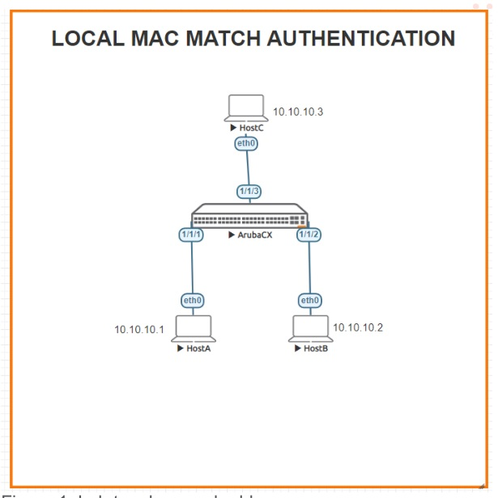

# Local MAC Match Authentication

> **Panduan praktik berbahasa Indonesia**  
> Sumber: `AOS-CX Simulator - Local Mac Authentication Lab Guide.pdf`  
> Tingkat: **Dasar–Menengah — Network Access Control**

## 1. Tujuan pembelajaran

Lab ini mengajarkan cara mengenali endpoint berdasarkan MAC address dan menerapkan atribut lokal tanpa menggunakan RADIUS.

Setelah selesai, Anda mampu:

- melihat MAC address client yang dipelajari switch;
- membuat `mac-group`;
- membuat local role;
- membuat device profile;
- menghubungkan MAC group dengan role;
- memvalidasi client yang memperoleh role.

> Fitur pada guide ditujukan untuk platform AOS-CX 6xxx. Dukungan pada image simulator atau versi lain dapat berbeda.

## 2. Gambaran besar



Tiga VPCS terhubung ke satu switch:

| Host | Port switch | IP contoh | MAC pada guide |
|---|---|---|---|
| HostA | `1/1/1` | `10.10.10.1/24` | `00:50:79:66:68:05` |
| HostB | `1/1/2` | `10.10.10.2/24` | `00:50:79:66:68:02` |
| HostC | `1/1/3` | `10.10.10.3/24` | `00:50:79:66:68:03` |

MAC pada VPCS Anda dapat berbeda. Gunakan hasil aktual dari `show mac-address-table detail` bila berbeda.

### Alur kerjanya

```text
Client mengirim frame
       ↓
Switch mempelajari MAC
       ↓
MAC dicocokkan dengan mac-group
       ↓
Device profile memilih local role
       ↓
Atribut role diterapkan ke client
```

## 3. Istilah penting

| Istilah | Arti sederhana |
|---|---|
| **MAC group** | Daftar pola MAC yang akan dicocokkan. |
| **Local role** | Kumpulan atribut untuk client, misalnya VLAN, MTU, dan waktu reautentikasi. |
| **Device profile** | Aturan yang menghubungkan MAC group dengan role. |
| **Port access client** | Endpoint yang terdeteksi pada port switch. |
| **Block until profile applied** | Trafik client ditahan sampai profile berhasil diterapkan. |
| **MAC OUI** | Tiga byte awal MAC yang biasanya menunjukkan vendor perangkat. |

## 4. Tahap 1 — Menyiapkan access port

Lakukan pada switch:

```text
configure terminal
hostname CX6000
interface 1/1/1-1/1/3
 no shutdown
 no routing
 vlan access 1
exit
```

Konfigurasi VPCS:

```text
# HostA
ip 10.10.10.1/24

# HostB
ip 10.10.10.2/24

# HostC
ip 10.10.10.3/24
```

Bangkitkan trafik agar MAC dipelajari, misalnya dengan ping antarklien:

```text
ping 10.10.10.2
```

### Validasi MAC

```text
show mac-address-table detail
```

Catat MAC aktual dan port tempat MAC tersebut terlihat.

## 5. Tahap 2 — Membuat MAC group

Gunakan MAC aktual. Contoh sesuai guide:

```text
mac-group localmacmatch
 seq 10 match mac 00:50:79:66:68:05
 seq 20 match mac 00:50:79:66:68:02
 seq 30 match mac 00:50:79:66:68:03
```

Nomor sequence menentukan urutan pemeriksaan dan memudahkan penambahan aturan di antara rule yang ada.

Selain exact MAC, AOS-CX dapat menggunakan pola seperti:

```text
match mac <mac-lengkap>
match mac-oui <tiga-byte-vendor>
match mac-mask <mac>/<panjang-mask>
```

## 6. Tahap 3 — Membuat local role

```text
port-access role localrole
 mtu 1600
 reauth-period 100
 vlan access 1
```

Arti atribut:

- `mtu 1600`: client menggunakan atribut MTU 1600 pada role;
- `reauth-period 100`: client dievaluasi ulang setiap 100 detik;
- `vlan access 1`: client ditempatkan pada VLAN 1.

## 7. Tahap 4 — Membuat device profile

```text
port-access device-profile localdp
 enable
 associate role localrole
 associate mac-group localmacmatch
```

Device profile `localdp` akan menerapkan `localrole` ketika MAC cocok dengan `localmacmatch`.

## 8. Tahap 5 — Menerapkan profile ke port

Lakukan pada setiap port client:

```text
interface 1/1/1
 no shutdown
 no routing
 vlan access 1
 port-access device-profile
 mode block-until-profile-applied

interface 1/1/2
 no shutdown
 no routing
 vlan access 1
 port-access device-profile
 mode block-until-profile-applied

interface 1/1/3
 no shutdown
 no routing
 vlan access 1
 port-access device-profile
 mode block-until-profile-applied
```

## 9. Validasi

### Ringkasan seluruh client

```text
show port-access clients
```

Hasil yang diharapkan memiliki pola:

```text
Port    MAC-Address         Onboarding Method  Status   Role
1/1/1   00:50:79:...        device-profile     Success  localrole
```

### Detail satu atau seluruh client

```text
show port-access clients detail
```

Bagian yang perlu dibaca:

| Bagian output | Yang harus diperiksa |
|---|---|
| `Status` | `Authenticated` |
| `Role` | `localrole` |
| `Status` pada Authorization | `Applied` |
| `Access VLAN` | `1` |
| `MTU` | `1600` |
| `Reauthentication Period` | `100 secs` |

Status `dot1x - Not attempted, mac-auth - Not attempted` tidak selalu berarti gagal. Pada lab ini onboarding dilakukan oleh **device profile/local MAC match**, bukan 802.1X atau RADIUS MAC authentication.

## 10. Checklist keberhasilan

- [ ] Ketiga client muncul pada MAC address table.
- [ ] MAC pada `mac-group` sama dengan MAC aktual.
- [ ] Device profile berstatus enabled.
- [ ] Port client memiliki `port-access device-profile`.
- [ ] Client menunjukkan `Success` dan role `localrole`.
- [ ] Detail role menunjukkan VLAN, MTU, dan reauth period yang benar.

## 11. Troubleshooting

| Gejala | Pemeriksaan | Solusi |
|---|---|---|
| Client tidak muncul | `show mac-address-table detail` | Bangkitkan trafik, periksa port dan IP host. |
| Profile tidak match | Bandingkan MAC aktual dengan `mac-group` | Ganti rule dengan MAC aktual. |
| Client tetap diblokir | `show port-access clients detail` | Pastikan device profile enabled dan role tersedia. |
| Perintah tidak dikenali | `show version` | Image/platform simulator mungkin tidak mendukung fitur. |
| Role tidak diterapkan | `show running-config` | Periksa `associate role` dan `associate mac-group`. |

## 12. Pertanyaan latihan

1. Apa perbedaan MAC table dengan MAC group?
2. Mengapa MAC aktual perlu diperiksa sebelum menyalin konfigurasi guide?
3. Apa yang terjadi bila MAC tidak cocok tetapi mode `block-until-profile-applied` aktif?
4. Kapan lebih tepat menggunakan OUI dibanding exact MAC?
5. Apa keuntungan local MAC match dan apa keterbatasannya dibanding RADIUS?

## 13. Ringkasan perintah

```text
show mac-address-table detail
mac-group localmacmatch
port-access role localrole
port-access device-profile localdp
interface 1/1/1
 port-access device-profile
 mode block-until-profile-applied
show port-access clients
show port-access clients detail
```
