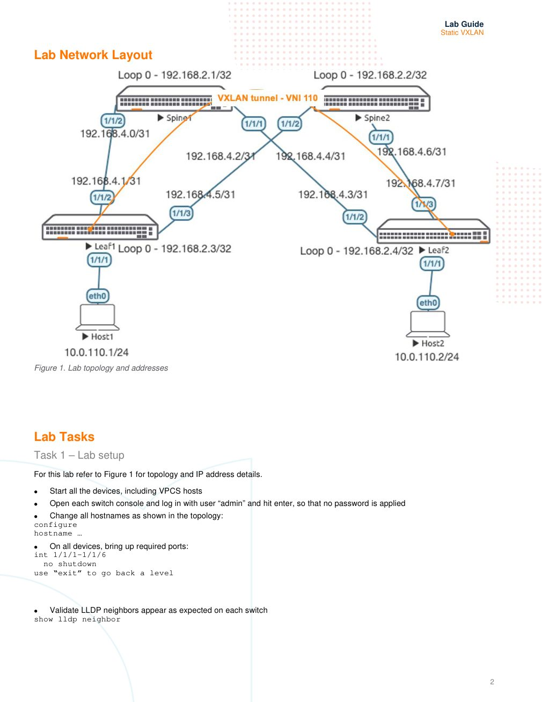

# Static VXLAN

> **Versi Markdown untuk belajar**  
> Sumber: `AOS-CX Simulator - Static VXLAN Lab Guide.pdf`  
> Tingkat: **Menengah - VXLAN Data Plane**

## Cara menggunakan dokumen ini

1. Baca bagian **Ringkasan Belajar** dan **Konsep Inti** terlebih dahulu.
2. Buka gambar topologi dan tulis ulang alamat/interface pada catatan Anda.
3. Kerjakan lab mengikuti **Alur Praktik** tanpa langsung menyalin seluruh appendix.
4. Setelah setiap tahap, jalankan perintah pada **Validasi Keberhasilan**.
5. Gunakan bagian **Transkrip Lengkap PDF** ketika membutuhkan instruksi atau output asli.

## Ringkasan Belajar

Lab ini memperpanjang VLAN 110 antara dua leaf melalui VXLAN. OSPF menyediakan underlay IP, sedangkan VTEP peer dikonfigurasi secara manual dan MAC remote dipelajari dengan mekanisme flood-and-learn.

## Konsep Inti

| Konsep | Arti dalam lab |
|---|---|
| **Underlay** | Jaringan IP yang menyediakan reachability antarlooback/VTEP. |
| **Overlay** | Jaringan logis Layer 2 yang dibawa di atas underlay. |
| **VTEP** | Endpoint tunnel VXLAN; pada lab menggunakan loopback leaf. |
| **VNI** | Identitas segment VXLAN; VLAN 110 dipetakan ke VNI 110. |
| **Static VTEP peer** | Alamat VTEP remote dikonfigurasi manual pada masing-masing leaf. |
| **Flood-and-learn** | Broadcast/unknown traffic digunakan untuk membantu pembelajaran MAC remote. |

## Topologi Lab



> Gambar di atas merupakan halaman 2 dari PDF asli. Perbesar gambar ketika mencatat nomor interface, alamat IP, VLAN, atau hubungan antarperangkat.

## Alur Praktik yang Disarankan

1. Bangun topologi spine-leaf dan validasi LLDP.
2. Konfigurasi link /31 dan loopback /32.
3. Aktifkan OSPF area 0 sebagai underlay.
4. Pastikan loopback Leaf1 dan Leaf2 saling reachable.
5. Buat VLAN 110 dan access port menuju host.
6. Buat interface VXLAN, source VTEP, VNI 110, dan static peer.
7. Konfigurasi Host1 dan Host2 pada subnet 10.0.110.0/24.
8. Uji ping, MAC table, interface VXLAN, dan packet capture.

## Perintah Utama

```text
# Underlay
interface loopback 0
 ip address 192.168.2.3/32
 ip ospf 1 area 0
router ospf 1
 router-id 192.168.2.3

# Access VLAN
vlan 110
interface 1/1/1
 no routing
 vlan access 110

# VXLAN Leaf1
interface vxlan 1
 source ip 192.168.2.3
 no shutdown
 vni 110
  vlan 110
  vtep-peer 192.168.2.4

show ip ospf neighbors
show ip route ospf
show interface vxlan
show mac-address-table
```

## Validasi Keberhasilan

- OSPF neighbor FULL dan remote loopback dapat diping.
- Interface VXLAN berstatus up dengan source VTEP yang benar.
- VNI 110 dipetakan ke VLAN 110 dan static peer terlihat.
- Host1 dan Host2 dapat saling ping pada subnet yang sama.
- MAC lokal muncul pada access port dan MAC remote melalui `vxlan1`.

## Catatan Troubleshooting

- Troubleshoot underlay dahulu. VXLAN tidak akan bekerja jika VTEP remote tidak reachable.
- VLAN dan VNI adalah dua identifier berbeda meski pada lab sama-sama memakai angka 110.
- Gateway `.254` pada VPCS hanya placeholder; lab ini menggunakan L2 VXLAN dan tidak membangun gateway tersebut.

## Metode Belajar Aktif

Setelah konfigurasi berhasil, ulangi lab dengan sengaja membuat satu kesalahan, misalnya interface masih shutdown, alamat IP salah, VLAN/VNI tidak sesuai, area OSPF berbeda, atau neighbor belum diaktifkan. Temukan penyebabnya hanya dengan perintah `show`, kemudian catat:

- gejala yang terlihat;
- perintah pemeriksaan yang digunakan;
- akar masalah;
- konfigurasi perbaikan;
- hasil validasi setelah perbaikan.

---

# Transkrip Lengkap PDF

Bagian berikut mempertahankan isi PDF asli per halaman dalam blok teks. Tata letak tabel dan output CLI dipertahankan sebisa mungkin agar mudah dibandingkan dengan dokumen sumber.

<details>
<summary><strong>Halaman 1</strong></summary>

```text
IMPORTANT! THIS GUIDE ASSUMES THAT THE AOS-CX OVA HAS BEEN INSTALLED AND WORKS IN GNS3 OR EVE-NG. PLEASE
REFER TO GNS3/EVE-NG INITIAL SETUP LABS IF REQUIRED.
https://www.eve-ng.net/index.php/documentation/howtos/howto-add-aruba-cx-switch/
TABLE OF CONTENTS
Lab Objective.............................................................................................................................................. 1
Lab Overview.............................................................................................................................................. 1
Lab Network Layout.................................................................................................................................... 2
Lab Tasks................................................................................................................................................... 2
Task 1 – Lab setup ..................................................................................................................................... 2
Task 2 – Configure IP Underlay Interfaces.................................................................................................. 3
Task 3 – Configure Leaf Switches with VXLAN........................................................................................... 5
Task 4 – Configure Hosts (VPCS)............................................................................................................... 6
Task 5 – Final Validation............................................................................................................................. 6
Appendix – Complete Configurations.......................................................................................................... 8
Lab Objective
This lab will enable the reader to gain hands on experience with L2 static Virtual Extensible LAN (VXLAN).
Lab Overview
This lab as shown in Figure 1 will allow you to provide end hosts (Virtual PC Simulator - VPCS) on the same subnet with L2
overlay network connectivity across the VXLAN data plane tunnel created manually.
OSPF is used as the IP underlay Interior Gateway Protocol (IGP) to provide loopback connectivity for VXLAN tunnel
establishment.
Static VXLAN uses flood and learn to advertise MAC addresses.
Take note that L3 VXLAN does not currently work with AOS-CX VMs.
VLAN 110 will be mapped to VXLAN Network Identifier (VNI) 110 to provide L2 overlay connectivity across the leaf switches.
```

</details>
<details>
<summary><strong>Halaman 2</strong></summary>

```text
Lab Network Layout
Figure 1. Lab topology and addresses
Lab Tasks
Task 1 – Lab setup
For this lab refer to Figure 1 for topology and IP address details.
• Start all the devices, including VPCS hosts
• Open each switch console and log in with user “admin” and hit enter, so that no password is applied
• Change all hostnames as shown in the topology:
configure
hostname …
• On all devices, bring up required ports:
int 1/1/1-1/1/6
no shutdown
use “exit” to go back a level
• Validate LLDP neighbors appear as expected on each switch
show lldp neighbor
```

</details>
<details>
<summary><strong>Halaman 3</strong></summary>

```text
Leaf1
Leaf1(config)# sh lld neighbor-info
LLDP Neighbor Information
=========================
Total Neighbor Entries : 2
Total Neighbor Entries Deleted : 0
Total Neighbor Entries Dropped : 0
Total Neighbor Entries Aged-Out : 0
LOCAL-PORT CHASSIS-ID PORT-ID PORT-DESC TTL SYS-NAME
------------------------------------------------------------------------------------------
1/1/2 08:00:09:8a:14:fa 1/1/2 1/1/2 120 Spine1
1/1/3 08:00:09:12:8e:9e 1/1/2 1/1/2 120 Spine2
Task 2 – Configure IP Underlay Interfaces
• Configure interfaces, IPs and required VLANs on the 4 switches
Leaf1
Leaf1(config)# int lo 0
Leaf1(config-loopback-if)# ip add 192.168.2.3/32
Leaf1(config-loopback-if)# ip ospf 1 area 0
OSPF process does not exist.
Do you want to create (y/n)? y
OSPF Area is not configured.
Do you want to create (y/n)? y
Leaf1(config-loopback-if)# router ospf 1
Leaf1(config-ospf-1)# router-id 192.168.2.3
Leaf1(config-ospf-1)# int 1/1/2
Leaf1(config-if)# ip add 192.168.4.1/31
Leaf1(config-if)# ip ospf 1 area 0
Leaf1(config-if)# ip ospf network point-to-point
Leaf1(config-if)# int 1/1/3
Leaf1(config-if)# ip add 192.168.4.5/31
Leaf1(config-if)# ip ospf 1 area 0
Leaf1(config-if)# ip ospf network point-to-point
Leaf2
Leaf2(config)# int lo 0
Leaf2(config-loopback-if)# ip add 192.168.2.4/32
Leaf2(config-loopback-if)# ip ospf 1 area 0
OSPF process does not exist.
Do you want to create (y/n)? y
OSPF Area is not configured.
Do you want to create (y/n)? y
Leaf2(config-loopback-if)# router ospf 1
Leaf2(config-ospf-1)# router-id 192.168.2.4
Leaf2(config-ospf-1)# int 1/1/2
Leaf2(config-if)# ip add 192.168.4.3/31
Leaf2(config-if)# ip ospf 1 area 0
Leaf2(config-if)# ip ospf network point-to-point
Leaf2(config-if)# int 1/1/3
Leaf2(config-if)# ip add 192.168.4.7/31
```

</details>
<details>
<summary><strong>Halaman 4</strong></summary>

```text
Leaf2(config-if)# ip ospf 1 area 0
Leaf2(config-if)# ip ospf network point-to-point
Spine1
Spine1(config)# int lo 0
Spine1(config-loopback-if)# ip add 192.168.2.1/32
Spine1(config-loopback-if)# ip ospf 1 area 0
OSPF process does not exist.
Do you want to create (y/n)? y
OSPF Area is not configured.
Do you want to create (y/n)? y
Spine1(config-loopback-if)# router ospf 1
Spine1(config-ospf-1)# router-id 192.168.2.1
Spine1(config-ospf-1)# int 1/1/2
Spine1(config-if)# ip add 192.168.4.0/31
Spine1(config-if)# ip ospf 1 area 0
Spine1(config-if)# ip ospf network point-to-point
Spine1(config-if)# int 1/1/1
Spine1(config-if)# ip add 192.168.4.2/31
Spine1(config-if)# ip ospf 1 area 0
Spine1(config-if)# ip ospf network point-to-point
Spine2
Spine2(config)# int lo 0
Spine2(config-loopback-if)# ip add 192.168.2.2/32
Spine2(config-loopback-if)# ip ospf 1 area 0
OSPF process does not exist.
Do you want to create (y/n)? y
OSPF Area is not configured.
Do you want to create (y/n)? y
Spine2(config-loopback-if)# router ospf 1
Spine2(config-ospf-1)# router-id 192.168.2.2
Spine2(config-ospf-1)# int 1/1/2
Spine2(config-if)# ip add 192.168.4.4/31
Spine2(config-if)# ip ospf 1 area 0
Spine2(config-if)# ip ospf network point-to-point
Spine2(config-if)# int 1/1/1
Spine2(config-if)# ip add 192.168.4.6/31
Spine2(config-if)# ip ospf 1 area 0
Spine2(config-if)# ip ospf network point-to-point
• Verify OSPF neighbors appear as expected between the switches
Leaf1(config)# sh ip os neighbors
OSPF Process ID 1 VRF default
==============================
Total Number of Neighbors: 2
Neighbor ID Priority State Nbr Address Interface
-------------------------------------------------------------------------
192.168.2.1 n/a FULL 192.168.4.0 1/1/2
192.168.2.2 n/a FULL 192.168.4.4 1/1/3
```

</details>
<details>
<summary><strong>Halaman 5</strong></summary>

```text
• Verify OSPF routes are learnt as expected, you should see ECMP routes towards Lo0 of the other leaf, this is supposed to
allow VXLAN traffic to be load shared across the ECMP routes (this works with real hardware, however AOS-CX VMs do not
currently support ECMP)
Leaf1(config)# sh ip ro ospf
Displaying ipv4 routes selected for forwarding
'[x/y]' denotes [distance/metric]
192.168.2.1/32, vrf default
via 192.168.4.0, [110/100], ospf
192.168.2.2/32, vrf default
via 192.168.4.4, [110/100], ospf
192.168.2.4/32, vrf default ECMP to Leaf2 Lo0
via 192.168.4.4, [110/200], ospf
via 192.168.4.0, [110/200], ospf
192.168.4.2/31, vrf default
via 192.168.4.0, [110/200], ospf
192.168.4.6/31, vrf default
via 192.168.4.4, [110/200], ospf
Task 3 – Configure Leaf Switches with VXLAN
• On both leaf switches, configure the desired VLAN to be VXLAN encapsulated on the ports towards Host1, Host2
Leaf1
Leaf1(config)# vlan 110
Leaf1(config-vlan-110)# int 1/1/1
Leaf1(config-if)# no routing
Leaf1(config-if)# vlan access 110
Leaf2
Leaf2(config)# vlan 110
Leaf2(config-vlan-110)# int 1/1/1
Leaf2(config-if)# no routing
Leaf2(config-if)# vlan access 110
• Configure the VXLAN interface, the source IP based on Lo0 and the desired VLAN to VXLAN Network Identifier (VNI)
mapping
Leaf1
Leaf1(config)# interface vxlan 1
Leaf1(config-vxlan-if)# source ip 192.168.2.3
Leaf1(config-vxlan-if)# no shutdown
Leaf1(config-vxlan-if)# vni 110
Leaf1(config-vni-110)# vlan 110
Leaf1(config-vni-110)# vtep-peer 192.168.2.4
Leaf2
Leaf2(config)# interface vxlan 1
Leaf2(config-vxlan-if)# source ip 192.168.2.4
Leaf2(config-vxlan-if)# no shutdown
Leaf2(config-vxlan-if)# vni 110
```

</details>
<details>
<summary><strong>Halaman 6</strong></summary>

```text
Leaf2(config-vni-110)# vlan 110
Leaf1(config-vni-110)# vtep-peer 192.168.2.3
• Validate the VXLAN interface is up with correct source, destination VTEP peer IPs and VNI/VLAN mapping.
Leaf1(config)# sh int vxlan
Interface vxlan1 is up
Admin state is up
Description:
Underlay VRF: default
Destination UDP port: 4789
VTEP source IPv4 address: 192.168.2.3
VNI VLAN VTEP Peers Origin
---------- ------ ----------------- --------
110 110 192.168.2.4 static
• If wireshark is available https://www.eve-ng.net/index.php/features-compare/
• Setup and start wireshark packet captures
o right click on a leaf switch -> Capture -> 1/1/2 -> Ethernet
o also right click on the same switch, other uplink -> Capture -> 1/1/3 -> Ethernet
• Only 1 link might show the desired packet captures as ECMP is not supported on the AOS-CX VMs
Task 4 – Configure Hosts (VPCS)
• Configure Host1, Host2 with the desired IP and default gateway (the default gateway doesn’t exist on the network as L2
VXLAN is used but is a required config in VPCS, so we assume a .254 as the default gateway)
Host1
ip 10.0.110.1/24 10.0.110.254
Host2
ip 10.0.110.2/24 10.0.110.254
Task 5 – Final Validation
• Ensure L2 connectivity works between hosts
VPCS> ping 10.0.110.2
84 bytes from 10.0.110.2 icmp_seq=1 ttl=64 time=1.787 ms
84 bytes from 10.0.110.2 icmp_seq=2 ttl=64 time=3.202 ms
84 bytes from 10.0.110.2 icmp_seq=3 ttl=64 time=3.999 ms
84 bytes from 10.0.110.2 icmp_seq=4 ttl=64 time=3.055 ms
84 bytes from 10.0.110.2 icmp_seq=5 ttl=64 time=3.375 ms
```

</details>
<details>
<summary><strong>Halaman 7</strong></summary>

```text
• Validate local and remote MACs are seen on the leaf switches as expected
Leaf1# sh mac-address-table
MAC age-time : 300 seconds
Number of MAC addresses : 2
MAC Address VLAN Type Port
--------------------------------------------------------------
00:50:79:66:68:05 110 dynamic 1/1/1
00:50:79:66:68:07 110 dynamic vxlan1(192.168.2.4)
• Validate VXLAN traffic is seen in the wireshark capture
```

</details>
<details>
<summary><strong>Halaman 8</strong></summary>

```text
Appendix – Complete Configurations
• If you face issues during your lab, you can verify your configs with the configs listed in this section
• If configs are the same, try powering off/powering on the switches to reboot them
Host1
VPCS> show ip
NAME : VPCS[1]
IP/MASK : 10.0.110.1/24
GATEWAY : 10.0.110.254
DNS :
MAC : 00:50:79:66:68:05
LPORT : 20000
RHOST:PORT : 127.0.0.1:30000
MTU : 1500
Host2
VPCS> show ip
NAME : VPCS[1]
IP/MASK : 10.0.110.2/24
GATEWAY : 10.0.110.254
DNS :
MAC : 00:50:79:66:68:07
LPORT : 20000
RHOST:PORT : 127.0.0.1:30000
MTU : 1500
Leaf1
Leaf1# sh run
Current configuration:
!
!Version ArubaOS-CX Virtual.10.05.0001
!export-password: default
hostname Leaf1
led locator on
!
!
!
!
ssh server vrf mgmt
vlan 1,110
interface mgmt
no shutdown
ip dhcp
interface 1/1/1
no shutdown
no routing
vlan access 110
interface 1/1/2
no shutdown
ip address 192.168.4.1/31
ip ospf 1 area 0.0.0.0
ip ospf network point-to-point
```

</details>
<details>
<summary><strong>Halaman 9</strong></summary>

```text
interface 1/1/3
no shutdown
ip address 192.168.4.5/31
ip ospf 1 area 0.0.0.0
ip ospf network point-to-point
interface 1/1/4
no shutdown
interface 1/1/5
no shutdown
interface 1/1/6
no shutdown
interface loopback 0
ip address 192.168.2.3/32
ip ospf 1 area 0.0.0.0
interface vxlan 1
source ip 192.168.2.3
no shutdown
vni 110
vlan 110
vtep-peer 192.168.2.4
!
!
!
!
!
router ospf 1
router-id 192.168.2.3
area 0.0.0.0
https-server vrf mgmt
Leaf2
Leaf2# sh run
Current configuration:
!
!Version ArubaOS-CX Virtual.10.05.0001
!export-password: default
hostname Leaf2
led locator on
!
!
!
!
ssh server vrf mgmt
vlan 1,110
interface mgmt
no shutdown
ip dhcp
interface 1/1/1
no shutdown
no routing
vlan access 110
interface 1/1/2
no shutdown
ip address 192.168.4.3/31
ip ospf 1 area 0.0.0.0
ip ospf network point-to-point
interface 1/1/3
no shutdown
ip address 192.168.4.7/31
ip ospf 1 area 0.0.0.0
ip ospf network point-to-point
interface 1/1/4
```

</details>
<details>
<summary><strong>Halaman 10</strong></summary>

```text
no shutdown
interface 1/1/5
no shutdown
interface 1/1/6
no shutdown
interface loopback 0
ip address 192.168.2.4/32
ip ospf 1 area 0.0.0.0
interface vxlan 1
source ip 192.168.2.4
no shutdown
vni 110
vlan 110
vtep-peer 192.168.2.3
!
!
!
!
router ospf 1
router-id 192.168.2.4
area 0.0.0.0
https-server vrf mgmt
Spine1
Spine1# sh run
Current configuration:
!
!Version ArubaOS-CX Virtual.10.05.0001
!export-password: default
hostname Spine1
led locator on
!
!
!
!
ssh server vrf mgmt
vlan 1
interface mgmt
no shutdown
ip dhcp
interface 1/1/1
no shutdown
ip address 192.168.4.2/31
ip ospf 1 area 0.0.0.0
ip ospf network point-to-point
interface 1/1/2
no shutdown
ip address 192.168.4.0/31
ip ospf 1 area 0.0.0.0
ip ospf network point-to-point
interface 1/1/3
no shutdown
interface 1/1/4
no shutdown
interface 1/1/5
no shutdown
interface 1/1/6
no shutdown
interface loopback 0
ip address 192.168.2.1/32
ip ospf 1 area 0.0.0.0
!
!
```

</details>
<details>
<summary><strong>Halaman 11</strong></summary>

```text
!
!
!
router ospf 1
router-id 192.168.2.1
area 0.0.0.0
https-server vrf mgmt
Spine2
Spine2# sh run
Current configuration:
!
!Version ArubaOS-CX Virtual.10.05.0001
!export-password: default
hostname Spine2
led locator on
!
!
!
!
ssh server vrf mgmt
vlan 1
interface mgmt
no shutdown
ip dhcp
interface 1/1/1
no shutdown
ip address 192.168.4.6/31
ip ospf 1 area 0.0.0.0
ip ospf network point-to-point
interface 1/1/2
no shutdown
ip address 192.168.4.4/31
ip ospf 1 area 0.0.0.0
ip ospf network point-to-point
interface 1/1/3
no shutdown
interface 1/1/4
no shutdown
interface 1/1/5
no shutdown
interface 1/1/6
no shutdown
interface loopback 0
ip address 192.168.2.2/32
ip ospf 1 area 0.0.0.0
!
!
!
!
!
router ospf 1
router-id 192.168.2.2
area 0.0.0.0
https-server vrf mgmt
```

</details>
<details>
<summary><strong>Halaman 12</strong></summary>

```text
www.arubanetworks.com
3333 Scott Blvd. Santa Clara, CA 95054
1.844.472.2782 | T: 1.408.227.4500 | FAX: 1.408.227.4550 | info@arubanetworks.com
```

</details>
