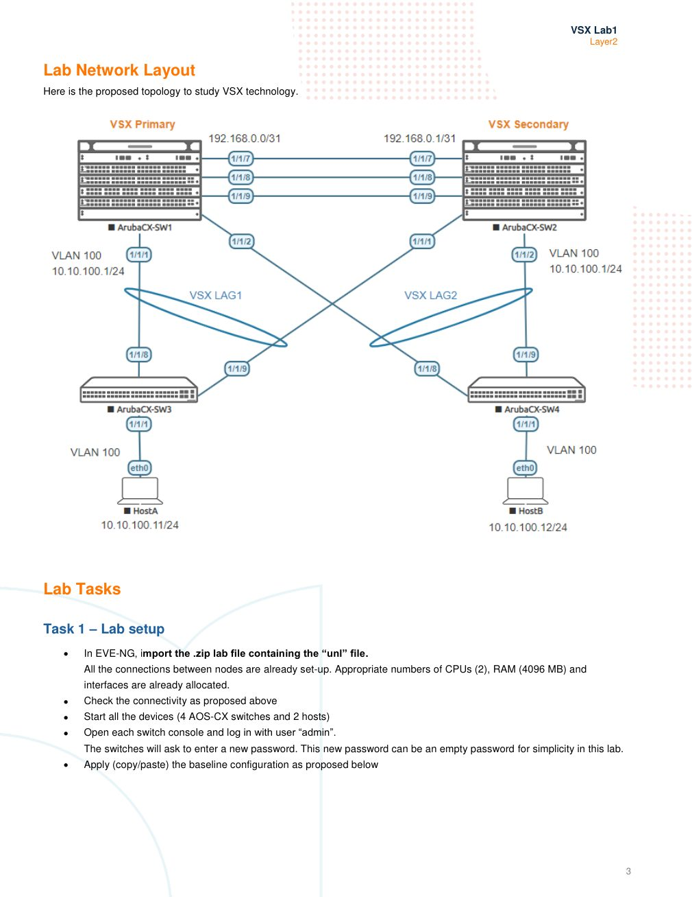

# VSX Lab1 - Layer2

> **Versi Markdown untuk belajar**  
> Sumber: `AOS-CX Simulator - VSX Part 1 Lab Guide.pdf`  
> Tingkat: **Menengah - High Availability Layer 2**

## Cara menggunakan dokumen ini

1. Baca bagian **Ringkasan Belajar** dan **Konsep Inti** terlebih dahulu.
2. Buka gambar topologi dan tulis ulang alamat/interface pada catatan Anda.
3. Kerjakan lab mengikuti **Alur Praktik** tanpa langsung menyalin seluruh appendix.
4. Setelah setiap tahap, jalankan perintah pada **Validasi Keberhasilan**.
5. Gunakan bagian **Transkrip Lengkap PDF** ketika membutuhkan instruksi atau output asli.

## Ringkasan Belajar

Lab ini membangun pasangan VSX primary-secondary, ISL, keepalive, sinkronisasi konfigurasi, dan multi-chassis LAG. Bagian akhir menguji apakah trafik tetap berjalan ketika link tertentu atau ISL terputus.

## Konsep Inti

| Konsep | Arti dalam lab |
|---|---|
| **ISL** | Inter-Switch Link yang membawa sinkronisasi dan trafik antaranggota VSX. |
| **Keepalive** | Jalur terpisah untuk mendeteksi kondisi peer dan mencegah split-brain. |
| **Primary/secondary** | Peran administratif pasangan VSX; keduanya tetap dapat meneruskan trafik. |
| **Config sync / vsx-sync** | Menyelaraskan elemen konfigurasi tertentu dari primary ke secondary. |
| **MCLAG** | Satu LAG logis dari perangkat downstream menuju dua switch VSX. |
| **Split recovery** | Mekanisme perlindungan saat ISL gagal tetapi kedua switch masih hidup. |

## Topologi Lab



> Gambar di atas merupakan halaman 3 dari PDF asli. Perbesar gambar ketika mencatat nomor interface, alamat IP, VLAN, atau hubungan antarperangkat.

## Alur Praktik yang Disarankan

1. Pastikan kedua node VSX menggunakan versi firmware yang sama.
2. Buat LAG 256 dari dua link dan gunakan sebagai ISL.
3. Buat VRF `KA` dan alamat /31 untuk link keepalive.
4. Bentuk cluster VSX, tetapkan system MAC dan peran primary/secondary.
5. Aktifkan keepalive dan pastikan status established.
6. Atur `vsx-sync`, split recovery, dan linkup delay.
7. Buat VLAN 100 dan sinkronkan ke secondary.
8. Buat VSX LAG ke SW3 dan SW4, lalu konfigurasi LACP pada access switch.
9. Uji ping HostA-HostB dan lakukan failure test pada link/ISL.

## Perintah Utama

```text
# ISL
interface lag 256
 no shutdown
 no routing
 vlan trunk allowed all
 lacp mode active

interface 1/1/8
 mtu 9198
 lag 256
interface 1/1/9
 mtu 9198
 lag 256

# Keepalive
vrf KA
interface 1/1/7
 vrf attach KA
 ip address 192.168.0.0/31   # primary

# Cluster pada primary
vsx
 system-mac 02:01:00:00:01:00
 inter-switch-link lag 256
 role primary
 vsx-sync vsx-global
 keepalive peer 192.168.0.1 source 192.168.0.0 vrf KA

# Validasi
show interface lag 256
show lacp interfaces
show vsx brief
show vsx status
show vsx status keepalive
show lacp interfaces multi-chassis
```

## Validasi Keberhasilan

- LAG 256 berstatus up dan anggota LACP collecting/distributing.
- ISL channel dan configuration sync berstatus `In-Sync`.
- Device state `Peer-Established`.
- Keepalive state `Keepalive-Established`.
- MCLAG downstream aktif pada kedua sisi.
- Ping HostA-HostB tetap berjalan ketika satu link downstream dimatikan.

## Catatan Troubleshooting

- Simulator memiliki caveat VSX LAG setelah reboot; ikuti prosedur pelepasan dan pemasangan ulang port LAG dari PDF bila forwarding gagal.
- ISL dan keepalive mempunyai fungsi berbeda. Jangan menempatkan keduanya dalam satu konsep atau satu jalur kegagalan.
- Gunakan MTU yang konsisten pada seluruh anggota LAG.

## Metode Belajar Aktif

Setelah konfigurasi berhasil, ulangi lab dengan sengaja membuat satu kesalahan, misalnya interface masih shutdown, alamat IP salah, VLAN/VNI tidak sesuai, area OSPF berbeda, atau neighbor belum diaktifkan. Temukan penyebabnya hanya dengan perintah `show`, kemudian catat:

- gejala yang terlihat;
- perintah pemeriksaan yang digunakan;
- akar masalah;
- konfigurasi perbaikan;
- hasil validasi setelah perbaikan.

---

# Transkrip Lengkap PDF

Bagian berikut mempertahankan isi PDF asli per halaman dalam blok teks. Tata letak tabel dan output CLI dipertahankan sebisa mungkin agar mudah dibandingkan dengan dokumen sumber.

<details>
<summary><strong>Halaman 1</strong></summary>

```text
Important! This guide assumes that the AOS-CX ova has been installed and works in GNS3 or EVE-NG.
Please refer to GNS3/EVE-NG initial setup labs if required.
https://www.eve-ng.net/index.php/documentation/howtos/howto-add-aruba-cx-switch/
At this time, EVE-NG does not support exporting/importing AOS-CX startup-config. The lab
user should copy/paste the AOS-CX node configuration from the lab guide as described in
the lab guide if required.
TABLE OF CONTENTS
Lab Objective.............................................................................................................................................. 2
Lab Overview.............................................................................................................................................. 2
Lab Network Layout.................................................................................................................................... 3
Lab Tasks................................................................................................................................................... 3
Task 1 – Lab setup................................................................................................................................... 3
Task 2 – Configure VSX ........................................................................................................................... 5
Prerequisite: same firmware release ...................................................................................................... 5
Step #1: create LAG for ISL ................................................................................................................... 5
Step #2: VSX keepalive preparation....................................................................................................... 6
Step #3: VSX Cluster creation................................................................................................................ 7
Step #4: VSX keepalive.......................................................................................................................... 8
Step #5: Configuration-sync and vsx-sync FeatureGroup settings ......................................................... 9
Step #6: VSX split-recovery.................................................................................................................. 10
Step #7: VSX linkup-delay-timer........................................................................................................... 10
Step #8: VLANs configuration .............................................................................................................. 11
Step #9: Downstream VSX LAG (MCLAG) configuration...................................................................... 11
Step #10: Access Switches configuration............................................................................................. 12
Task 3 - Resiliency tests......................................................................................................................... 15
Test #1: Layer2 connectivity between HostA and HostB ...................................................................... 16
Test #2: resiliency on shutting down interfaces .................................................................................... 17
Test #3: VSX split resiliency on ISL cut ................................................................................................ 18
Appendix –Reference Configurations........................................................................................................ 24
```

</details>
<details>
<summary><strong>Halaman 2</strong></summary>

```text
Lab Objective
This lab will enable the reader to gain hands-on experience with VSX basic Layer2 configuration.
Lab Overview
This lab guide explains how to configure a VSX cluster of a pair of AOS-CX switches following the VSX Configuration Best
Practices (https://support.hpe.com/hpesc/public/docDisplay?docId=a00094242en_us), for the Layer2 aspects.
Please read also the AOS-CX 10.6 Virtual Switching Extension (VSX) Guide (https://www.arubanetworks.com/techdocs/AOS-
CX/10.06/HTML/5200-7727/index.html#book.html).
In this lab, you’ll be able to:
- Configure VSX and VSX LAG (MCLAG) for Layer2 traffic
- Test L2 connectivity between clients: HostA and HostB that are part of the same subnet
- Test resiliency by shutting down interfaces
- Test a VSX split
The minimum recommended AOS-CX Switch Simulator version for this lab is 10.06.0110.
This lab uses EVE-NG Pro for Graph of links utilization. This is optional and EVE-NG Community or GNS3 can be used as well
without graphs by using show interface command instead.
VSX LAG CAVEAT:
If you need to stop the AOS-CX virtual switches already configured with VSX LAGs and you need to start them again later, then
there is currently a limitation in the AOS-CX Switch Simulator that prevents the switches, starting with the VSX LAGs configuration,
to forward traffic on the VSX LAGs. The following workaround is required to restore the nodes for appropriate forwarding state:
- Before CX virtual switch shutdown, shutdown all interfaces (1/1/1-1/1/9) and remove interface from VSX LAG (no lag command
under the interfaces that are part of a multi-chassis LAG).
- Then AOS-CX virtual switch can be stopped.
- After restarting CX virtual switch, re-enable all interfaces (this will clean-up the INVALID MTU state of interfaces) and re-assign
the physical port to the desired VSX LAGs (lag command under interface context).
This will restore the AOS-CX virtual nodes with VSX LAGs in a proper state, ready to forward traffic.
if you face an issue with traffic forwarding on a CX Switch Simulator lab configured with VSX LAGs, the following tip
might be very useful to remind:
- on the VSX nodes: remove ports from VSX LAGs, shut all ports, write mem, reboot, no shut all ports and finally re-
assign ports to the VSX LAGs.
- on the LACP neighbors of VSX nodes, shut/no shut all ports that are members of LAG connected to the VSX nodes.
```

</details>
<details>
<summary><strong>Halaman 3</strong></summary>

```text
Lab Network Layout
Here is the proposed topology to study VSX technology.
Lab Tasks
Task 1 – Lab setup
 In EVE-NG, import the .zip lab file containing the “unl” file.
All the connections between nodes are already set-up. Appropriate numbers of CPUs (2), RAM (4096 MB) and
interfaces are already allocated.
 Check the connectivity as proposed above
 Start all the devices (4 AOS-CX switches and 2 hosts)
 Open each switch console and log in with user “admin”.
The switches will ask to enter a new password. This new password can be an empty password for simplicity in this lab.
 Apply (copy/paste) the baseline configuration as proposed below
```

</details>
<details>
<summary><strong>Halaman 4</strong></summary>

```text
Baseline Configuration proposal (for initial copy/paste):
SW1 SW2
hostname SW1
!
vlan 1
interface mgmt
no shutdown
ip dhcp
interface 1/1/1
no shutdown
description to SW3
interface 1/1/2
no shutdown
description to SW4
interface 1/1/7
no shutdown
description keepalive link
interface 1/1/8
no shutdown
description ISL link
interface 1/1/9
no shutdown
description ISL link
hostname SW2
!
vlan 1
interface mgmt
no shutdown
ip dhcp
interface 1/1/1
no shutdown
description to SW3
interface 1/1/2
no shutdown
description to SW4
interface 1/1/7
no shutdown
description keepalive link
interface 1/1/8
no shutdown
description ISL link
interface 1/1/9
no shutdown
description ISL link
SW3 SW4
hostname SW3
!
vlan 1
interface mgmt
no shutdown
ip dhcp
interface 1/1/1
no shutdown
interface 1/1/8
no shutdown
description to SW1
interface 1/1/9
no shutdown
description to SW2
hostname SW4
!
vlan 1
interface mgmt
no shutdown
ip dhcp
interface 1/1/1
no shutdown
interface 1/1/8
no shutdown
description to SW1
interface 1/1/9
no shutdown
description to SW2
 Verify the connectivity through LLDP neighbor information as follows:
SW1
SW1# show lldp neighbor-info
LLDP Neighbor Information
=========================
Total Neighbor Entries : 5
Total Neighbor Entries Deleted : 0
Total Neighbor Entries Dropped : 0
Total Neighbor Entries Aged-Out : 0
LOCAL-PORT CHASSIS-ID PORT-ID PORT-DESC TTL SYS-NAME
-------------------------------------------------------------------------------------------------------
1/1/1 08:00:09:5b:7e:2d 1/1/8 to SW1 120 SW3
1/1/2 08:00:09:ed:b5:6e 1/1/8 to SW1 120 SW4
1/1/7 08:00:09:54:97:83 1/1/7 keepalive link 120 SW2
1/1/8 08:00:09:54:97:83 1/1/8 ISL 120 SW2
1/1/9 08:00:09:54:97:83 1/1/9 ISL 120 SW2
SW2
SW2# show lldp neighbor-info
LLDP Neighbor Information
=========================
Total Neighbor Entries : 5
Total Neighbor Entries Deleted : 0
Total Neighbor Entries Dropped : 0
Total Neighbor Entries Aged-Out : 0
```

</details>
<details>
<summary><strong>Halaman 5</strong></summary>

```text
LOCAL-PORT CHASSIS-ID PORT-ID PORT-DESC TTL SYS-NAME
-------------------------------------------------------------------------------------------------------
1/1/1 08:00:09:5b:7e:2d 1/1/9 to SW2 120 SW3
1/1/2 08:00:09:ed:b5:6e 1/1/9 to SW2 120 SW4
1/1/7 08:00:09:d7:5f:0f 1/1/7 keepalive link 120 SW1
1/1/8 08:00:09:d7:5f:0f 1/1/8 ISL 120 SW1
1/1/9 08:00:09:d7:5f:0f 1/1/9 ISL 120 SW1
Task 2 – Configure VSX
Prerequisite: same firmware release
Both CX switches SW1 and SW2 must run the same version (the version exposed here is an example):
SW1 SW2
SW1# show version
--------------------------------------------------
---------------------------
ArubaOS-CX
(c) Copyright Hewlett Packard Enterprise
Development LP
--------------------------------------------------
---------------------------
Version : Virtual.10.06.0110
Build Date :
Build ID : ArubaOS-
CX:Virtual.10.06.0110:bc56d8a669a9:202103161859
Build SHA :
bc56d8a669a92c8fe9d946e01c7a791c538b3bdd
Active Image :
Service OS Version :
BIOS Version :
SW2# show version
---------------------------------------------------
--------------------------
ArubaOS-CX
(c) Copyright Hewlett Packard Enterprise
Development LP
---------------------------------------------------
--------------------------
Version : Virtual.10.06.0110
Build Date :
Build ID : ArubaOS-
CX:Virtual.10.06.0110:bc56d8a669a9:202103161859
Build SHA :
bc56d8a669a92c8fe9d946e01c7a791c538b3bdd
Active Image :
Service OS Version :
BIOS Version :
Step #1: create LAG for ISL
It is highly recommended to have two physical interconnectivity links for ISL redundancy. See the VSX Best Practices for ISL
bandwidth recommendation.
SW1(config)# SW2(config)#
interface lag 256
no shutdown
description ISL
no routing
vlan trunk allowed all
lacp mode active
interface 1/1/8
no shutdown
mtu 9198
description ISL link
lag 256
interface 1/1/9
no shutdown
mtu 9198
description ISL link
lag 256
interface lag 256
no shutdown
description ISL
no routing
vlan trunk allowed all
lacp mode active
interface 1/1/8
no shutdown
mtu 9198
description ISL link
lag 256
interface 1/1/9
no shutdown
mtu 9198
description ISL link
lag 256
Note: Since 10.4, regardless of the MTU value configured on ports used for ISL, the MTU will be fixed internally to 9198 bytes for
the ports used for ISL. This is however not applicable to the AOS-CX Switch Simulator yet.
Check that the ISL LAG is UP.
SW1 SW2
SW1# show interface lag256
Aggregate lag256 is up
SW2# show interface lag 256
Aggregate lag256 is up
```

</details>
<details>
<summary><strong>Halaman 6</strong></summary>

```text
Admin state is up
Description : ISL
MAC Address : 08:00:09:d7:5f:0f
Aggregated-interfaces : 1/1/8 1/1/9
Aggregation-key : 256
Aggregate mode : active
Speed : 2000 Mb/s
L3 Counters: Rx Disabled, Tx Disabled
qos trust none
VLAN Mode: native-untagged
Native VLAN: 1
Allowed VLAN List: all
Rx
744 total packets 97355 total bytes
0 unicast packets
0 multicast packets
0 broadcast packets
0 errors 0 dropped
0 CRC/FCS 0 pause
Tx
778 total packets 1450 total bytes
0 unicast packets
0 multicast packets
0 broadcast packets
0 errors 0 dropped
0 collision 0 pause
Admin state is up
Description : ISL
MAC Address : 08:00:09:54:97:83
Aggregated-interfaces : 1/1/8 1/1/9
Aggregation-key : 256
Aggregate mode : active
Speed : 2000 Mb/s
L3 Counters: Rx Disabled, Tx Disabled
qos trust none
VLAN Mode: native-untagged
Native VLAN: 1
Allowed VLAN List: all
Rx
815 total packets 106239 total bytes
0 unicast packets
0 multicast packets
0 broadcast packets
0 errors 0 dropped
0 CRC/FCS 0 pause
Tx
779 total packets 101814 total bytes
0 unicast packets
0 multicast packets
0 broadcast packets
0 errors 0 dropped
0 collision 0 pause
Check that LACP is collecting and distributing (flags should be ALFNCD).
SW1 / SW2
SW1# show lacp interfaces
State abbreviations :
A - Active P - Passive F - Aggregable I - Individual
S - Short-timeout L - Long-timeout N - InSync O - OutofSync
C - Collecting D - Distributing
X - State m/c expired E - Default neighbor state
Actor details of all interfaces:
----------------------------------------------------------------------------------
Intf Aggr Port Port State System-ID System Aggr Forwarding
Name Id Pri Pri Key State
----------------------------------------------------------------------------------
1/1/8 lag256 9 1 ALFNCD 08:00:09:d7:5f:0f 65534 256 up
1/1/9 lag256 10 1 ALFNCD 08:00:09:d7:5f:0f 65534 256 up
Partner details of all interfaces:
----------------------------------------------------------------------------------
Intf Aggr Port Port State System-ID System Aggr
Name Id Pri Pri Key
----------------------------------------------------------------------------------
1/1/8 lag256 9 1 ALFNCD 08:00:09:54:97:83 65534 256
1/1/9 lag256 10 1 ALFNCD 08:00:09:54:97:83 65534 256
Note: If ISL LAG is not UP while LLDP information are properly received, it might be useful to bounce interfaces 1/1/8 and 1/1/9 on
both SW1 and SW2 (shut/no shut interfaces). This issue may happen sometime on AOS-CX Switch Simulator.
Note: at this stage VLAN mode is native-untagged (it will change when ISL function is associated to this LAG).
Step #2: VSX keepalive preparation
Create the dedicated KeepAlive VRF and associated interface Although KA VRF is optional, it is a good practice.
SW1(config)# SW2(config)#
vrf KA vrf KA
```

</details>
<details>
<summary><strong>Halaman 7</strong></summary>

```text
interface 1/1/7
no shutdown
vrf attach KA
description VSX keepalive
ip address 192.168.0.0/31
interface 1/1/7
no shutdown
vrf attach KA
description VSX keepalive
ip address 192.168.0.1/31
Check IP connectivity between future VSX nodes inside this dedicated “KA” VRF.
SW1 / SW2
SW1# ping 192.168.0.1 vrf KA
PING 192.168.0.1 (192.168.0.1) 100(128) bytes of data.
108 bytes from 192.168.0.1: icmp_seq=1 ttl=64 time=18.9 ms
108 bytes from 192.168.0.1: icmp_seq=2 ttl=64 time=2.52 ms
108 bytes from 192.168.0.1: icmp_seq=3 ttl=64 time=2.72 ms
108 bytes from 192.168.0.1: icmp_seq=4 ttl=64 time=2.40 ms
108 bytes from 192.168.0.1: icmp_seq=5 ttl=64 time=6.51 ms
--- 192.168.0.1 ping statistics ---
5 packets transmitted, 5 received, 0% packet loss, time 4003ms
rtt min/avg/max/mdev = 2.406/6.633/18.999/6.371 ms
Step #3: VSX Cluster creation
The best practice for system-mac is to set the system-mac manually on the VSX primary switch. Please refer to the VSX Best
Practices for system-mac values. Here, 02:01:00:00:01:00 is used. The main advantage to set VSX system-mac (and not to
leave it blank with default HW system-mac being used) is to be independent from the physical hardware MAC address. In case
of hardware replacement of the VSX primary, the new switch can be configured exactly with the same configuration than the
previous unit and there will be no impact on the secondary which will remain in the same cluster ID. HW replacement is hitless
for the VSX secondary.
The best practice for inter-switch-link timers (dead-interval, hello-interval, hold-time, peer-detect-interval) is to keep the
default timers (i.e. no specific configuration).
The best practice for role (primary or secondary) is to have a meaningful relationship with the switch hostname/identification.
Example: SW1 is the VSX primary and SW2 is the VSX secondary.
SW1(config)# SW2(config)#
vsx
system-mac 02:01:00:00:01:00
inter-switch-link lag 256
role primary
vsx-sync vsx-global
vsx
inter-switch-link lag 256
role secondary
At this stage few aspects can be highlighted:
 Best practice for vsx-sync includes vsx-global. Thanks to this vsx-sync FeatureGroup parameter, the VSX management-
plane will synchronize the following VSX settings: inter-switch-link hello-interval, dead-interval, hold-time, peer-detect-
interval, keepalive udp-port, hello-interval, keepalive dead-interval, system-mac, split-recovery, linkup-delay-timer.
 VSX automatically tags the native VLAN configured on the LAG used for ISL.
SW1 SW2
SW1# show vsx status
VSX Operational State
---------------------
ISL channel : In-Sync
ISL mgmt channel : operational
Config Sync Status : In-Sync
NAE : peer_reachable
HTTPS Server : peer_reachable
Attribute Local Peer
------------ -------- --------
ISL link lag256 lag256
ISL version 2 2
SW2# show vsx status
VSX Operational State
---------------------
ISL channel : In-Sync
ISL mgmt channel : operational
Config Sync Status : In-Sync
NAE : peer_reachable
HTTPS Server : peer_reachable
Attribute Local Peer
------------ -------- --------
ISL link lag256 lag256
ISL version 2 2
```

</details>
<details>
<summary><strong>Halaman 8</strong></summary>

```text
System MAC 02:01:00:00:01:00
02:01:00:00:01:00
Platform X86-64 X86-64
Software Version Virtual.10.06.0110
Virtual.10.06.0110
Device Role primary secondary
SW1# show running-config | begin 5 vsx
vsx
system-mac 02:01:00:00:01:00
inter-switch-link lag 256
role primary
vsx-sync vsx-global
SW1# show running-config vsx
vsx
system-mac 02:01:00:00:01:00
inter-switch-link lag 256
role primary
vsx-sync vsx-global
interface lag 256
description ISL
no shutdown
no routing
vlan trunk native 1 tag
vlan trunk allowed all
lacp mode active
interface 1/1/9
no shutdown
lag 256
interface 1/1/8
no shutdown
lag 256
System MAC 02:01:00:00:01:00
02:01:00:00:01:00
Platform X86-64 X86-64
Software Version Virtual.10.06.0110
Virtual.10.06.0110
Device Role secondary primary
SW2# show running-config | begin 5 vsx
vsx
system-mac 02:01:00:00:01:00
inter-switch-link lag 256
role secondary
vsx-sync vsx-global
SW2# sh running-config vsx
vsx
system-mac 02:01:00:00:01:00
inter-switch-link lag 256
role secondary
vsx-sync vsx-global
interface lag 256
description ISL
no shutdown
no routing
vlan trunk native 1 tag
vlan trunk allowed all
lacp mode active
interface 1/1/8
no shutdown
lag 256
interface 1/1/9
no shutdown
lag 256
At this stage, the VSX cluster is created and show command vsx-peer can be used from any VSX node. However, the cluster is
not protected yet against a split. (keepalive is not yes established). Step#3 and Step#4 can be merged into a single step (here
they are separated for educational purpose).
SW1 / SW2
SW1# show vsx brief
ISL State : In-Sync
Device State : Peer-Established
Keepalive State : Keepalive-Init
Device Role : primary
Number of Multi-chassis LAG interfaces : 0
SW1# show vsx brief vsx-peer
ISL State : In-Sync
Device State : Peer-Established
Keepalive State : Keepalive-Init
Device Role : secondary
Number of Multi-chassis LAG interfaces : 0
Step #4: VSX keepalive
The best practice for VSX keepalive timers (dead-interval, hello-interval) is to keep the default timers (i.e. no specific
configuration).
SW1(config)# SW2(config)#
vsx
keepalive peer 192.168.0.1 source 192.168.0.0
vrf KA
vsx
keepalive peer 192.168.0.0 source 192.168.0.1
vrf KA
SW1 / SW2
SW1# show vsx brief
ISL State : In-Sync
Device State : Peer-Established
Keepalive State : Keepalive-Established
Device Role : primary
synchronized
synchronized
```

</details>
<details>
<summary><strong>Halaman 9</strong></summary>

```text
Number of Multi-chassis LAG interfaces : 0
SW1# show vsx brief vsx-peer
ISL State : In-Sync
Device State : Peer-Established
Keepalive State : Keepalive-Established
Device Role : secondary
Number of Multi-chassis LAG interfaces : 0
SW2# show vsx status keepalive
Keepalive State : Keepalive-Established
Last Established : Thu Apr 1 18:55:53 2021
Last Failed : Thu Apr 1 18:55:27 2021
Peer System Id : 02:01:00:00:01:00
Peer Device Role : secondary
Keepalive Counters
Keepalive Packets Tx : 230
Keepalive Packets Rx : 201
Keepalive Timeouts : 0
Keepalive Packets Dropped : 0
Step #5: Configuration-sync and vsx-sync FeatureGroup settings
The best practice for VSX configuration-sync is to keep the default enabled configuration-synchronization (no configuration
change).
SW1 SW2
SW1# show vsx status config-sync
Admin state : Enabled
Operational State : Operational
Error State : None
Recommended remediation : N/A
Current time : Thu Nov 28 15:54:17 2019
Last sync time : Thu Nov 28 15:40:27 2019
SW2# show vsx status config-sync
Admin state : Enabled
Operational State : Operational
Error State : None
Recommended remediation : N/A
Current time : Thu Nov 28 16:05:31 2019
Last sync time : Thu Nov 28 15:40:27 2019
The best practice for vsx-sync global settings is to use as much as possible the automatic synchronization, to avoid human
errors. From the list below, the best practice settings are highlighted (in the context of a traditional Aggregation layer for IPv4).
According to specific requirements, more or less parameters can be used from the list.
SW1(config)#
SW1(config-vsx)# vsx-sync ?
aaa Sync all AAA instances
acl-log-timer Sync access-list log timer instance
arp-security Sync all ARP security configurations
bfd-global Sync all BFD global configuration
bgp Sync all BGP, ip aspath list, community list, prefix
list, route map configurations
control-plane-acls Sync all Control-plane Access-list instances
copp-policy Sync all CoPP instances
dhcp-relay Sync all DHCP RELAY instances
dhcp-server Sync all DHCPv4-Server and DHCPv6-Server instances
dhcp-snooping Sync all DHCPv4-Snooping and DHCPv6-Snooping instances.
dns Sync all DNS instances
evpn Sync all evpn configurations
icmp-tcp Sync all icmp and tcp instances
keychain Sync all keychain configurations
lldp Sync all LLDP instances
loop-protect-global Sync all Loop-protect global configuration
mac-lockout Sync all mac lockout configurations
macsec Sync all MACsec and MKA policies
mclag-interfaces Sync QoS, LACP, Loop-Protect, LAG description, sFlow,
STP, Rate-Limits, Vlans, ACLs, MACsec and Portfilters
for MCLAG interface instances
mgmd-global Sync all MGMD global instances
nd-snooping Sync all ND-Snooping instances.
neighbor Sync all IPv4 and IPv6 static neighbor entries
ospf Sync all OSPF instances
qos-global Sync all QoS global instances
rip Sync all RIP configurations
```

</details>
<details>
<summary><strong>Halaman 10</strong></summary>

```text
route-map Sync all ip aspath list, community list, prefix list,
route map configurations
sflow-global Sync all sFlow global instances
snmp Sync all SNMP instances
ssh Sync all SSH instances
static-routes Sync all Static Routes instances
stp-global Sync all STP Global Configuration
time Sync all time instances
udp-forwarder Sync all UDP FORWARDER instances
vrrp Sync all VRRP instances
vsx-global Sync all VSX global configuration
In addition of the current vsx-global feature synchronization, the other settings are added to the VSX primary. No configuration
for this synchronization features is required on VSX secondary switch which will inherit from VSX primary.
Configure the following vsx-sync parameters on SW1:
SW1(config)# SW2(config)#
vsx
vsx-sync aaa acl-log-timer bfd-global bgp
control-plane-acls copp-policy dhcp-relay dhcp-
server dhcp-snooping dns icmp-tcp lldp loop-
protect-global mac-lockout mclag-interfaces
neighbor ospf qos-global route-map sflow-global
snmp ssh stp-global time vsx-global
SW1 / SW2
SW1# show running-config vsx-sync
<snipped>
vsx
system-mac 02:01:00:00:01:00
vsx-sync aaa acl-log-timer bfd-global bgp control-plane-acls copp-policy dhcp-relay dhcp-server dh
cp-snooping dns icmp-tcp lldp loop-protect-global mac-lockout mclag-interfaces neighbor ospf qos-globa
l route-map sflow-global snmp ssh stp-global time vsx-global
SW2# show running-config | begin 0 vsx
vsx
vsx-sync aaa acl-log-timer bfd-global bgp control-plane-acls copp-policy dhcp-relay dhcp-server dh
cp-snooping dns icmp-tcp lldp loop-protect-global mac-lockout mclag-interfaces neighbor ospf qos-globa
l route-map sflow-global snmp ssh stp-global time vsx-global
Step #6: VSX split-recovery
The best practice for VSX split-recovery is to keep the default split-recovery enabled (no configuration change). This best
practice might be revisited in case of VSX and VXLAN VTEP.
SW1 SW2
SW1# show vsx configuration split-recovery
Split Recovery Mode : Enabled
SW2# show vsx configuration split-recovery
Split Recovery Mode : Enabled
Step #7: VSX linkup-delay-timer
The best practice for VSX linkup-delay-timer for mid-size network (<10k MAC/ARP) is to keep the default timer.
Linkup-delay timer is the period of time to wait before the VSX LAG ports are enabled during a VSX cluster join event.
SW1 / SW2 (mid-size network)
SW1# show vsx status linkup-delay
Configured linkup delay-timer : 180 seconds
Initial sync status : Completed
Delay timer status : Completed
Linkup Delay time left :
Interfaces that will be brought up after delay timer expires :
Interfaces that are excluded from delay timer :
Sw2# show vsx status linkup-delay
Configured linkup delay-timer : 180 seconds
Initial sync status : Completed
Delay timer status : Completed
synchronized
```

</details>
<details>
<summary><strong>Halaman 11</strong></summary>

```text
Linkup Delay time left :
Interfaces that will be brought up after delay timer expires :
Interfaces that are excluded from delay timer :
Step #8: VLANs configuration
The best practice for VLANs configuration is to configure the VLANs on the VSX primary with the vsx-sync attribute and let
the VSX config-sync automatically synchronize the VLANs on the VSX secondary. Here, VLAN 100 is the endpoints VLAN.
SW1(config)# AGG-2(config)#
SW1(config)# vlan 100
SW1(config-vlan-<100>)# vsx-sync
SW1# show running-config vsx-sync | beg 1 vlan
vlan 100
vsx-sync
SW2# show run vsx-sync | beg 1 vlan
vlan 100
vsx-sync
SW1 /SW2
SW2# show vlan
-------------------------------------------------------------------------------------------------------
VLAN Name Status Reason Type Interfaces
-------------------------------------------------------------------------------------------------------
1 DEFAULT_VLAN_1 up ok default lag256
100 VLAN100 up ok static lag256
Note: if vsx-sync attribute is removed from the configuration element on the VSX primary the configuration item will stay on the
VSX secondary without the vsx-sync keyword. Consequently, if an item is then removed from the VSX primary, it will stay on the
VSX secondary.
Step #9: Downstream VSX LAG (MCLAG) configuration
The best practice for VSX LAG is to create the multi-chassis lag interface on the VSX primary with all settings and then create
the mirrored lag interface on the VSX secondary. LAG interface settings (including description) will be synchronized
automatically. Only “no shut” in the lag interface context has to be performed on the VSX secondary. Once the multi-chassis lag
interface is created, it can be assigned to the physical port.
The best practice for allowed VLANs is to exclude the native VLAN 1 from being propagated. This is a very robust method to
avoid Layer2 storm propagation due to potential loop initiated on an access switch. In case of access switch Zero-Touch-
Provisioning use-case., this trunking exclusion is performed after the ZTP process.
The best practice for LACP timers on the VSX LAG is to keep the default long timer (30s = lacp rate slow). The LACP fast rate
does not provide any acceleration of link failure detection as link-state reported by transceivers takes care of this. Consequently,
as LACP fast rate does not provide much benefits in most of the scenarios, and as it may increase CPU load, it is recommended
to keep the slow rate.
The best practice for MTU is to configure on all devices the appropriate size to support features such as Dynamic
Segmentation or server jumbo frame. Care should be taken to ensure that the IP path from the access devices (switches or APs)
can provide a MTU of at least 1564 bytes to the mobility controllers and that the server jumbo packet of 9000 bytes can be
encapsulated. Flexibility should be anticipated to perform VXLAN encapsulation from the access switch (9000+50) or VXLAN
encapsulation from the aggregation layer MTU+50. So the recommended Ethernet MTU is 9100 bytes for the downstream VSX
LAG to the access layer and a MTU of 9000 bytes for endpoints or servers. The SVI IP MTU should match the MTU size on the
aggregation layer, so the recommended IP MTU is 9100 bytes.
The best practice for hashing algorithm on the VSX LAG is to keep the default l3-src-dst (alternative being l2-src-dst). This
option has an effect only if at least 2 ports per VSX node are members of the same VSX LAG.
synchronized
```

</details>
<details>
<summary><strong>Halaman 12</strong></summary>

```text
Note: Most of the time the VSX LAG includes only two links: one link from the primary and one link from the secondary.
Consequently, hashing algorithm selection has no effect on the traffic path as it is forwarded to the local port of the VSX LAG on
the switch receiving the traffic.
SW1(config)# SW2(config)#
interface lag 1 multi-chassis
description SW3 VSX LAG
no shutdown
vlan trunk allowed 100
interface 1/1/1
no shutdown
mtu 9100
description to SW3
lag 1
interface lag 2 multi-chassis
description SW4 VSX LAG
no shutdown
vlan trunk allowed 100
interface 1/1/2
no shutdown
mtu 9100
description to SW4
lag 2
interface lag 1 multi-chassis
no shutdown
interface 1/1/1
no shutdown
mtu 9100
description to SW3
lag 1
interface lag 2 multi-chassis
no shutdown
interface 1/1/2
no shutdown
mtu 9100
description to SW4
lag 2
Step #10: Access Switches configuration
SW3(config)# SW4(config)#
vlan 100
interface lag 1
no shutdown
no routing
vlan trunk native 1
vlan trunk allowed 100
lacp mode active
interface 1/1/8
no shutdown
description to SW1
lag 1
interface 1/1/9
no shutdown
description to SW2
lag 1
interface 1/1/1
no shutdown
no routing
vlan access 100
vlan 100
interface lag 1
no shutdown
no routing
vlan trunk native 1
vlan trunk allowed 100
lacp mode active
interface 1/1/8
no shutdown
description to SW1
lag 1
interface 1/1/9
no shutdown
description to SW2
lag 1
interface 1/1/1
no shutdown
no routing
vlan access 100
Check the LAGs state:
SW3 / SW4
SW3# show lacp interfaces
State abbreviations :
A - Active P - Passive F - Aggregable I - Individual
S - Short-timeout L - Long-timeout N - InSync O - OutofSync
C - Collecting D - Distributing
X - State m/c expired E - Default neighbor state
Actor details of all interfaces:
----------------------------------------------------------------------------------
Intf Aggr Port Port State System-ID System Aggr Forwarding
Name Id Pri Pri Key State
----------------------------------------------------------------------------------
1/1/8 lag1 up
1/1/9 lag1 up
synchronized
```

</details>
<details>
<summary><strong>Halaman 13</strong></summary>

```text
Partner details of all interfaces:
----------------------------------------------------------------------------------
Intf Aggr Port Port State System-ID System Aggr
Name Id Pri Pri Key
----------------------------------------------------------------------------------
1/1/8 lag1
1/1/9 lag1
SW3# show interface lag 1
Aggregate lag1 is up
Admin state is up
Description :
MAC Address : 08:00:09:5b:7e:2d
Aggregated-interfaces : 1/1/8 1/1/9
Aggregation-key : 1
Speed : 2000 Mb/s
L3 Counters: Rx Disabled, Tx Disabled
qos trust none
VLAN Mode: native-untagged
Native VLAN: 1
Allowed VLAN List: 100
Rx
1458 total packets 189345 total bytes
0 unicast packets
0 multicast packets
0 broadcast packets
0 errors 0 dropped
0 CRC/FCS 0 pause
Tx
894 total packets 119504 total bytes
0 unicast packets
0 multicast packets
0 broadcast packets
0 errors 0 dropped
0 collision 0 pause
SW1 / SW2
SW1# show lacp interfaces multi-chassis
State abbreviations :
A - Active P - Passive F - Aggregable I - Individual
S - Short-timeout L - Long-timeout N - InSync O - OutofSync
C - Collecting D - Distributing
X - State m/c expired E - Default neighbor state
Actor details of all interfaces:
----------------------------------------------------------------------------------
Intf Aggregate Port Port State System-ID System Aggr
name id Priority Priority Key
----------------------------------------------------------------------------------
1/1/1 lag1(mc) 1 1 ALFNCD 02:01:00:00:01:00 65534 1
1/1/2 lag2(mc) 2 1 ALFNCD 02:01:00:00:01:00 65534 2
Partner details of all interfaces:
----------------------------------------------------------------------------------
Intf Aggregate Partner Port State System-ID System Aggr
name Port-id Priority Priority Key
----------------------------------------------------------------------------------
1/1/1 lag1(mc) 9 1 ALFNCD 08:00:09:5b:7e:2d 65534 1
1/1/2 lag2(mc) 9 1 ALFNCD 08:00:09:ed:b5:6e 65534 1
Remote Actor details of all interfaces:
----------------------------------------------------------------------------------
Intf Aggregate Port Port State System-ID System Aggr
name id Priority Priority Key
----------------------------------------------------------------------------------
1/1/1 lag1(mc) 1001 1 ALFNCD 02:01:00:00:01:00 65534 1
1/1/2 lag2(mc) 1002 1 ALFNCD 02:01:00:00:01:00 65534 2
Remote Partner details of all interfaces:
```

</details>
<details>
<summary><strong>Halaman 14</strong></summary>

```text
----------------------------------------------------------------------------------
Intf Aggregate Partner Port State System-ID System Aggr
name Port-id Priority Priority Key
----------------------------------------------------------------------------------
1/1/1 lag1(mc) 10 1 ALFNCD 08:00:09:5b:7e:2d 65534 1
1/1/2 lag2(mc) 10 1 ALFNCD 08:00:09:ed:b5:6e 65534 1
SW2# show inter lag1
Aggregate lag1 is up
Admin state is up
Description : SW3 VSX LAG
MAC Address : 08:00:09:54:97:83
Aggregated-interfaces : 1/1/1
Aggregation-key : 1
Aggregate mode : active
Speed : 1000 Mb/s
L3 Counters: Rx Disabled, Tx Disabled
qos trust none
VLAN Mode: native-untagged
Native VLAN: 1
Allowed VLAN List: 100
Rx
479 total packets 64043 total bytes
0 unicast packets
0 multicast packets
0 broadcast packets
0 errors 0 dropped
0 CRC/FCS 0 pause
Tx
765 total packets 99504 total bytes
0 unicast packets
0 multicast packets
0 broadcast packets
0 errors 0 dropped
0 collision 0 pause
The “show lacp interfaces multi-chassis” command is very useful to get a complete status of the local LACP partnership as well
as the VSX peer partnership details. Actor = local node, Partner = LACP neighbor (the access switch), Remote Actor = the VSX
peer, Remote Partner = LACP neighbor of the VSX peer.
Note that the port id of the VSX secondary is equal to 1000+ID_of_the_primary (in the example 1001). ALFNCD LACP state-
flags should appear on all entries.
The best practice for LACP fallback feature is to enable it on the VSX LAGs for the following use-cases: PXE boot, access
switch ZTP, server NIC driver migration from active/standby to LACP. When applied to the VSX primary, LACP fallback is
automatically synced on the VSX secondary.
Configure LACP fallback on LAG2 only (just for educational purpose in this lab):
SW1(config)# SW2(config)#
interface lag 2 multi-chassis
lacp fallback
SW1# show running-config interface lag2
interface lag 2 multi-chassis
no shutdown
description SW4 VSX LAG
no routing
vlan trunk native 1
vlan trunk allowed 100
lacp mode active
lacp fallback
exit
SW2# show running-config interface lag2
interface lag 2 multi-chassis
no shutdown
description SW4 VSX LAG
no routing
vlan trunk native 1
vlan trunk allowed 100
lacp mode active
lacp fallback
exit
Further on in this document, LACP fallback is no longer shown as this is reserved for the previous indicated use-cases.
The main configuration for Layer2 on VSX cluster is completed. More advanced configuration might be exposed in other labs,
showing VSX interaction with other features like Spanning-tree for instance.
synchronized
```

</details>
<details>
<summary><strong>Halaman 15</strong></summary>

```text
Task 3 - Resiliency tests
IMPORTANT: The CX Simulator does not sense the state of the interfaces. It means that if the interface of the neighboring switch
is shutdown, the local facing interface is not teared down and stays up. In other words, the interface state is not reflected between
the CX neighbors. Consequently, when performing resiliency tests in CX Simulator Labs, it is recommended to:
- shutdown both ends of a link in a coordinated manner
- or when the link is part of a LACP LAG, use LACP short timer to let LACP protocol to unselect the interface.
This note is specific to CX Simulator and, in production, default LACP rate (slow) is used for physical CX switches.
In the previous SW1/SW2/SW3/SW4 switch configuration, adjust the LACP timer to short on all LAG interfaces:
SW1 SW2
SW2(config)# interface lag 256
SW2(config-lag-if)# lacp rate fast
SW1(config)# interface lag 1-2
SW1(config-lag-if-<1-2>)# lacp rate fast
SW1(config-lag-if-<1-2>)# exit
SW2(config)# interface lag 256
SW2(config-lag-if)# lacp rate fast
Similarly on SW3 and SW4
SW3 SW4
W3(config)# int lag 1
SW3(config-lag-if)# lacp rate fast
SW4(config)# int lag 1
SW4(config-lag-if)# lacp rate fast
As a reference, configuration of SW1/SW2/SW3/SW4 should look like: (you may copy/paste easily from Appendix if needed)
SW1 SW2
hostname SW1
!
vrf KA
!
vlan 1
vlan 100
vsx-sync
interface mgmt
no shutdown
ip dhcp
interface lag 1 multi-chassis
no shutdown
description SW3 VSX LAG
no routing
vlan trunk native 1
vlan trunk allowed 100
lacp mode active
lacp rate fast
interface lag 2 multi-chassis
no shutdown
description SW4 VSX LAG
no routing
vlan trunk native 1
vlan trunk allowed 100
lacp mode active
lacp fallback
lacp rate fast
interface lag 256
no shutdown
description ISL
no routing
vlan trunk native 1 tag
vlan trunk allowed all
lacp mode active
lacp rate fast
interface 1/1/1
no shutdown
mtu 9100
description to SW3
lag 1
hostname SW2
!
vrf KA
!
vlan 1
vlan 100
vsx-sync
interface mgmt
no shutdown
ip dhcp
interface lag 1 multi-chassis
no shutdown
description SW3 VSX LAG
no routing
vlan trunk native 1
vlan trunk allowed 100
lacp mode active
lacp rate fast
interface lag 2 multi-chassis
no shutdown
description SW4 VSX LAG
no routing
vlan trunk native 1
vlan trunk allowed 100
lacp mode active
lacp fallback
lacp rate fast
interface lag 256
no shutdown
description ISL
no routing
vlan trunk native 1 tag
vlan trunk allowed all
lacp mode active
lacp rate fast
interface 1/1/1
no shutdown
mtu 9100
description to SW3
lag 1
synchronized
```

</details>
<details>
<summary><strong>Halaman 16</strong></summary>

```text
interface 1/1/2
no shutdown
mtu 9100
description to SW4
lag 2
interface 1/1/7
no shutdown
vrf attach KA
description keepalive link
ip address 192.168.0.0/31
interface 1/1/8
no shutdown
mtu 9198
description ISL
lag 256
interface 1/1/9
no shutdown
mtu 9198
description ISL
lag 256
vsx
system-mac 02:01:00:00:01:00
inter-switch-link lag 256
role primary
keepalive peer 192.168.0.1 source 192.168.0.0
vrf KA
vsx-sync aaa acl-log-timer bfd-global bgp
control-plane-acls copp-policy dhcp-relay dhcp-
server dhcp-snooping dns icmp-tcp lldp loop-
protect-global mac-lockout mclag-interfaces
neighbor ospf qos-global route-map sflow-global
snmp ssh stp-global time vsx-global
!
interface 1/1/2
no shutdown
mtu 9100
description to SW4
lag 2
interface 1/1/7
no shutdown
vrf attach KA
description keepalive link
ip address 192.168.0.1/31
interface 1/1/8
no shutdown
mtu 9198
description ISL
lag 256
interface 1/1/9
no shutdown
mtu 9198
description ISL
lag 256
vsx
system-mac 02:01:00:00:01:00
inter-switch-link lag 256
role secondary
keepalive peer 192.168.0.0 source 192.168.0.1
vrf KA
vsx-sync aaa acl-log-timer bfd-global bgp
control-plane-acls copp-policy dhcp-relay dhcp-
server dhcp-snooping dns icmp-tcp lldp loop-
protect-global mac-lockout mclag-interfaces
neighbor ospf qos-global route-map sflow-global
snmp ssh stp-global time vsx-global
!
SW3 SW4
hostname SW3
!
vlan 1,100
interface mgmt
no shutdown
ip dhcp
interface lag 1
no shutdown
no routing
vlan trunk native 1
vlan trunk allowed 100
lacp mode active
lacp rate fast
interface 1/1/1
no shutdown
no routing
vlan access 100
interface 1/1/8
no shutdown
description to SW1
lag 1
interface 1/1/9
no shutdown
description to SW2
lag 1
hostname SW4
!
vlan 1,100
interface mgmt
no shutdown
ip dhcp
interface lag 1
no shutdown
no routing
vlan trunk native 1
vlan trunk allowed 100
lacp mode active
lacp rate fast
interface 1/1/1
no shutdown
no routing
vlan access 100
interface 1/1/8
no shutdown
description to SW1
lag 1
interface 1/1/9
no shutdown
description to SW2
lag 1
Test #1: Layer2 connectivity between HostA and HostB
Set-up IP address on HostA and HostB:
HostA HostB
VPCS> ip 10.10.100.11/24 10.10.100.1
Checking for duplicate address...
VPCS : 10.10.100.11 255.255.255.0 gateway
10.10.100.1
VPCS> show ip
VPCS> ip 10.10.100.12/24 10.10.100.1
Checking for duplicate address...
VPCS : 10.10.100.12 255.255.255.0 gateway
10.10.100.1
VPCS> show ip
```

</details>
<details>
<summary><strong>Halaman 17</strong></summary>

```text
NAME : VPCS[1]
IP/MASK : 10.10.100.11/24
GATEWAY : 10.10.100.1
DNS :
MAC : 00:50:79:66:68:07
LPORT : 20000
RHOST:PORT : 127.0.0.1:30000
MTU : 1500
NAME : VPCS[1]
IP/MASK : 10.10.100.12/24
GATEWAY : 10.10.100.1
DNS :
MAC : 00:50:79:66:68:05
LPORT : 20000
RHOST:PORT : 127.0.0.1:30000
MTU : 1500
Ping HostB from HostA
HostA
VPCS> ping 10.10.100.12
84 bytes from 10.10.100.12 icmp_seq=1 ttl=64 time=4.431 ms
84 bytes from 10.10.100.12 icmp_seq=2 ttl=64 time=4.459 ms
84 bytes from 10.10.100.12 icmp_seq=3 ttl=64 time=3.723 ms
84 bytes from 10.10.100.12 icmp_seq=4 ttl=64 time=3.759 ms
84 bytes from 10.10.100.12 icmp_seq=5 ttl=64 time=3.633 ms
Test #2: resiliency on shutting down interfaces
Right-click on SW3, select Graph Menu and click on 1/1/8.
A Graph of the link utilization will appear. Repeat the same action for 1/1/9. You should have the following graphs:
The nominal traffic (and peaks) are due to LACP. If LACP rate slow is used instead of fast, the graphs would look like:
```

</details>
<details>
<summary><strong>Halaman 18</strong></summary>

```text
Start again the ping to HostB from HostA with large datagram size like:
ping 10.10.100.12 –l 1400 -t
You should now see one of the link being loaded from this ping, here interface 1/1/9
So based on the L2 hashing mechanism ping traffic from 10.10.100.11 to 10.10.100.12 is sent over interface 1/1/9.
Repeat the ping with –t option for continuous ping (until interrupted with CTRL+C): ping 10.10.100.12 –l 1400 -t
Shutdown interface 1/1/9 on SW3.
You should now see traffic moved from interface 1/1/9 to interface 1/1/8.
This is expected as standard LAG ports mechanism. In production, failover of traffic from one link to another link of the same
VSX LAG should happen in less than 200 milliseconds.
Restore (no shut) interface 1/1/9 on SW3 and interface 1/1/1 on SW2.
Test #3: VSX split resiliency on ISL cut
Make sure that the continuous ping is running between HostA and HostB, and that all links are in nominal state (up).
Create a VSX split event by shutting down ISL on SW1 (int lag 256, then shutdown).
SW1 SW2
SW1# show vsx status
VSX Operational State
---------------------
ISL channel : In-Sync
ISL mgmt channel : operational
SW2# show vsx status
VSX Operational State
---------------------
ISL channel : In-Sync
ISL mgmt channel : operational
```

</details>
<details>
<summary><strong>Halaman 19</strong></summary>

```text
Config Sync Status : In-Sync
NAE : peer_reachable
HTTPS Server : peer_reachable
Attribute Local Peer
------------ -------- --------
ISL link lag256 lag256
ISL version 2 2
System MAC 02:01:00:00:01:00
02:01:00:00:01:00
Platform X86-64 X86-64
Software Version Virtual.10.06.0110
Virtual.10.06.0110
Device Role primary secondary
SW1# show vsx status inter-switch-link
State : In-Sync
Last Connect Time : Fri Apr 2 13:29:41
Last Disconnect Time :
Link Status : up
Mgmt state : operational
Inter-switch link Statistics
------------------------------
Hello Packets Tx : 340981
Hello Packets Rx : 340981
Data Packets Tx : 11859
Data Packets Rx : 11748
Mgmt Packets Tx : 2883972
Mgmt Packets Rx : 1526638
Mgmt Packet Drops : 0
SW1(config)# int lag 256
SW1(config-lag-if)# shut
SW1(config-lag-if)# end
SW1# show vsx status
VSX Operational State
---------------------
ISL channel : Out-Of-Sync
ISL mgmt channel : inter_switch_link_down
Config Sync Status : Out-Of-Sync
NAE : peer_unreachable
HTTPS Server : peer_unreachable
Attribute Local Peer
------------ -------- --------
ISL link lag256
ISL version 2
System MAC 02:01:00:00:01:00
02:01:00:00:01:00
Platform X86-64
Software Version Virtual.10.06.0110
Device Role primary
SW1# sh vsx status inter-switch-link
State : Out-Of-Sync
Last Connect Time : Fri Apr 2 13:29:41
Last Disconnect Time : Tue Apr 6 13:11:58
Link Status : down
Mgmt state : inter_switch_link_down
Inter-switch link Statistics
------------------------------
Hello Packets Tx : 344536
Hello Packets Rx : 344536
Data Packets Tx : 12003
Data Packets Rx : 11991
Config Sync Status : In-Sync
NAE : peer_reachable
HTTPS Server : peer_reachable
Attribute Local Peer
------------ -------- --------
ISL link lag256 lag256
ISL version 2 2
System MAC 02:01:00:00:01:00
02:01:00:00:01:00
Platform X86-64 X86-64
Software Version Virtual.10.06.0110
Virtual.10.06.0110
Device Role secondary primary
SW2# show vsx status inter-switch-link
State : In-Sync
Last Connect Time : Fri Apr 2 13:29:40
Last Disconnect Time :
Link Status : up
Mgmt state : operational
Inter-switch link Statistics
------------------------------
Hello Packets Tx : 341031
Hello Packets Rx : 341032
Data Packets Tx : 11750
Data Packets Rx : 11884
Mgmt Packets Tx : 1527779
Mgmt Packets Rx : 2883846
Mgmt Packet Drops : 0
SW2# show vsx status
VSX Operational State
---------------------
ISL channel : Out-Of-Sync
ISL mgmt channel : inter_switch_link_down
Config Sync Status : Out-Of-Sync
NAE : peer_unreachable
HTTPS Server : peer_unreachable
Attribute Local Peer
------------ -------- --------
ISL link lag256
ISL version 2
System MAC 02:01:00:00:01:00
02:01:00:00:01:00
Platform X86-64
Software Version Virtual.10.06.0110
Device Role secondary
SW2# sh vsx status inter-switch-link
State : Out-Of-Sync
Last Connect Time : Fri Apr 2 13:29:40
Last Disconnect Time : Tue Apr 6 13:12:03
Link Status : down
Mgmt state : inter_switch_link_down
Inter-switch link Statistics
------------------------------
Hello Packets Tx : 344541
Hello Packets Rx : 344540
Data Packets Tx : 11992
Data Packets Rx : 12027
```

</details>
<details>
<summary><strong>Halaman 20</strong></summary>

```text
Mgmt Packets Tx : 2924516
Mgmt Packets Rx : 1551344
Mgmt Packet Drops : 0
SW1# show vsx brief
ISL State : Out-Of-
Sync
Device State : Split-
System-Primary
Keepalive State :
Keepalive-Established
Device Role : Primary
Number of Multi-chassis LAG interfaces : 2
Mgmt Packets Tx : 1552118
Mgmt Packets Rx : 2923783
Mgmt Packet Drops : 0
SW2# show vsx brief
ISL State : Out-Of-
Sync
Device State : Split-
System-Secondary
Keepalive State : Keepalive-
Established
Device Role : Secondary
Number of Multi-chassis LAG interfaces : 2
Check interface state:
SW1
SW1# show interface brief
-------------------------------------------------------------------------------------------------------
Port Native Mode Type Enabled Status Reason Speed Description
VLAN (Mb/s)
-------------------------------------------------------------------------------------------------------
1/1/1 1 trunk -- yes up 1000 to SW3
1/1/2 1 trunk -- yes up 1000 to SW4
1/1/3 -- routed -- no down Administratively down -- --
1/1/4 -- routed -- no down Administratively down -- --
1/1/5 -- routed -- no down Administratively down -- --
1/1/6 -- routed -- no down Administratively down -- --
1/1/7 -- routed -- yes up 1000 keepalive link
1/1/8 1 trunk -- yes down Administratively down 1000 ISL
1/1/9 1 trunk -- yes down Administratively down 1000 ISL
lag1 1 trunk -- yes up -- 1000 SW3 VSX LAG
lag2 1 trunk -- yes up -- 1000 SW4 VSX LAG
lag256 1 trunk -- no down -- auto ISL
SW2
SW2# show interface brief
------------------------------------------------------------------------------------------------------
Port Native Mode Type Enabled Status Reason Speed Description
VLAN (Mb/s)
------------------------------------------------------------------------------------------------------
1/1/1 1 trunk -- yes down 1000 to SW1
1/1/2 1 trunk -- yes down 1000 to SW2
1/1/3 -- routed -- no down Administratively down -- --
1/1/4 -- routed -- no down Administratively down -- --
1/1/5 -- routed -- no down Administratively down -- --
1/1/6 -- routed -- no down Administratively down -- --
1/1/7 -- routed -- yes up 1000 keepalive link
1/1/8 1 trunk -- yes up 1000 ISL
1/1/9 1 trunk -- yes up 1000 ISL
lag1 1 trunk -- yes down -- auto SW3 VSX LAG
lag2 1 trunk -- yes down -- auto SW4 VSX LAG
lag256 1 trunk -- yes blocked -- auto ISL
SW2# show interface lag 1
Aggregate lag1 is down
Admin state is up
State information : Disabled by aggregation
Description : SW3 VSX LAG
MAC Address : 08:00:09:54:97:83
Aggregated-interfaces : 1/1/1
Aggregation-key : 1
Aggregate mode : active
Speed : 0 Mb/s
L3 Counters: Rx Disabled, Tx Disabled
qos trust none
VLAN Mode: native-untagged
Native VLAN: 1
Allowed VLAN List: 100
```

</details>
<details>
<summary><strong>Halaman 21</strong></summary>

```text
Rx
29090 total packets 9183765 total bytes
0 unicast packets
0 multicast packets
0 broadcast packets
0 errors 0 dropped
0 CRC/FCS 0 pause
Tx
29245 total packets 9204402 total bytes
0 unicast packets
0 multicast packets
0 broadcast packets
0 errors 0 dropped
0 collision 0 pause
Note: On the VSX secondary (SW2) the Reason for Down Status should be “Disabled by VSX”. (CX Simulator shows none due to
a limitation).
The traffic from HostA to HostB is not interrupted and moved from interface 1/1/9 to interface 1/1/8.
Restore the ISL LAG (no shutdown of interface lag 256 on SW1)
SW1 SW2
SW1# show vsx status
VSX Operational State
---------------------
ISL channel : In-Sync
ISL mgmt channel : operational
Config Sync Status : In-Sync
NAE : peer_unreachable
HTTPS Server : peer_reachable
Attribute Local Peer
------------ -------- --------
ISL link lag256 lag256
ISL version 2 2
System MAC 02:01:00:00:01:00
02:01:00:00:01:00
Platform X86-64 X86-64
Software Version Virtual.10.06.0110
Virtual.10.06.0110
Device Role primary secondary
SW1# sh vsx status linkup-delay
Configured linkup delay-timer
: 180 seconds
Initial sync status
: Completed
Delay timer status
: Completed
Linkup Delay time left
:
Interfaces that will be brought up after delay
timer expires :
Interfaces that are excluded from delay timer
:
SW2# show vsx status
VSX Operational State
---------------------
ISL channel : In-Sync
ISL mgmt channel : operational
Config Sync Status : In-Sync
NAE : peer_unreachable
HTTPS Server : peer_reachable
Attribute Local Peer
------------ -------- --------
ISL link lag256 lag256
ISL version 2 2
System MAC 02:01:00:00:01:00
02:01:00:00:01:00
Platform X86-64 X86-64
Software Version Virtual.10.06.0110
Virtual.10.06.0110
Device Role secondary primary
SW2# sh vsx status linkup-delay
Configured linkup delay-timer
: 180 seconds
Initial sync status
: In-progress
Delay timer status
: Waiting-to-start
Linkup Delay time left
:
Interfaces that will be brought up after delay
timer expires : lag1-lag2
Interfaces that are excluded from delay timer
:
As soon as the ISL is restored the VSX status shows both CX nodes in the VSX cluster. However, the VSX secondary is not yet
```

</details>
<details>
<summary><strong>Halaman 22</strong></summary>

```text
forwarding the traffic as the MAC/ARP are not yet synchronized. The VSX secondary will be forwarding as soon as the VSX
linkup delay timer expires (timer to guarantee that MAC/ARP area synchronized between VSX primary and VSX secondary).
SW2
W2# show lacp interface
State abbreviations :
A - Active P - Passive F - Aggregable I - Individual
S - Short-timeout L - Long-timeout N - InSync O - OutofSync
C - Collecting D - Distributing
X - State m/c expired E - Default neighbor state
Actor details of all interfaces:
----------------------------------------------------------------------------------
Intf Aggr Port Port State System-ID System Aggr Forwarding
Name Id Pri Pri Key State
----------------------------------------------------------------------------------
1/1/1 lag1(mc) down
1/1/2 lag2(mc) down
1/1/8 lag256 9 1 ASFNCD 08:00:09:54:97:83 65534 256 up
1/1/9 lag256 10 1 ASFNCD 08:00:09:54:97:83 65534 256 up
Partner details of all interfaces:
----------------------------------------------------------------------------------
Intf Aggr Port Port State System-ID System Aggr
Name Id Pri Pri Key
----------------------------------------------------------------------------------
1/1/1 lag1(mc)
1/1/2 lag2(mc)
1/1/8 lag256 9 1 ASFNCD 08:00:09:d7:5f:0f 65534 256
1/1/9 lag256 10 1 ASFNCD 08:00:09:d7:5f:0f 65534 256
If the linkup delay-timer status is stuck to “Waiting-to-start”, it might be necessary to bounce (shut/no shut) the ISL LAG on SW2
to unfreeze the timer (AOS-CX Simulator intermittent issue).
SW2
SW2(config)# int lag 256
SW2(config-lag-if)# shut
SW2(config-lag-if)# no shut
SW2(config-lag-if)# end
SW2# show vsx status
VSX Operational State
---------------------
ISL channel : In-Sync
ISL mgmt channel : operational
Config Sync Status : In-Sync
NAE : peer_reachable
HTTPS Server : peer_reachable
Attribute Local Peer
------------ -------- --------
ISL link lag256 lag256
ISL version 2 2
System MAC 02:01:00:00:01:00 02:01:00:00:01:00
Platform X86-64 X86-64
Software Version Virtual.10.06.0110 Virtual.10.06.0110
Device Role secondary primary
SW2# show vsx status linkup-delay
Configured linkup delay-timer : 180 seconds
Initial sync status : Completed
Delay timer status : Running
Linkup Delay time left : 2 minutes 48 seconds
Interfaces that will be brought up after delay timer expires : lag1-lag2
Interfaces that are excluded from delay timer :
SW2# show vsx status linkup-delay
```

</details>
<details>
<summary><strong>Halaman 23</strong></summary>

```text
Configured linkup delay-timer : 180 seconds
Initial sync status : Completed
Delay timer status : Completed
Linkup Delay time left :
Interfaces that will be brought up after delay timer expires :
Interfaces that are excluded from delay timer :
SW2# show lacp int
State abbreviations :
A - Active P - Passive F - Aggregable I - Individual
S - Short-timeout L - Long-timeout N - InSync O - OutofSync
C - Collecting D - Distributing
X - State m/c expired E - Default neighbor state
Actor details of all interfaces:
----------------------------------------------------------------------------------
Intf Aggr Port Port State System-ID System Aggr Forwarding
Name Id Pri Pri Key State
----------------------------------------------------------------------------------
1/1/1 lag1(mc) 1001 1 ASFNCD 02:01:00:00:01:00 65534 1 up
1/1/2 lag2(mc) 1002 1 ASFNCD 02:01:00:00:01:00 65534 2 up
1/1/8 lag256 9 1 ASFNCD 08:00:09:54:97:83 65534 256 up
1/1/9 lag256 10 1 ASFNCD 08:00:09:54:97:83 65534 256 up
Partner details of all interfaces:
----------------------------------------------------------------------------------
Intf Aggr Port Port State System-ID System Aggr
Name Id Pri Pri Key
----------------------------------------------------------------------------------
1/1/1 lag1(mc) 10 1 ASFNCD 08:00:09:5b:7e:2d 65534 1
1/1/2 lag2(mc) 10 1 ASFNCD 08:00:09:ed:b5:6e 65534 1
1/1/8 lag256 9 1 ASFNCD 08:00:09:d7:5f:0f 65534 256
1/1/9 lag256 10 1 ASFNCD 08:00:09:d7:5f:0f 65534 256
As soon as the VSX linkup delay timer on the VSX secondary is “Completed”, the traffic is now restored on the link between SW3
and SW2 as is was in nominal situation (before VSX split).
When the VSX peer joins back the VSX cluster, there is no reboot required.
This is the end of this lab.
```

</details>
<details>
<summary><strong>Halaman 24</strong></summary>

```text
Appendix –Reference Configurations
If you face issues during your lab, you can verify your configuration with the configuration extract listed in this section.
SW1
hostname SW1
!
vrf KA
!
vlan 1
vlan 100
vsx-sync
interface mgmt
no shutdown
ip dhcp
interface lag 1 multi-chassis
no shutdown
description SW3 VSX LAG
no routing
vlan trunk native 1
vlan trunk allowed 100
lacp mode active
lacp rate fast
interface lag 2 multi-chassis
no shutdown
description SW4 VSX LAG
no routing
vlan trunk native 1
vlan trunk allowed 100
lacp mode active
lacp fallback
lacp rate fast
interface lag 256
no shutdown
description ISL
no routing
vlan trunk native 1 tag
vlan trunk allowed all
lacp mode active
lacp rate fast
interface 1/1/1
no shutdown
mtu 9100
description to SW3
lag 1
interface 1/1/2
no shutdown
mtu 9100
description to SW4
lag 2
interface 1/1/7
no shutdown
vrf attach KA
description keepalive link
ip address 192.168.0.0/31
interface 1/1/8
no shutdown
mtu 9198
description ISL
lag 256
interface 1/1/9
no shutdown
mtu 9198
description ISL
lag 256
vsx
system-mac 02:01:00:00:01:00
inter-switch-link lag 256
role primary
keepalive peer 192.168.0.1 source 192.168.0.0 vrf KA
vsx-sync aaa acl-log-timer bfd-global bgp control-plane-acls copp-policy dhcp-relay dhcp-server
dhcp-snooping dns icmp-tcp lldp loop-protect-global mac-lockout mclag-interfaces neighbor ospf qos-
global route-map sflow-global snmp ssh stp-global time vsx-global
```

</details>
<details>
<summary><strong>Halaman 25</strong></summary>

```text
SW2
hostname SW2
!
vrf KA
!
vlan 1
vlan 100
vsx-sync
interface mgmt
no shutdown
ip dhcp
interface lag 1 multi-chassis
no shutdown
description SW3 VSX LAG
no routing
vlan trunk native 1
vlan trunk allowed 100
lacp mode active
lacp rate fast
interface lag 2 multi-chassis
no shutdown
description SW4 VSX LAG
no routing
vlan trunk native 1
vlan trunk allowed 100
lacp mode active
lacp fallback
lacp rate fast
interface lag 256
no shutdown
description ISL
no routing
vlan trunk native 1 tag
vlan trunk allowed all
lacp mode active
lacp rate fast
interface 1/1/1
no shutdown
mtu 9100
description to SW3
lag 1
interface 1/1/2
no shutdown
mtu 9100
description to SW4
lag 2
interface 1/1/7
no shutdown
vrf attach KA
description keepalive link
ip address 192.168.0.1/31
interface 1/1/8
no shutdown
mtu 9198
description ISL
lag 256
interface 1/1/9
no shutdown
mtu 9198
description ISL
lag 256
vsx
system-mac 02:01:00:00:01:00
inter-switch-link lag 256
role secondary
keepalive peer 192.168.0.0 source 192.168.0.1 vrf KA
vsx-sync aaa acl-log-timer bfd-global bgp control-plane-acls copp-policy dhcp-relay dhcp-server
dhcp-snooping dns icmp-tcp lldp loop-protect-global mac-lockout mclag-interfaces neighbor ospf qos-
global route-map sflow-global snmp ssh stp-global time vsx-global
```

</details>
<details>
<summary><strong>Halaman 26</strong></summary>

```text
SW3
hostname SW3
!
vlan 1,100
interface mgmt
no shutdown
ip dhcp
interface lag 1
no shutdown
no routing
vlan trunk native 1
vlan trunk allowed 100
lacp mode active
lacp rate fast
interface 1/1/1
no shutdown
no routing
vlan access 100
interface 1/1/8
no shutdown
mtu 9100
description to SW1
lag 1
interface 1/1/9
no shutdown
mtu 9100
description to SW2
lag 1
SW4
hostname SW4
!
vlan 1,100
interface mgmt
no shutdown
ip dhcp
interface lag 1
no shutdown
no routing
vlan trunk native 1
vlan trunk allowed 100
lacp mode active
lacp rate fast
interface 1/1/1
no shutdown
no routing
vlan access 100
interface 1/1/8
no shutdown
mtu 9100
description to SW1
lag 1
interface 1/1/9
no shutdown
mtu 9100
description to SW2
lag 1
```

</details>
<details>
<summary><strong>Halaman 27</strong></summary>

```text
www.arubanetworks.com
3333 Scott Blvd. Santa Clara, CA 95054
1.844.472.2782 | T: 1.408.227.4500 | FAX: 1.408.227.4550 | info@arubanetworks.com
```

</details>
