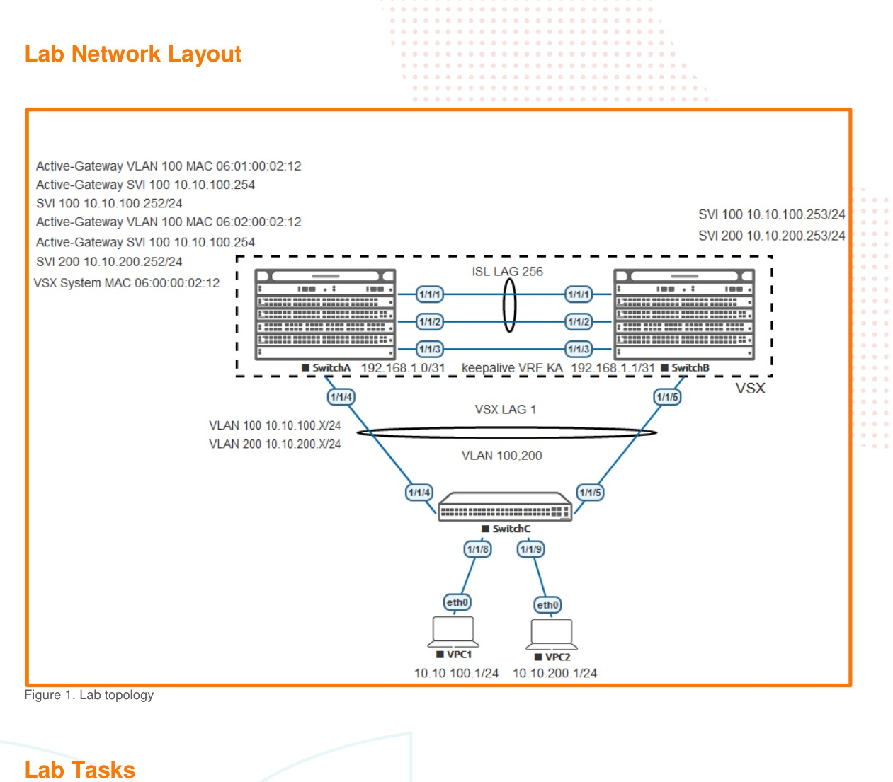

# Campus Series Part I - 2 Tier L2 Access & VSX

> **Panduan praktik berbahasa Indonesia**  
> Sumber: `AOS-CX Simulator Lab - Campus 2-Tier IPv4 L2 Access VSX Lab Guide.pdf`  
> Tingkat: **Menengah - Integrasi VLAN, LACP, VSX, MCLAG, dan Active Gateway**

## 1. Modul ini belajar tentang apa?

Lab ini menggabungkan beberapa konsep yang sebelumnya dipelajari secara terpisah menjadi sebuah desain jaringan kampus **dua lapis (2-tier)**.

```text
Perangkat pengguna
        ↓
Access switch Layer 2
        ↓ melalui LACP/MCLAG
Dua switch VSX sebagai collapsed core
        ↓
Default gateway dan routing antar-VLAN
```

Istilah **collapsed core** berarti fungsi distribution dan core digabung pada pasangan switch VSX yang sama. Access switch hanya menangani koneksi Layer 2, sedangkan fungsi Layer 3 dan default gateway ditempatkan pada VSX core.

## 2. Tujuan pembelajaran

Setelah menyelesaikan lab, Anda mampu:

- membentuk pasangan VSX primary dan secondary;
- membuat ISL dan keepalive untuk VSX;
- menghubungkan access switch ke dua switch VSX menggunakan MCLAG;
- membuat VLAN 100 dan VLAN 200 pada access dan core;
- menempatkan host ke access VLAN yang benar;
- membuat **VSX Active Gateway** sebagai default gateway bersama;
- menguji komunikasi antarhost yang berada pada VLAN berbeda;
- membaca status LACP, VSX, VLAN, MAC, dan gateway.

## 3. Gambaran topologi



### Peran perangkat

| Perangkat | Peran |
|---|---|
| SwitchA | VSX primary dan collapsed core |
| SwitchB | VSX secondary dan collapsed core |
| SwitchC | Access switch Layer 2 |
| VPC1 | Host VLAN 100, `10.10.100.1/24` |
| VPC2 | Host VLAN 200, `10.10.200.1/24` |

### Jaringan yang digunakan

| Fungsi | Alamat/VLAN |
|---|---|
| VSX keepalive | `192.168.1.0/31` dan `192.168.1.1/31` pada VRF `KA` |
| VLAN pengguna 1 | VLAN 100, jaringan `10.10.100.0/24` |
| VLAN pengguna 2 | VLAN 200, jaringan `10.10.200.0/24` |
| SVI SwitchA | `10.10.100.252/24` dan `10.10.200.252/24` |
| SVI SwitchB | `10.10.100.253/24` dan `10.10.200.253/24` |
| Active Gateway | `10.10.100.254` dan `10.10.200.254` |

> **Catatan:** pada halaman setup PDF terdapat kalimat bahwa SwitchA tidak digunakan. Ini tampaknya salah ketik karena topologi dan seluruh konfigurasi jelas menggunakan SwitchA sebagai VSX primary.

## 4. Konsep penting sebelum praktik

### 4.1 Arsitektur 2-tier

Pada desain dua lapis:

1. **Access layer** menghubungkan endpoint seperti komputer, printer, dan access point.
2. **Collapsed core** melakukan fungsi agregasi sekaligus routing Layer 3.

Desain ini lebih sederhana daripada 3-tier dan cocok untuk kampus kecil hingga menengah.

### 4.2 LAG dan MCLAG

- **LAG** menggabungkan beberapa link fisik menjadi satu link logis.
- **LACP** melakukan negosiasi anggota LAG.
- **MCLAG** memungkinkan satu access switch membuat LAG ke dua chassis VSX yang berbeda, tetapi terlihat sebagai satu sistem logis.

### 4.3 VSX Active Gateway

Active Gateway menyediakan satu alamat default gateway virtual yang aktif pada kedua switch VSX. Host menggunakan alamat `.254`, sedangkan setiap VSX node tetap mempunyai alamat SVI sendiri (`.252` dan `.253`).

```text
VPC1 menggunakan gateway 10.10.100.254
                  ├─ dapat dijawab oleh SwitchA
                  └─ dapat dijawab oleh SwitchB
```

Keuntungannya:

- tidak memerlukan pemilihan active/standby seperti desain VRRP tradisional;
- trafik dapat diteruskan secara lokal oleh kedua switch;
- kegagalan salah satu node tidak mengubah default gateway host.

## 5. Tahap 1 - Menyiapkan perangkat dan interface

Atur hostname dan aktifkan port sesuai topologi.

Contoh:

```text
configure terminal
hostname SwitchA
interface 1/1/1-1/1/4
 no shutdown
```

SwitchB mengaktifkan port ISL, keepalive, dan uplink ke SwitchC. SwitchC mengaktifkan uplink ke SwitchA/SwitchB serta port menuju VPC.

Validasi topologi:

```text
show lldp neighbor-info
show interface brief
```

Jangan lanjut sebelum neighbor LLDP muncul pada port yang sesuai.

## 6. Tahap 2 - Membuat ISL LAG

Lakukan pada SwitchA dan SwitchB:

```text
interface lag 256
 no shutdown
 description ISL
 no routing
 vlan trunk allowed all
 lacp mode active

interface 1/1/1-1/1/2
 no shutdown
 mtu 9198
 description ISL link
 lag 256
```

Validasi:

```text
show interface lag 256
show lacp interfaces
```

Target:

- `Aggregate lag256 is up`;
- interface `1/1/1` dan `1/1/2` menjadi anggota `lag256`;
- flag LACP ideal menunjukkan `ALFNCD`;
- status forwarding `up`.

## 7. Tahap 3 - Membuat keepalive VSX

Buat VRF khusus:

```text
vrf KA
```

SwitchA:

```text
interface 1/1/3
 no shutdown
 vrf attach KA
 ip address 192.168.1.0/31
 description VSX keepalive link
```

SwitchB:

```text
interface 1/1/3
 no shutdown
 vrf attach KA
 ip address 192.168.1.1/31
 description VSX keepalive link
```

Uji konektivitas:

```text
# Dari SwitchA
ping 192.168.1.1 vrf KA

# Dari SwitchB
ping 192.168.1.0 vrf KA
```

Keepalive harus dapat saling ping sebelum cluster VSX dibuat.

## 8. Tahap 4 - Membentuk pasangan VSX

SwitchA:

```text
vsx
 system-mac 06:00:00:00:02:12
 inter-switch-link lag 256
 role primary
 vsx-sync vsx-global
```

SwitchB:

```text
vsx
 inter-switch-link lag 256
 role secondary
```

Tambahkan keepalive.

SwitchA:

```text
vsx
 keepalive peer 192.168.1.1 source 192.168.1.0 vrf KA
```

SwitchB:

```text
vsx
 keepalive peer 192.168.1.0 source 192.168.1.1 vrf KA
```

Validasi:

```text
show vsx status
show vsx brief
show vsx status keepalive
```

Target utama:

```text
ISL State       : In-Sync
Device State    : Peer-Established
Keepalive State : Keepalive-Established
```

## 9. Tahap 5 - Sinkronisasi dan VLAN pengguna

Pada VSX primary, aktifkan kelompok sinkronisasi yang diperlukan. Guide memberikan daftar lengkap untuk tujuan pembelajaran. Untuk memahami konsepnya, yang penting adalah konfigurasi relevan seperti VLAN, OSPF, MCLAG, dan global VSX dapat disinkronkan dari primary ke secondary.

Buat VLAN pada SwitchA:

```text
vlan 100,200
 vsx-sync
```

Periksa pada SwitchB:

```text
show vlan
```

VLAN 100 dan 200 harus muncul pada kedua node.

## 10. Tahap 6 - Membuat MCLAG menuju access switch

SwitchA:

```text
interface lag 1 multi-chassis
 no shutdown
 description SwitchC VSX-MCLAG
 no routing
 vlan trunk allowed 100,200
 lacp mode active

interface 1/1/4
 no shutdown
 no routing
 description to SwitchC
 lag 1
```

SwitchB:

```text
interface lag 1 multi-chassis
 no shutdown

interface 1/1/5
 no shutdown
 no routing
 description to SwitchC
 lag 1
```

Pada SwitchC:

```text
vlan 100,200

interface lag 1
 no shutdown
 no routing
 vlan trunk allowed 100,200
 lacp mode active

interface 1/1/4
 no shutdown
 description to SwitchA
 lag 1

interface 1/1/5
 no shutdown
 description to SwitchB
 lag 1
```

Validasi:

```text
# SwitchC
show interface lag 1
show lacp interfaces

# SwitchA/SwitchB
show lacp interfaces multi-chassis
```

Kedua link harus masuk ke LAG yang sama dan berstatus collecting/distributing.

## 11. Tahap 7 - Membuat access port dan host

Pada SwitchC:

```text
interface 1/1/8
 no shutdown
 no routing
 vlan access 100

interface 1/1/9
 no shutdown
 no routing
 vlan access 200
```

VPC1:

```text
ip 10.10.100.1/24 10.10.100.254
```

VPC2:

```text
ip 10.10.200.1/24 10.10.200.254
```

Sebelum Active Gateway dibuat, host belum mempunyai gateway Layer 3 yang dapat digunakan untuk komunikasi antar-VLAN.

## 12. Tahap 8 - Membuat VSX Active Gateway

SwitchA:

```text
interface vlan 100
 vsx-sync active-gateways
 ip mtu 9100
 ip address 10.10.100.252/24
 active-gateway ip mac 06:01:00:00:02:12
 active-gateway ip 10.10.100.254

interface vlan 200
 vsx-sync active-gateways
 ip mtu 9100
 ip address 10.10.200.252/24
 active-gateway ip mac 06:02:00:00:02:12
 active-gateway ip 10.10.200.254
```

SwitchB memiliki alamat SVI lokal:

```text
interface vlan 100
 ip mtu 9100
 ip address 10.10.100.253/24

interface vlan 200
 ip mtu 9100
 ip address 10.10.200.253/24
```

Konfigurasi active gateway akan tersinkron sesuai pengaturan VSX.

> Pada perangkat fisik, best practice umumnya menggunakan VMAC yang sama untuk seluruh IPv4 active gateway. Guide memakai VMAC berbeda karena keterbatasan simulator dan VPCS.

## 13. Validasi akhir

Dari VPC1:

```text
ping 10.10.100.254
ping 10.10.200.1
```

Dari VPC2:

```text
ping 10.10.200.254
ping 10.10.100.1
```

Periksa juga:

```text
show vlan
show mac-address-table
show arp
show vsx brief
show lacp interfaces multi-chassis
show running-config interface vlan 100
show running-config interface vlan 200
```

## 14. Bagaimana paket bergerak?

Contoh VPC1 mengirim paket ke VPC2:

```text
VPC1 10.10.100.1
  ↓ access port VLAN 100
SwitchC
  ↓ trunk MCLAG
SwitchA atau SwitchB
  ↓ routing melalui Active Gateway
SVI VLAN 200
  ↓ trunk MCLAG
SwitchC
  ↓ access port VLAN 200
VPC2 10.10.200.1
```

Karena VPC1 dan VPC2 berada pada subnet berbeda, paket harus dirutekan oleh SVI pada VSX core.

## 15. Troubleshooting

| Gejala | Pemeriksaan | Penyebab umum |
|---|---|---|
| `lag256` down | `show lacp interfaces` | port belum aktif, port salah, LACP tidak sesuai |
| VSX tidak `In-Sync` | `show vsx status` | ISL gagal atau versi firmware berbeda |
| Keepalive tidak established | ping VRF `KA` | IP/VRF/port keepalive salah |
| MCLAG hanya satu link aktif | cek LAG di SwitchC dan VSX | nomor LAG, VLAN trunk, atau LACP tidak sama |
| Host tidak dapat ping gateway | cek VLAN, MAC, SVI | access VLAN salah atau Active Gateway belum ada |
| VPC1 tidak dapat ping VPC2 | cek gateway dan SVI kedua VLAN | host salah gateway, SVI down, VLAN tidak melewati trunk |
| VLAN ada di primary tetapi tidak di secondary | `show vsx status config-sync` | `vsx-sync` belum diterapkan atau sync bermasalah |

## 16. Checklist keberhasilan

- [ ] ISL LAG `lag256` berstatus up.
- [ ] Keepalive VRF `KA` dapat saling ping.
- [ ] VSX berstatus `In-Sync` dan `Peer-Established`.
- [ ] VLAN 100 dan 200 ada pada kedua VSX node.
- [ ] MCLAG menuju SwitchC aktif pada kedua link.
- [ ] VPC1 berada di VLAN 100 dan VPC2 di VLAN 200.
- [ ] Active Gateway `.254` dapat diping dari masing-masing host.
- [ ] VPC1 dan VPC2 dapat saling ping.

## 17. Pertanyaan latihan

1. Mengapa access switch tetap Layer 2 pada desain ini?
2. Apa perbedaan ISL dan keepalive?
3. Mengapa uplink SwitchC dapat membentuk satu LAG ke dua switch fisik berbeda?
4. Apa perbedaan alamat SVI `.252`, `.253`, dan Active Gateway `.254`?
5. Mengapa komunikasi VPC1 ke VPC2 memerlukan routing?
6. Apa yang terjadi bila link SwitchC ke SwitchA diputus?
7. Apa yang terjadi bila VSX primary dimatikan?

## 18. Ringkasan perintah

```text
show lldp neighbor-info
show interface lag 256
show lacp interfaces
show vsx status
show vsx brief
show vsx status keepalive
show vlan
show lacp interfaces multi-chassis
show mac-address-table
show arp
ping <alamat>
```
