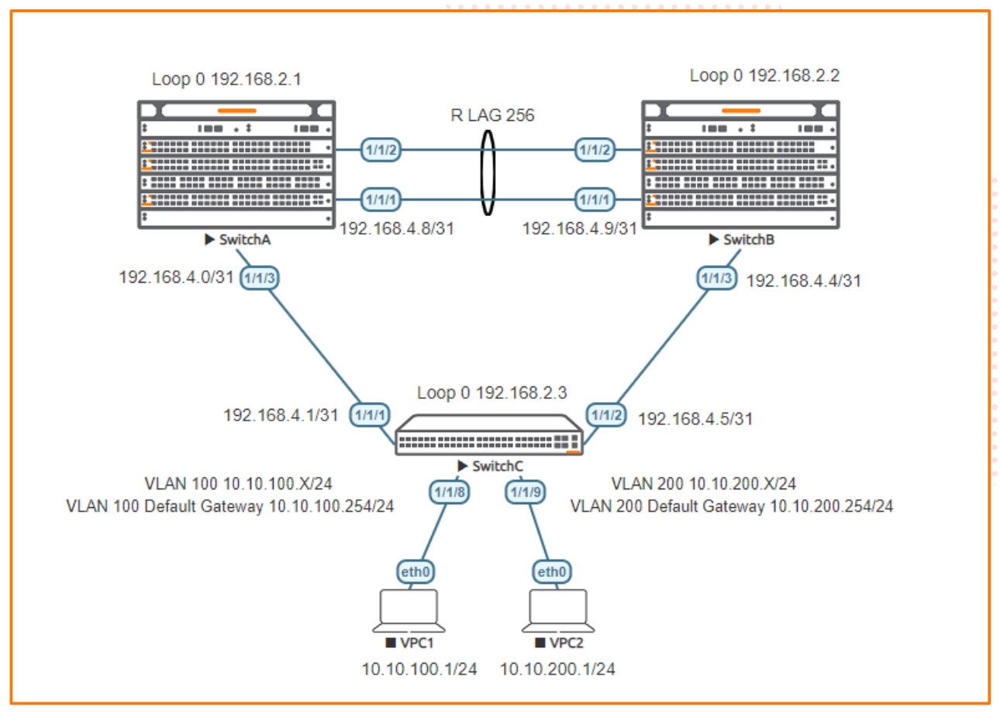

# Part I Campus 2 Tier - Layer 3 Access with OSPF

> **Panduan praktik berbahasa Indonesia**  
> Sumber: `AOS-CX Simulator Lab - Campus 2-Tier L3 Access with OSPF Lab Guide.pdf`  
> Tingkat: **Menengah - Routed Access, Routed LAG, dan OSPF**

## 1. Modul ini belajar tentang apa?

Lab ini mengajarkan desain jaringan kampus **dua lapis (2-tier)** dengan fungsi Layer 3 dimulai langsung dari access switch.

Pada modul Campus 2-Tier L2 sebelumnya, access switch hanya membawa VLAN ke pasangan VSX dan default gateway berada di core. Pada modul ini, pendekatannya berbeda:

```text
VPC/endpoint
    ↓
SwitchC sebagai access switch Layer 3
    ├─ menjadi default gateway VLAN 100 dan VLAN 200
    ├─ terhubung ke SwitchA melalui link routed
    └─ terhubung ke SwitchB melalui link routed
             ↓
      OSPF menuju collapsed core
```

Artinya, endpoint menggunakan **SwitchC sebagai default gateway lokal**, lalu SwitchC mengiklankan jaringan pengguna ke core menggunakan OSPF. fileciteturn6file0

## 2. Mengapa desain L3 access digunakan?

Pada desain Layer 2 access, uplink access switch membawa VLAN dalam bentuk trunk. Redundansi dan pencegahan loop biasanya bergantung pada STP, LAG, MCLAG, atau teknologi sejenis.

Pada desain Layer 3 access:

- uplink access-to-core menggunakan IP point-to-point;
- setiap link menjadi jalur routing independen;
- OSPF memilih jalur terbaik;
- kegagalan satu uplink dapat ditangani oleh routing;
- domain Layer 2 tidak perlu diperpanjang sampai core;
- endpoint memakai gateway pada access switch terdekat.

> **Inti desain:** batasi Layer 2 di access switch dan gunakan Layer 3 untuk uplink menuju core.

## 3. Tujuan pembelajaran

Setelah menyelesaikan lab, Anda mampu:

- membangun routed LAG antara dua core switch;
- menggunakan jaringan `/31` untuk link point-to-point;
- membuat loopback sebagai router ID OSPF;
- membentuk OSPF neighbor antara SwitchA, SwitchB, dan SwitchC;
- membuat dua jalur routed dari access switch menuju core;
- menempatkan default gateway VLAN pada access switch;
- mengiklankan jaringan VLAN pengguna melalui OSPF;
- membaca routing table dan memahami jalur redundan;
- menguji konektivitas dari VPC menuju core.

## 4. Gambaran topologi



### Peran perangkat

| Perangkat | Peran |
|---|---|
| **SwitchA** | Collapsed core pertama, router ID `192.168.2.1` |
| **SwitchB** | Collapsed core kedua, router ID `192.168.2.2` |
| **SwitchC** | Access switch Layer 3, router ID `192.168.2.3`, gateway pengguna |
| **VPC1** | Host VLAN 100, `10.10.100.1/24` |
| **VPC2** | Host VLAN 200, `10.10.200.1/24` |

### Tabel alamat

| Link/fungsi | Sisi pertama | Sisi kedua |
|---|---|---|
| Routed LAG SwitchA-SwitchB | SwitchA `192.168.4.8/31` | SwitchB `192.168.4.9/31` |
| SwitchA-SwitchC | SwitchA `192.168.4.0/31` | SwitchC `192.168.4.1/31` |
| SwitchB-SwitchC | SwitchB `192.168.4.4/31` | SwitchC `192.168.4.5/31` |
| Loopback | A `192.168.2.1/32` | B `192.168.2.2/32`; C `192.168.2.3/32` |
| VLAN 100 | Jaringan `10.10.100.0/24` | Gateway `10.10.100.254` |
| VLAN 200 | Jaringan `10.10.200.0/24` | Gateway `10.10.200.254` |

## 5. Konsep penting

### 5.1 Routed port

Port routed mempunyai IP address dan meneruskan paket berdasarkan routing table.

```text
interface 1/1/3
 ip address 192.168.4.0/31
```

Berbeda dengan access port:

```text
interface 1/1/8
 no routing
 vlan access 100
```

### 5.2 Mengapa menggunakan `/31`?

Prefix `/31` menyediakan tepat dua alamat dan cocok untuk link point-to-point.

```text
192.168.4.0/31
├─ 192.168.4.0
└─ 192.168.4.1
```

Karena hanya ada dua perangkat pada link tersebut, tidak perlu membuang alamat untuk network dan broadcast seperti pada subnet tradisional.

### 5.3 Routed LAG

SwitchA dan SwitchB memakai dua link fisik yang digabung menjadi `lag256`, lalu IP address ditempatkan pada interface LAG.

```text
Dua kabel fisik
      ↓ LACP
interface lag 256
      ↓
Satu link Layer 3 logis
```

### 5.4 Loopback dan router ID

Loopback tetap aktif selama switch menyala dan tidak bergantung pada satu port fisik. Karena itu loopback cocok digunakan sebagai identitas OSPF.

## 6. Tahap 1 - Menyiapkan perangkat

Aktifkan interface sesuai topologi.

SwitchA dan SwitchB:

```text
configure terminal
interface 1/1/1-1/1/3
 no shutdown
```

SwitchC:

```text
configure terminal
interface 1/1/1-1/1/2
 no shutdown
```

Validasi:

```text
show interface brief
show lldp neighbor-info
```

Pada SwitchC harus terlihat:

- SwitchA pada `1/1/1`;
- SwitchB pada `1/1/2`.

> Jangan melanjutkan ke OSPF sebelum koneksi fisik dan LLDP benar.

## 7. Tahap 2 - Membuat routed LAG antar-core

### SwitchA

```text
interface lag 256
 no shutdown
 description Routed LAG to SwitchB
 ip address 192.168.4.8/31
 lacp mode active

interface 1/1/1-1/1/2
 no shutdown
 mtu 9198
 description Core link
 lag 256
```

### SwitchB

```text
interface lag 256
 no shutdown
 description Routed LAG to SwitchA
 ip address 192.168.4.9/31
 lacp mode active

interface 1/1/1-1/1/2
 no shutdown
 mtu 9198
 description Core link
 lag 256
```

Validasi:

```text
show interface lag 256
show lacp interfaces
```

Target:

```text
Aggregate lag256 is up
```

Flag LACP yang diharapkan:

```text
ALFNCD
```

Arti bagian terpenting:

- `A`: Active;
- `F`: Aggregable;
- `N`: InSync;
- `C`: Collecting;
- `D`: Distributing.

Uji IP langsung:

```text
# Dari SwitchA
ping 192.168.4.9
```

Ping ini harus berhasil sebelum OSPF dikonfigurasi.

## 8. Tahap 3 - Mengaktifkan OSPF pada core

Seluruh link dimasukkan ke Area 0.

### SwitchA

```text
router ospf 1
 router-id 192.168.2.1
 max-metric router-lsa on-startup
 passive-interface default
 graceful-restart restart-interval 300
 trap-enable
 area 0.0.0.0

interface loopback 0
 ip address 192.168.2.1/32
 ip ospf 1 area 0.0.0.0

interface lag 256
 mtu 9198
 description to SwitchB
 ip ospf 1 area 0.0.0.0
 no ip ospf passive
 ip ospf network point-to-point

interface 1/1/3
 no shutdown
 mtu 9198
 description to SwitchC
 ip address 192.168.4.0/31
 ip ospf 1 area 0.0.0.0
 no ip ospf passive
 ip ospf network point-to-point
```

### SwitchB

```text
router ospf 1
 router-id 192.168.2.2
 max-metric router-lsa on-startup
 passive-interface default
 graceful-restart restart-interval 300
 trap-enable
 area 0.0.0.0

interface loopback 0
 ip address 192.168.2.2/32
 ip ospf 1 area 0.0.0.0

interface lag 256
 mtu 9198
 description to SwitchA
 ip ospf 1 area 0.0.0.0
 no ip ospf passive
 ip ospf network point-to-point

interface 1/1/3
 no shutdown
 mtu 9198
 description to SwitchC
 ip address 192.168.4.4/31
 ip ospf 1 area 0.0.0.0
 no ip ospf passive
 ip ospf network point-to-point
```

Setelah SwitchA dan SwitchB dikonfigurasi:

```text
show ip ospf neighbors
```

Masing-masing core seharusnya melihat neighbor core lainnya dengan status `FULL` melalui `lag256`.

## 9. Tahap 4 - Mengaktifkan OSPF pada access switch

### SwitchC

```text
router ospf 1
 router-id 192.168.2.3
 max-metric router-lsa on-startup
 passive-interface default
 graceful-restart restart-interval 300
 trap-enable
 area 0.0.0.0

interface loopback 0
 ip address 192.168.2.3/32
 ip ospf 1 area 0.0.0.0

interface 1/1/1
 no shutdown
 mtu 9198
 description to SwitchA
 ip address 192.168.4.1/31
 ip ospf 1 area 0.0.0.0
 no ip ospf passive
 ip ospf network point-to-point

interface 1/1/2
 no shutdown
 mtu 9198
 description to SwitchB
 ip address 192.168.4.5/31
 ip ospf 1 area 0.0.0.0
 no ip ospf passive
 ip ospf network point-to-point
```

Validasi:

```text
show ip ospf neighbors
```

SwitchC harus melihat dua neighbor:

```text
192.168.2.1  FULL  melalui 1/1/1
192.168.2.2  FULL  melalui 1/1/2
```

Periksa route:

```text
show ip ospf route
show ip route ospf
```

Uji loopback core:

```text
ping 192.168.2.1
ping 192.168.2.2
```

### Mengapa cost dapat terlihat sangat tinggi?

Guide menggunakan:

```text
max-metric router-lsa on-startup
```

Fitur ini membuat router sementara mengiklankan metric tinggi ketika baru aktif agar tidak langsung menjadi jalur transit sebelum routing stabil. Karena itu output awal dapat memperlihatkan cost `65535`.

## 10. Tahap 5 - Membuat VLAN pengguna pada SwitchC

SwitchC menjadi gateway untuk kedua VLAN.

```text
vlan 100,200

interface vlan 100
 ip address 10.10.100.254/24
 ip ospf 1 area 0.0.0.0

interface vlan 200
 ip address 10.10.200.254/24
 ip ospf 1 area 0.0.0.0

interface 1/1/8
 no shutdown
 no routing
 vlan access 100

interface 1/1/9
 no shutdown
 no routing
 vlan access 200
```

Dengan `passive-interface default`, SVI pengguna tetap dapat diiklankan ke OSPF tanpa harus membentuk neighbor dengan host.

> PDF sumber menambahkan `no ip ospf passive` pada SVI. Untuk VLAN yang hanya berisi endpoint dan tidak memiliki router OSPF, mempertahankan interface sebagai passive umumnya lebih aman karena switch tidak perlu mengirim OSPF Hello ke jaringan pengguna.

Validasi dari SwitchA atau SwitchB:

```text
show ip route
show ip ospf route
```

Route berikut harus muncul sebagai route OSPF:

```text
10.10.100.0/24
10.10.200.0/24
```

## 11. Tahap 6 - Mengonfigurasi VPC

VPC1:

```text
ip 10.10.100.1/24 10.10.100.254
```

VPC2:

```text
ip 10.10.200.1/24 10.10.200.254
```

Pengujian:

```text
# Dari VPC1
ping 10.10.100.254
ping 10.10.200.1
ping 192.168.2.1
ping 192.168.2.2
```

Alur paket VPC1 menuju core:

```text
VPC1
→ gateway 10.10.100.254 pada SwitchC
→ routing table SwitchC
→ salah satu uplink OSPF
→ SwitchA atau SwitchB
```

## 12. Perbandingan Campus 2-Tier L2 dan L3 Access

| Aspek | L2 Access dengan VSX | L3 Access dengan OSPF |
|---|---|---|
| Gateway pengguna | Pada pasangan VSX core | Pada access switch |
| Uplink access-core | Trunk VLAN/MCLAG | Routed point-to-point |
| Domain Layer 2 | Diperpanjang ke core | Berhenti di access |
| Pencegahan loop uplink | STP/LAG/VSX | Routing OSPF |
| Teknologi utama | VLAN, LACP, VSX, Active Gateway | IP, routed LAG, OSPF |
| Kelebihan | Gateway redundan terpusat | Failure domain kecil dan routing lebih langsung |

## 13. Cara membaca hasil

### Neighbor OSPF

```text
show ip ospf neighbors
```

`FULL` berarti database OSPF telah dipertukarkan dengan benar.

### Routing table

```text
show ip route
```

Kode penting:

| Kode | Arti |
|---|---|
| `C` | Connected |
| `L` | Local |
| `O` | OSPF |

### OSPF route

```text
show ip ospf route
```

Karena semua perangkat berada pada Area 0, route OSPF akan terlihat sebagai **intra-area (`i`)**.

## 14. Failure test

Setelah lab berhasil, uji redundansi.

Pada SwitchC:

```text
interface 1/1/1
 shutdown
```

Kemudian:

```text
show ip ospf neighbors
show ip route
ping 192.168.2.1
```

Yang diharapkan:

- neighbor ke SwitchA hilang;
- neighbor ke SwitchB tetap `FULL`;
- route dikalkulasi ulang;
- konektivitas tetap dapat berjalan melalui SwitchB.

Aktifkan kembali:

```text
interface 1/1/1
 no shutdown
```

## 15. Troubleshooting

| Gejala | Penyebab umum | Pemeriksaan |
|---|---|---|
| LAG down | Anggota LAG salah atau LACP tidak aktif | `show lacp interfaces` |
| Ping A-B gagal | IP `/31` tidak berpasangan atau LAG down | `show interface lag 256` |
| Neighbor OSPF tidak muncul | Area/network type berbeda atau interface passive | `show ip ospf interface` |
| SwitchC hanya punya satu neighbor | Salah satu uplink down atau IP salah | `show interface brief` |
| VLAN user tidak muncul di core | SVI belum dimasukkan OSPF | `show ip ospf route` |
| VPC tidak dapat ping gateway | Port access/VLAN/IP host salah | `show vlan`, `show mac-address-table` |
| Route ada tetapi ping gagal | Gateway host atau return route salah | `show ip route` |
| Cost OSPF sangat tinggi | `max-metric router-lsa on-startup` masih aktif | `show running-config router ospf` |

## 16. Checklist keberhasilan

- [ ] LLDP sesuai topologi.
- [ ] `lag256` antara SwitchA dan SwitchB berstatus up.
- [ ] Ping `192.168.4.8 ↔ 192.168.4.9` berhasil.
- [ ] SwitchA dan SwitchB membentuk neighbor OSPF `FULL`.
- [ ] SwitchC mempunyai dua neighbor OSPF `FULL`.
- [ ] Loopback ketiga switch saling dapat dijangkau.
- [ ] Route VLAN 100 dan VLAN 200 terlihat pada core.
- [ ] VPC dapat ping gateway lokal.
- [ ] VPC dapat mencapai loopback core.
- [ ] Konektivitas tetap tersedia ketika satu uplink SwitchC dimatikan.

## 17. Pertanyaan latihan

1. Apa perbedaan utama antara L2 access dan L3 access?
2. Mengapa uplink point-to-point cocok menggunakan `/31`?
3. Mengapa SwitchC mempunyai dua OSPF neighbor?
4. Di perangkat mana default gateway pengguna berada?
5. Apa fungsi routed LAG antara SwitchA dan SwitchB?
6. Mengapa user VLAN sebaiknya menjadi passive interface OSPF?
7. Apa yang terjadi ketika satu uplink SwitchC shutdown?

## 18. Ringkasan perintah

```text
show lldp neighbor-info
show interface brief
show interface lag 256
show lacp interfaces
show ip ospf neighbors
show ip ospf interface
show ip ospf route
show ip route
ping <alamat>
```
