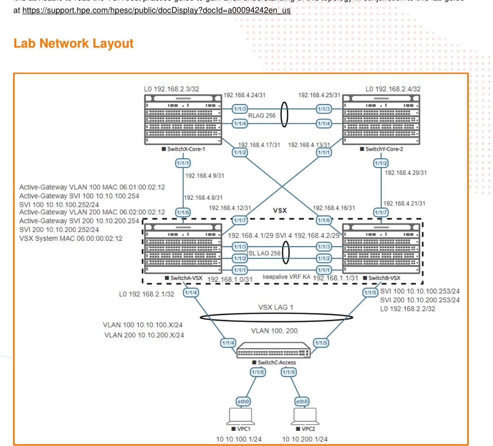

# Part II Campus 3 Tier - L2 Access with VSX and OSPF

> **Panduan praktik berbahasa Indonesia**  
> Sumber: `AOS-CX Simulator Lab - Campus 3-Tier IPv4 L2 Access with VSX and OSPF Lab Guide.pdf`  
> Tingkat: **Menengah-Lanjut - Integrasi Campus 2-Tier, VSX, Active Gateway, routed LAG, dan OSPF**

## 1. Modul ini belajar tentang apa?

Lab ini merupakan kelanjutan langsung dari **Campus Series Part I - 2 Tier L2 Access & VSX**. Pada Part I, access switch terhubung ke pasangan VSX yang berfungsi sebagai collapsed core. Pada Part II, jaringan diperluas menjadi desain kampus **tiga lapis (3-tier)** dengan menambahkan dua switch core di atas pasangan VSX.

```text
Endpoint
   ↓
Access layer - SwitchC
   ↓ Layer 2 MCLAG
Aggregation/distribution layer - SwitchA dan SwitchB VSX
   ↓ Layer 3 OSPF
Core layer - SwitchX dan SwitchY
```

Lab ini menunjukkan bagaimana trafik pengguna dari VLAN 100 dan VLAN 200 dapat mencapai jaringan core melalui routing OSPF yang redundan.

## 2. Prasyarat

Sebelum memulai, selesaikan terlebih dahulu modul:

1. VSX Lab1 - Layer2;
2. Configuring OSPF on Aruba CX Switches;
3. Campus Series Part I - 2 Tier L2 Access & VSX.

Part II menggunakan konfigurasi SwitchA, SwitchB, SwitchC, VPC1, dan VPC2 dari Part I sebagai titik awal. PDF juga menyatakan bahwa lab ini dibangun di atas lab 2-tier sebelumnya.

## 3. Tujuan pembelajaran

Setelah menyelesaikan lab, Anda mampu:

- mengubah desain 2-tier menjadi 3-tier;
- memahami perbedaan access, aggregation/distribution, dan core;
- membuat transit VLAN khusus antarpeer VSX untuk OSPF;
- mengaktifkan OSPF pada SVI pengguna dan link routed point-to-point;
- membuat routed LAG antarswitch core;
- memahami penggunaan `passive-interface default`;
- mengatur OSPF cost untuk memengaruhi jalur trafik;
- membaca neighbor dan route OSPF pada seluruh fabric;
- menguji konektivitas endpoint sampai ke core.

## 4. Gambaran topologi



### Peran perangkat

| Perangkat | Peran |
|---|---|
| SwitchC | Access switch Layer 2 |
| SwitchA | VSX primary, aggregation/distribution |
| SwitchB | VSX secondary, aggregation/distribution |
| SwitchX | Core switch 1 |
| SwitchY | Core switch 2 |
| VPC1 | Endpoint VLAN 100 |
| VPC2 | Endpoint VLAN 200 |

### Loopback router ID

| Perangkat | Loopback0 |
|---|---|
| SwitchA | `192.168.2.1/32` |
| SwitchB | `192.168.2.2/32` |
| SwitchX | `192.168.2.3/32` |
| SwitchY | `192.168.2.4/32` |

### Link routed utama

| Link | Alamat sisi pertama | Alamat sisi kedua |
|---|---|---|
| SwitchA-SwitchX | A `192.168.4.8/31` | X `192.168.4.9/31` |
| SwitchA-SwitchY | A `192.168.4.12/31` | Y `192.168.4.13/31` |
| SwitchB-SwitchX | B `192.168.4.16/31` | X `192.168.4.17/31` |
| SwitchB-SwitchY | B `192.168.4.20/31` | Y `192.168.4.21/31` |
| SwitchX-SwitchY RLAG | X `192.168.4.24/31` | Y `192.168.4.25/31` |
| Transit VSX VLAN 4 | A `192.168.4.1/29` | B `192.168.4.2/29` |

## 5. Memahami arsitektur 3-tier

### Access layer

- menghubungkan endpoint;
- melakukan switching VLAN;
- tidak menjadi lokasi routing utama pada lab ini.

### Aggregation/distribution layer

- menggunakan pasangan VSX;
- menjadi default gateway VLAN pengguna;
- mengiklankan jaringan pengguna ke OSPF;
- menyediakan jalur redundan ke core.

### Core layer

- menjadi backbone Layer 3 berkecepatan tinggi;
- menghubungkan blok aggregation;
- tidak perlu membawa VLAN pengguna sebagai Layer 2 trunk;
- mempelajari subnet pengguna melalui OSPF.

## 6. Mengapa diperlukan Transit VLAN 4?

SwitchA dan SwitchB adalah dua router OSPF terpisah walaupun bekerja sebagai pasangan VSX. Keduanya perlu membentuk adjacency OSPF agar dapat bertukar informasi route, khususnya untuk subnet atau link yang hanya melekat pada salah satu node.

```text
SwitchA OSPF router 192.168.2.1
        ↕ VLAN 4 melalui ISL
SwitchB OSPF router 192.168.2.2
```

Transit VLAN ini tidak ditujukan sebagai jalur normal trafik pengguna. Dalam guide, cost VLAN 4 dibuat lebih rendah daripada link ke core agar komunikasi antarpeer VSX menggunakan jalur internal yang sesuai ketika diperlukan. fileciteturn5file0

## 7. Tahap 1 - Pastikan Campus 2-Tier sudah bekerja

Sebelum menambah SwitchX dan SwitchY, validasi konfigurasi Part I:

```text
show vsx brief
show lacp interfaces multi-chassis
show vlan
show mac-address-table
```

Dari VPC1:

```text
ping 10.10.100.254
ping 10.10.200.1
```

Jangan melanjutkan apabila jaringan 2-tier belum berhasil.

## 8. Tahap 2 - Membuat Transit VLAN 4

Pada SwitchA:

```text
vlan 4
 vsx-sync

interface vlan 4
 description Transit VLAN
 ip address 192.168.4.1/29
```

Pada SwitchB:

```text
interface vlan 4
 description Transit VLAN
 ip address 192.168.4.2/29
```

Validasi:

```text
# Dari SwitchA
ping 192.168.4.2

# Dari SwitchB
ping 192.168.4.1
```

Jika ping gagal, periksa status VLAN 4 pada ISL dan sinkronisasi VSX.

## 9. Tahap 3 - Mengaktifkan OSPF pada pasangan VSX

### 9.1 Proses OSPF SwitchA

```text
router ospf 1
 router-id 192.168.2.1
 max-metric router-lsa on-startup
 passive-interface default
 graceful-restart restart-interval 300
 trap-enable
 area 0.0.0.0
```

### 9.2 Interface OSPF SwitchA

```text
interface loopback 0
 ip address 192.168.2.1/32
 ip ospf 1 area 0.0.0.0

interface vlan 4
 ip ospf 1 area 0.0.0.0
 no ip ospf passive
 ip ospf cost 50
 ip ospf network point-to-point

interface vlan 100
 ip ospf 1 area 0.0.0.0

interface vlan 200
 ip ospf 1 area 0.0.0.0

interface 1/1/6
 no shutdown
 mtu 9198
 description to SwitchX
 ip address 192.168.4.8/31
 ip ospf 1 area 0.0.0.0
 no ip ospf passive
 ip ospf cost 1000
 ip ospf network point-to-point

interface 1/1/7
 no shutdown
 mtu 9198
 description to SwitchY
 ip address 192.168.4.12/31
 ip ospf 1 area 0.0.0.0
 no ip ospf passive
 ip ospf cost 1000
 ip ospf network point-to-point
```

### 9.3 Proses dan interface OSPF SwitchB

```text
router ospf 1
 router-id 192.168.2.2
 max-metric router-lsa on-startup
 passive-interface default
 graceful-restart restart-interval 300
 trap-enable
 area 0.0.0.0

interface loopback 0
 ip address 192.168.2.2/32
 ip ospf 1 area 0.0.0.0

interface vlan 4
 ip ospf 1 area 0.0.0.0
 no ip ospf passive
 ip ospf cost 50
 ip ospf network point-to-point

interface vlan 100
 ip ospf 1 area 0.0.0.0

interface vlan 200
 ip ospf 1 area 0.0.0.0

interface 1/1/6
 no shutdown
 mtu 9198
 description to SwitchX
 ip address 192.168.4.16/31
 ip ospf 1 area 0.0.0.0
 no ip ospf passive
 ip ospf cost 1000
 ip ospf network point-to-point

interface 1/1/7
 no shutdown
 mtu 9198
 description to SwitchY
 ip address 192.168.4.20/31
 ip ospf 1 area 0.0.0.0
 no ip ospf passive
 ip ospf cost 1000
 ip ospf network point-to-point
```

Pada tahap ini, sebelum SwitchX dan SwitchY dikonfigurasi, neighbor yang seharusnya muncul hanya SwitchA-SwitchB melalui VLAN 4.

```text
show ip ospf neighbors
```

Target pada SwitchA:

```text
Neighbor ID 192.168.2.2
State       FULL
Interface   vlan4
```

## 10. Memahami `passive-interface default`

Perintah ini membuat seluruh interface OSPF pasif secara default.

- jaringan pada interface tetap diiklankan;
- OSPF Hello tidak dikirim;
- neighbor tidak dapat terbentuk pada interface tersebut.

Untuk link antarrouter, pasif harus dibuka:

```text
no ip ospf passive
```

Karena itu:

- SVI VLAN 100 dan VLAN 200 tetap pasif: subnet pengguna diiklankan, tetapi endpoint tidak menerima Hello OSPF;
- VLAN 4 dan routed uplink ke core dibuat non-passive: adjacency harus terbentuk.

## 11. Tahap 4 - Menambahkan SwitchX dan SwitchY

Tambahkan dua node AOS-CX dan hubungkan sesuai gambar topologi. Aktifkan port:

```text
interface 1/1/1-1/1/4
 no shutdown
```

Pada SwitchA dan SwitchB, aktifkan `1/1/6-1/1/7`.

Validasi:

```text
show lldp neighbor-info
```

SwitchX seharusnya melihat:

- SwitchA pada `1/1/1`;
- SwitchB pada `1/1/2`;
- dua link ke SwitchY pada `1/1/3` dan `1/1/4`.

## 12. Tahap 5 - Membuat routed LAG antarswitch core

### SwitchX

```text
interface lag 256
 no shutdown
 ip address 192.168.4.24/31
 lacp mode active

interface 1/1/3-1/1/4
 no shutdown
 description InterCoreLink
 lag 256
```

### SwitchY

```text
interface lag 256
 no shutdown
 ip address 192.168.4.25/31
 lacp mode active

interface 1/1/3-1/1/4
 no shutdown
 description InterCoreLink
 lag 256
```

Berbeda dari ISL LAG, LAG ini adalah **routed LAG** karena alamat IP dipasang langsung pada `interface lag 256` dan tidak menggunakan `no routing`.

Validasi:

```text
show interface lag 256
show lacp interfaces
ping 192.168.4.25   # dari SwitchX
```

Target flag LACP: `ALFNCD`.

## 13. Tahap 6 - Mengaktifkan OSPF pada core

### SwitchX

```text
router ospf 1
 router-id 192.168.2.3
 max-metric router-lsa on-startup
 passive-interface default
 graceful-restart restart-interval 300
 trap-enable
 area 0.0.0.0

interface loopback 0
 ip address 192.168.2.3/32
 ip ospf 1 area 0.0.0.0

interface 1/1/1
 mtu 9198
 description to SwitchA_VSX_Pri
 ip address 192.168.4.9/31
 ip ospf 1 area 0.0.0.0
 no ip ospf passive
 ip ospf cost 1000
 ip ospf network point-to-point

interface 1/1/2
 mtu 9198
 description to SwitchB_VSX_Sec
 ip address 192.168.4.17/31
 ip ospf 1 area 0.0.0.0
 no ip ospf passive
 ip ospf cost 1000
 ip ospf network point-to-point

interface lag 256
 ip ospf 1 area 0.0.0.0
 no ip ospf passive
 ip ospf cost 1000
 ip ospf network point-to-point
```

### SwitchY

```text
router ospf 1
 router-id 192.168.2.4
 max-metric router-lsa on-startup
 passive-interface default
 graceful-restart restart-interval 300
 trap-enable
 area 0.0.0.0

interface loopback 0
 ip address 192.168.2.4/32
 ip ospf 1 area 0.0.0.0

interface 1/1/1
 mtu 9198
 description to SwitchA_VSX_Pri
 ip address 192.168.4.13/31
 ip ospf 1 area 0.0.0.0
 no ip ospf passive
 ip ospf cost 1000
 ip ospf network point-to-point

interface 1/1/2
 mtu 9198
 description to SwitchB_VSX_Sec
 ip address 192.168.4.21/31
 ip ospf 1 area 0.0.0.0
 no ip ospf passive
 ip ospf cost 1000
 ip ospf network point-to-point

interface lag 256
 ip ospf 1 area 0.0.0.0
 no ip ospf passive
 ip ospf cost 1000
 ip ospf network point-to-point
```

## 14. Neighbor OSPF yang diharapkan

Setelah seluruh konfigurasi selesai:

| Perangkat | Jumlah neighbor | Neighbor |
|---|---:|---|
| SwitchA | 3 | SwitchB, SwitchX, SwitchY |
| SwitchB | 3 | SwitchA, SwitchX, SwitchY |
| SwitchX | 3 | SwitchA, SwitchB, SwitchY |
| SwitchY | 3 | SwitchA, SwitchB, SwitchX |

Validasi:

```text
show ip ospf neighbors
```

Seluruh neighbor harus berstatus `FULL`.

## 15. Memahami OSPF cost pada lab

Guide menetapkan:

- Transit VLAN 4 antara SwitchA-SwitchB: cost `50`;
- link VSX ke core: cost `1000`;
- routed LAG SwitchX-SwitchY: cost `1000`.

Cost yang lebih kecil lebih disukai. Transit antarpeer VSX dibuat lebih murah agar route menuju subnet atau link yang melekat pada peer dapat diteruskan melalui jalur internal VSX bila desain memerlukannya.

Periksa cost:

```text
show ip ospf interface vlan 4
show ip ospf interface 1/1/6
show ip route
```

## 16. Memahami route pengguna pada core

SwitchX dan SwitchY seharusnya mempelajari:

```text
10.10.100.0/24 melalui OSPF
10.10.200.0/24 melalui OSPF
```

Karena kedua subnet terhubung pada pasangan VSX, core dapat melihat equal-cost route melalui SwitchA dan SwitchB.

Contoh logika:

```text
SwitchX menuju 10.10.100.0/24
   ├─ next-hop SwitchA
   └─ next-hop SwitchB
```

Validasi:

```text
show ip route
show ip route ospf
show ip ospf route
```

## 17. Tahap 7 - Pengujian endpoint ke core

VPC1:

```text
ip 10.10.100.1/24 10.10.100.254
ping 10.10.100.254
ping 192.168.2.3
ping 192.168.2.4
```

VPC2 dapat melakukan pengujian serupa dari VLAN 200.

Alur paket VPC1 menuju loopback SwitchX:

```text
VPC1
  ↓ VLAN 100
SwitchC
  ↓ MCLAG
SwitchA atau SwitchB VSX
  ↓ routed uplink OSPF
SwitchX loopback 192.168.2.3
```

## 18. Failure test yang disarankan

Setelah semua berhasil, lakukan uji ketahanan satu per satu:

1. shutdown link SwitchC-SwitchA;
2. shutdown link SwitchA-SwitchX;
3. shutdown salah satu anggota routed LAG SwitchX-SwitchY;
4. shutdown SwitchX;
5. shutdown VSX primary setelah memastikan secondary sehat.

Setelah setiap perubahan, periksa:

```text
show lacp interfaces
show vsx brief
show ip ospf neighbors
show ip route
ping <tujuan>
```

Tujuannya bukan memastikan tidak ada satu pun paket hilang pada simulator, tetapi memahami bagaimana neighbor, route, dan jalur berubah.

## 19. Troubleshooting

| Gejala | Penyebab umum | Pemeriksaan |
|---|---|---|
| A-B tidak menjadi neighbor pada VLAN 4 | VLAN 4 tidak melewati ISL, SVI down, area berbeda | `show vlan`, `show ip ospf interface vlan 4` |
| Link ke core dapat ping tetapi OSPF tidak FULL | interface masih passive, network type/area berbeda | `show ip ospf interface <port>` |
| Neighbor stuck `EXSTART/EXCHANGE` | MTU berbeda | `show interface <port>` dan samakan MTU |
| SwitchX tidak melihat subnet VLAN 100/200 | SVI belum dimasukkan OSPF atau OSPF process belum aktif | cek `ip ospf 1 area 0` pada SVI |
| Routed LAG down | LACP/anggota port salah | `show interface lag 256`, `show lacp interfaces` |
| Hanya satu next-hop menuju subnet user | salah satu adjacency atau iklan route tidak tersedia | cek neighbor dan route pada kedua VSX node |
| VPC dapat ping gateway tetapi tidak core | default gateway benar, tetapi OSPF/uplink bermasalah | cek route pada VSX dan core |
| OSPF Hello muncul ke endpoint | SVI user tidak passive | gunakan `passive-interface default`; jangan `no ip ospf passive` pada SVI user |

## 20. Checklist keberhasilan

- [ ] Campus 2-tier Part I bekerja sebelum core ditambahkan.
- [ ] Transit VLAN 4 dapat ping antara SwitchA dan SwitchB.
- [ ] SwitchA-SwitchB membentuk neighbor OSPF melalui VLAN 4.
- [ ] Routed LAG SwitchX-SwitchY berstatus up.
- [ ] Setiap router mempunyai loopback/router ID yang unik.
- [ ] Setiap perangkat mempunyai tiga neighbor OSPF berstatus FULL.
- [ ] SwitchX dan SwitchY mempelajari subnet VLAN 100 dan 200.
- [ ] VPC1/VPC2 dapat mencapai Active Gateway.
- [ ] Endpoint dapat mencapai loopback SwitchX dan SwitchY.
- [ ] Konektivitas tetap tersedia ketika satu link redundan diputus.

## 21. Pertanyaan latihan

1. Apa perbedaan desain 2-tier dan 3-tier?
2. Mengapa SwitchC tidak menjalankan OSPF?
3. Mengapa VLAN 100 dan 200 dibuat passive dalam OSPF?
4. Mengapa Transit VLAN 4 dibutuhkan jika SwitchA dan SwitchB sudah mempunyai ISL?
5. Apa perbedaan ISL LAG dengan routed LAG SwitchX-SwitchY?
6. Mengapa semua router harus mempunyai router ID unik?
7. Mengapa subnet pengguna dapat memiliki dua next-hop pada SwitchX?
8. Apa akibatnya jika MTU pada dua sisi link OSPF berbeda?
9. Jalur mana yang dipilih ketika OSPF cost berbeda?

## 22. Ringkasan perintah

```text
show lldp neighbor-info
show vsx brief
show interface lag 256
show lacp interfaces
show ip ospf neighbors
show ip ospf interface <interface>
show ip route
show ip route ospf
show ip ospf route
ping <alamat>
```
