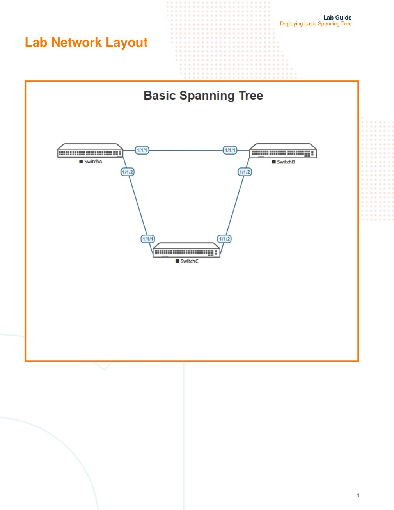

# Deploying basic STP

> **Versi Markdown untuk belajar**  
> Sumber: `AOS-CX Simulator Lab - Spanning Tree Basics Lab Guide.pdf`  
> Tingkat: **Dasar - Layer 2**

## Cara menggunakan dokumen ini

1. Baca bagian **Ringkasan Belajar** dan **Konsep Inti** terlebih dahulu.
2. Buka gambar topologi dan tulis ulang alamat/interface pada catatan Anda.
3. Kerjakan lab mengikuti **Alur Praktik** tanpa langsung menyalin seluruh appendix.
4. Setelah setiap tahap, jalankan perintah pada **Validasi Keberhasilan**.
5. Gunakan bagian **Transkrip Lengkap PDF** ketika membutuhkan instruksi atau output asli.

## Ringkasan Belajar

Lab ini memperkenalkan cara STP/MSTP mencegah loop pada jaringan Layer 2 yang memiliki jalur redundan. Anda akan melihat proses pemilihan root bridge, perubahan peran port, serta pengaruh bridge priority dan path cost.

## Konsep Inti

| Konsep | Arti dalam lab |
|---|---|
| **BPDU** | Pesan yang dipertukarkan switch untuk membentuk topologi bebas loop. |
| **Root bridge** | Switch pusat perhitungan STP. Semua port pada root bridge menjadi designated forwarding. |
| **Root port** | Port terbaik pada non-root switch untuk menuju root bridge. |
| **Designated port** | Port yang diizinkan meneruskan trafik pada suatu segmen. |
| **Alternate/blocking port** | Jalur cadangan yang diblokir agar tidak terjadi loop. |
| **Bridge priority dan path cost** | Parameter untuk mengendalikan pemilihan root dan jalur forwarding. |

## Topologi Lab



> Gambar di atas merupakan halaman 4 dari PDF asli. Perbesar gambar ketika mencatat nomor interface, alamat IP, VLAN, atau hubungan antarperangkat.

## Alur Praktik yang Disarankan

1. Bangun topologi tiga switch berbentuk segitiga dan pastikan LLDP sesuai.
2. Ubah seluruh link menjadi port Layer 2 dengan `no routing`.
3. Aktifkan MSTP pada ketiga switch.
4. Identifikasi root bridge dan peran setiap port.
5. Ubah bridge priority agar SwitchA menjadi root.
6. Ubah port cost dan amati perubahan jalur aktif/blokir.

## Perintah Utama

```text
configure terminal
spanning-tree mode mstp
spanning-tree
show spanning-tree
show lldp neighbor-info

# Mengarahkan SwitchA menjadi root
spanning-tree priority 1

# Mengubah biaya jalur pada interface
interface 1/1/1
 spanning-tree cost <nilai>
```

## Validasi Keberhasilan

- Hanya ada satu root bridge untuk MST0.
- Root bridge memiliki seluruh port sebagai designated/forwarding.
- Setiap non-root switch memiliki satu root port.
- Pada topologi segitiga terdapat minimal satu alternate/blocking port.
- Perubahan priority atau cost mengubah topologi sesuai prediksi.

## Catatan Troubleshooting

- Jalankan `show spanning-tree` pada semua switch, bukan hanya satu perangkat.
- MAC address pada simulator dapat berbeda dari contoh PDF; fokus pada role, state, priority, dan cost.
- Pastikan STP sudah diaktifkan. Perintah mode saja belum selalu berarti protokol aktif.

## Metode Belajar Aktif

Setelah konfigurasi berhasil, ulangi lab dengan sengaja membuat satu kesalahan, misalnya interface masih shutdown, alamat IP salah, VLAN/VNI tidak sesuai, area OSPF berbeda, atau neighbor belum diaktifkan. Temukan penyebabnya hanya dengan perintah `show`, kemudian catat:

- gejala yang terlihat;
- perintah pemeriksaan yang digunakan;
- akar masalah;
- konfigurasi perbaikan;
- hasil validasi setelah perbaikan.

---

# Transkrip Lengkap PDF

Bagian berikut mempertahankan isi PDF asli per halaman dalam blok teks. Tata letak tabel dan output CLI dipertahankan sebisa mungkin agar mudah dibandingkan dengan dokumen sumber.

<details>
<summary><strong>Halaman 1</strong></summary>

```text
IMPORTANT! THIS GUIDE ASSUMES THAT THE AOS-CX OVA HAS BEEN INSTALLED AND WORKS IN GNS3 OR EVE-NG. PLEASE
REFER TO GNS3/EVE-NG INITIAL SETUP LABS IF REQUIRED.
WRITE MEM SAVED CONFIGS DON’T IMPORT CORRECTLY, READER SHOULD COPY/PASTE LAB CONFIGS FROM APPENDIX
INTO LAB IF REQUIRED.
TABLE OF CONTENTS
Lab Objective.............................................................................................................................................. 1
Lab Overview.............................................................................................................................................. 2
Lab Network Layout.................................................................................................................................... 4
Lab Tasks................................................................................................................................................... 5
Task 1 - Lab setup...................................................................................................................................... 5
Task 2 – Enable Spanning Tree on Switch A, B & C and review output ...................................................... 6
Task 3 – Changing Bridge priorities .......................................................................................................... 10
Task 4 – Changing port costs ................................................................................................................... 13
Appendix – Complete Configurations........................................................................................................ 15
Lab Objective
This lab is aimed at audiences who have little knowledge of spanning-tree or wish to have a ‘refresh’ on the key spanning tree
concepts.
At the end of this workshop, you will be able to implement and understand the basic configuration to enable the Spanning Tree
Protocol (STP).
The main goal of this lab is to deploy a basic LAN Topology with redundant links, configure and enable spanning -tree and
observe the STP status and behavior under normal conditions.
The key STP concepts of spanning tree root bridge, root port, designated bridge and designated port, path cost and STP timers
are introduced to consolidate understanding.
This lab concentrates on the STP protocol leveraging MSTP with a default region 0 to simplify configuration. MSTP is backwardly
compatible with STP (based on the IEEE 802.1d standard of to eliminate loops at the data link layer in a LAN) and it this
configuration profile which is used in the lab.
In a narrow sense, STP refers to IEEE 802.1d STP. In a broad sense, STP refers to the IEEE 802.1d STP and various enhanced
spanning tree protocols derived from that protocol, such as RPVST+ and MSTP.
```

</details>
<details>
<summary><strong>Halaman 2</strong></summary>

```text
The underlying concepts of STP apply to all Spanning tree protocols and it is these fundamental concepts that are the focus of
this lab.
Lab Overview
LANs often have redundant links as backups in case of failures, but loops are a very serious problem. Devices running STP
detect loops in the network by exchanging information with one another. They eliminate loops by selectively blocking certain
ports to prune the loop structure into a loop-free tree structure. This avoids proliferation and infinite cycling of packets that would
occur in a loop network.
In the lab, MSTP with region 0 , the default region, will be enabled on all switches to participate in the spanning-tree.
• A root bridge will be identified
• Bridge priorities will be changed
• Port costs will be changed
BPDUs
STP uses bridge protocol data units (BPDUs), also known as configuration messages, as its protocol packets. STP-enabled
network devices exchange BPDUs to establish a spanning tree. STP uses the following types of BPDUs:
• Configuration BPDUs: Used by the network devices to calculate a spanning tree and maintain the spanning tree
topology.
• Topology change notification (TCN) BPDUs: Use to notify network devices of network topology changes.
Root Bridge
A tree network must have a root bridge. The entire network contains only one root bridge, and all the other
bridges in the network are called leaf nodes. The root bridge is not permanent, but can change with changes
of the network topology.
Upon initialization of a network, each switch device generates and periodically sends configuration BPDUs, with
itself as the root bridge. After network convergence, only the root bridge generates and periodically sends
configuration BPDUs. The other devices only forward the BPDUs.
Root Port
On a non-root bridge, the port which has the least cost to reach the root bridge is the root port.
```

</details>
<details>
<summary><strong>Halaman 3</strong></summary>

```text
The root port communicates with the root bridge. Each non-root bridge has only one root port. The root
bridge has no root port.
Designated port
A designated port is a not a root port but is it permitted to forward traffic . Designated ports are selected per segment based on
the ‘port’ cost on either side of the segment and used by STP for the total cost calculation back to the root bridge. If one end of a
switch link (segment) is a designated port then the other end is a root port or a ‘blocked’ port. All ports on the root bridge are
assigned as designated ports.
Alternate port
An alternate port relates to the blocking state of spanning tree (802.1D) . A blocked port is neither the root port or the designated
port.
Path cost
Path cost is a reference value used fo link selection in STP. STP calculates the path costs to select the preferred links and
blocks redundant links to prune the network into a loop free tree.
```

</details>
<details>
<summary><strong>Halaman 4</strong></summary>

```text
Lab Network Layout
```

</details>
<details>
<summary><strong>Halaman 5</strong></summary>

```text
Lab Tasks
Task 1 - Lab setup
MAC addressing and forwarding states will vary between labs and are presented as examples for illustration along with the
interface forwarding states..
For this lab refer to Figure 1 for topology.
• Start all the devices
• Open each switch console and log in with user “admin” and no password
• Change all hostnames as shown in the topology:
hostname …
• On all devices, bring up required ports and remove routing:
int 1/1/1-1/1/2
no shutdown
no routing
• Validate LLDP neighbors appear as expected
show lldp neighbor
SwitchA
SwitchA# sh lldp neighbor-info
LLDP Neighbor Information
=========================
Total Neighbor Entries : 2
Total Neighbor Entries Deleted : 0
Total Neighbor Entries Dropped : 0
Total Neighbor Entries Aged-Out : 0
LOCAL-PORT CHASSIS-ID PORT-ID PORT-DESC TTL SYS-NAME
------------------------------------------------------------------------------------------
1/1/1 08:00:09:1a:7c:31 1/1/1 1/1/1 120 SwitchB
1/1/2 08:00:09:d6:0c:85 1/1/1 1/1/1 120 SwitchC
SwitchA#
END OF TASK1
```

</details>
<details>
<summary><strong>Halaman 6</strong></summary>

```text
Task 2 – Enable Spanning Tree on Switch A, B & C and review output
• On all switches, enable spanning tree and set the spanning tree mode to MSTP
• Identify the current root bridge within the topology using the ‘sh spanning-tree’ command
Configure spanning tree on all switches.
SwitchA(config)# spanning-tree mode mstp
Enable spanning-tree
SwitchA(config)# spanning-tree
Identify the current root bridge
On all switches
sh spanning-tree
Example output –
SwitchA
SwitchA# sh spanning-tree
Spanning tree status : Enabled Protocol: MSTP
MST0
Root ID Priority : 32768
MAC-Address: 08:00:09:1a:7c:31
Hello time(in seconds):2 Max Age(in seconds):20
Forward Delay(in seconds):15
Bridge ID Priority : 32768
MAC-Address: 08:00:09:fb:91:8b
Hello time(in seconds):2 Max Age(in seconds):20
Forward Delay(in seconds):15
Port Role State Cost Priority Type BPDU-Tx BPDU-Rx TCN-Tx TCN-Rx
------------ -------------- ---------- -------------- ---------- ---------------- ---------- ---------- ---------- -
1/1/1 Root Forwarding 20000 128 P2P Bound 39 104 2 2
1/1/2 Alternate Blocking 20000 128 P2P Bound 21 125 3 4
SwitchB
SwitchB# sh spanning-tree
Spanning tree status : Enabled Protocol: MSTP
```

</details>
<details>
<summary><strong>Halaman 7</strong></summary>

```text
MST0
Root ID Priority : 32768
MAC-Address: 08:00:09:1a:7c:31
This bridge is the root
Hello time(in seconds):2 Max Age(in seconds):20
Forward Delay(in seconds):15
Bridge ID Priority : 32768
MAC-Address: 08:00:09:1a:7c:31
Hello time(in seconds):2 Max Age(in seconds):20
Forward Delay(in seconds):15
Port Role State Cost Priority Type BPDU-Tx BPDU-Rx TCN-Tx TCN-Rx
------------ -------------- ---------- -------------- ---------- ---------------- ---------- ---------- ---------- -
1/1/1 Designated Forwarding 20000 128 P2P 359 2 2 2
1/1/2 Designated Forwarding 20000 128 P2P 359 3 2 2
SwitchC
SwitchC# sh spanning-tree
Spanning tree status : Enabled Protocol: MSTP
MST0
Root ID Priority : 32768
MAC-Address: 08:00:09:1a:7c:31
Hello time(in seconds):2 Max Age(in seconds):20
Forward Delay(in seconds):15
Bridge ID Priority : 32768
MAC-Address: 08:00:09:d6:0c:85
Hello time(in seconds):2 Max Age(in seconds):20
Forward Delay(in seconds):15
Port Role State Cost Priority Type BPDU-Tx BPDU-Rx TCN-Tx TCN-Rx
------------ -------------- ---------- -------------- ---------- ---------------- ---------- ---------- ---------- -
1/1/1 Designated Forwarding 20000 128 P2P 586 4 4 3
1/1/2 Root Forwarding 20000 128 P2P Bound 23 564 2 2
Bridge Priorities
```

</details>
<details>
<summary><strong>Halaman 8</strong></summary>

```text
Every switch participating spanning tree has a bridge priority. The switch with the lowest bridge priority becomes the ‘root’ bridge.
The default bridge priority is 37268 and all switches in this example have the default bridge priority of 32768.
• The tie break if each spanning tree switch ‘bridge’ has the same bridge priority is the bridge mac address.
• If all switches have the same spanning tree bridge priority the switch with the lowest bridge mac address becomes the
root bridge.
In the example, Switch A,B & Switch C output is shown. All switches have the same bridge priority, but Switch B has a lower
bridge mac address and becomes the root bridge.
Switch A STP interface port status
Port Role State Cost Priority Type BPDU-Tx BPDU-Rx TCN-Tx TCN-Rx
------------ -------------- ---------- -------------- ---------- ---------------- ---------- ---------- ---------- -
1/1/1 Root Forwarding 20000 128 P2P Bound 39 806 2 2
1/1/2 Alternate Blocking 20000 128 P2P Bound 21 827 3 4
Port 1/1/1 is in the ‘root ‘ port role and is in the forwarding state to the root bridge – to Switch B
Port 1/1/2 is in the ‘Alternate’ role and is in the ‘blocking’ state – to Switch C
Switch B STP interface port status
Port Role State Cost Priority Type BPDU-Tx BPDU-Rx TCN-Tx TCN-Rx
------------ -------------- ---------- -------------- ---------- ---------- ----- ----- ---------- ---------- ----------
1/1/1 Designated Forwarding 20000 128 P2P 889 2 2 2
1/1/2 Designated Forwarding 20000 128 P2P 889 3 2 2
Ports 1/1/1 & 1/1/2 are both in the ‘Designated’ port role and are forwarding to Switch A and Switch C respectively
Switch C STP interface port status
Port Role State Cost Priority Type BPDU-Tx BPDU-Rx TCN-Tx TCN-Rx
------------ -------------- ---------- -------------- ---------- ---------------- ---------- ---------- ---------- ----------
1/1/1 Designated Forwarding 20000 128 P2P 983 4 4 3
1/1/2 Root Forwarding 20000 128 P2P Bound 23 962 2 2
Port 1/1/2 is the root forwarding port. The port with the least cost to the root bridge.
Port 1/1/1 is in the designated forwarding state.
Switch A port 1/1/2 is in the alternate blocking state to provide a loop free network.
The spanning tree topology in this example will look like the example below(exact port forwarding states in other labs may vary
from this example):-
```

</details>
<details>
<summary><strong>Halaman 9</strong></summary>

```text
• The STP root bridge will have all STP ports in the ‘designated forwarding’ Role.
• Other switches, non-root bridges, participating in STP will have 1 port designated as the ‘Root Port Forwarding’. This is
the port which has the least cost to reach the root bridge and is the root port
• Other ports on non-root bridges will either be in the ‘Designated Port Forwarding ‘ role which is a non-root port but
permitted to forward traffic or in the alternate port ‘blocking’ state to prevent a bridging ‘loop’.
END OF TASK2
```

</details>
<details>
<summary><strong>Halaman 10</strong></summary>

```text
Task 3 – Changing Bridge priorities
On Switch A change the spanning priority to make Switch A the ‘root’ bridge by changing the ‘bridge priority’. Switch A may
already be the root bridge by having the lowest mac address.
SwitchA(config)# spanning-tree priority 1
Enter
SwitchA# sh spanning-tree
The root bridge priority will change to 4096 and Switch A will become the ‘root’ bridge and interfaces 1/1/1 and 1/1/2 will both be
in the ‘designated forwarding’ role.
The CX-OS spanning priorities range from 0-15. Each number has a value of ‘4096’ . The default bridge priority id 32768 ,
equaling the value 8, as the default spanning priority (8*4096=32768)
Switch A
SwitchA# sh spanning-tree
Spanning tree status : Enabled Protocol: MSTP
MST0
Root ID Priority : 4096
MAC-Address: 08:00:09:fb:91:8b
This bridge is the root
Hello time(in seconds):2 Max Age(in seconds):20
Forward Delay(in seconds):15
Bridge ID Priority : 4096
MAC-Address: 08:00:09:fb:91:8b
Hello time(in seconds):2 Max Age(in seconds):20
Forward Delay(in seconds):15
Port Role State Cost Priority Type BPDU-Tx BPDU-Rx TCN-Tx TCN-Rx
------------ -------------- ---------- -------------- ---------- ---------------- ---------- ---------- ---------- ----------
1/1/1 Designated Forwarding 20000 128 P2P 138 1990 4 2
1/1/2 Designated Forwarding 20000 128 P2P 120 2011 5 4
Enter the ‘sh spanning-tree’ command on switch B & C and identify which port is in the ‘alternate port blocking’ state
Each switch bridge should recognize a change in the STP root bridge priority, a change in the root bridge mac address and the
STP port role state will change on each switch for each port participating in STP.
```

</details>
<details>
<summary><strong>Halaman 11</strong></summary>

```text
Switch B
SwitchB# sh spanning-tree
Spanning tree status : Enabled Protocol: MSTP
MST0
Root ID Priority : 4096
MAC-Address: 08:00:09:fb:91:8b
Hello time(in seconds):2 Max Age(in seconds):20
Forward Delay(in seconds):15
Bridge ID Priority : 32768
MAC-Address: 08:00:09:1a:7c:31
Hello time(in seconds):2 Max Age(in seconds):20
Forward Delay(in seconds):15
Port Role State Cost Priority Type BPDU-Tx BPDU-Rx TCN-Tx TCN-Rx
------------ -------------- ---------- -------------- ---------- ---------------- ---------- ---------- ---------- ----------
1/1/1 Root Forwarding 20000 128 P2P Bound 1990 913 2 4
1/1/2 Designated Forwarding 20000 128 P2P 2900 5 4 2
Switch C
SwitchB# sh spanning-tree
Spanning tree status : Enabled Protocol: MSTP
MST0
Root ID Priority : 4096
MAC-Address: 08:00:09:fb:91:8b
Hello time(in seconds):2 Max Age(in seconds):20
Forward Delay(in seconds):15
Bridge ID Priority : 32768
MAC-Address: 08:00:09:1a:7c:31
Hello time(in seconds):2 Max Age(in seconds):20
Forward Delay(in seconds):15
Port Role State Cost Priority Type BPDU-Tx BPDU-Rx TCN-Tx TCN-Rx
------------ -------------- ---------- -------------- ---------- ---------------- ---------- ---------- ---------- ----------
1/1/1 Root Forwarding 20000 128 P2P Bound 2021 2860 10 11
1/1/2 Alternate Blocking 20000 128 P2P Bound 57 4818 3 12
```

</details>
<details>
<summary><strong>Halaman 12</strong></summary>

```text
The spanning tree topology in this example will now look like the example below(exact port forwarding states in other labs may
vary from this example):-
END OF TASK3
```

</details>
<details>
<summary><strong>Halaman 13</strong></summary>

```text
Task 4 – Changing port costs
There may be situations where the forwarding root port may not be the preferred interface to forward data and the alternate
blocking or designated forwarding ports maybe the preferable STP ‘root’ forwarding port on a switch. Port costs can be changed
on each interface which can alter the forwarding/blocking STP roles.
• On Switch C, change the ‘root’ port forwarding interface cost from the default cost of 20000 (10Gbps) to 2000000
(10mbps). This will be on the interface directly connect to the root bridge.(interface 1/1/1)
An example below on Switch C with Switch A as root using the default port costs:-:
Port Role State Cost Priority Type BPDU-Tx BPDU-Rx TCN-Tx TCN-Rx
------------ -------------- ---------- -------------- ---------- ---------------- ---------- ---------- ---------- ----------
1/1/1 Root Forwarding 20000 128 P2P Bound 2021 2860 10 11
1/1/2 Alternate Blocking 20000 128 P2P Bound 57 4818 3 12
On Switch C
Change interface 1/1/1 to reflect a port cost of 2000000 (to reflect a low speed 10mbps link)
SwitchC(config)# interface 1/1/1
SwitchC(config-if)# spanning-tree cost 2000000
Review the changed port cost with the ‘sh spanning-tree’ command
Port Role State Cost Priority Type BPDU-Tx BPDU-Rx TCN-Tx TCN-Rx
------------ -------------- ---------- -------------- ---------- ---------------- ---------- ---------- ---------- ----------
1/1/1 Alternate Blocking 2000000 128 P2P Bound 2029 3798 12 17
1/1/2 Root Forwarding 20000 128 P2P Bound 179 5640 8 16
The STP port roles are now reversed as interface 1/1/1 is now perceived to be further away from the root bridge with a higher
path cost back to the root even though it is directly connected to the root bridge.
By default, a port cost is defined by the speed at which the port operates and is directly related to the ports associated
bandwidth. A port with the lowest accumulated cost to the root bridge will become the ‘root ‘ forwarding port. If an interface cost
is not configured, the cost is determined by the interface link speed and the number of ‘hops’ to the root bridge.
The default interface port costs are:-
• 10 Mbps link speed equals a path cost of 2,000,000.
• 100 Mbps link speed equals a path cost of 200,000.
• 1 Gbps link speed equals a path cost of 20,000.
• 2 Gbps link speed equals a path cost of 10,000.
• 10 Gbps link speed equals a path cost of 2,000.
• 100 Gbps link speed equals a path cost of 200.
```

</details>
<details>
<summary><strong>Halaman 14</strong></summary>

```text
• 1 Tbps link speed equals a path cost of 20.
The final STP topology in the lab will look like :-
END OF LAB TASKS
```

</details>
<details>
<summary><strong>Halaman 15</strong></summary>

```text
Appendix – Complete Configurations
SwitchA
Current configuration:
!
!Version ArubaOS-CX Virtual.10.06.0001
!export-password: default
hostname SwitchA
led locator on
!
!
!
!
ssh server vrf mgmt
vlan 1
spanning-tree
spanning-tree priority 1
interface mgmt
no shutdown
ip dhcp
interface 1/1/1
no shutdown
no routing
vlan access 1
interface 1/1/2
no shutdown
no routing
vlan access 1
!
!
!
!
!
https-server vrf mgmt
```

</details>
<details>
<summary><strong>Halaman 16</strong></summary>

```text
SwitchB
Current configuration:
!
!Version ArubaOS-CX Virtual.10.06.0001
!export-password: default
hostname SwitchB
!
!
!
!
ssh server vrf mgmt
vlan 1
spanning-tree
interface mgmt
no shutdown
ip dhcp
interface 1/1/1
no shutdown
no routing
vlan access 1
interface 1/1/2
no shutdown
no routing
vlan access 1
!
!
!
!
!
https-server vrf mgmt
SwitchC
SwitchC# sh runn
Current configuration:
!
```

</details>
<details>
<summary><strong>Halaman 17</strong></summary>

```text
!Version ArubaOS-CX Virtual.10.06.0001
!export-password: default
hostname SwitchC
led locator on
!
!
!
!
ssh server vrf mgmt
vlan 1
spanning-tree
interface mgmt
no shutdown
ip dhcp
interface 1/1/1
no shutdown
no routing
vlan access 1
spanning-tree cost 2000000
interface 1/1/2
no shutdown
no routing
vlan access 1
!
!
!
!
!
https-server vrf mgmt
```

</details>
<details>
<summary><strong>Halaman 18</strong></summary>

```text
www.arubanetworks.com
3333 Scott Blvd. Santa Clara, CA 95054
1.844.472.2782 | T: 1.408.227.4500 | FAX: 1.408.227.4550 | info@arubanetworks.com
END OF DOCUMENT
```

</details>
