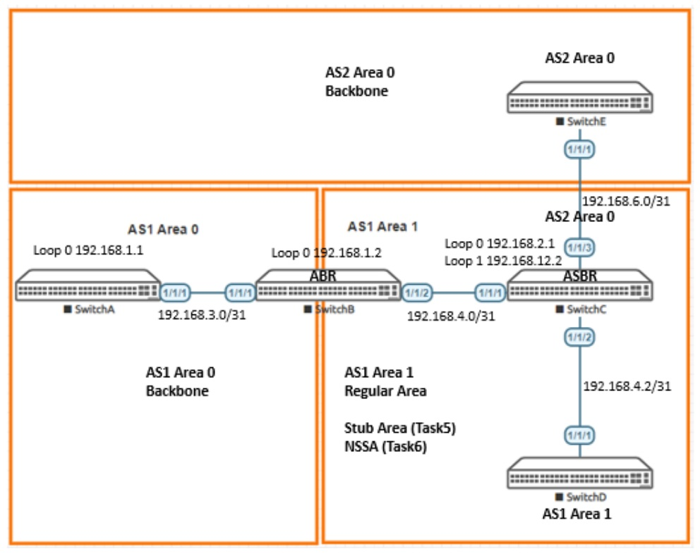

# Deploying OSPFv2 Areas

> **Panduan praktik berbahasa Indonesia**  
> Sumber: `AOS-CX Switch Simulator - OSPFv2 Areas Basics Lab Guide.pdf`  
> Tingkat: **Menengah — Multi-area OSPF dan Redistribution**

## 1. Tujuan pembelajaran

Modul ini melanjutkan OSPF dasar dengan topik:

- Area 0 dan Area 1;
- ABR dan ASBR;
- route intra-area, inter-area, E1, dan E2;
- OSPF cost dan reference bandwidth;
- dua proses OSPF serta redistribution;
- stub area dan totally stubby behavior (`no-summary`);
- NSSA.

## 2. Topologi



### Alamat utama

| Perangkat | Loopback0 | Link |
|---|---|---|
| SwitchA | `192.168.1.1/32` | A–B: `192.168.3.0/31` |
| SwitchB | `192.168.1.2/32` | B–C: `192.168.4.0/31` |
| SwitchC | `192.168.2.1/32` | C–D: `192.168.4.2/31`; C–E: `192.168.6.0/31` |
| SwitchD | `192.168.2.2/32` | D side: `192.168.4.3/31` |
| SwitchE | `192.168.12.1/32` | E side: `192.168.6.1/31` |

SwitchC juga memakai Loopback1 `192.168.12.2/32` sebagai router ID OSPF process 2.

### Struktur area awal

```text
SwitchA ── Area 0 ── SwitchB ── Area 1 ── SwitchC ── Area 1 ── SwitchD
                         ↑
                        ABR
```

Kemudian SwitchC menghubungkan process 1 dengan process 2 menuju SwitchE dan berperan sebagai ASBR.

## 3. Istilah penting

| Istilah | Penjelasan |
|---|---|
| **Intra-area (`i`)** | Route berasal dari area yang sama. |
| **Inter-area (`I`)** | Route berasal dari area lain melalui ABR. |
| **ABR** | Router dengan interface pada Area 0 dan area non-backbone. |
| **ASBR** | Router yang memasukkan route dari domain/proses routing lain. |
| **E1** | External metric ditambah internal cost menuju ASBR. |
| **E2** | Hanya external metric yang dominan; internal cost tidak ditambahkan pada metrik eksternal. |
| **Stub area** | Menolak external LSA dan menggunakan default route dari ABR. |
| **NSSA** | Area mirip stub tetapi masih dapat menerima external route dari ASBR di dalam area. |

## 4. Tahap 1 — Membuat loopback

```text
# SwitchA
interface loopback 0
 ip address 192.168.1.1/32

# SwitchB
interface loopback 0
 ip address 192.168.1.2/32

# SwitchC
interface loopback 0
 ip address 192.168.2.1/32

# SwitchD
interface loopback 0
 ip address 192.168.2.2/32

# SwitchE
interface loopback 0
 ip address 192.168.12.1/32
```

## 5. Tahap 2 — Membangun Area 0 dan Area 1

### SwitchA — hanya Area 0

```text
router ospf 1
 router-id 192.168.1.1
 area 0.0.0.0
interface 1/1/1
 ip address 192.168.3.0/31
 ip ospf 1 area 0.0.0.0
 ip ospf network point-to-point
interface loopback 0
 ip ospf 1 area 0.0.0.0
```

### SwitchB — ABR Area 0 dan Area 1

```text
router ospf 1
 router-id 192.168.1.2
 area 0.0.0.0
 area 0.0.0.1
interface 1/1/1
 ip address 192.168.3.1/31
 ip ospf 1 area 0.0.0.0
 ip ospf network point-to-point
interface 1/1/2
 ip address 192.168.4.0/31
 ip ospf 1 area 0.0.0.1
 ip ospf network point-to-point
interface loopback 0
 ip ospf 1 area 0.0.0.0
```

### SwitchC — Area 1

```text
router ospf 1
 router-id 192.168.2.1
 area 0.0.0.1
interface 1/1/1
 ip address 192.168.4.1/31
 ip ospf 1 area 0.0.0.1
 ip ospf network point-to-point
interface 1/1/2
 ip address 192.168.4.2/31
 ip ospf 1 area 0.0.0.1
 ip ospf network point-to-point
interface loopback 0
 ip ospf 1 area 0.0.0.1
```

### SwitchD — Area 1

```text
router ospf 1
 router-id 192.168.2.2
 area 0.0.0.1
interface 1/1/1
 ip address 192.168.4.3/31
 ip ospf 1 area 0.0.0.1
 ip ospf network point-to-point
interface loopback 0
 ip ospf 1 area 0.0.0.1
```

## 6. Validasi multi-area

```text
show ip ospf neighbors
show ip ospf route
```

Yang perlu dipahami:

- SwitchA melihat jaringan Area 1 sebagai `I` — inter-area.
- SwitchB adalah ABR, sehingga route Area 0 dan Area 1 terlihat sebagai intra-area dari perspektif area tempat interface-nya berada.
- SwitchC melihat jaringan Area 0 sebagai inter-area.

Kode output:

```text
i  = Intra-area
I  = Inter-area
E1 = External Type 1
E2 = External Type 2
```

## 7. Memahami OSPF cost

Rumus umum:

```text
Cost = Reference bandwidth / Interface bandwidth
```

Periksa cost aktual:

```text
show ip ospf interface 1/1/1
```

Ubah reference bandwidth pada proses:

```text
router ospf 1
 reference-bandwidth <nilai-Mbps>
```

Atau paksa cost interface:

```text
interface 1/1/1
 ip ospf cost <1-65535>
```

Kembalikan ke otomatis:

```text
no ip ospf cost
```

> Gunakan reference bandwidth yang sama di seluruh domain agar perhitungan jalur konsisten.

## 8. Tahap 3 — Membuat OSPF process kedua

Tujuan tahap ini adalah menunjukkan bahwa process ID berbeda tidak otomatis saling bertukar route.

### SwitchC — process 2 menuju SwitchE

```text
interface loopback 1
 ip address 192.168.12.2/32

router ospf 2
 router-id 192.168.12.2
 area 0.0.0.0

interface loopback 1
 ip ospf 2 area 0.0.0.0

interface 1/1/3
 no shutdown
 ip address 192.168.6.0/31
 ip ospf 2 area 0.0.0.0
 ip ospf network point-to-point
```

### SwitchE

```text
router ospf 1
 router-id 192.168.12.1
 area 0.0.0.0

interface loopback 0
 ip ospf 1 area 0.0.0.0

interface 1/1/1
 no shutdown
 ip address 192.168.6.1/31
 ip ospf 1 area 0.0.0.0
 ip ospf network point-to-point
```

Validasi:

```text
show ip ospf neighbors
show ip ospf route
```

Pada SwitchC akan terlihat tabel untuk process 1 dan process 2. Sebelum redistribution:

- route process 2 tidak muncul pada process 1;
- route process 1 tidak muncul pada process 2.

Process ID bersifat lokal. Yang dimaksud dua domain pada lab adalah dua instance OSPF yang dipisahkan dan dihubungkan melalui redistribution.

## 9. Tahap 4 — Menjadikan SwitchC sebagai ASBR

Pada SwitchC:

```text
router ospf 1
 redistribute ospf 2

router ospf 2
 redistribute ospf 1
```

Validasi:

```text
show ip ospf route
show ip route ospf
```

Setelah redistribution:

- SwitchA/B dapat melihat jaringan di process 2 sebagai external route;
- SwitchE dapat melihat jaringan dari process 1 sebagai external route;
- default redistribution pada contoh menghasilkan E2.

### E1 vs E2

- **E1**: total metric mempertimbangkan external metric dan cost internal menuju ASBR.
- **E2**: external metric tetap dominan; cost internal hanya dipakai sebagai tie-breaker tertentu, tidak ditambahkan seperti E1.

## 10. Tahap 5 — Stub Area

Tujuan: Area 1 tidak menerima external route dan menggunakan default route dari ABR.

Agar fokus, shutdown link lanjutan dari SwitchC:

```text
interface 1/1/2
 shutdown
interface 1/1/3
 shutdown
```

Pada SwitchB:

```text
router ospf 1
 area 0.0.0.1 stub
```

Pada SwitchC:

```text
router ospf 1
 area 0.0.0.1 stub
```

Konfigurasi stub harus konsisten pada semua router dalam area tersebut. Validasi:

```text
show ip ospf neighbors
show ip ospf route
```

SwitchC akan menerima default route `0.0.0.0/0` dari ABR.

### Mengurangi summary route

Pada ABR SwitchB:

```text
router ospf 1
 area 0.0.0.1 stub no-summary
```

Hasil pada SwitchC menjadi lebih sederhana: route area lain digantikan oleh default route ditambah route intra-area lokal.

## 11. Tahap 6 — NSSA

NSSA digunakan ketika area ingin bersifat seperti stub tetapi memiliki ASBR internal yang memasukkan external route.

Pada SwitchB:

```text
router ospf 1
 no area 0.0.0.1 stub
 area 0.0.0.1 nssa no-summary
```

Pada SwitchC:

```text
interface 1/1/3
 no shutdown

router ospf 1
 no area 0.0.0.1 stub
 area 0.0.0.1 nssa
 redistribute ospf 2

router ospf 2
 redistribute ospf 1
```

Validasi:

```text
show ip ospf neighbors
show ip ospf route
```

Yang diharapkan:

- adjacency SwitchB–SwitchC kembali FULL;
- SwitchC tetap memperoleh default route dari ABR;
- external route dari process 2 dapat dimasukkan melalui NSSA;
- pada sisi lain route dapat terlihat sebagai E2 setelah diterjemahkan oleh ABR.

## 12. Perbandingan area

| Jenis area | Menerima inter-area | Menerima external Type 5 | Dapat memiliki ASBR internal | Default route dari ABR |
|---|---:|---:|---:|---:|
| Regular | Ya | Ya | Ya | Tidak otomatis |
| Stub | Ya | Tidak | Tidak | Ya |
| Stub `no-summary` | Tidak, diganti default | Tidak | Tidak | Ya |
| NSSA | Ya | Tidak langsung; memakai Type 7 internal | Ya | Tergantung konfigurasi |
| NSSA `no-summary` | Dibatasi | Type 7 internal | Ya | Ya |

## 13. Checklist keberhasilan

- [ ] SwitchB dikenali sebagai ABR.
- [ ] Route `i` dan `I` dapat dibedakan.
- [ ] Cost jalur dapat dijelaskan.
- [ ] Sebelum redistribution, route antarprocess terpisah.
- [ ] Setelah redistribution, external route muncul.
- [ ] Stub area menerima default route.
- [ ] `no-summary` menyederhanakan routing table.
- [ ] NSSA tetap dapat mengimpor external route dari SwitchC.

## 14. Troubleshooting

| Gejala | Penyebab umum |
|---|---|
| Neighbor Area 1 hilang setelah stub | Salah satu router belum dikonfigurasi `stub`. |
| Neighbor hilang setelah NSSA | Konfigurasi area tidak konsisten: satu stub, satu NSSA. |
| External route tidak muncul | `redistribute ospf` belum ada atau interface process 2 down. |
| Route salah kode | Periksa sumber route dan posisi router terhadap ABR/ASBR. |
| Cost tidak konsisten | Reference bandwidth berbeda antarrouter. |
| Ada route process lain sebelum redistribution | Periksa static/default/connected route; jangan menganggap semuanya berasal dari OSPF. |

## 15. Pertanyaan latihan

1. Mengapa Area 0 disebut backbone?
2. Apa yang menjadikan SwitchB sebagai ABR?
3. Mengapa process ID tidak harus sama antarneighbor?
4. Mengapa stub area tidak cocok bila di dalamnya terdapat ASBR?
5. Apa kelebihan NSSA dibanding stub biasa?
6. Kapan E1 lebih masuk akal dibanding E2?

## 16. Ringkasan perintah

```text
show ip ospf neighbors
show ip ospf route
show ip ospf interface <port>
router ospf 1
 area 0.0.0.1 stub
 area 0.0.0.1 stub no-summary
 area 0.0.0.1 nssa
 area 0.0.0.1 nssa no-summary
 redistribute ospf 2
```
