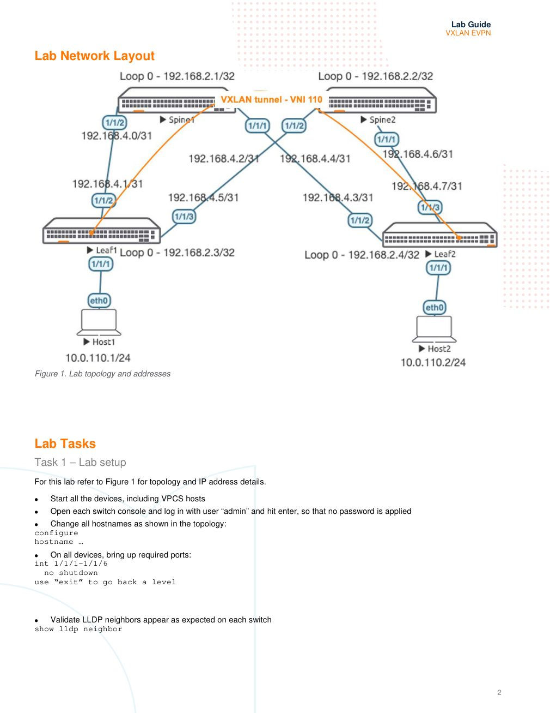

# VXLAN EVPN

> **Versi Markdown untuk belajar**  
> Sumber: `AOS-CX Switch Simulator - VXLAN EVPN Lab Guide.pdf`  
> Tingkat: **Lanjutan - VXLAN dengan BGP EVPN Control Plane**

## Cara menggunakan dokumen ini

1. Baca bagian **Ringkasan Belajar** dan **Konsep Inti** terlebih dahulu.
2. Buka gambar topologi dan tulis ulang alamat/interface pada catatan Anda.
3. Kerjakan lab mengikuti **Alur Praktik** tanpa langsung menyalin seluruh appendix.
4. Setelah setiap tahap, jalankan perintah pada **Validasi Keberhasilan**.
5. Gunakan bagian **Transkrip Lengkap PDF** ketika membutuhkan instruksi atau output asli.

## Ringkasan Belajar

Lab ini mengganti static VTEP peer dengan BGP EVPN. OSPF tetap menjadi underlay, spine bertindak sebagai iBGP EVPN route reflector, dan leaf menjadi VTEP serta route-reflector client.

## Konsep Inti

| Konsep | Arti dalam lab |
|---|---|
| **OSPF underlay** | Menyediakan reachability loopback untuk BGP dan tunnel VXLAN. |
| **BGP EVPN** | Control plane untuk mendistribusikan informasi endpoint dan membership VNI. |
| **Route reflector** | Spine memantulkan route EVPN sehingga leaf tidak memerlukan full-mesh. |
| **Route distinguisher** | Membuat route EVPN unik. |
| **Route target** | Mengatur proses import/export route EVPN. |
| **EVPN Type 2** | Route MAC/IP endpoint. |
| **EVPN Type 3** | Informasi inclusive multicast/replication untuk VNI. |

## Topologi Lab



> Gambar di atas merupakan halaman 2 dari PDF asli. Perbesar gambar ketika mencatat nomor interface, alamat IP, VLAN, atau hubungan antarperangkat.

## Alur Praktik yang Disarankan

1. Bangun OSPF underlay dan pastikan seluruh loopback reachable.
2. Konfigurasi iBGP AS 65001 menggunakan loopback sebagai neighbor source.
3. Pada spine, jadikan leaf sebagai route-reflector client pada address-family EVPN.
4. Pada leaf, aktifkan kedua spine sebagai neighbor EVPN.
5. Buat VLAN 110 dan konfigurasi EVPN RD/RT auto.
6. Buat VXLAN interface dan mapping VLAN 110 ke VNI 110 tanpa static VTEP peer.
7. Konfigurasi host dan uji konektivitas.
8. Validasi BGP EVPN table, MAC lokal/remote, dan VTEP peer yang dipelajari melalui EVPN.

## Perintah Utama

```text
# Spine sebagai Route Reflector
router bgp 65001
 bgp router-id 192.168.2.1
 neighbor 192.168.2.3 remote-as 65001
 neighbor 192.168.2.3 update-source loopback 0
 address-family l2vpn evpn
  neighbor 192.168.2.3 activate
  neighbor 192.168.2.3 route-reflector-client
  neighbor 192.168.2.3 send-community extended

# EVPN VLAN pada leaf
evpn
 vlan 110
  rd auto
  route-target export auto
  route-target import auto

# VXLAN pada leaf
interface vxlan 1
 source ip 192.168.2.3
 no shutdown
 vni 110
  vlan 110

show bgp l2vpn evpn summary
show bgp l2vpn evpn
show interface vxlan
show mac-address-table
show ip ospf neighbors
```

## Validasi Keberhasilan

- OSPF underlay sehat dan semua loopback dapat diping.
- Dua neighbor BGP EVPN pada setiap leaf berstatus `Established`.
- VXLAN peer remote muncul dengan origin `evpn`.
- EVPN table berisi route Type 2 dan Type 3 yang relevan.
- MAC remote muncul melalui VXLAN dan host dapat saling ping.

## Catatan Troubleshooting

- Pisahkan troubleshooting menjadi underlay, BGP EVPN control plane, lalu VXLAN data plane.
- Perintah `send-community extended` penting karena route target dibawa sebagai extended community.
- AOS-CX VM pada guide memiliki keterbatasan ECMP; hasil packet capture dapat hanya terlihat pada salah satu uplink.

## Metode Belajar Aktif

Setelah konfigurasi berhasil, ulangi lab dengan sengaja membuat satu kesalahan, misalnya interface masih shutdown, alamat IP salah, VLAN/VNI tidak sesuai, area OSPF berbeda, atau neighbor belum diaktifkan. Temukan penyebabnya hanya dengan perintah `show`, kemudian catat:

- gejala yang terlihat;
- perintah pemeriksaan yang digunakan;
- akar masalah;
- konfigurasi perbaikan;
- hasil validasi setelah perbaikan.

---

# Transkrip Lengkap PDF

Bagian berikut mempertahankan isi PDF asli per halaman dalam blok teks. Tata letak tabel dan output CLI dipertahankan sebisa mungkin agar mudah dibandingkan dengan dokumen sumber.

<details>
<summary><strong>Halaman 1</strong></summary>

```text
IMPORTANT! THIS GUIDE ASSUMES THAT THE AOS-CX OVA HAS BEEN INSTALLED AND WORKS IN GNS3 OR EVE-NG. PLEASE
REFER TO GNS3/EVE-NG INITIAL SETUP LABS IF REQUIRED.
https://www.eve-ng.net/index.php/documentation/howtos/howto-add-aruba-cx-switch/
TABLE OF CONTENTS
Lab Objective.............................................................................................................................................. 1
Lab Overview.............................................................................................................................................. 1
Lab Network Layout.................................................................................................................................... 2
Lab Tasks................................................................................................................................................... 2
Task 1 – Lab setup ..................................................................................................................................... 2
Task 2 – Configure IP Underlay Interfaces.................................................................................................. 3
Task 3 – Configure IP Underlay with EVPN ................................................................................................ 5
Task 4 – Configure Leaf Switches with VXLAN........................................................................................... 7
Task 5 – Configure Hosts (VPCS)............................................................................................................... 8
Task 6 – Final Validation............................................................................................................................. 8
Appendix – Complete Configurations........................................................................................................ 11
Lab Objective
This lab will enable the reader to gain hands on experience with L2 Virtual Extensible LAN (VXLAN) Ethernet VPN (EVPN).
Lab Overview
This lab as shown in Figure 1 will allow you to provide end hosts (Virtual PC Simulator - VPCS) on the same subnet with L2
overlay network connectivity across the VXLAN data plane tunnel created by EVPN control plane.
OSPF is used as the IP underlay Interior Gateway Protocol (IGP) to provide loopback connectivity for IBGP peering (AS#65001).
IBGP EVPN with Route Reflectors (RRs) are used in this example to prevent the need for full mesh IBGP peers.
VXLAN EVPN scales better compared to flood and learn static VXLAN and allows use cases such as distributed L3 anycast
gateways. Take note that L3 VXLAN does not currently work with AOS-CX VMs.
Spine1/Spine2 will function as IBGP EVPN RRs, while Leaf1/Leaf2 will function as IBGP EVPN RR clients.
VLAN 110 will be mapped to VXLAN Network Identifier (VNI) 110 to provide L2 overlay connectivity across the leaf switches.
```

</details>
<details>
<summary><strong>Halaman 2</strong></summary>

```text
Lab Network Layout
Figure 1. Lab topology and addresses
Lab Tasks
Task 1 – Lab setup
For this lab refer to Figure 1 for topology and IP address details.
• Start all the devices, including VPCS hosts
• Open each switch console and log in with user “admin” and hit enter, so that no password is applied
• Change all hostnames as shown in the topology:
configure
hostname …
• On all devices, bring up required ports:
int 1/1/1-1/1/6
no shutdown
use “exit” to go back a level
• Validate LLDP neighbors appear as expected on each switch
show lldp neighbor
```

</details>
<details>
<summary><strong>Halaman 3</strong></summary>

```text
Leaf1
Leaf1(config)# sh lld neighbor-info
LLDP Neighbor Information
=========================
Total Neighbor Entries : 2
Total Neighbor Entries Deleted : 0
Total Neighbor Entries Dropped : 0
Total Neighbor Entries Aged-Out : 0
LOCAL-PORT CHASSIS-ID PORT-ID PORT-DESC TTL SYS-NAME
------------------------------------------------------------------------------------------
1/1/2 08:00:09:8a:14:fa 1/1/2 1/1/2 120 Spine1
1/1/3 08:00:09:12:8e:9e 1/1/2 1/1/2 120 Spine2
Task 2 – Configure IP Underlay Interfaces
• Configure interfaces, IPs and required VLANs on the 4 switches
Leaf1
Leaf1(config)# int lo 0
Leaf1(config-loopback-if)# ip add 192.168.2.3/32
Leaf1(config-loopback-if)# ip ospf 1 area 0
OSPF process does not exist.
Do you want to create (y/n)? y
OSPF Area is not configured.
Do you want to create (y/n)? y
Leaf1(config-loopback-if)# router ospf 1
Leaf1(config-ospf-1)# router-id 192.168.2.3
Leaf1(config-ospf-1)# int 1/1/2
Leaf1(config-if)# ip add 192.168.4.1/31
Leaf1(config-if)# ip ospf 1 area 0
Leaf1(config-if)# ip ospf network point-to-point
Leaf1(config-if)# int 1/1/3
Leaf1(config-if)# ip add 192.168.4.5/31
Leaf1(config-if)# ip ospf 1 area 0
Leaf1(config-if)# ip ospf network point-to-point
Leaf2
Leaf2(config)# int lo 0
Leaf2(config-loopback-if)# ip add 192.168.2.4/32
Leaf2(config-loopback-if)# ip ospf 1 area 0
OSPF process does not exist.
Do you want to create (y/n)? y
OSPF Area is not configured.
Do you want to create (y/n)? y
Leaf2(config-loopback-if)# router ospf 1
Leaf2(config-ospf-1)# router-id 192.168.2.4
Leaf2(config-ospf-1)# int 1/1/2
Leaf2(config-if)# ip add 192.168.4.3/31
Leaf2(config-if)# ip ospf 1 area 0
Leaf2(config-if)# ip ospf network point-to-point
Leaf2(config-if)# int 1/1/3
Leaf2(config-if)# ip add 192.168.4.7/31
```

</details>
<details>
<summary><strong>Halaman 4</strong></summary>

```text
Leaf2(config-if)# ip ospf 1 area 0
Leaf2(config-if)# ip ospf network point-to-point
Spine1
Spine1(config)# int lo 0
Spine1(config-loopback-if)# ip add 192.168.2.1/32
Spine1(config-loopback-if)# ip ospf 1 area 0
OSPF process does not exist.
Do you want to create (y/n)? y
OSPF Area is not configured.
Do you want to create (y/n)? y
Spine1(config-loopback-if)# router ospf 1
Spine1(config-ospf-1)# router-id 192.168.2.1
Spine1(config-ospf-1)# int 1/1/2
Spine1(config-if)# ip add 192.168.4.0/31
Spine1(config-if)# ip ospf 1 area 0
Spine1(config-if)# ip ospf network point-to-point
Spine1(config-if)# int 1/1/1
Spine1(config-if)# ip add 192.168.4.2/31
Spine1(config-if)# ip ospf 1 area 0
Spine1(config-if)# ip ospf network point-to-point
Spine2
Spine2(config)# int lo 0
Spine2(config-loopback-if)# ip add 192.168.2.2/32
Spine2(config-loopback-if)# ip ospf 1 area 0
OSPF process does not exist.
Do you want to create (y/n)? y
OSPF Area is not configured.
Do you want to create (y/n)? y
Spine2(config-loopback-if)# router ospf 1
Spine2(config-ospf-1)# router-id 192.168.2.2
Spine2(config-ospf-1)# int 1/1/2
Spine2(config-if)# ip add 192.168.4.4/31
Spine2(config-if)# ip ospf 1 area 0
Spine2(config-if)# ip ospf network point-to-point
Spine2(config-if)# int 1/1/1
Spine2(config-if)# ip add 192.168.4.6/31
Spine2(config-if)# ip ospf 1 area 0
Spine2(config-if)# ip ospf network point-to-point
• Verify OSPF neighbors appear as expected between the switches
Leaf1(config)# sh ip os neighbors
OSPF Process ID 1 VRF default
==============================
Total Number of Neighbors: 2
Neighbor ID Priority State Nbr Address Interface
-------------------------------------------------------------------------
192.168.2.1 n/a FULL 192.168.4.0 1/1/2
192.168.2.2 n/a FULL 192.168.4.4 1/1/3
```

</details>
<details>
<summary><strong>Halaman 5</strong></summary>

```text
• Verify OSPF routes are learnt as expected, you should see ECMP routes towards Lo0 of the other leaf, this is supposed to
allow VXLAN traffic to be load shared across the ECMP routes (this works with real hardware, however AOS-CX VMs do not
currently support ECMP)
Leaf1(config)# sh ip ro ospf
Displaying ipv4 routes selected for forwarding
'[x/y]' denotes [distance/metric]
192.168.2.1/32, vrf default
via 192.168.4.0, [110/100], ospf
192.168.2.2/32, vrf default
via 192.168.4.4, [110/100], ospf
192.168.2.4/32, vrf default ECMP to Leaf2 Lo0
via 192.168.4.4, [110/200], ospf
via 192.168.4.0, [110/200], ospf
192.168.4.2/31, vrf default
via 192.168.4.0, [110/200], ospf
192.168.4.6/31, vrf default
via 192.168.4.4, [110/200], ospf
Task 3 – Configure IP Underlay with EVPN
• On spine switches, configure EVPN Route Reflectors (RR) towards the leaf switches (RR clients) using leaf loopback IPs as
neighbors
Spine1
Spine1(config)# router bgp 65001
Spine1(config-bgp)# bgp router-id 192.168.2.1
Spine1(config-bgp)# neighbor 192.168.2.3 remote-as 65001
Spine1(config-bgp)# neighbor 192.168.2.3 update-source loopback 0
Spine1(config-bgp)# neighbor 192.168.2.4 remote-as 65001
Spine1(config-bgp)# neighbor 192.168.2.4 update-source loopback 0
Spine1(config-bgp)# address-family l2vpn evpn
Spine1(config-bgp-l2vpn-evpn)# neighbor 192.168.2.3 activate
Spine1(config-bgp-l2vpn-evpn)# neighbor 192.168.2.3 route-reflector-client
BGP Session with this peer will be restarted
Spine1(config-bgp-l2vpn-evpn)# neighbor 192.168.2.3 send-community extended
Spine1(config-bgp-l2vpn-evpn)# neighbor 192.168.2.4 activate
Spine1(config-bgp-l2vpn-evpn)# neighbor 192.168.2.4 route-reflector-client
BGP Session with this peer will be restarted
Spine1(config-bgp-l2vpn-evpn)# neighbor 192.168.2.4 send-community extended
Spine2
Spine2(config-if)# router bgp 65001
Spine2(config-bgp)# bgp router-id 192.168.2.2
Spine2(config-bgp)# neighbor 192.168.2.3 remote-as 65001
Spine2(config-bgp)# neighbor 192.168.2.3 update-source loopback 0
Spine2(config-bgp)# neighbor 192.168.2.4 remote-as 65001
Spine2(config-bgp)# neighbor 192.168.2.4 update-source loopback 0
Spine2(config-bgp)# address-family l2vpn evpn
Spine2(config-bgp-l2vpn-evpn)# neighbor 192.168.2.3 activate
Spine2(config-bgp-l2vpn-evpn)# neighbor 192.168.2.3 route-reflector-client
BGP Session with this peer will be restarted
Spine2(config-bgp-l2vpn-evpn)# neighbor 192.168.2.3 send-community extended
Spine2(config-bgp-l2vpn-evpn)# neighbor 192.168.2.4 activate
```

</details>
<details>
<summary><strong>Halaman 6</strong></summary>

```text
Spine2(config-bgp-l2vpn-evpn)# neighbor 192.168.2.4 route-reflector-client
BGP Session with this peer will be restarted
Spine2(config-bgp-l2vpn-evpn)# neighbor 192.168.2.4 send-community extended
Leaf1
Leaf1(config)# router bgp 65001
Leaf1(config-bgp)# bgp router-id 192.168.2.3
Leaf1(config-bgp)# neighbor 192.168.2.1 remote-as 65001
Leaf1(config-bgp)# neighbor 192.168.2.1 update-source loopback 0
Leaf1(config-bgp)# neighbor 192.168.2.2 remote-as 65001
Leaf1(config-bgp)# neighbor 192.168.2.2 update-source loopback 0
Leaf1(config-bgp)# address-family l2vpn evpn
Leaf1(config-bgp-l2vpn-evpn)# neighbor 192.168.2.1 activate
Leaf1(config-bgp-l2vpn-evpn)# neighbor 192.168.2.1 send-community extended
Leaf1(config-bgp-l2vpn-evpn)# neighbor 192.168.2.2 activate
Leaf1(config-bgp-l2vpn-evpn)# neighbor 192.168.2.2 send-community extended
Leaf2
Leaf2(config-if)# router bgp 65001
Leaf2(config-bgp)# bgp router-id 192.168.2.4
Leaf2(config-bgp)# neighbor 192.168.2.1 remote-as 65001
Leaf2(config-bgp)# neighbor 192.168.2.1 update-source loopback 0
Leaf2(config-bgp)# neighbor 192.168.2.2 remote-as 65001
Leaf2(config-bgp)# neighbor 192.168.2.2 update-source loopback 0
Leaf2(config-bgp)# address-family l2vpn evpn
Leaf2(config-bgp-l2vpn-evpn)# neighbor 192.168.2.1 activate
Leaf2(config-bgp-l2vpn-evpn)# neighbor 192.168.2.1 send-community extended
Leaf2(config-bgp-l2vpn-evpn)# neighbor 192.168.2.2 activate
Leaf2(config-bgp-l2vpn-evpn)# neighbor 192.168.2.2 send-community extended
• Validate EVPN neighbors are up on the leaf switches
Leaf1(config)# show bgp l2vpn evpn summary
VRF : default
BGP Summary
-----------
Local AS : 65001 BGP Router Identifier : 192.168.2.3
Peers : 2 Log Neighbor Changes : No
Cfg. Hold Time : 180 Cfg. Keep Alive : 60
Neighbor Remote-AS MsgRcvd MsgSent Up/Down Time State AdminStatus
192.168.2.1 65001 5 5 00h:01m:59s Established Up
192.168.2.2 65001 5 5 00h:01m:59s Established Up
• On leaf switches, configure the desired VLAN to be VXLAN encapsulated, this VLAN will be enabled towards Host1, Host2.
Specify the same vlan under evpn.
• RD and route-target can be left as auto for IBGP EVPN, these are advertised to other devices via “send-community
extended” configured previously
Leaf1
Leaf1(config)# vlan 110
Leaf1(config-vlan-110)#
Leaf1(config-vlan-110)# evpn
Leaf1(config-evpn)# vlan 110
Leaf1(config-evpn-vlan-110)# rd auto
```

</details>
<details>
<summary><strong>Halaman 7</strong></summary>

```text
Leaf1(config-evpn-vlan-110)# route-target export auto
Leaf1(config-evpn-vlan-110)# route-target import auto
Leaf2
Leaf2(config)# vlan 110
Leaf2(config-vlan-110)#
Leaf2(config-vlan-110)# evpn
Leaf2(config-evpn)# vlan 110
Leaf2(config-evpn-vlan-110)# rd auto
Leaf2(config-evpn-vlan-110)# route-target export auto
Leaf2(config-evpn-vlan-110)# route-target import auto
Task 4 – Configure Leaf Switches with VXLAN
• On both leaf switches, configure the desired VLAN to be VXLAN encapsulated on the ports towards Host1, Host2
Leaf1
Leaf1(config)# int 1/1/1
Leaf1(config-if)# no routing
Leaf1(config-if)# vlan access 110
Leaf2
Leaf2(config)# int 1/1/1
Leaf2(config-if)# no routing
Leaf2(config-if)# vlan access 110
• Configure the VXLAN interface, the source IP based on Lo0 and the desired VLAN to VXLAN Network Identifier (VNI)
mapping
Leaf1
Leaf1(config)# interface vxlan 1
Leaf1(config-vxlan-if)# source ip 192.168.2.3
Leaf1(config-vxlan-if)# no shutdown
Leaf1(config-vxlan-if)# vni 110
Leaf1(config-vni-110)# vlan 110
Leaf2
Leaf2(config)# interface vxlan 1
Leaf2(config-vxlan-if)# source ip 192.168.2.4
Leaf2(config-vxlan-if)# no shutdown
Leaf2(config-vxlan-if)# vni 110
Leaf2(config-vni-110)# vlan 110
• Validate the VXLAN interface is up with correct source, destination VTEP peer IPs via EVPN and VNI/VLAN mapping.
Leaf1(config)# sh int vxlan
Interface vxlan1 is up
Admin state is up
Description:
Underlay VRF: default
Destination UDP port: 4789
VTEP source IPv4 address: 192.168.2.3
VNI VLAN VTEP Peers Origin
---------- ------ ----------------- --------
```

</details>
<details>
<summary><strong>Halaman 8</strong></summary>

```text
110 110 192.168.2.4 evpn
• The leafs automatically create a VXLAN tunnel between them as they are both interested in the same VNI
• If wireshark is available https://www.eve-ng.net/index.php/features-compare/
• Setup and start wireshark packet captures
o right click on a leaf switch -> Capture -> 1/1/2 -> Ethernet
o also right click on the same switch, other uplink -> Capture -> 1/1/3 -> Ethernet
• Only 1 link might show the desired packet captures as ECMP is not supported on the AOS-CX VMs
Task 5 – Configure Hosts (VPCS)
• Configure Host1, Host2 with the desired IP and default gateway (the default gateway doesn’t exist on the network as L2
VXLAN is used but is a required config in VPCS, so we assume a .254 as the default gateway)
Host1
ip 10.0.110.1/24 10.0.110.254
Host2
ip 10.0.110.2/24 10.0.110.254
Task 6 – Final Validation
• Ensure L2 connectivity works between hosts
VPCS> ping 10.0.110.2
84 bytes from 10.0.110.2 icmp_seq=1 ttl=64 time=1.787 ms
84 bytes from 10.0.110.2 icmp_seq=2 ttl=64 time=3.202 ms
84 bytes from 10.0.110.2 icmp_seq=3 ttl=64 time=3.999 ms
84 bytes from 10.0.110.2 icmp_seq=4 ttl=64 time=3.055 ms
84 bytes from 10.0.110.2 icmp_seq=5 ttl=64 time=3.375 ms
• Validate local and remote MACs are seen on the leaf switches as expected
Leaf1# sh mac-address-table
MAC age-time : 300 seconds
Number of MAC addresses : 2
MAC Address VLAN Type Port
--------------------------------------------------------------
00:50:79:66:68:05 110 dynamic 1/1/1
00:50:79:66:68:07 110 evpn vxlan1(192.168.2.4)
```

</details>
<details>
<summary><strong>Halaman 9</strong></summary>

```text
• Validate local and remote MACs are also seen in the EVPN table
Leaf1# sh bgp l2vpn evpn
Status codes: s suppressed, d damped, h history, * valid, > best, = multipath,
i internal, e external S Stale, R Removed
Origin codes: i - IGP, e - EGP, ? - incomplete
EVPN Route-Type 2 prefix: [2]:[ESI]:[EthTag]:[MAC]:[OrigIP]
EVPN Route-Type 3 prefix: [3]:[EthTag]:[OrigIP]
VRF : default
Local Router-ID 192.168.2.3
Network Nexthop Metric LocPrf Weight
Path
-----------------------------------------------------------------------------------------------------------
-
Route Distinguisher: 192.168.2.3:110 (L2VNI 110)
*> [2]:[0]:[0]:[00:50:79:66:68:05]:[] 192.168.2.3 0 100 0 ?
*> [3]:[0]:[192.168.2.3] 192.168.2.3 0 100 0 ?
Route Distinguisher: 192.168.2.4:110 (L2VNI 110)
*>i [2]:[0]:[0]:[00:50:79:66:68:07]:[] 192.168.2.4 0 100 0 ?
* i [2]:[0]:[0]:[00:50:79:66:68:07]:[] 192.168.2.4 0 100 0 ?
*>i [3]:[0]:[192.168.2.4] 192.168.2.4 0 100 0 ?
* i [3]:[0]:[192.168.2.4] 192.168.2.4 0 100 0 ?
Total number of entries 6
• Validate VXLAN traffic is seen in the wireshark capture
• Validate EVPN mac address advertisements
```

</details>
<details>
<summary><strong>Halaman 11</strong></summary>

```text
Appendix – Complete Configurations
• If you face issues during your lab, you can verify your configs with the configs listed in this section
• If configs are the same, try powering off/powering on the switches to reboot them
Host1
VPCS> show ip
NAME : VPCS[1]
IP/MASK : 10.0.110.1/24
GATEWAY : 10.0.110.254
DNS :
MAC : 00:50:79:66:68:05
LPORT : 20000
RHOST:PORT : 127.0.0.1:30000
MTU : 1500
Host2
VPCS> show ip
NAME : VPCS[1]
IP/MASK : 10.0.110.2/24
GATEWAY : 10.0.110.254
DNS :
MAC : 00:50:79:66:68:07
LPORT : 20000
RHOST:PORT : 127.0.0.1:30000
MTU : 1500
Leaf1
Leaf1# sh run
Current configuration:
!
!Version ArubaOS-CX Virtual.10.05.0001
!export-password: default
hostname Leaf1
user admin group administrators password ciphertext
AQBapVMU52p/ytCYietVZGUk6tIqYw4Q6Akwu3365UgNKfHpYgAAADiRDONY/h2CBMH3N7BMvRRQl+cqX6RfeBJpVlnE4Fy
hoWrLRp7YL1hG4UUpF4eJxnNbkt00CM/6ZyxB
ZEC61b3HA1m04o3wLSbsWFvH9r83X+Tgd1xX3lsD0tOEKwfSPD6X
led locator on
!
!
!
!
ssh server vrf mgmt
vlan 1,110
evpn
vlan 110
rd auto
route-target export auto
route-target import auto
interface mgmt
no shutdown
ip dhcp
```

</details>
<details>
<summary><strong>Halaman 12</strong></summary>

```text
interface 1/1/1
no shutdown
no routing
vlan access 110
interface 1/1/2
no shutdown
ip address 192.168.4.1/31
ip ospf 1 area 0.0.0.0
ip ospf network point-to-point
interface 1/1/3
no shutdown
ip address 192.168.4.5/31
ip ospf 1 area 0.0.0.0
ip ospf network point-to-point
interface 1/1/4
no shutdown
interface 1/1/5
no shutdown
interface 1/1/6
no shutdown
interface loopback 0
ip address 192.168.2.3/32
ip ospf 1 area 0.0.0.0
interface vxlan 1
source ip 192.168.2.3
no shutdown
vni 110
vlan 110
!
!
!
!
!
router ospf 1
router-id 192.168.2.3
area 0.0.0.0
router bgp 65001
bgp router-id 192.168.2.3
neighbor 192.168.2.1 remote-as 65001
neighbor 192.168.2.1 update-source loopback 0
neighbor 192.168.2.2 remote-as 65001
neighbor 192.168.2.2 update-source loopback 0
address-family l2vpn evpn
neighbor 192.168.2.1 activate
neighbor 192.168.2.1 send-community extended
neighbor 192.168.2.2 activate
neighbor 192.168.2.2 send-community extended
exit-address-family
!
https-server vrf mgmt
Leaf2
Leaf2# sh run
Current configuration:
!
!Version ArubaOS-CX Virtual.10.05.0001
!export-password: default
hostname Leaf2
user admin group administrators password ciphertext
AQBapatyqH0CftWF1n1MVl85TAbO9WDzCOquKut5MUry1/WkYgAAAFzxzdzLlkrDdw4XJpYgRjJEdVBzF3kg1JX6pqIm3dY
pLNRx2UaegUlKCLtL+eqqYKdmJizE/p0B1YkL
1PhYYLfX9riBS72YQdgzy/TWyK4KsoMBo0KOyA8HAwwl60LydmEK
```

</details>
<details>
<summary><strong>Halaman 13</strong></summary>

```text
led locator on
!
!
!
!
ssh server vrf mgmt
vlan 1,110
evpn
vlan 110
rd auto
route-target export auto
route-target import auto
interface mgmt
no shutdown
ip dhcp
interface 1/1/1
no shutdown
no routing
vlan access 110
interface 1/1/2
no shutdown
ip address 192.168.4.3/31
ip ospf 1 area 0.0.0.0
ip ospf network point-to-point
interface 1/1/3
no shutdown
ip address 192.168.4.7/31
ip ospf 1 area 0.0.0.0
ip ospf network point-to-point
interface 1/1/4
no shutdown
interface 1/1/5
no shutdown
interface 1/1/6
no shutdown
interface loopback 0
ip address 192.168.2.4/32
ip ospf 1 area 0.0.0.0
interface vxlan 1
source ip 192.168.2.4
no shutdown
vni 110
vlan 110
!
!
!
!
!
router ospf 1
router-id 192.168.2.4
area 0.0.0.0
router bgp 65001
bgp router-id 192.168.2.4
neighbor 192.168.2.1 remote-as 65001
neighbor 192.168.2.1 update-source loopback 0
neighbor 192.168.2.2 remote-as 65001
neighbor 192.168.2.2 update-source loopback 0
address-family l2vpn evpn
neighbor 192.168.2.1 activate
neighbor 192.168.2.1 send-community extended
neighbor 192.168.2.2 activate
neighbor 192.168.2.2 send-community extended
exit-address-family
!
https-server vrf mgmt
```

</details>
<details>
<summary><strong>Halaman 14</strong></summary>

```text
Spine1
Spine1# sh run
Current configuration:
!
!Version ArubaOS-CX Virtual.10.05.0001
!export-password: default
hostname Spine1
user admin group administrators password ciphertext
AQBapQmyufe7KU4F+7y0XkwIsvuwwy+1zBXxDKhnrN99muFCYgAAAMBAMUs8+7DMHMpSf5hWbuXPGW6AsSiV8gCMUVUvo0m
waV1h6lv8JKB784F5JpeRDhRZawQQwww8qWEb
75GleLUzv0KKWxfO68ZH/vyH4kS+mOlqBanG2FfUwLK3hlGp0WYX
led locator on
!
!
!
!
ssh server vrf mgmt
vlan 1
interface mgmt
no shutdown
ip dhcp
interface 1/1/1
no shutdown
ip address 192.168.4.2/31
ip ospf 1 area 0.0.0.0
ip ospf network point-to-point
interface 1/1/2
no shutdown
ip address 192.168.4.0/31
ip ospf 1 area 0.0.0.0
ip ospf network point-to-point
interface 1/1/3
no shutdown
interface 1/1/4
no shutdown
interface 1/1/5
no shutdown
interface 1/1/6
no shutdown
interface loopback 0
ip address 192.168.2.1/32
ip ospf 1 area 0.0.0.0
!
!
!
!
!
router ospf 1
router-id 192.168.2.1
area 0.0.0.0
router bgp 65001
bgp router-id 192.168.2.1
neighbor 192.168.2.3 remote-as 65001
neighbor 192.168.2.3 update-source loopback 0
neighbor 192.168.2.4 remote-as 65001
neighbor 192.168.2.4 update-source loopback 0
address-family l2vpn evpn
neighbor 192.168.2.3 activate
neighbor 192.168.2.3 route-reflector-client
neighbor 192.168.2.3 send-community extended
neighbor 192.168.2.4 activate
neighbor 192.168.2.4 route-reflector-client
neighbor 192.168.2.4 send-community extended
```

</details>
<details>
<summary><strong>Halaman 15</strong></summary>

```text
exit-address-family
!
https-server vrf mgmt
Spine2
Spine2# sh run
Current configuration:
!
!Version ArubaOS-CX Virtual.10.05.0001
!export-password: default
hostname Spine2
user admin group administrators password ciphertext
AQBapQO37UTF26BBmzKTurSE0YYNBHnts3ccme3ZAtefD8lYYgAAAH904CccOVwhGS7zXBrJxrsC0EO5vND88i3JRpKdxDt
Eih6QtPpA23znBp11RH/J72YHm/iLDSHs0gWO
xadHnIwj3DnT/324kjPE2fQCN7Z8H7S1reE6Wbd1Hc808Iw5o6aM
led locator on
!
!
!
!
ssh server vrf mgmt
vlan 1
interface mgmt
no shutdown
ip dhcp
interface 1/1/1
no shutdown
ip address 192.168.4.6/31
ip ospf 1 area 0.0.0.0
ip ospf network point-to-point
interface 1/1/2
no shutdown
ip address 192.168.4.4/31
ip ospf 1 area 0.0.0.0
ip ospf network point-to-point
interface 1/1/3
no shutdown
interface 1/1/4
no shutdown
interface 1/1/5
no shutdown
interface 1/1/6
no shutdown
interface loopback 0
ip address 192.168.2.2/32
ip ospf 1 area 0.0.0.0
!
!
!
!
!
router ospf 1
router-id 192.168.2.2
area 0.0.0.0
router bgp 65001
bgp router-id 192.168.2.2
area 0.0.0.0
router bgp 65001
bgp router-id 192.168.2.2
neighbor 192.168.2.3 remote-as 65001
neighbor 192.168.2.3 update-source loopback 0
neighbor 192.168.2.4 remote-as 65001
```

</details>
<details>
<summary><strong>Halaman 16</strong></summary>

```text
neighbor 192.168.2.4 update-source loopback 0
address-family l2vpn evpn
neighbor 192.168.2.3 activate
neighbor 192.168.2.3 route-reflector-client
neighbor 192.168.2.3 send-community extended
neighbor 192.168.2.4 activate
neighbor 192.168.2.4 route-reflector-client
neighbor 192.168.2.4 send-community extended
exit-address-family
!
https-server vrf mgmt
```

</details>
<details>
<summary><strong>Halaman 17</strong></summary>

```text
www.arubanetworks.com
3333 Scott Blvd. Santa Clara, CA 95054
1.844.472.2782 | T: 1.408.227.4500 | FAX: 1.408.227.4550 | info@arubanetworks.com
```

</details>
