# Panduan Belajar HPE Aruba Implementing Campus Access Fundamentals

> Panduan belajar berbahasa Indonesia berdasarkan materi **Day 1 sampai Day 5**, dilengkapi **visualisasi inti dari slide**, penjelasan cara membaca diagram, alur paket, contoh konfigurasi, verifikasi, dan latihan troubleshooting.

---

## Daftar Isi

1. [Peta Besar Materi Lima Hari](#peta-besar-materi-lima-hari)
2. [Day 1 - Aruba ESP, Campus Architecture, Aruba Central, VSX, dan OSPF](#day-1---aruba-esp-campus-architecture-aruba-central-vsx-dan-ospf)
3. [Day 2 - AOS 10 Gateway, Gateway Cluster, dan Tunnel WLAN](#day-2---aos-10-gateway-gateway-cluster-dan-tunnel-wlan)
4. [Day 3 - Secure Enterprise WLAN, RADIUS, Role, dan Guest Access](#day-3---secure-enterprise-wlan-radius-role-dan-guest-access)
5. [Day 4 - MPSK IoT, Mixed Mode, Wired Authentication, dan Dynamic Segmentation](#day-4---mpsk-iot-mixed-mode-wired-authentication-dan-dynamic-segmentation)
6. [Day 5 - VXLAN, GBP, Security, QoS, dan Monitoring](#day-5---vxlan-gbp-security-qos-dan-monitoring)
7. [Cheat Sheet Perintah Penting](#cheat-sheet-perintah-penting)
8. [Troubleshooting Berdasarkan Gejala](#troubleshooting-berdasarkan-gejala)
9. [Glosarium](#glosarium)
10. [Rencana Belajar dan Latihan](#rencana-belajar-dan-latihan)

---

# Peta Besar Materi Lima Hari

| Hari | Fokus Utama | Pertanyaan yang Harus Bisa Dijawab |
|---|---|---|
| Day 1 | Arsitektur kampus, Aruba ESP/Central, VSX, OSPF | Bagaimana membangun fondasi wired yang redundan dan terkelola? |
| Day 2 | Gateway, cluster, tunneled WLAN | Bagaimana AP mengirim kontrol dan data ke gateway serta melakukan failover? |
| Day 3 | 802.1X, RADIUS, AAA, role, guest | Bagaimana identitas pengguna menentukan akses jaringan? |
| Day 4 | MPSK, mixed mode, wired access control | Bagaimana mengamankan IoT dan endpoint kabel yang kemampuan autentikasinya berbeda? |
| Day 5 | VXLAN/GBP, security, QoS, monitoring | Bagaimana melakukan segmentasi berbasis role pada fabric dan menjaga kualitas serta visibilitas jaringan? |

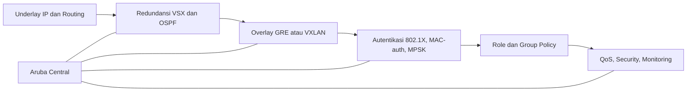
```mermaid
flowchart LR
    A[Underlay IP dan Routing] --> B[Redundansi VSX dan OSPF]
    B --> C[Overlay GRE atau VXLAN]
    C --> D[Autentikasi 802.1X, MAC-auth, MPSK]
    D --> E[Role dan Group Policy]
    E --> F[QoS, Security, Monitoring]
    G[Aruba Central] --- B
    G --- C
    G --- D
    G --- F
```

# Day 1 - Aruba ESP, Campus Architecture, Aruba Central, VSX, dan OSPF

**Referensi utama:** `Day - 1.pdf`, terutama halaman 13-95.

## 1. Tujuan Belajar Day 1

Setelah mempelajari bagian ini, Anda seharusnya mampu:

- menjelaskan Aruba ESP dan peran Aruba Central;
- membedakan arsitektur kampus two-tier dan three-tier;
- membedakan bridge, centralized overlay/UBT, dan distributed overlay/EVPN-VXLAN;
- menjelaskan perbedaan VSX dan VSF;
- mengenali komponen serta skenario kegagalan VSX;
- memahami OSPF single-area, multi-area, LSA, route aggregation, special area, dan BFD.

---

## 2. Aruba ESP: Gambaran Besar


#### Visualisasi Kunci - Aruba ESP Campus Network Architecture

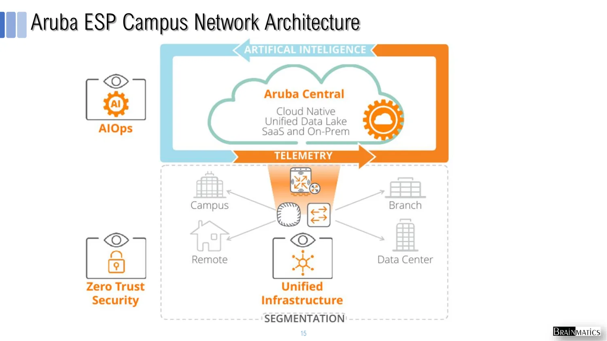

> **Sumber visual:** `Day - 1.pdf`, halaman 14.  
> **Cara membaca:** Aruba Central berada pada lapisan manajemen dan analitik. Perangkat kampus, branch, remote, dan data center mengirim telemetry ke Central; AIOps mengolah telemetry, sementara Zero Trust dan Unified Infrastructure menjadi prinsip desain. Jalur data pengguna tetap diproses oleh perangkat jaringan, bukan melewati Central.

**Aruba ESP** adalah arsitektur cloud-native yang menyatukan tiga pilar:

| Pilar | Fungsi |
|---|---|
| AIOps | Mengolah telemetry untuk mendeteksi masalah dan memberi rekomendasi. |
| Unified Infrastructure | Mengelola wired, wireless, gateway, branch, dan data center melalui kerangka yang konsisten. |
| Zero Trust Security | Menggunakan identitas, role, segmentasi, serta kebijakan least privilege. |

### Model sederhananya

- **Connectivity:** AP, switch, gateway, WAN, dan jaringan IP.
- **Policy:** identitas, role, segmentasi, dan enforcement.
- **Services:** provisioning, orchestration, analytics, assurance, dan management.
- **Aruba Central:** titik manajemen yang menerima telemetry dan mengirim konfigurasi.

> Ingat: **Central bukan jalur data pengguna**. Central mengelola dan mengorkestrasi; forwarding aktual tetap dilakukan perangkat jaringan.

---

## 3. Arsitektur Campus LAN

### 3.1 Two-Tier Campus

Lapisan yang digunakan:

1. **Access layer:** menghubungkan endpoint dan AP.
2. **Collapsed core:** menjalankan fungsi aggregation/distribution sekaligus core.

Cocok untuk:

- kampus kecil sampai menengah;
- jumlah gedung dan jalur uplink terbatas;
- kebutuhan operasional lebih sederhana.

Kelebihan:

- lebih sedikit perangkat;
- biaya dan kompleksitas lebih rendah;
- troubleshooting lebih mudah.

Keterbatasan:

- kapasitas dan skala lebih terbatas;
- perubahan pada collapsed core memiliki dampak lebih besar.

### 3.2 Three-Tier Campus


#### Visualisasi Kunci - Arsitektur Three-Tier Campus

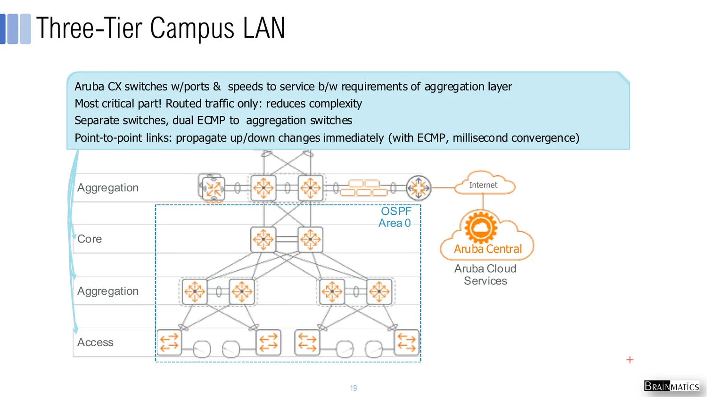

> **Sumber visual:** `Day - 1.pdf`, halaman 18.  
> **Cara membaca:** Baca dari bawah ke atas: access menghubungkan endpoint, aggregation menggabungkan dan membatasi domain kegagalan, sedangkan core menyediakan transport berkecepatan tinggi. Redundansi pada setiap lapisan mencegah satu perangkat atau satu link menjadi single point of failure.

Lapisan yang digunakan:

1. **Access**
2. **Aggregation/Distribution**
3. **Core**

Cocok untuk:

- kampus besar atau multi-gedung;
- membutuhkan kapasitas tinggi dan domain kegagalan yang lebih terkontrol;
- membutuhkan pertumbuhan jangka panjang.

### Cara memilih

| Kondisi | Pilihan Umum |
|---|---|
| Satu lokasi, skala tidak terlalu besar | Two-tier |
| Banyak gedung, traffic antarlokasi tinggi | Three-tier |
| Perlu domain routing dan fault isolation lebih jelas | Three-tier |
| Tim operasional kecil dan topologi sederhana | Two-tier |

---

## 4. Bridge, Tunnel, dan Overlay


#### Visualisasi Kunci - Centralized Overlay vs Distributed Overlay

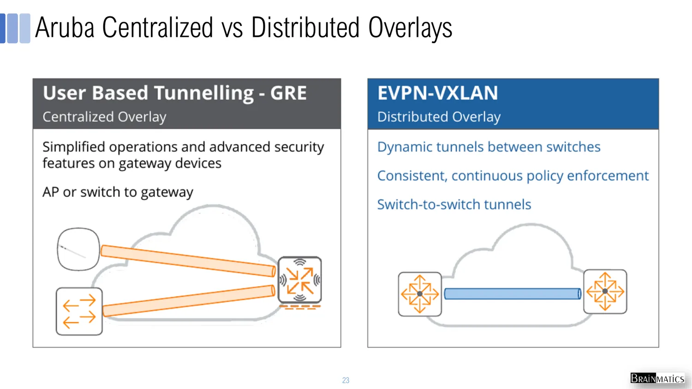

> **Sumber visual:** `Day - 1.pdf`, halaman 22.  
> **Cara membaca:** Pada UBT/GRE, traffic pengguna ditarik ke gateway sehingga enforcement terpusat. Pada EVPN-VXLAN, fungsi overlay dan enforcement tersebar pada switch fabric. Gunakan gambar ini untuk membedakan titik terminasi tunnel dan lokasi penerapan kebijakan.

### 4.1 Bridge Mode

Pada bridge mode, AP meneruskan traffic klien ke VLAN lokal pada switch.

**Konsekuensi desain:**

- VLAN pengguna harus tersedia pada port AP dan jalur switch terkait;
- broadcast domain dapat melebar;
- enforcement dapat dilakukan di AP atau switch, tetapi konfigurasi VLAN tersebar di jaringan wired.

### 4.2 Tunnel Mode

Pada tunnel mode, AP membangun tunnel menuju gateway. Traffic klien diteruskan ke gateway untuk diproses dan diberi kebijakan.

**Keuntungan:**

- VLAN pengguna tidak perlu dibawa ke seluruh access layer;
- policy lebih terpusat;
- roaming dan segmentasi lebih konsisten;
- gateway dapat menjadi titik enforcement dan layanan mobility.

### 4.3 Centralized Overlay: UBT/GRE

**User-Based Tunneling (UBT)** menggunakan GRE untuk mengirim traffic pengguna dari access switch menuju gateway.

Karakteristik:

- tunnel diarahkan ke gateway;
- role dan policy dapat diterapkan secara terpusat;
- sesuai saat organisasi ingin policy konsisten tanpa memperluas VLAN pengguna di seluruh kampus.

### 4.4 Distributed Overlay: EVPN-VXLAN

EVPN-VXLAN mendistribusikan fungsi overlay ke switch fabric.

Karakteristik:

- VXLAN memperpanjang segment Layer 2 di atas underlay Layer 3;
- MP-BGP EVPN mendistribusikan informasi endpoint dan tunnel;
- enforcement dapat dilakukan lebih dekat ke endpoint;
- lebih scalable daripada tunnel statis.

### Ringkasan Perbandingan

| Mode | Forwarding | Titik Kebijakan | Ketergantungan VLAN Fisik |
|---|---|---|---|
| Bridge | Lokal dari AP ke switch | AP/switch | Tinggi |
| Tunnel WLAN | AP ke gateway melalui GRE | Gateway/AP | Rendah |
| UBT | Switch ke gateway melalui GRE | Gateway | Rendah |
| EVPN-VXLAN | Antara VTEP pada fabric | Ingress/egress VTEP | Sangat rendah |

---

## 5. Aruba Central: Group, Site, dan Persona

### 5.1 Group

**Group** adalah kontainer konfigurasi. Perangkat dalam group menerima konfigurasi yang sama.

Contoh:

- `Branch-AP`
- `Campus-Switch`
- `Mobility-Gateway`

Jenis konfigurasi:

| Tingkat | Kegunaan |
|---|---|
| Group level | Konfigurasi umum untuk banyak perangkat. |
| Device level | Override khusus perangkat tertentu. |

> **Device-level configuration mengalahkan group-level configuration** untuk parameter yang sama.

### 5.2 Site

**Site** merepresentasikan lokasi fisik. Site terutama digunakan untuk:

- monitoring berdasarkan lokasi;
- filtering laporan dan alert;
- pengelompokan AP, switch, dan gateway pada gedung atau cabang yang sama.

### 5.3 Persona

Persona menentukan tipe dan kemampuan perangkat dalam group, misalnya:

- AP AOS 10 Campus/Branch;
- gateway Mobility, Branch, atau VPN Concentrator;
- switch UI group atau template group.

### 5.4 UI Group vs Template Group

| Tipe Group | Cara Konfigurasi | Cocok Untuk |
|---|---|---|
| UI group | Form dan menu grafis | Implementasi standar dan tim yang mengutamakan kemudahan. |
| Template group | Template CLI berbasis variabel | Konfigurasi kompleks, mass deployment, dan otomasi. |

---

## 6. VSX dan VSF

### 6.1 Perbedaan Inti

| Aspek | VSX | VSF |
|---|---|---|
| Control plane | Masing-masing switch tetap independen | Satu control plane logis |
| Data plane | Active-active | Satu stack logis |
| Umum digunakan | Aggregation/core | Access layer |
| Upgrade | Mendukung upgrade dengan dampak lebih rendah | Bergantung pada stack |
| Operasional | Dua perangkat dikelola sebagai pasangan | Beberapa switch seperti satu perangkat |

### 6.2 Mengapa VSX Penting

VSX memberikan:

- active-active Layer 2 dan Layer 3;
- multi-chassis LAG ke downstream atau upstream;
- control plane independen sehingga kegagalan satu switch tidak otomatis menjatuhkan pasangan;
- sinkronisasi konfigurasi tertentu;
- active gateway tanpa membutuhkan VRRP untuk default gateway klien.

### 6.3 Komponen VSX


#### Visualisasi Kunci - Komponen Utama VSX

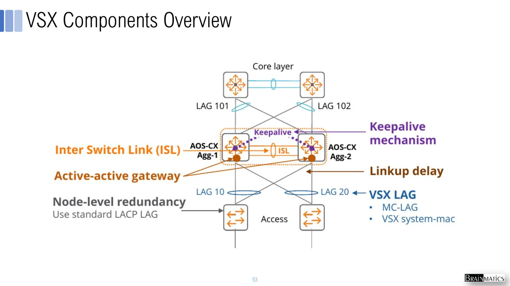

> **Sumber visual:** `Day - 1.pdf`, halaman 52.  
> **Cara membaca:** Dua switch tetap memiliki control plane masing-masing, tetapi berbagi keadaan tertentu melalui ISL. Keepalive dipakai untuk mendeteksi kondisi split-brain, sedangkan VSX LAG menghubungkan downstream secara aktif ke kedua peer.

| Komponen | Fungsi |
|---|---|
| ISL - Inter-Switch Link | Membawa sinkronisasi data plane dan state antarpasangan VSX. |
| Keepalive | Memastikan peer masih hidup ketika ISL bermasalah. |
| VSX LAG | LAG multi-chassis yang terlihat sebagai satu koneksi logis oleh perangkat downstream. |
| Active Gateway | Kedua switch aktif sebagai default gateway menggunakan virtual IP dan virtual MAC yang sama. |
| Configuration sync | Menyalin konfigurasi tertentu dari primary ke secondary. |
| Linkup delay | Menahan interface agar tidak terlalu cepat aktif setelah reboot sebelum state tersinkronisasi. |

### 6.4 ISL dan Keepalive

**ISL** sebaiknya:

- dibuat sebagai LAG;
- memiliki bandwidth dan redundansi memadai;
- membawa VLAN yang dibutuhkan pasangan VSX;
- tidak digunakan sebagai satu-satunya jalur keepalive.

**Keepalive** sebaiknya menggunakan jalur independen, misalnya:

- koneksi langsung;
- routed network terpisah;
- management/OOB network yang stabil.

### 6.5 Configuration Synchronization

Prinsip penting:

- `vsx-sync` dikonfigurasi pada **primary**;
- tidak semua konfigurasi disinkronkan;
- alamat IP, router ID, hostname, dan parameter unik biasanya tetap berbeda;
- konfigurasi overlap harus diperhatikan agar primary tidak menimpa konfigurasi unik pada secondary.

### 6.6 Active Gateway


#### Visualisasi Kunci - Active Gateway pada VSX

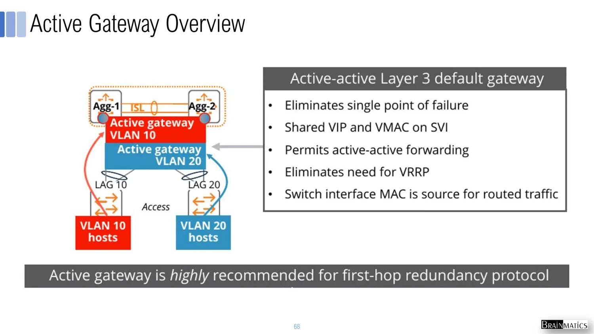

> **Sumber visual:** `Day - 1.pdf`, halaman 67.  
> **Cara membaca:** Kedua peer menyajikan default gateway virtual yang sama. Endpoint dapat mengirim traffic ke peer terdekat tanpa menunggu protokol first-hop redundancy memilih satu perangkat aktif. Konsep ini mempercepat forwarding sekaligus mempertahankan redundansi.

Active Gateway memungkinkan kedua switch VSX menjawab sebagai default gateway.

Keuntungan:

- tidak ada perangkat standby pasif;
- traffic klien dapat menggunakan kedua switch;
- tidak membutuhkan VRRP untuk first-hop redundancy;
- north-south traffic dapat menggunakan jalur lokal tanpa harus menyeberangi ISL pada kondisi normal.

### 6.7 Contoh Konfigurasi Dasar VSX

> Contoh berikut mengikuti pola pada materi. Sesuaikan nomor interface, VLAN, IP, dan system MAC dengan lab Anda.

```text
! 1. Membuat ISL LAG
interface lag 128
    no shutdown
    no routing
    vlan trunk native 1
    vlan trunk allowed 10,11,12
    lacp mode active

interface 1/4/28
    no shutdown
    lag 128

interface 1/4/32
    no shutdown
    lag 128

! 2. Interface keepalive
interface 1/1/5
    no shutdown
    ip address 192.168.100.1/24

! 3. Mengaktifkan VSX pada primary
vsx
    role primary
    system-mac 02:01:00:00:aa:bb
    inter-switch-link lag 128

! 4. Multi-chassis LAG ke perangkat downstream
interface lag 1 multi-chassis
    no shutdown
    no routing
    vlan trunk native 1
    vlan trunk allowed 11
    lacp mode active

interface 1/1/1
    no shutdown
    lag 1
```

Tambahkan konfigurasi keepalive peer sesuai desain dan alamat peer pada pasangan VSX.

### 6.8 Urutan Verifikasi VSX

1. Pastikan interface fisik ISL **up**.
2. Pastikan anggota LAG dan LACP terbentuk.
3. Pastikan role primary/secondary benar.
4. Pastikan keepalive reachable.
5. Pastikan ISL state normal.
6. Periksa konfigurasi yang disinkronkan.
7. Periksa VSX LAG pada kedua peer.
8. Uji active gateway dari sisi klien.
9. Cabut satu member ISL, lalu seluruh ISL, dan amati failover.

### 6.9 Skenario Kegagalan

| Kegagalan | Risiko | Respons yang Diharapkan |
|---|---|---|
| Salah satu member ISL putus | Kapasitas berkurang | ISL tetap aktif melalui member lain. |
| Seluruh ISL putus, keepalive hidup | Potensi split-brain | Sistem mendeteksi peer masih hidup dan membatasi forwarding tertentu pada secondary. |
| ISL dan keepalive putus | Split-brain | Kedua perangkat dapat menganggap peer gagal; desain OOB dan proteksi sangat penting. |
| Primary reboot | State belum sinkron | Linkup delay menahan interface sampai sinkronisasi selesai. |

---

## 7. OSPF

### 7.1 Konsep Dasar

OSPF adalah:

- Interior Gateway Protocol;
- link-state routing protocol;
- menggunakan SPF/Dijkstra;
- dibagi dalam area untuk skalabilitas;
- memilih jalur berdasarkan **cost**.

### 7.2 Urutan Implementasi OSPF

1. Buat proses OSPF.
2. Tentukan router ID, idealnya dari loopback.
3. Buat atau gunakan area.
4. Aktifkan OSPF pada interface Layer 3.
5. Sesuaikan network type, cost, authentication, dan BFD bila diperlukan.
6. Verifikasi neighbor, LSDB, dan routing table.

### 7.3 Network Type

| Tipe | Karakteristik | Catatan |
|---|---|---|
| Broadcast | Memilih DR dan BDR | Umum pada Ethernet multi-access. |
| Point-to-point | Tidak menggunakan DR/BDR | Baik untuk link yang hanya memiliki dua router. |
| Stub/non-broadcast lainnya | Digunakan pada skenario tertentu | Sesuaikan dengan desain media. |

> Pada link Ethernet yang hanya menghubungkan dua router, point-to-point dapat menyederhanakan adjacency dan menghindari pemilihan DR/BDR yang tidak diperlukan.

### 7.4 LSA yang Perlu Diingat

| Tipe LSA | Nama | Dibuat Oleh | Lingkup |
|---|---|---|---|
| 1 | Router LSA | Semua router | Dalam area |
| 2 | Network LSA | DR | Dalam area |
| 3 | Summary LSA | ABR | Antararea |
| 4 | ASBR Summary | ABR | Menunjukkan cara mencapai ASBR |
| 5 | AS External | ASBR | External route, kecuali area yang memblokirnya |
| 7 | NSSA External | ASBR dalam NSSA | Diterjemahkan ke Type 5 oleh ABR |
| 9/10/11 | Opaque LSA | Router OSPF | Ekstensi sesuai scope |

### 7.5 Single-Area vs Multi-Area


#### Visualisasi Kunci - Multi-Area OSPF untuk Skalabilitas

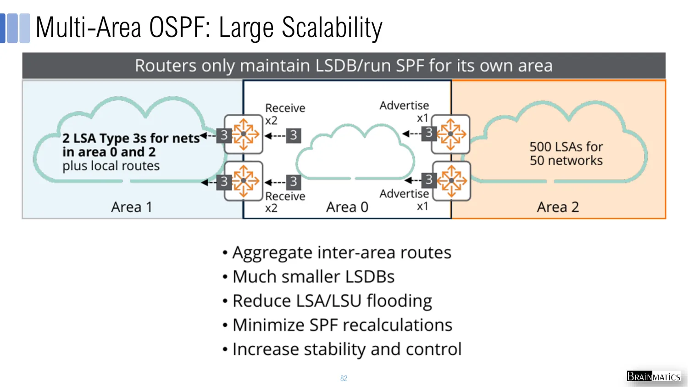

> **Sumber visual:** `Day - 1.pdf`, halaman 81.  
> **Cara membaca:** Area 0 menjadi backbone dan area lain terhubung melalui ABR. Pembagian area mengurangi ukuran LSDB dan ruang lingkup perhitungan SPF. Namun desain area harus tetap sederhana dan semua area non-backbone memerlukan konektivitas logis ke area 0.

**Single-area** mudah, tetapi pada jaringan besar:

- LSDB menjadi besar;
- flooding LSA meningkat;
- perhitungan SPF lebih berat;
- perubahan lokal dapat memengaruhi lebih banyak router.

**Multi-area** memberikan:

- LSDB lebih kecil;
- isolasi perubahan topologi;
- summarization antararea;
- skalabilitas lebih baik.

### 7.6 ABR dan ASBR

- **ABR:** memiliki interface di area 0 dan area lain, serta menghasilkan Type 3 LSA.
- **ASBR:** mengimpor route dari luar OSPF, lalu mengiklankannya sebagai external route.

### 7.7 Route Aggregation

Tujuan summarization:

- mengurangi jumlah route;
- menyederhanakan LSDB;
- menyembunyikan perubahan subnet individual;
- meningkatkan stabilitas.

Contoh konsep:

```text
Subnet area 2:
10.2.0.0/24
10.2.1.0/24
10.2.2.0/24
...

Diumumkan oleh ABR sebagai:
10.2.0.0/16
```

> Summarization harus dibuat pada batas area yang tepat dan tidak boleh mencakup alamat yang tidak benar-benar tersedia tanpa mempertimbangkan risiko blackhole.

### 7.8 Route Redistribution dan Route Map

Redistribution memasukkan route dari sumber lain ke OSPF. Gunakan route map untuk:

- memilih prefix tertentu;
- menentukan metric;
- menentukan external type;
- mencegah seluruh route eksternal masuk tanpa kontrol.

Contoh pola:

```text
ip prefix-list PL-NET10 seq 10 permit 172.16.0.0/16

route-map My_Option1_Map permit seq 10
    match ip address prefix-list PL-NET10

router ospf 1
    redistribute static route-map My_Option1_Map
```

### 7.9 Stub dan Totally Stubby Area

| Area | Type 3 | Type 5 | Default Route |
|---|---:|---:|---:|
| Normal | Ya | Ya | Tidak otomatis |
| Stub | Ya | Tidak | Disuntikkan ABR |
| Totally Stubby | Tidak, kecuali default | Tidak | Disuntikkan ABR |

Gunakan special area jika router internal tidak perlu mengetahui seluruh external atau inter-area route.

### 7.10 OSPF Cost dan Reference Bandwidth

Secara konsep:

```text
OSPF Cost = Reference Bandwidth / Interface Bandwidth
```

Masalah umum: jika reference bandwidth terlalu rendah, link berkecepatan tinggi yang berbeda dapat memperoleh cost sama.

Solusi:

- naikkan reference bandwidth;
- gunakan nilai yang sama pada semua router OSPF;
- override interface cost bila perlu.

### 7.11 BFD


#### Visualisasi Kunci - OSPF dengan BFD

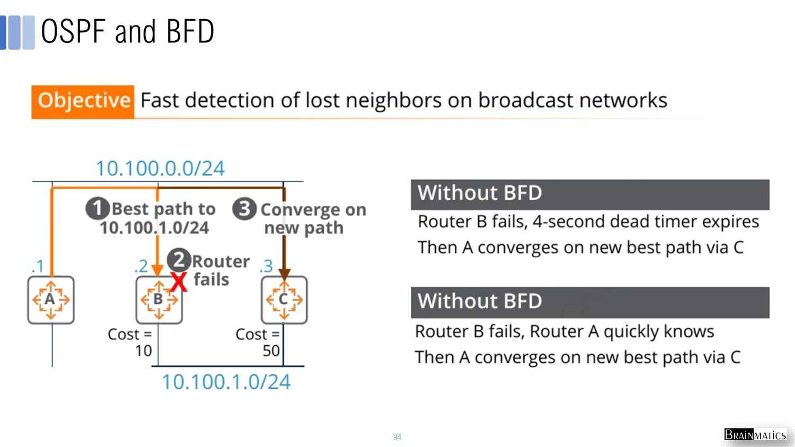

> **Sumber visual:** `Day - 1.pdf`, halaman 93.  
> **Cara membaca:** OSPF Hello/Dead Timer dapat terlalu lambat untuk mendeteksi kegagalan link. BFD menyediakan deteksi kegagalan yang lebih cepat; setelah BFD menyatakan peer gagal, OSPF segera memperbarui adjacency dan menghitung rute baru.

BFD menyediakan deteksi kegagalan jauh lebih cepat daripada menunggu OSPF dead timer.

Alur:

1. OSPF membentuk neighbor.
2. BFD membentuk sesi cepat antarpeer.
3. Jika BFD gagal, OSPF segera diberi tahu.
4. OSPF menghitung ulang jalur.

**Echo mode** menggunakan paket echo dengan interval sangat pendek untuk deteksi sub-second.

### 7.12 OSPF dengan VSX

Prinsip desain:

- masing-masing switch VSX memiliki control plane dan router ID sendiri;
- link routed upstream dapat menggunakan L3 LAG atau routed port;
- active gateway melayani endpoint, sedangkan OSPF menyediakan jalur northbound;
- hindari desain yang memaksa traffic normal menyeberangi ISL.

---

## 8. Checklist Day 1

- [ ] Saya dapat menjelaskan bedanya underlay dan overlay.
- [ ] Saya dapat memilih two-tier atau three-tier berdasarkan kebutuhan.
- [ ] Saya memahami group, site, dan persona di Aruba Central.
- [ ] Saya memahami ISL, keepalive, VSX LAG, active gateway, dan linkup delay.
- [ ] Saya dapat menjelaskan perbedaan VSX dan VSF.
- [ ] Saya hafal fungsi LSA 1, 2, 3, 4, 5, dan 7.
- [ ] Saya memahami ABR, ASBR, stub, totally stubby, summarization, cost, dan BFD.

---

# Day 2 - AOS 10 Gateway, Gateway Cluster, dan Tunnel WLAN

**Referensi utama:** `Day - 2.pdf`, halaman 3-59.

## 1. Tujuan Belajar Day 2

- memahami pembagian tanggung jawab Central, AP, dan gateway pada AOS 10;
- melakukan onboarding gateway melalui ZTP atau OTP;
- memahami gateway sebagai perangkat Layer 2 atau Layer 3;
- memilih mode cluster otomatis atau manual;
- memahami IPsec control plane, GRE data plane, OTO, DDG, dan bucket map.

---

## 2. Pembagian Tanggung Jawab AOS 10


#### Visualisasi Kunci - Pembagian Tanggung Jawab AOS 10

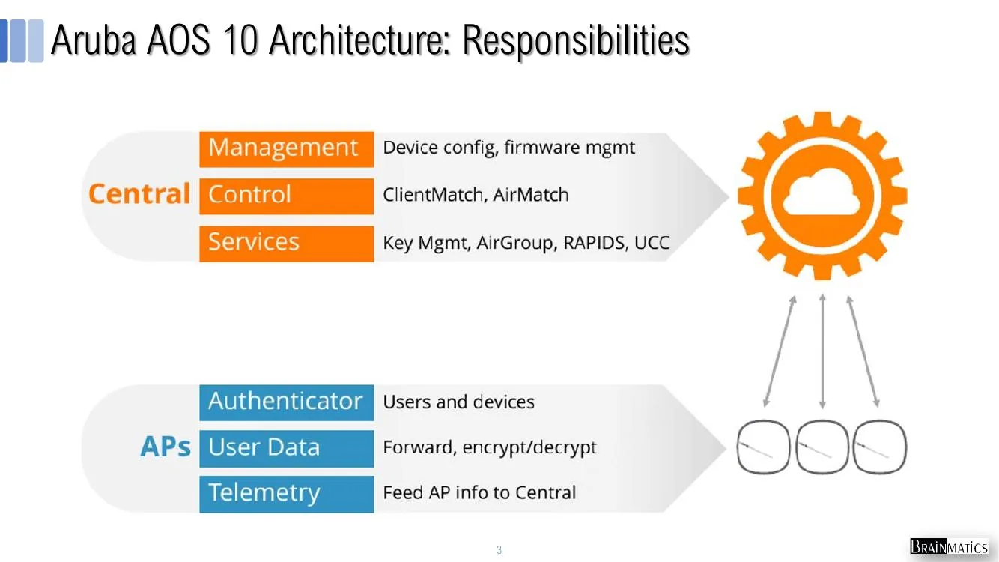

> **Sumber visual:** `Day - 2.pdf`, halaman 3.  
> **Cara membaca:** Central menangani management, control, dan layanan seperti ClientMatch/AirMatch. AP tetap menjadi authenticator, meneruskan traffic pengguna, melakukan enkripsi/dekripsi, serta mengirim telemetry. Gateway digunakan ketika traffic atau policy perlu diterminasi secara terpusat.

### Aruba Central

| Fungsi | Contoh |
|---|---|
| Management | Device configuration dan firmware management. |
| Control | ClientMatch dan AirMatch. |
| Services | Key management, AirGroup, RAPIDS, UCC. |

### Access Point

| Fungsi | Penjelasan |
|---|---|
| Authenticator | Melayani proses koneksi pengguna/perangkat. |
| User data | Forwarding serta encrypt/decrypt frame wireless. |
| Telemetry | Mengirim informasi AP dan klien ke Central. |

### Gateway

Gateway digunakan untuk:

- tunneled WLAN;
- dynamic segmentation;
- enhanced mobility;
- RADIUS proxy;
- penyederhanaan VLAN di access layer;
- cluster dan redundancy;
- deployment skala besar.

Materi mencontohkan gateway terutama relevan pada lingkungan dengan jumlah klien/AP besar atau kebutuhan segmentasi terpusat.

---

## 3. Group-Level dan Device-Level Configuration

- **Group-level:** konfigurasi yang diwariskan oleh seluruh perangkat dalam group.
- **Device-level:** override untuk satu perangkat.

Risiko operasional:

- terlalu banyak device override membuat konfigurasi sulit diaudit;
- perangkat yang dipindahkan ke group baru akan menerima konfigurasi group tersebut;
- dokumentasikan override agar tidak dianggap sebagai configuration drift.

---

## 4. Provisioning Gateway

### 4.1 Default Port

Materi menunjukkan dua tipe port awal:

| Tipe | Karakteristik |
|---|---|
| ZTP port | Untagged VLAN, DHCP client, IP dinamis, dapat melakukan ZTP. |
| Service port | DHCP server lokal `172.16.0.0/24`, IP default `172.16.0.254`, dapat digunakan untuk OTP. |

### 4.2 ZTP - Zero Touch Provisioning

Alur:

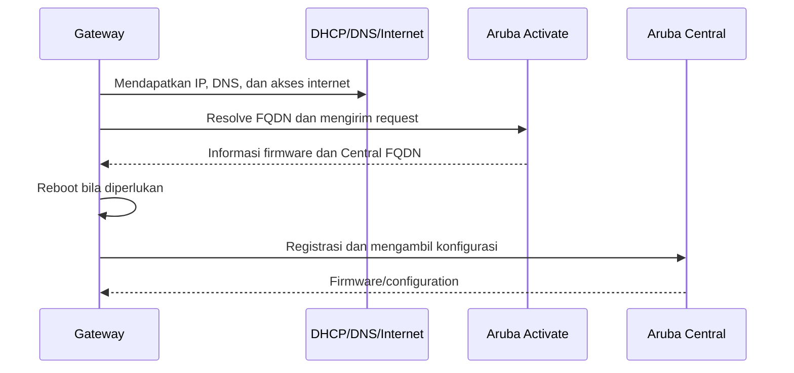
```mermaid
sequenceDiagram
    participant GW as Gateway
    participant DHCP as DHCP/DNS/Internet
    participant ACT as Aruba Activate
    participant C as Aruba Central

    GW->>DHCP: Mendapatkan IP, DNS, dan akses internet
    GW->>ACT: Resolve FQDN dan mengirim request
    ACT-->>GW: Informasi firmware dan Central FQDN
    GW->>GW: Reboot bila diperlukan
    GW->>C: Registrasi dan mengambil konfigurasi
    C-->>GW: Firmware/configuration
```

Syarat ZTP:

- gateway mendapat IP melalui DHCP;
- DNS berfungsi;
- akses ke layanan Aruba tersedia;
- serial perangkat dan subscription telah dipetakan pada tenant yang benar.

### 4.3 OTP - One Touch Provisioning

OTP digunakan ketika ZTP tidak dapat berjalan otomatis atau dibutuhkan konfigurasi awal lokal.

Metode:

- serial console;
- web browser melalui service port, biasanya ke `https://172.16.0.254`.

Data yang umumnya diisi:

- uplink port dan VLAN;
- IP statis atau DHCP;
- default gateway;
- DNS;
- informasi Central/Activate.

### 4.4 NTP

NTP sangat penting untuk:

- validasi certificate;
- log dan audit trail;
- cluster operation;
- RADIUS dan security event correlation.

> Sebelum troubleshooting autentikasi atau certificate, selalu periksa waktu gateway, AP, switch, dan server.

---

## 5. Gateway sebagai Layer 2 atau Layer 3

| Mode | Karakteristik | Umum Digunakan Untuk |
|---|---|---|
| Layer 2 | Gateway terhubung ke VLAN/trunk yang sama dengan core atau aggregation | Campus deployment |
| Layer 3 | Gateway memiliki routed uplink dan dapat terhubung ke lebih dari satu jaringan/ISP | Branch gateway |

Pada campus, active gateway pada VSX dapat menjadi next-hop bagi gateway mobility. Pada branch, gateway sering menangani routing, WAN, dan policy secara langsung.

---

## 6. Gateway Cluster


#### Visualisasi Kunci - Gateway Cluster

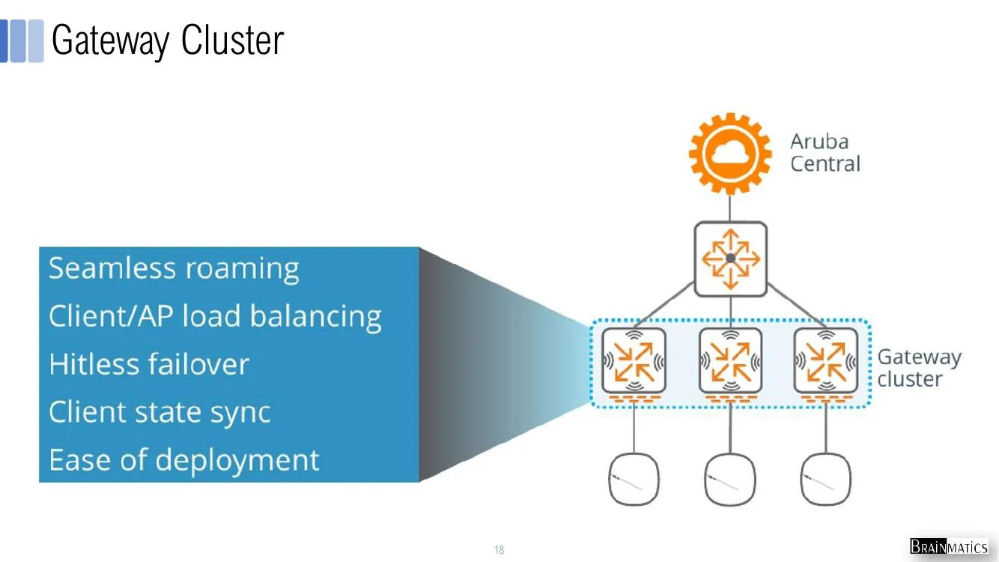

> **Sumber visual:** `Day - 2.pdf`, halaman 18.  
> **Cara membaca:** Beberapa gateway bekerja sebagai satu sistem layanan. Cluster memberikan load balancing, failover, client state synchronization, dan kemudahan operasi. Perhatikan bahwa cluster bukan sekadar dua perangkat cadangan; keduanya dapat aktif melayani client.

### 6.1 Manfaat

- seamless roaming;
- client/AP load balancing;
- hitless failover dalam cluster;
- sinkronisasi client state;
- kemudahan deployment dan operasi.

### 6.2 Homogeneous vs Heterogeneous Cluster

| Tipe | Penjelasan | Rekomendasi |
|---|---|---|
| Homogeneous | Model/kapasitas gateway sama | Disarankan karena load distribution lebih mudah diprediksi. |
| Heterogeneous | Model dan kapasitas berbeda | Bisa digunakan pada kondisi tertentu, tetapi capacity planning lebih kompleks. |

### 6.3 Single Cluster vs Multi-Cluster

| Desain | Kelebihan | Kekurangan |
|---|---|---|
| Single cluster | Sederhana; semua WLAN menggunakan cluster yang sama | Fault domain lebih besar. |
| Multi-cluster | Pemisahan employee/guest, gedung, atau fungsi | Lebih banyak konfigurasi dan tunnel. |

### 6.4 Automatic Cluster

Dua mode umum:

- **Auto-Group:** gateway dalam group yang sama otomatis menjadi satu cluster.
- **Auto-Site:** gateway dengan group dan site yang sama otomatis dikelompokkan.

Kelebihan:

- gateway baru dapat bergabung otomatis;
- nama cluster dapat dibuat otomatis;
- mengurangi konfigurasi manual.

### 6.5 Manual Cluster

Gunakan manual cluster jika:

- membutuhkan kontrol anggota cluster secara eksplisit;
- membutuhkan skenario redundancy atau Microbranch tertentu;
- auto-cluster tidak sesuai dengan pemetaan WLAN yang sudah berjalan.

### 6.6 Secondary Cluster

Secondary cluster berfungsi sebagai backup dari primary cluster.

Hal penting:

- clustering adalah proteksi utama;
- hitless failover terjadi di dalam cluster yang sama;
- perpindahan primary ke secondary cluster tidak selalu hitless;
- pastikan site dan mapping secondary cluster benar.

---

## 7. Tunnel WLAN pada AOS 10


#### Visualisasi Kunci - Tunnel Forwarding Mode

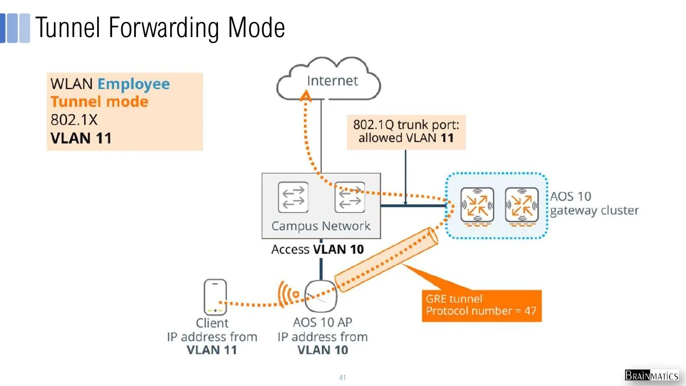

> **Sumber visual:** `Day - 2.pdf`, halaman 41.  
> **Cara membaca:** AP membungkus traffic client dan mengirimkannya ke gateway cluster. VLAN pengguna cukup tersedia pada sisi gateway, sehingga tidak harus dibentangkan ke seluruh access layer. Ini menyederhanakan campus LAN dan memusatkan enforcement.

### 7.1 Control Plane dan Data Plane

| Jalur | Tunnel | Fungsi |
|---|---|---|
| Control plane AP-GW | IPsec | Heartbeat, cluster information, RADIUS assistance, roaming, orchestrated tunnel. |
| Data plane klien | GRE | Membawa traffic dari AP ke gateway. |

Materi menekankan bahwa satu GRE dapat digunakan untuk membawa traffic beberapa SSID dari AP ke gateway, dengan VLAN tag di dalam tunnel.

### 7.2 OTO - Overlay Tunnel Orchestrator

OTO membantu:

- negosiasi IPsec phase 1;
- distribusi material key;
- memberi informasi tunnel kepada AP dan gateway;
- menghindari kebutuhan mekanisme controller discovery lama.

### 7.3 Enkripsi Data

Secara default, traffic wireless sudah dienkripsi di udara oleh WPA2/WPA3. Setelah frame didekripsi di AP, traffic dapat:

- dikirim melalui GRE tanpa enkripsi tambahan; atau
- dimasukkan ke GRE yang berjalan di dalam IPsec jika **data encryption** diaktifkan.

Aktifkan data encryption jika underlay tidak dipercaya atau kebijakan mensyaratkan enkripsi end-to-end AP-gateway.

### 7.4 Alur Client pada Tunneled SSID


#### Visualisasi Kunci - Alur Client pada Tunneled SSID

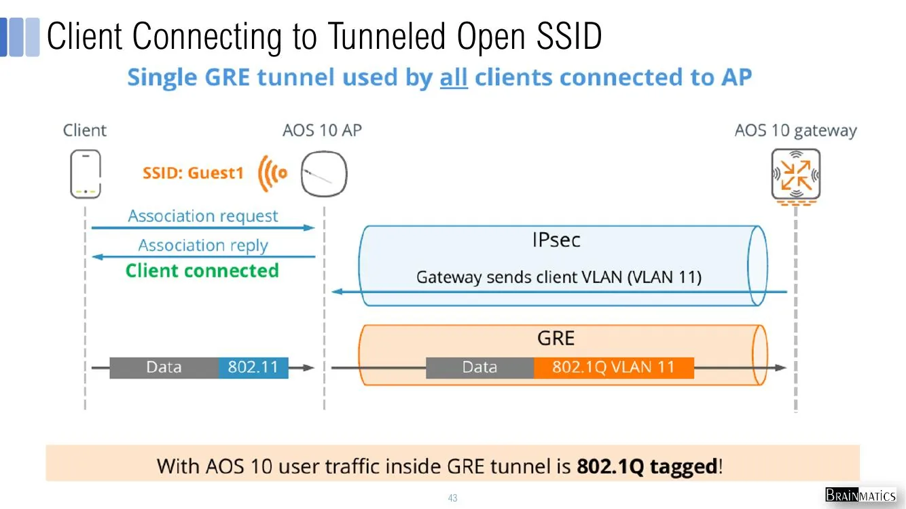

> **Sumber visual:** `Day - 2.pdf`, halaman 43.  
> **Cara membaca:** Control traffic AP-gateway dilindungi IPsec, sedangkan data client dibawa melalui GRE. Setelah client berasosiasi, gateway menentukan role/VLAN dan traffic diteruskan berdasarkan hasil policy tersebut.

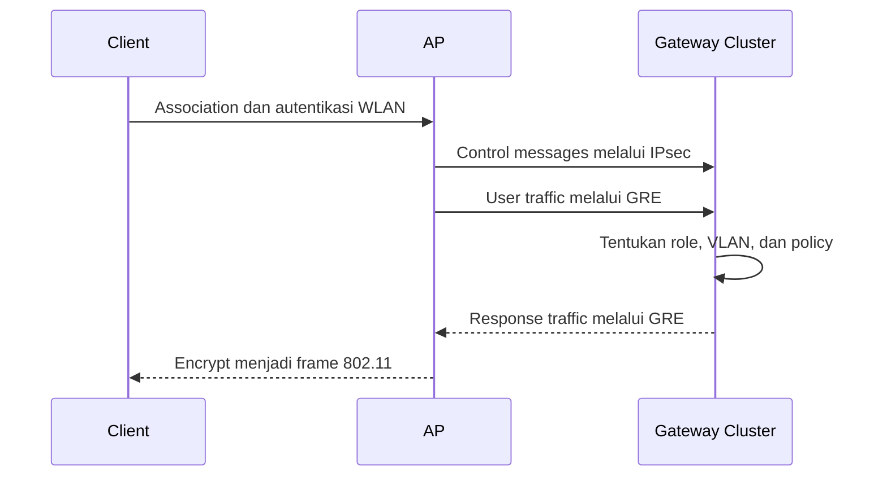
```mermaid
sequenceDiagram
    participant Client
    participant AP
    participant GW as Gateway Cluster

    Client->>AP: Association dan autentikasi WLAN
    AP->>GW: Control messages melalui IPsec
    AP->>GW: User traffic melalui GRE
    GW->>GW: Tentukan role, VLAN, dan policy
    GW-->>AP: Response traffic melalui GRE
    AP-->>Client: Encrypt menjadi frame 802.11
```

---

## 8. Cluster Leader, DDG, dan Bucket Map

### 8.1 Cluster Leader Election

Urutan umum pada materi:

1. priority tertinggi;
2. platform tertinggi;
3. MAC address tertinggi jika nilai lain sama.

### 8.2 Tugas Cluster Leader

- menetapkan DDG dan S-DDG;
- membuat dan mempublikasikan bucket map;
- melakukan load balancing.

### 8.3 DDG - Device Designated Gateway


#### Visualisasi Kunci - Tugas Device Designated Gateway

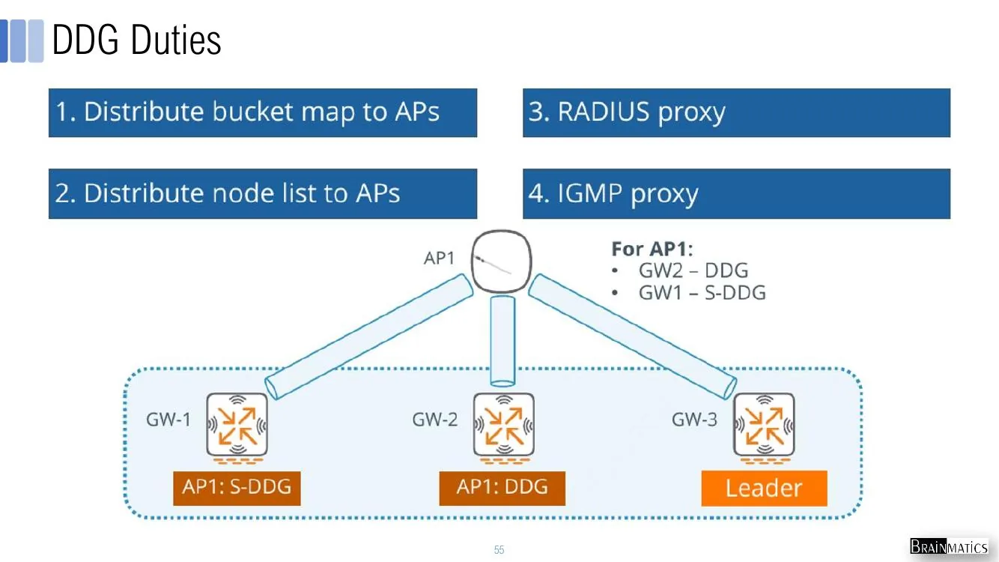

> **Sumber visual:** `Day - 2.pdf`, halaman 55.  
> **Cara membaca:** DDG mengatur bucket map, mendistribusikan node list ke AP, bertindak sebagai RADIUS proxy, dan menangani key management proxy. DDG adalah fungsi koordinasi; kegagalan satu DDG tidak berarti seluruh cluster berhenti karena fungsi dapat berpindah.

DDG menjalankan fungsi seperti:

- mendistribusikan bucket map ke AP;
- mendistribusikan node list;
- RADIUS proxy;
- IGMP proxy.

### 8.4 Client-to-Gateway Mapping

Client dipetakan ke gateway berdasarkan bucket map dan hashing. Tujuannya:

- distribusi klien lebih seimbang;
- failover dapat diprediksi;
- AP mengetahui primary dan secondary designated gateway untuk klien.

### 8.5 Load Balancing

- homogeneous cluster membagi bucket secara relatif merata;
- heterogeneous cluster membagi bucket berdasarkan capacity ratio;
- rebalance dilakukan ketika ukuran cluster berubah, bukan terus-menerus pada cluster stabil.

---

## 9. Troubleshooting Tunnel WLAN

Urutan pemeriksaan:

1. AP dan gateway terlihat online di Central.
2. AP mendapat daftar cluster dan DDG.
3. IPsec control tunnel terbentuk.
4. GRE data tunnel terbentuk.
5. SSID mengarah ke primary cluster yang benar.
6. VLAN dan role tersedia pada gateway.
7. Client mendapatkan role dan IP.
8. Routing dari gateway ke DHCP/DNS/default gateway tersedia.
9. Policy tidak memblokir DHCP, DNS, ARP, atau traffic aplikasi.
10. Jika failover gagal, periksa bucket map, leader, DDG, dan health cluster.

---

## 10. Checklist Day 2

- [ ] Saya dapat menjelaskan perbedaan ZTP dan OTP.
- [ ] Saya memahami fungsi service port `172.16.0.254` pada kondisi default.
- [ ] Saya dapat memilih auto-group, auto-site, atau manual cluster.
- [ ] Saya memahami perbedaan primary dan secondary cluster.
- [ ] Saya dapat menjelaskan IPsec control plane dan GRE data plane.
- [ ] Saya memahami OTO, leader, DDG, S-DDG, dan bucket map.

---

# Day 3 - Secure Enterprise WLAN, RADIUS, Role, dan Guest Access

**Referensi utama:** `Day - 3.pdf`, halaman 3-60.

## 1. Opsi Keamanan WLAN


#### Visualisasi Kunci - Perbandingan Open, WPA-Personal, dan WPA-Enterprise

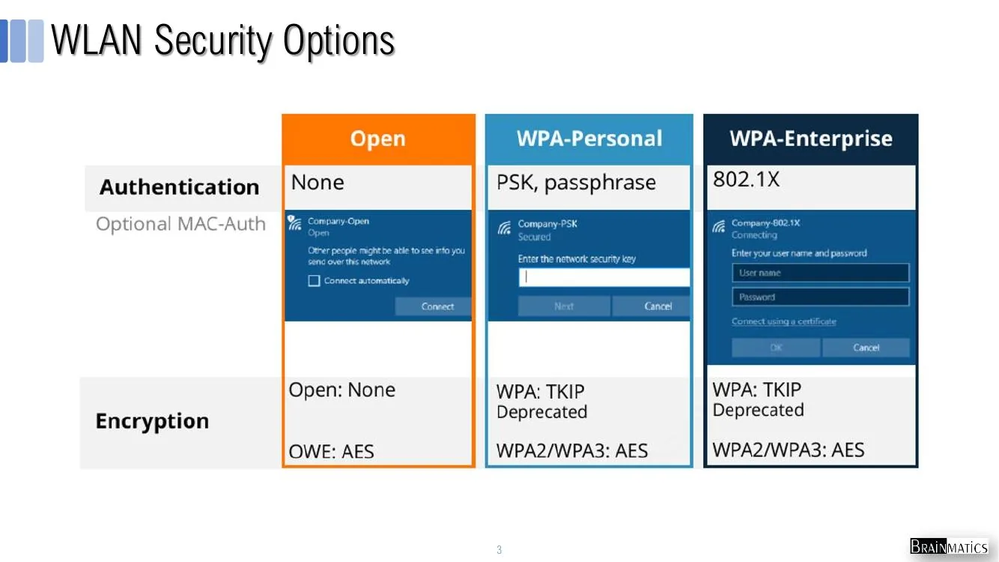

> **Sumber visual:** `Day - 3.pdf`, halaman 3.  
> **Cara membaca:** Open tidak melakukan autentikasi pengguna; OWE hanya menambah enkripsi tanpa identitas. WPA-Personal memakai satu atau beberapa PSK. WPA-Enterprise menggunakan 802.1X dan RADIUS sehingga keputusan akses dapat didasarkan pada identitas, sertifikat, role, dan policy.

| Mode | Autentikasi | Enkripsi | Penggunaan |
|---|---|---|---|
| Open | Tidak ada, opsional MAC-auth | Tidak ada atau OWE/AES | Guest atau onboarding dengan kontrol tambahan. |
| WPA-Personal | PSK/passphrase | WPA2/WPA3 AES | Jaringan kecil atau perangkat yang tidak mendukung 802.1X. |
| WPA-Enterprise | 802.1X/EAP | WPA2/WPA3 AES | Enterprise dengan identitas individual. |

> TKIP dianggap deprecated. Gunakan AES dan versi WPA yang sesuai kemampuan klien serta kebijakan keamanan.

---

## 2. Tiga Aktor 802.1X


#### Visualisasi Kunci - Tiga Aktor dalam 802.1X

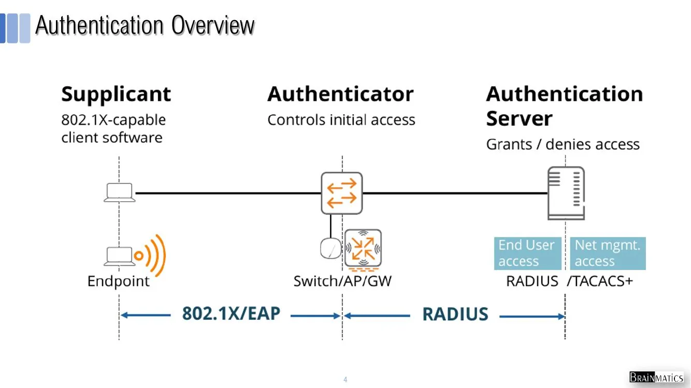

> **Sumber visual:** `Day - 3.pdf`, halaman 4.  
> **Cara membaca:** Supplicant berada pada endpoint, authenticator berada pada AP/switch/gateway, dan authentication server biasanya RADIUS/ClearPass. EAPOL berjalan antara endpoint dan authenticator; pesan EAP diteruskan menuju server melalui RADIUS.

| Aktor | Contoh | Fungsi |
|---|---|---|
| Supplicant | Laptop/telepon dengan 802.1X client | Mengirim identitas dan credential/certificate. |
| Authenticator | AP, switch, atau gateway | Mengontrol akses awal dan meneruskan EAP. |
| Authentication server | RADIUS/ClearPass | Memvalidasi identitas dan mengembalikan keputusan/policy. |

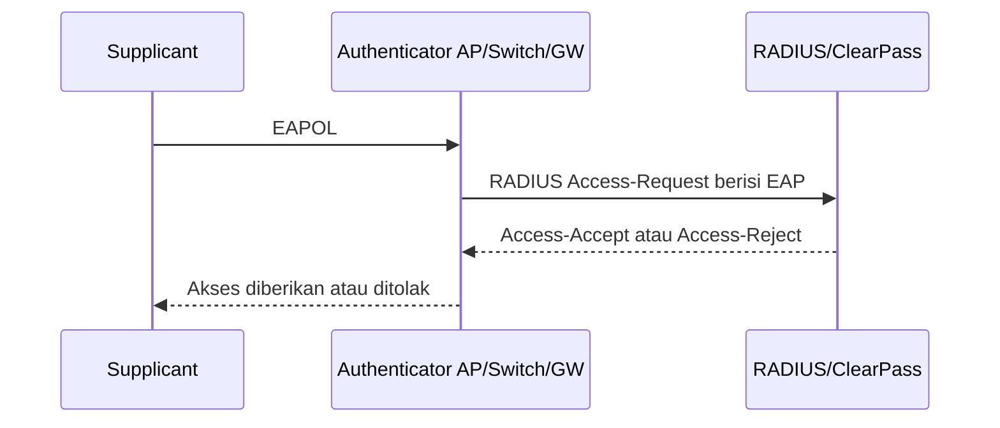
```mermaid
sequenceDiagram
    participant S as Supplicant
    participant A as Authenticator AP/Switch/GW
    participant R as RADIUS/ClearPass

    S->>A: EAPOL
    A->>R: RADIUS Access-Request berisi EAP
    R-->>A: Access-Accept atau Access-Reject
    A-->>S: Akses diberikan atau ditolak
```

---

## 3. AAA

Cara mudah mengingat:

- **Authentication - Siapa Anda?**
- **Authorization - Anda boleh melakukan apa?**
- **Accounting - Apa yang Anda lakukan?**

| Layanan | Hasil |
|---|---|
| Authentication | Valid/tidak valid berdasarkan password, certificate, token, atau identitas perangkat. |
| Authorization | Role, VLAN, ACL, bandwidth, session timeout, dan hak akses. |
| Accounting | Start/stop/interim update untuk audit dan pelacakan sesi. |

---

## 4. RADIUS

RADIUS menggunakan model client-server:

- AP/switch/gateway bertindak sebagai NAS atau RADIUS client;
- ClearPass/RADIUS server memproses request;
- UDP 1812 umum digunakan untuk authentication/authorization;
- UDP 1813 umum digunakan untuk accounting.

### 4.1 Access-Request

Dikirim ketika klien mencoba terhubung. Atribut dapat berisi:

- NAS-Port-Type;
- Calling-Station-ID atau MAC klien;
- ESSID;
- lokasi/AP group;
- EAP payload;
- informasi perangkat dan network profile.

### 4.2 Access-Accept

Berarti autentikasi dan otorisasi berhasil. Respons dapat membawa:

- Aruba-User-Role;
- VLAN;
- ACL;
- timeout;
- policy lain.

### 4.3 Access-Reject

Penyebab umum:

- credential salah;
- client menolak certificate server;
- EAP negotiation gagal;
- policy server menolak akses;
- akun/perangkat tidak memenuhi posture atau authorization rule.

---

## 5. Alur 802.11 + 802.1X + WPA


#### Visualisasi Kunci - Urutan 802.11, 802.1X, dan WPA

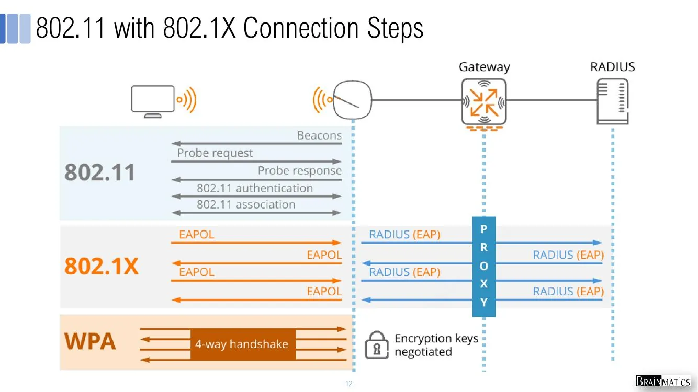

> **Sumber visual:** `Day - 3.pdf`, halaman 12.  
> **Cara membaca:** Pisahkan proses menjadi tiga fase: discovery/association 802.11, autentikasi 802.1X melalui EAPOL dan RADIUS, lalu 4-way handshake WPA untuk membentuk kunci enkripsi. Client baru benar-benar siap mengirim data setelah ketiga fase selesai.

Urutan konseptual:

1. Client menerima beacon atau melakukan probe.
2. Client melakukan 802.11 authentication dan association.
3. EAPOL berjalan antara client dan AP.
4. AP/gateway mem-proxy EAP ke RADIUS.
5. RADIUS mengirim Access-Accept/Reject.
6. Jika berhasil, 4-way handshake membentuk encryption key.
7. Client mendapat role/VLAN dan mulai mengirim data.

> Jangan mencampur istilah **802.11 authentication** dengan **802.1X authentication**. 802.11 adalah tahap asosiasi wireless; 802.1X adalah kontrol akses berbasis EAP.

---

## 6. Key Management Service dan Roaming

KMS membantu sinkronisasi key untuk roaming antar-AP.

Tujuannya:

- mengurangi autentikasi penuh saat klien berpindah AP;
- mendukung roaming yang lebih cepat;
- menyimpan informasi key/station pada mobility domain.

Saat troubleshooting roaming:

- periksa apakah AP berada dalam mobility domain yang tepat;
- periksa daftar neighboring AP;
- pastikan waktu dan state cluster konsisten;
- pastikan klien mendukung metode fast roaming yang digunakan.

---

## 7. Role-Based Firewall

### 7.1 Apa Itu Role?

Role adalah kumpulan pengaturan yang mengontrol traffic klien, misalnya:

- access control rules;
- application rules;
- bandwidth contract;
- captive portal/redirect;
- VLAN assignment;
- session policy.

Contoh role:

- `employee`
- `contractor`
- `guest-logon`
- `guest`
- `iot`
- `quarantine`

### 7.2 Identity-Based Firewall

Dua klien pada SSID dan subnet yang sama dapat memperoleh policy berbeda karena role berbeda.

Contoh:

| Role | Printer | Finance App | Internet |
|---|---:|---:|---:|
| Employee | Allow | Allow | Allow |
| Contractor | Allow | Deny | Allow |
| Guest | Deny | Deny | Allow terbatas |

### 7.3 Role Derivation


#### Visualisasi Kunci - Urutan Penentuan Role

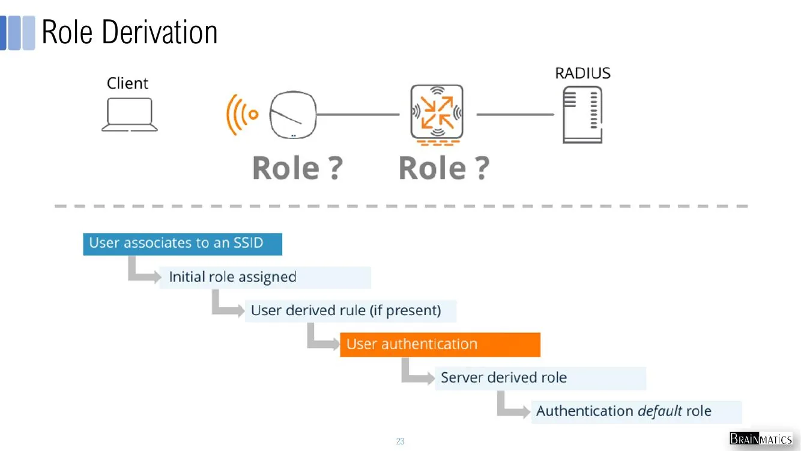

> **Sumber visual:** `Day - 3.pdf`, halaman 23.  
> **Cara membaca:** Perangkat dapat memulai dengan initial role. Setelah autentikasi, role dapat berasal dari atribut RADIUS atau server-derived rule. Bila tidak ada hasil yang cocok, sistem memakai default authenticated role. Urutan evaluasi ini penting saat troubleshooting akses yang salah.

Role dapat berasal dari:

1. initial role pada SSID;
2. local/user derivation rules;
3. hasil authentication;
4. server-derived role dari RADIUS;
5. perubahan dinamis melalui CoA.

> Selalu pastikan Anda mengetahui **role akhir** yang terpasang pada user, bukan hanya role default pada SSID.

### 7.4 AAA Profile

AAA profile mendefinisikan:

- authentication options;
- authentication server group;
- accounting server group;
- default role;
- user derivation dan server rules;
- gateway cluster atau forwarding behavior terkait.

---

## 8. Server Rules dan Aliases

### 8.1 Server Rules

Server rule membaca atribut RADIUS dan mengubahnya menjadi tindakan.

Contoh logika:

```text
IF Aruba-User-Role equals employee
THEN set role employee

IF department equals finance
THEN set role finance
```

### 8.2 Alias

Alias adalah nama logis untuk:

- network/subnet;
- host;
- service/port;
- user group.

Keuntungan:

- rule lebih mudah dibaca;
- perubahan alamat cukup dilakukan pada alias;
- policy lebih scalable;
- mengurangi kesalahan karena IP/port ditulis berulang.

Contoh:

```text
Alias: Finance-Servers
Isi: 172.16.50.0/24

Rule:
role contractor -> Finance-Servers -> deny
role finance -> Finance-Servers -> permit
```

---

## 9. Dynamic Authorization

Dynamic Authorization memungkinkan RADIUS mengubah sesi yang sedang aktif.

Bentuk umum:

- **CoA:** mengubah role, VLAN, ACL, atau parameter sesi;
- **Disconnect-Request:** memutus sesi agar autentikasi dimulai ulang.

Kegunaan:

- posture berubah;
- user dipindahkan ke quarantine;
- perangkat berhasil registrasi;
- administrator mencabut akses;
- role diperbarui tanpa menunggu session timeout.

---

## 10. Guest Access dan Captive Portal


#### Visualisasi Kunci - Alur Pengalaman Guest

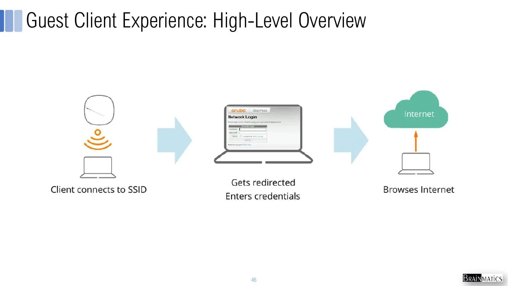

> **Sumber visual:** `Day - 3.pdf`, halaman 46.  
> **Cara membaca:** Guest terhubung ke SSID, diarahkan ke portal eksternal/ClearPass, melakukan autentikasi, kemudian memperoleh post-authentication role. Browser dapat mengakses internet hanya setelah policy mengubah role atau mengizinkan sesi.

### 10.1 Pilihan Captive Portal

| Pilihan | Portal Dihosting | Pengelolaan |
|---|---|---|
| Cloud Guest | Aruba Central | Lebih sederhana dan terintegrasi Central. |
| External Captive Portal | Server eksternal/ClearPass Guest | Fleksibel, dapat dikustomisasi dan terintegrasi policy enterprise. |

### 10.2 Pre-Authentication Role

Sebelum login, klien hanya boleh mengakses layanan minimum:

- DHCP;
- DNS;
- HTTPS/HTTP ke captive portal;
- tujuan lain yang diperlukan untuk certificate atau onboarding.

Semua akses lain harus diblokir atau dibatasi.

### 10.3 Post-Authentication Role

Setelah autentikasi berhasil, klien memperoleh role guest yang memberikan akses internet atau resource tertentu sesuai kebijakan.

### 10.4 Alur Captive Portal


#### Visualisasi Kunci - Captive Portal - Fase Awal

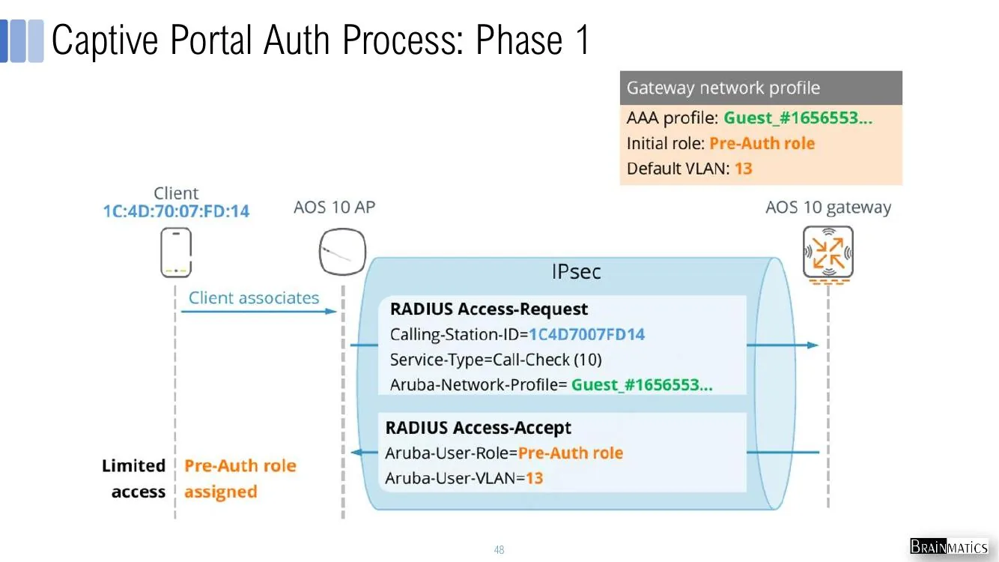

> **Sumber visual:** `Day - 3.pdf`, halaman 48.  
> **Cara membaca:** Pada fase awal, client memperoleh pre-authentication role. Permintaan web diintersep dan dialihkan ke halaman login. Pastikan DNS, DHCP, akses ke portal, dan ACL pre-auth bekerja sebelum memeriksa kredensial pengguna.

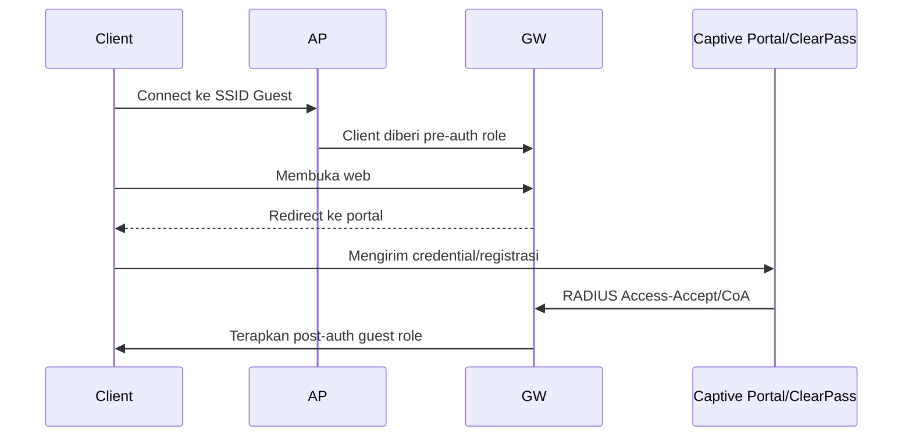
```mermaid
sequenceDiagram
    participant Client
    participant AP
    participant GW
    participant CP as Captive Portal/ClearPass

    Client->>AP: Connect ke SSID Guest
    AP->>GW: Client diberi pre-auth role
    Client->>GW: Membuka web
    GW-->>Client: Redirect ke portal
    Client->>CP: Mengirim credential/registrasi
    CP->>GW: RADIUS Access-Accept/CoA
    GW->>Client: Terapkan post-auth guest role
```

### 10.5 Masalah Captive Portal Berulang

Tanpa MAC caching, user mungkin harus login ulang setelah perangkat sleep atau reconnect.

Solusi yang dibahas dalam materi:

- first connection menggunakan captive portal;
- MAC authentication/caching digunakan pada reconnect berikutnya;
- ClearPass memvalidasi apakah MAC masih memiliki otorisasi yang aktif.

---

## 11. Troubleshooting Autentikasi

### Client tidak dapat terhubung ke 802.1X

1. Pastikan waktu client dan RADIUS benar.
2. Pastikan certificate RADIUS dipercaya client.
3. Pastikan EAP method client dan server cocok.
4. Periksa Access-Request sampai ke RADIUS.
5. Periksa alasan Access-Reject.
6. Periksa shared secret NAS.
7. Periksa role/VLAN yang dikembalikan.
8. Periksa DHCP setelah autentikasi berhasil.

### Captive portal tidak muncul

1. Client mendapat IP atau tidak?
2. DNS berfungsi atau tidak?
3. Pre-auth role mengizinkan DHCP/DNS/portal?
4. Redirect rule aktif?
5. Portal URL dan certificate valid?
6. Browser menggunakan HTTPS/HSTS yang menghambat redirect?
7. Role akhir berubah setelah login?

---

## 12. Checklist Day 3

- [ ] Saya memahami supplicant, authenticator, dan RADIUS server.
- [ ] Saya dapat menjelaskan AAA.
- [ ] Saya memahami Access-Request, Accept, Reject, dan CoA.
- [ ] Saya dapat menggambar urutan 802.11, 802.1X, dan 4-way handshake.
- [ ] Saya memahami initial role, server-derived role, dan role akhir.
- [ ] Saya memahami pre-auth dan post-auth role pada guest WLAN.

---

# Day 4 - MPSK IoT, Mixed Mode, Wired Authentication, dan Dynamic Segmentation

**Referensi utama:** `Day - 4.pdf`, halaman 3-76.

## 1. MPSK untuk IoT

### 1.1 Masalah PSK Biasa

Banyak perangkat IoT:

- tidak mendukung 802.1X;
- hanya mendukung PSK;
- sulit dikelola jika seluruh perangkat memakai password yang sama;
- akan memerlukan perubahan massal jika PSK bocor.

### 1.2 Manfaat MPSK

MPSK memungkinkan:

- banyak PSK pada SSID yang sama;
- role/VLAN berbeda berdasarkan key;
- blast radius lebih kecil jika satu key bocor;
- integrasi registrasi dan policy melalui ClearPass.

### 1.3 Opsi Deployment

| Opsi | Key | Pengelolaan | Dampak Jika Key Bocor |
|---|---|---|---|
| Single PSK | Semua perangkat sama | SSID/Central | Semua perangkat harus diubah. |
| Local MPSK | Satu key per kelompok | Aruba Central/AP | Hanya kelompok tersebut diubah. |
| ClearPass MPSK | Dapat unik per perangkat | ClearPass | Dapat dibatasi hanya satu perangkat. |

> Sesuai materi ini, MPSK digunakan dengan WPA2. Pastikan kemampuan perangkat dan release AOS yang Anda gunakan sebelum deployment produksi.

### 1.4 Mapping Key ke Role dan VLAN


#### Visualisasi Kunci - MPSK: Satu SSID, Banyak Role dan VLAN

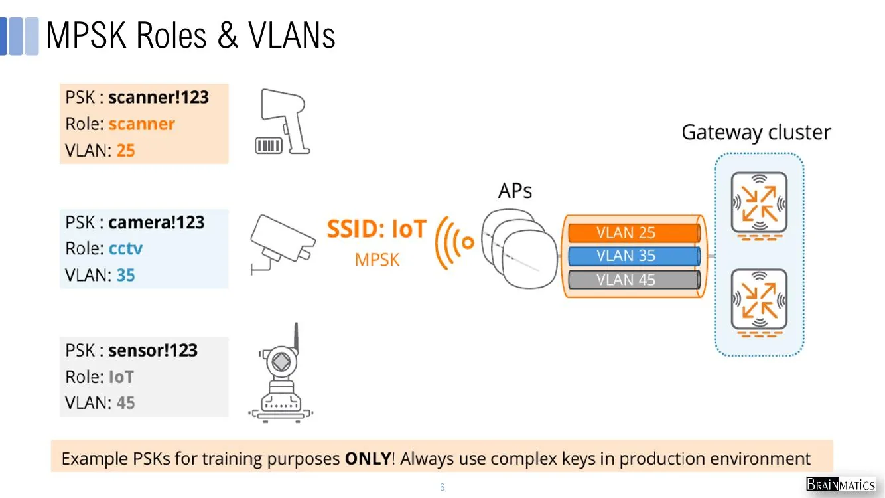

> **Sumber visual:** `Day - 4.pdf`, halaman 6.  
> **Cara membaca:** Scanner, kamera, dan sensor menggunakan SSID yang sama tetapi PSK berbeda. Nama/key MPSK dipetakan ke role dan VLAN yang berbeda, sehingga kompromi satu key tidak harus memengaruhi seluruh perangkat IoT.

Contoh:

| Key Name | Perangkat | Role | VLAN |
|---|---|---|---:|
| Scanner | Barcode scanner | `scanner`/`iot` | 25 |
| Camera | CCTV | `cctv` | 35 |
| Sensor | Environmental sensor | `sensor` | 45 |

### 1.5 Local MPSK Flow

1. Client mengirim PSK saat terhubung.
2. AP mengenali nama MPSK key.
3. AAA/user derivation rule mencocokkan `Aruba-Mpsk-Key-Name`.
4. Sistem menetapkan role dan VLAN.
5. Traffic diteruskan sesuai policy.

### 1.6 Local MPSK + ClearPass


#### Visualisasi Kunci - Local MPSK dengan ClearPass

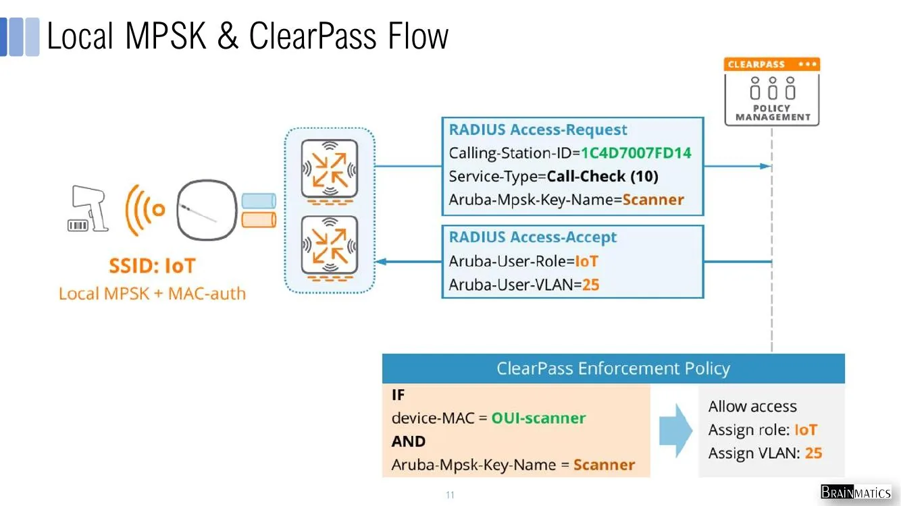

> **Sumber visual:** `Day - 4.pdf`, halaman 11.  
> **Cara membaca:** AP/gateway memvalidasi MPSK secara lokal, lalu MAC dan nama key dapat dikirim ke ClearPass. ClearPass menggabungkan identitas perangkat, profiling, dan atribut MPSK untuk memutuskan role/VLAN serta menolak impersonation.

Kombinasi ini menggunakan:

- validasi PSK secara lokal;
- MAC-auth ke ClearPass;
- ClearPass profiling dan enforcement policy;
- pemeriksaan kecocokan jenis perangkat dengan key yang digunakan.

Contoh policy:

```text
IF device MAC/OUI menunjukkan scanner
AND Aruba-Mpsk-Key-Name = Scanner
THEN role = IoT, VLAN = 25
ELSE deny atau quarantine
```

Ini mengurangi risiko perangkat menyamar menggunakan key milik kategori lain.

---

## 2. Mixed Forwarding Mode


#### Visualisasi Kunci - Mixed Forwarding Mode Architecture

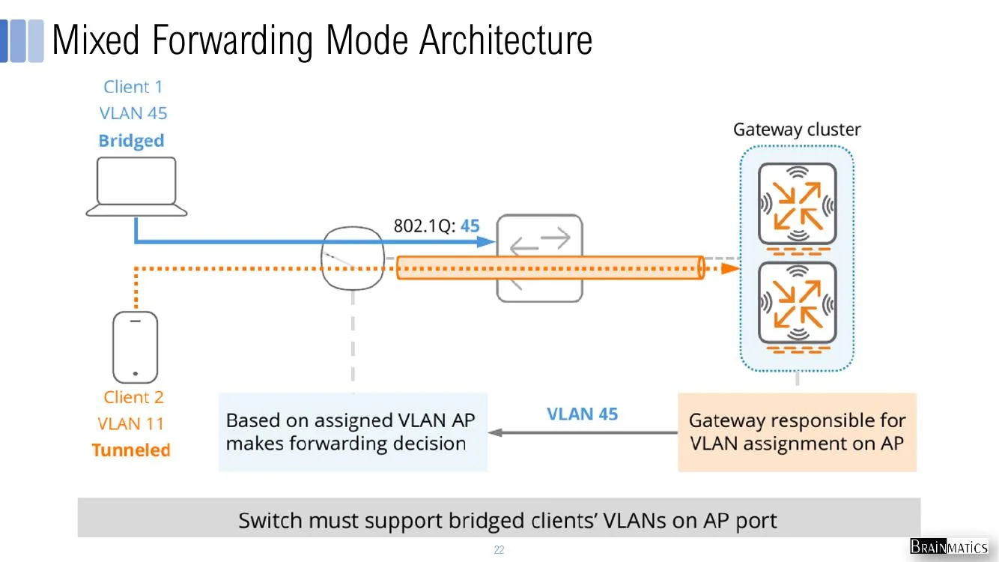

> **Sumber visual:** `Day - 4.pdf`, halaman 22.  
> **Cara membaca:** Satu WLAN dapat meneruskan sebagian client secara bridge dan sebagian lain melalui tunnel. Keputusan dibuat berdasarkan VLAN rule atau atribut RADIUS. Pastikan VLAN bridge tersedia pada access switch, sedangkan VLAN tunneled tersedia pada gateway.

### 2.1 Tujuan

Mixed mode memungkinkan **satu SSID** membawa sebagian klien secara bridge dan sebagian secara tunnel.

Manfaat:

- mengurangi jumlah SSID;
- mempertahankan local breakout untuk kebutuhan tertentu;
- tetap menggunakan gateway untuk pengguna yang membutuhkan policy terpusat.

### 2.2 Cara Pengambilan Keputusan

Keputusan forwarding dapat berdasarkan:

- VLAN assignment;
- MAC address analysis;
- authentication attribute pada 802.1X;
- server-derived role/rule.

Prinsip materi:

- forwarding default adalah tunnel;
- diperlukan minimal satu rule untuk bridge;
- VLAN yang tidak dibawa melalui GRE dapat diarahkan sebagai bridged VLAN sesuai rule.

### 2.3 Contoh

| Client | Role | VLAN | Forwarding |
|---|---|---:|---|
| Employee biasa | employee | 11 | Tunnel ke gateway |
| IoT lokal | iot-ac | 45 | Bridge pada AP/switch |

### 2.4 Hal yang Harus Diperiksa

- VLAN bridge tersedia pada switch port AP;
- trunk mengizinkan VLAN bridge;
- gateway mengetahui VLAN tunneled;
- rule urutannya benar;
- default VLAN tidak menyebabkan klien salah jalur;
- security mode kompatibel dengan rule assignment.

---

## 3. Wired Port-Based Authentication


#### Visualisasi Kunci - Alur 802.1X pada Port Kabel

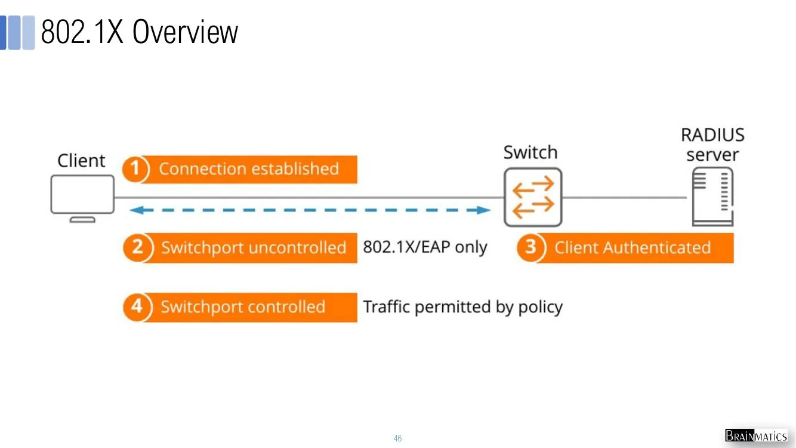

> **Sumber visual:** `Day - 4.pdf`, halaman 46.  
> **Cara membaca:** Port awalnya unauthorized dan hanya mengizinkan EAPOL. Switch meneruskan autentikasi ke RADIUS. Setelah Access-Accept, port menjadi authorized dan role/VLAN/policy diterapkan. Ini menjelaskan mengapa konektivitas fisik belum berarti akses data sudah diizinkan.

### 3.1 Tujuan

- mengamankan access port;
- memberi VLAN/role dinamis;
- menyediakan guest access;
- mendukung endpoint tanpa supplicant;
- menerapkan segmentasi berbasis identitas.

### 3.2 Metode

| Metode | Cocok Untuk | Kekuatan/Keterbatasan |
|---|---|---|
| 802.1X | User/device dengan supplicant | Paling kuat, mendukung user/certificate identity. |
| MAC-auth | Printer, kamera, IoT | Mudah tetapi MAC dapat dipalsukan; perlu profiling/policy. |
| Captive portal | Guest | Interaktif, tetapi bergantung browser dan redirect. |

### 3.3 802.1X Flow pada Switch

1. Link terbentuk.
2. Switch meminta identitas melalui EAPOL.
3. Switch mengirim Access-Request ke RADIUS.
4. RADIUS mengautentikasi client.
5. Switch menerapkan VLAN/role/policy.

### 3.4 Konfigurasi RADIUS Server

```text
radius-server host 10.100.50.50 key plaintext aruba123
```

Jika menggunakan management VRF:

```text
radius-server key plaintext aruba123
radius-server host 10.100.50.50 vrf mgmt
```

> Jangan gunakan contoh shared secret `aruba123` di produksi. Gunakan secret kuat dan unik.

### 3.5 Mengaktifkan 802.1X pada AOS-CX

```text
! Gunakan EAP-RADIUS untuk 802.1X
aaa authentication port-access dot1x authenticator auth-method eap-radius

! Pilih RADIUS server group
aaa authentication port-access dot1x authenticator radius server-group radius

! Aktifkan secara global
aaa authentication port-access dot1x authenticator enable

! Aktifkan pada interface
interface 1/1/1
    aaa authentication port-access dot1x authenticator
        enable
    aaa authentication port-access allow-lldp-bpdu
    aaa authentication port-access allow-cdp-bpdu
```

### 3.6 Dynamic Authorization/CoA

```text
radius-server dyn-authorization enable
```

Fungsi:

- menerima CoA/Disconnect dari ClearPass;
- mengubah role/VLAN tanpa menunggu reauthentication period;
- memutus sesi yang tidak lagi memenuhi policy.

### 3.7 RADIUS Accounting

Accounting mengirim informasi sesi ke server:

- start;
- stop;
- interim update.

Gunakan untuk audit, visibility, dan correlation pada ClearPass/SIEM.

### 3.8 RADIUS Server Group

Server group memungkinkan:

- urutan server tertentu untuk 802.1X;
- grup terpisah untuk admin authentication;
- failover antarserver;
- pemisahan fungsi dan site.

Persiapan penting:

- reachability ke semua server;
- source IP/VRF benar;
- shared secret konsisten;
- timeout dan retries sesuai latency;
- server yang tidak diperlukan tidak dimasukkan ke group.

---

## 4. MAC Authentication

### 4.1 Alur

1. Switch menerima traffic dari MAC yang belum terautentikasi.
2. Switch mengirim MAC sebagai credential ke RADIUS.
3. RADIUS melakukan profiling dan policy lookup.
4. Access-Accept mengembalikan role/VLAN atau Access-Reject menolak.

### 4.2 Contoh Konfigurasi

```text
radius-server host 10.1.1.1 key plaintext aruba123
radius-server dyn-authorization enable

! Global MAC-auth
aaa authentication port-access mac-auth
    addr-format <delimiter-format>
    auth-method <chap | pap>
    radius server-group radius
    enable

! Per interface
interface 1/1/1
    aaa authentication port-access mac-auth
        enable
```

### 4.3 Risiko MAC-auth

- MAC dapat dipalsukan;
- perangkat dapat diganti tanpa administrator menyadari;
- password pada dasarnya berasal dari MAC.

Mitigasi:

- device profiling;
- OUI/vendor check;
- DHCP fingerprint;
- switch port/location check;
- MPSK atau certificate jika perangkat mendukung;
- least-privilege role.

---

## 5. User Role pada AOS-CX

Role dapat berisi:

- VLAN;
- ACL/policy;
- captive portal;
- QoS;
- reauthentication parameter;
- client limits;
- tunnel destination untuk dynamic segmentation.

Role dapat diperoleh dari:

- local role;
- downloadable user role dari ClearPass;
- RADIUS VSA/IETF attributes;
- pre-auth, auth, reject, atau critical role.

### Role Lokal Penting

| Role | Diterapkan Ketika |
|---|---|
| preauth-role | Sebelum autentikasi. |
| auth-role | Autentikasi berhasil tanpa role spesifik dari RADIUS. |
| reject-role | Autentikasi gagal. |
| critical-voice-role | RADIUS gagal tetapi voice device perlu tetap berfungsi. |
| critical-role | RADIUS tidak dapat dijangkau. |

---

## 6. Client-Based vs Device-Based Mode

### Client-Based Mode

- setiap MAC diautentikasi sendiri;
- policy dapat berbeda untuk setiap client pada port yang sama;
- cocok untuk phone + PC atau port dengan beberapa endpoint.

### Device-Based Mode

- satu endpoint mengautentikasi port;
- setelah berhasil, perangkat lain dapat melewati port berdasarkan policy desain;
- berguna untuk AP bridge mode atau perangkat yang membawa banyak client;
- perlu hati-hati karena domain kepercayaannya lebih luas.

---

## 7. Menggabungkan 802.1X dan MAC-auth

Metode umum:

- 802.1X diprioritaskan untuk endpoint yang memiliki supplicant;
- MAC-auth menjadi fallback untuk perangkat tanpa supplicant;
- concurrent onboarding dapat menjalankan keduanya lebih awal agar onboarding lebih cepat.

> Pastikan policy server dapat membedakan hasil 802.1X dan MAC-auth agar endpoint tidak mendapatkan role yang terlalu luas.

---

## 8. Dynamic Segmentation


#### Visualisasi Kunci - Dynamic Segmentation sebagai Solusi

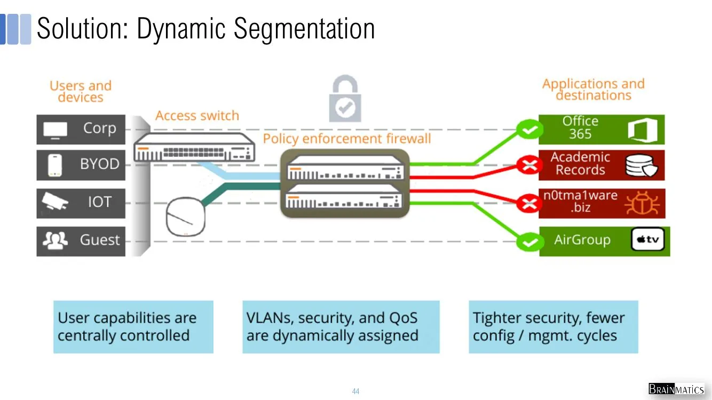

> **Sumber visual:** `Day - 4.pdf`, halaman 44.  
> **Cara membaca:** Identitas endpoint dipetakan ke role, lalu traffic dapat ditunnel ke gateway untuk enforcement yang konsisten. Pendekatan ini mengurangi kebutuhan VLAN yang tersebar, menyederhanakan operasi, dan memungkinkan policy mengikuti pengguna/perangkat.

Dynamic segmentation mengirim traffic endpoint melalui tunnel ke gateway agar policy diterapkan konsisten.

Keuntungan:

- policy wired dan wireless lebih seragam;
- VLAN tidak perlu dibentangkan ke seluruh access network;
- role mengikuti identitas, bukan port fisik;
- gateway menyediakan stateful firewall, inspection, dan policy terpusat.

Alur sederhana:

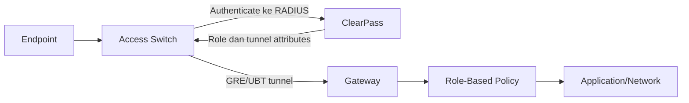
```mermaid
flowchart LR
    E[Endpoint] --> S[Access Switch]
    S -->|Authenticate ke RADIUS| R[ClearPass]
    R -->|Role dan tunnel attributes| S
    S -->|GRE/UBT tunnel| G[Gateway]
    G --> P[Role-Based Policy]
    P --> N[Application/Network]
```

---

## 9. Checklist Day 4

- [ ] Saya memahami perbedaan single PSK, local MPSK, dan ClearPass MPSK.
- [ ] Saya dapat memetakan MPSK key ke role dan VLAN.
- [ ] Saya memahami kapan traffic mixed mode di-bridge atau ditunnel.
- [ ] Saya dapat menjelaskan 802.1X dan MAC-auth pada access port.
- [ ] Saya memahami CoA, RADIUS accounting, dan server group.
- [ ] Saya memahami client-based, device-based, dan concurrent onboarding.
- [ ] Saya memahami dynamic segmentation/UBT.

---

# Day 5 - VXLAN, GBP, Security, QoS, dan Monitoring

**Referensi utama:** `Day - 5.pdf`, halaman 3-70.

## 1. VXLAN dan Distributed Overlay


#### Visualisasi Kunci - Distributed Overlay Architecture

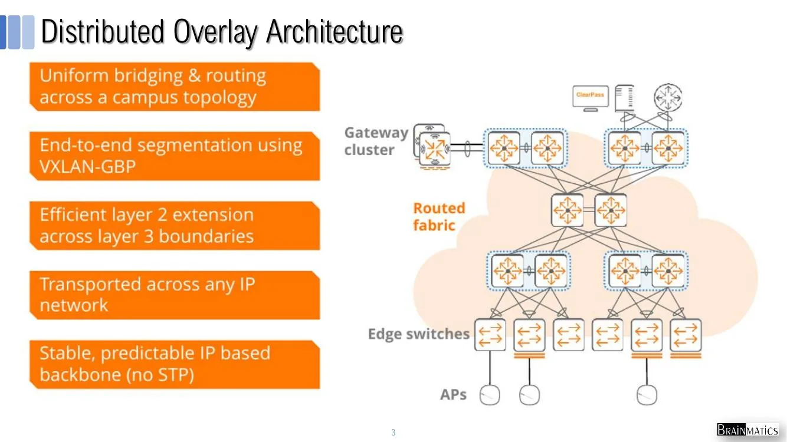

> **Sumber visual:** `Day - 5.pdf`, halaman 3.  
> **Cara membaca:** Underlay berupa fabric Layer 3 yang stabil, sedangkan VXLAN membentuk overlay Layer 2/segmentasi di atasnya. Edge switch bertindak sebagai VTEP. Dengan desain ini, jaringan tidak bergantung pada STP untuk transport fabric.

### 1.1 Underlay dan Overlay

- **Underlay:** jaringan IP routed yang menghubungkan seluruh VTEP.
- **Overlay:** jaringan virtual yang dibangun di atas underlay.

Underlay harus:

- memiliki IP reachability antarlooopback/VTEP;
- stabil dan predictable;
- mendukung ECMP;
- memiliki MTU cukup;
- tidak bergantung pada spanning tree untuk core fabric.

### 1.2 VXLAN

VXLAN mengenkapsulasi Ethernet frame di dalam UDP/IP.

Manfaat:

- memperluas Layer 2 di atas jaringan Layer 3;
- mendukung sekitar 16 juta VNI karena field 24-bit;
- memanfaatkan ECMP pada underlay;
- cocok untuk fabric campus dan data center.

### 1.3 Istilah Penting

| Istilah | Arti |
|---|---|
| VNI | VXLAN Network Identifier, identitas segment virtual 24-bit. |
| VTEP | VXLAN Tunnel Endpoint, melakukan encapsulation dan decapsulation. |
| Underlay | IP network yang membawa paket VXLAN. |
| Overlay | Segment virtual yang dilihat endpoint. |
| EVPN | Control plane berbasis MP-BGP untuk mendistribusikan endpoint dan VNI. |

### 1.4 Alur Paket VXLAN

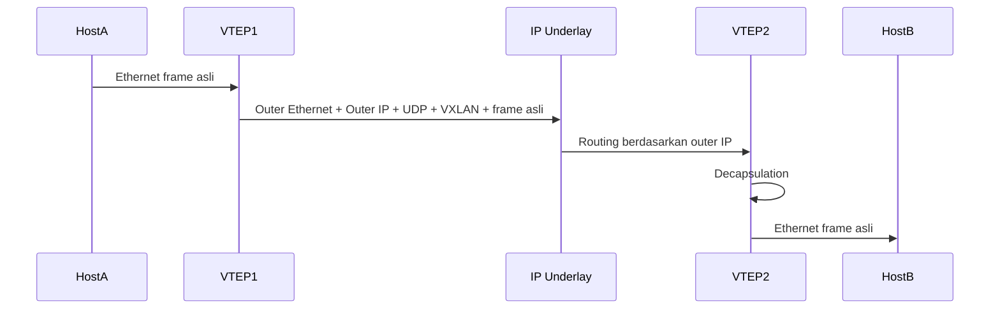
```mermaid
sequenceDiagram
    participant HostA
    participant VTEP1
    participant IP as IP Underlay
    participant VTEP2
    participant HostB

    HostA->>VTEP1: Ethernet frame asli
    VTEP1->>IP: Outer Ethernet + Outer IP + UDP + VXLAN + frame asli
    IP->>VTEP2: Routing berdasarkan outer IP
    VTEP2->>VTEP2: Decapsulation
    VTEP2->>HostB: Ethernet frame asli
```

### 1.5 Overhead dan MTU


#### Visualisasi Kunci - Struktur Paket VXLAN

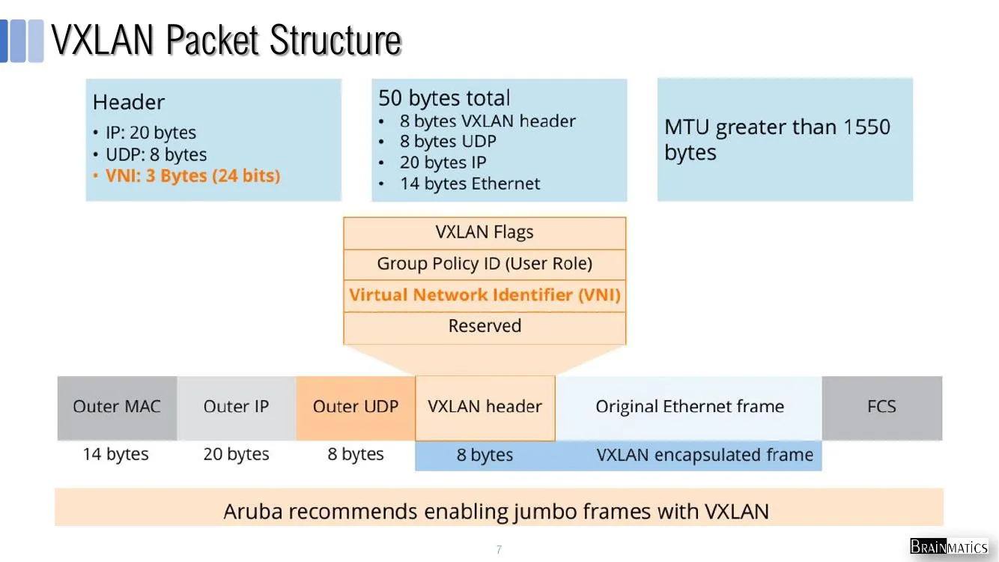

> **Sumber visual:** `Day - 5.pdf`, halaman 7.  
> **Cara membaca:** Frame Ethernet asli diberi header VXLAN, UDP, IP, dan Ethernet luar. Overhead sekitar 50 byte membuat MTU underlay harus lebih besar daripada MTU endpoint; jika tidak, fragmentasi atau packet drop dapat terjadi.

Materi menunjukkan overhead VXLAN sekitar **50 byte**:

- outer Ethernet: 14 byte;
- outer IP: 20 byte;
- UDP: 8 byte;
- VXLAN header: 8 byte.

Karena itu:

- MTU underlay harus lebih besar dari frame endpoint;
- materi merekomendasikan jumbo frame untuk menghindari fragmentation;
- konfigurasi MTU harus konsisten sepanjang jalur VTEP.

### 1.6 Static VXLAN vs EVPN


#### Visualisasi Kunci - Static VXLAN vs EVPN

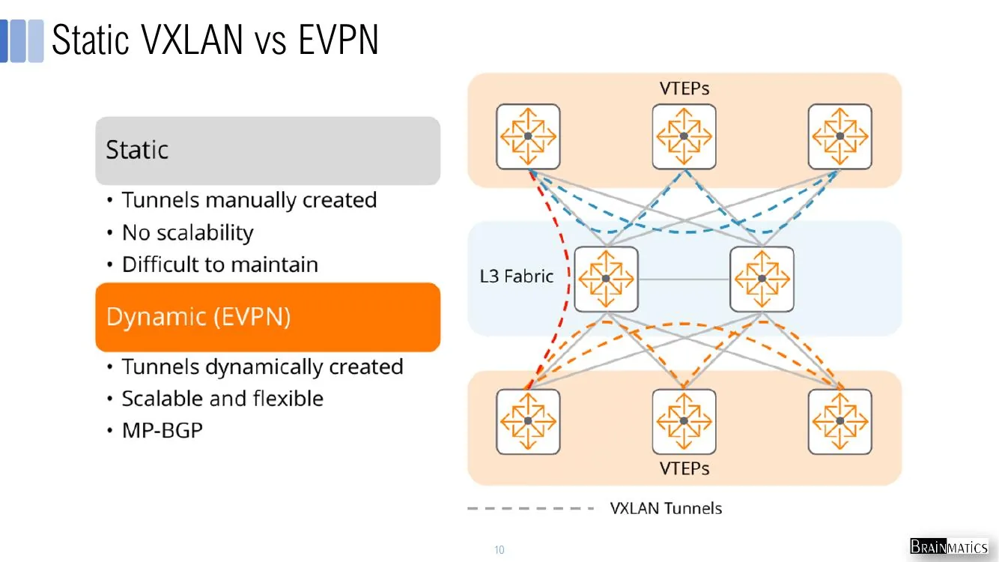

> **Sumber visual:** `Day - 5.pdf`, halaman 10.  
> **Cara membaca:** Static VXLAN mengharuskan tunnel dan peer dikonfigurasi manual sehingga sulit diskalakan. EVPN menggunakan MP-BGP untuk mendistribusikan informasi endpoint dan membentuk tunnel secara dinamis.

| Aspek | Static VXLAN | EVPN-VXLAN |
|---|---|---|
| Tunnel | Dibuat manual | Dibuat/dipelajari dinamis |
| Skalabilitas | Rendah | Tinggi |
| Operasi | Sulit dipelihara pada banyak VTEP | Lebih otomatis dan fleksibel |
| Control plane | Tidak ada/dibuat manual | MP-BGP EVPN |

---

## 2. GBP - Group-Based Policy

### 2.1 Mengapa Policy Berbasis IP Tidak Cukup

Policy IP sulit saat:

- endpoint mendapat IP dinamis;
- perangkat berpindah lokasi;
- beberapa jenis perangkat berada pada subnet sama;
- organisasi ingin kebijakan berdasarkan identitas atau fungsi.

GBP membawa **Group Policy ID** pada VXLAN header sehingga policy dapat didasarkan pada role, bukan IP.

### 2.2 Micro-Segmentation dan Macro-Segmentation


#### Visualisasi Kunci - Micro-Segmentation Berbasis Role

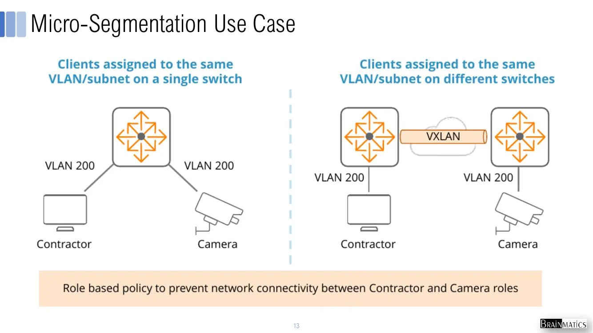

> **Sumber visual:** `Day - 5.pdf`, halaman 13.  
> **Cara membaca:** Dua endpoint dapat berada pada VLAN/subnet yang sama tetapi tetap dipisahkan berdasarkan role. Policy diterapkan pada ingress sehingga akses Contractor ke Camera dapat ditolak tanpa harus membuat subnet baru.

| Jenis | Contoh |
|---|---|
| Micro-segmentation | Contractor dan camera berada pada VLAN yang sama tetapi tidak boleh saling berkomunikasi. |
| Macro-segmentation | Contractor dan medical device berada pada VLAN/VRF berbeda dan policy tetap mengikuti role. |

### 2.3 Cara Kerja

1. Endpoint diautentikasi.
2. Endpoint mendapat role.
3. Role dipetakan ke Group Policy ID.
4. Ingress VTEP menambahkan Group Policy ID ke VXLAN header.
5. Egress VTEP menerapkan policy berdasarkan source/destination role.

Materi menunjukkan default konsep:

- client dengan role sama dapat diizinkan;
- client dengan role berbeda ditolak kecuali ada policy yang mengizinkan.

### 2.4 Contoh Mapping Role ke Policy ID

```text
gbp enable
gbp role-tag mapping Employee 100
gbp role-tag mapping Contractor 200
gbp role-tag mapping Medical-gear 300
```

### 2.5 Contoh Class GBP

```text
class gbp-ip IP-Class-Contractor
    10 match any any Contractor

class gbp-mac MAC-Class-Contractor
    10 match any Contractor arp

class gbp-ip IP-Class-Employee
    10 match any any Employee

class gbp-mac MAC-Class-Employee
    10 match any Employee arp

class gbp-ip IP-Class-Medical-gear
    10 match any any Medical-gear

class gbp-mac MAC-Class-Medical-gear
    10 match any Medical-gear arp

class gbp-ip Allow-Employee-Medical
    10 match udp Employee Medical-gear eq 8644

class gbp-ip Deny-Contractor-Medical
    10 match any Contractor Medical-gear
```

### 2.6 Membuat Policy dan Mengaitkan Role

```text
port-access gbp employee
    10 class gbp-mac MAC-Class-Employee
    20 class gbp-ip IP-Class-Employee

port-access gbp contractor
    10 class gbp-mac MAC-Class-Contractor
    20 class gbp-ip IP-Class-Contractor

port-access gbp medical-gear
    10 class gbp-ip Deny-Contractor-Medical action drop
    20 class gbp-ip Allow-Employee-Medical
    30 class gbp-mac MAC-Class-Medical-gear
    40 class gbp-ip IP-Class-Medical-gear

port-access role Employee
    associate gbp employee

port-access role Contractor
    associate gbp contractor

port-access role Medical-gear
    associate gbp medical-gear
```

> Nama role harus dibuat dan dipetakan secara konsisten pada seluruh VTEP yang memerlukan enforcement.

---

## 3. Wireless IDS/WIPS dan Rogue AP

### 3.1 Mode AP

| Mode | Fungsi Utama |
|---|---|
| Access mode | Melayani client sambil melakukan scanning sesuai kemampuan. |
| Air Monitor | Fokus scanning, IDS, containment, dan monitoring RF. |
| Spectrum Monitor | Analisis spectrum/interference, tidak melayani client. |

### 3.2 Klasifikasi AP

AP yang ditemukan dapat diklasifikasikan sebagai:

- rogue;
- suspected rogue;
- interfering;
- neighbor.

**Rogue AP** adalah AP yang terhubung ke jaringan korporat tanpa otorisasi atau perangkat yang meniru SSID untuk menyerang pengguna.

### 3.3 Containment

Containment dapat memutus koneksi rogue/unauthorized wireless client. Gunakan hanya:

- pada lingkungan yang Anda kelola;
- sesuai kebijakan dan regulasi;
- setelah klasifikasi rogue tervalidasi untuk mencegah gangguan ke jaringan pihak lain.

---

## 4. Service Survivability dan Local Authentication

### 4.1 Authentication Caching pada Switch

Jika RADIUS tidak tersedia:

- endpoint yang sudah pernah berhasil dapat menggunakan cache sesuai konfigurasi;
- RADIUS attribute yang tersimpan dapat dipakai sementara;
- cached reauthentication memiliki periode tertentu.

### 4.2 Authentication Survivability pada Gateway

Materi menjelaskan:

- user tetap dapat terhubung saat RADIUS tidak reachable;
- durasi kehilangan koneksi maksimum dapat dikonfigurasi hingga beberapa hari, contoh materi 7 hari;
- digunakan pada mixed/tunneled mode;
- EAP-TLS menjadi metode yang didukung pada skenario tersebut dalam materi.

### 4.3 AOS-CX Manager Roles

| Role | Hak Akses |
|---|---|
| Administrator | Full CLI dan Web UI, termasuk user management. |
| Operator | Read-only/display access. |
| Auditor | Akses audit/log tertentu. |

Best practice:

- buat minimal satu local administrator dengan password kuat;
- jangan membiarkan admin default tanpa password;
- gunakan aturan panjang dan kompleksitas;
- gunakan AAA terpusat, tetapi tetap sediakan emergency local account yang dilindungi.

---

## 5. RF Optimization

### 5.1 AirMatch


#### Visualisasi Kunci - Cara Kerja AirMatch

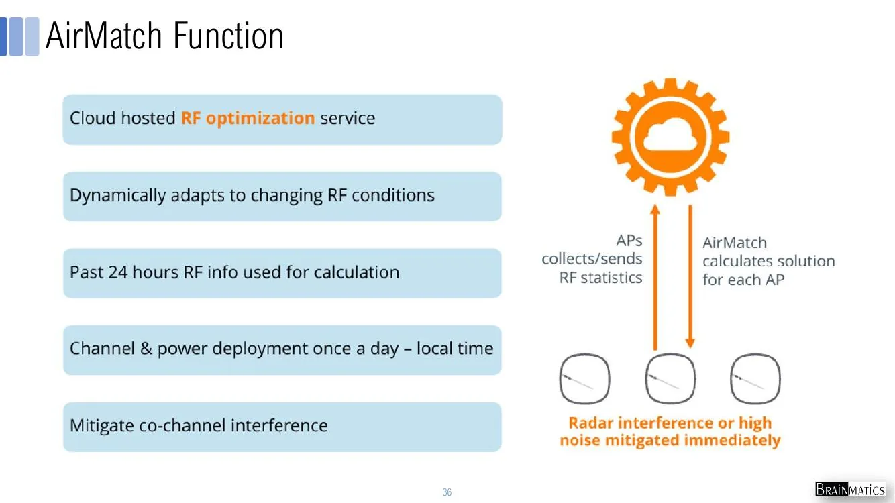

> **Sumber visual:** `Day - 5.pdf`, halaman 36.  
> **Cara membaca:** AirMatch mengolah telemetry RF pada Central untuk menentukan channel, transmit power, dan channel width. Hasil perhitungan kemudian didorong ke AP. Tujuannya adalah optimasi global, bukan keputusan lokal per AP secara terpisah.

AirMatch:

- merupakan layanan optimasi RF berbasis cloud;
- menggunakan data RF historis, termasuk 24 jam terakhir pada contoh materi;
- menghitung channel dan transmit power plan;
- melakukan optimasi rutin, serta dapat merespons interference/noise berat.

### 5.2 ClientMatch

ClientMatch membantu:

- load balancing;
- band steering;
- memindahkan sticky client ke AP yang lebih baik;
- meningkatkan pengalaman roaming.

### 5.3 Broadcast dan Multicast Optimization

Masalah multicast wireless:

- biasanya dikirim pada data rate rendah agar semua client dapat menerima;
- satu client lambat dapat menurunkan efisiensi seluruh cell.

Solusi:

- broadcast filtering;
- multicast transmission optimization;
- Dynamic Multicast Optimization, yaitu mengubah multicast menjadi beberapa unicast saat kondisi memenuhi threshold.

### 5.4 AirGroup

AirGroup menyediakan discovery service lintas VLAN dan policy untuk layanan seperti:

- AirPlay;
- AirPrint;
- Google Cast;
- perangkat multimedia/IoT berbasis mDNS/DLNA.

Tujuannya adalah mengontrol siapa dapat menemukan layanan apa tanpa membuka seluruh multicast discovery ke semua VLAN.

---

## 6. QoS


#### Visualisasi Kunci - Dasar QoS: Classification, Marking, dan Queuing

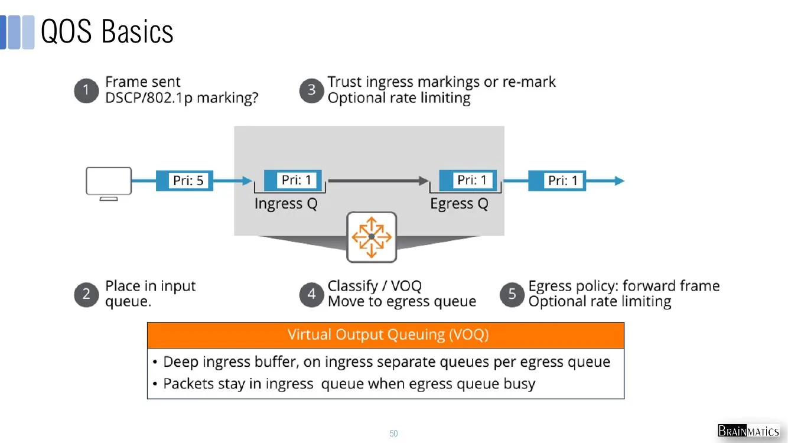

> **Sumber visual:** `Day - 5.pdf`, halaman 50.  
> **Cara membaca:** Traffic dikenali terlebih dahulu, kemudian diberi marking dan ditempatkan pada queue yang sesuai. QoS tidak menciptakan bandwidth; QoS menentukan traffic mana yang diprioritaskan ketika terjadi kontensi.

### 6.1 Tujuan

QoS memberikan perlakuan berbeda pada traffic:

- voice;
- video;
- control traffic;
- business application;
- best effort/background.

### 6.2 Tahapan QoS

1. **Classify** - identifikasi traffic.
2. **Mark** - beri nilai priority.
3. **Queue** - masukkan ke antrean.
4. **Schedule/Service** - tentukan urutan pengiriman.

### 6.3 L2 dan L3 Marking

| Marking | Bit | Lokasi |
|---|---:|---|
| 802.1p/PCP | 3 bit | VLAN tag Layer 2 |
| DSCP | 6 bit | IP header Layer 3 |

Contoh umum:

- voice dapat menggunakan prioritas tinggi/EF;
- network control menggunakan class khusus;
- best effort menggunakan nilai default.

> Trust boundary harus jelas. Jangan mempercayai marking dari seluruh endpoint tanpa validasi karena client dapat menandai traffic-nya sendiri sebagai high priority.

### 6.4 Rate Limiting

Rate limiting digunakan untuk:

- mengontrol bandwidth;
- mencegah flooding/storm;
- membatasi BUM atau ICMP sesuai kebutuhan;
- melindungi link dan control plane.

Konfigurasi dapat diterapkan per interface fisik atau LAG.

### 6.5 Classifier-Based QoS

Contoh pola:

```text
class ip VOICE
    10 match udp any any eq 5060 count

policy POLICY-VOICE
    10 class ip VOICE action local-priority 5

interface 1/1/1
    apply policy POLICY-VOICE in
```

> Sesuaikan syntax dengan versi AOS-CX dan tipe classifier yang digunakan pada lab.

### 6.6 LLDP dan LLDP-MED

LLDP:

- menemukan perangkat tetangga langsung;
- memvalidasi konektivitas Layer 2.

LLDP-MED menambahkan fungsi untuk endpoint seperti IP phone:

- voice VLAN;
- QoS policy;
- power management;
- location information;
- inventory.

---

## 7. Monitoring dan Device Insights

### 7.1 Alert

Alert dapat difilter berdasarkan:

- severity;
- kategori perangkat;
- site/group;
- durasi;
- threshold.

Gunakan:

- default recipient untuk alert global;
- site-level override jika lokasi memiliki tim penerima berbeda;
- custom alert untuk KPI atau threshold khusus.

### 7.2 Device Insights


#### Visualisasi Kunci - Central Device Insights

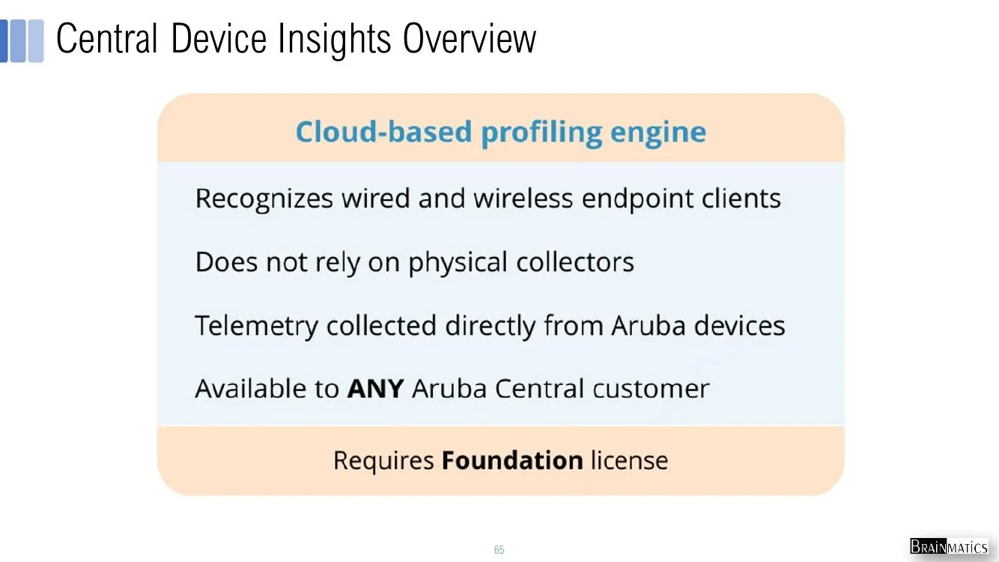

> **Sumber visual:** `Day - 5.pdf`, halaman 65.  
> **Cara membaca:** Device Insights menggunakan telemetry dari perangkat Aruba untuk mengenali endpoint kabel dan nirkabel. Hasil profiling dapat membantu inventory, policy assignment, dan investigasi perangkat yang tidak dikenal.

Device Insights adalah profiling engine berbasis cloud yang:

- mengenali wired dan wireless endpoint;
- menggunakan telemetry dari AP, switch, dan gateway;
- tidak memerlukan collector fisik khusus pada desain yang dijelaskan;
- menampilkan klasifikasi, vendor, OS, application, dan flow sesuai sumber telemetry.

### 7.3 Alur Monitoring yang Baik

1. Alert menunjukkan gejala.
2. Buka device/client dashboard.
3. Periksa timeline, connectivity, RF, role, IP, VLAN, dan application.
4. Korelasikan dengan event pada switch/gateway/ClearPass.
5. Tentukan apakah akar masalah berada pada RF, authentication, DHCP/DNS, routing, policy, atau application.

---

## 8. Checklist Day 5

- [ ] Saya memahami underlay, overlay, VNI, VTEP, dan EVPN.
- [ ] Saya memahami overhead VXLAN dan kebutuhan MTU.
- [ ] Saya dapat menjelaskan GBP dan policy berdasarkan role.
- [ ] Saya memahami micro- dan macro-segmentation.
- [ ] Saya memahami rogue AP, containment, dan survivability.
- [ ] Saya memahami AirMatch, ClientMatch, DMO, dan AirGroup.
- [ ] Saya memahami classify, mark, queue, schedule, 802.1p, dan DSCP.
- [ ] Saya dapat menggunakan alert dan Device Insights untuk troubleshooting.

---

# Cheat Sheet Perintah Penting

> Perintah dapat berbeda menurut versi AOS-CX/AOS 10. Gunakan `?`, `show running-config`, dan dokumentasi release yang sesuai pada perangkat lab.

## VSX

```text
show vsx status
show vsx brief
show lacp interfaces
show interface lag 128
show running-config vsx
```

## OSPF

```text
show ip ospf
show ip ospf neighbors
show ip ospf interface
show ip ospf database
show ip route ospf
show bfd
```

## RADIUS dan Port Access

```text
show aaa authentication port-access
show port-access clients
show port-access clients interface 1/1/1
show radius-server
show radius statistics
show logging | include radius
```

## VLAN dan Interface

```text
show interface brief
show interface 1/1/1
show vlan
show mac-address-table
show arp
show lldp neighbor-info
```

## VXLAN/GBP

```text
show vxlan
show bgp l2vpn evpn summary
show bgp l2vpn evpn
show port-access clients
show running-config | include gbp
```

## Gateway/Client

```text
show user
show datapath tunnel
show cluster
show ap database
```

---

# Troubleshooting Berdasarkan Gejala

## 1. Switch Tidak Dapat Membentuk VSX

Periksa secara berurutan:

1. Interface fisik ISL.
2. LACP dan LAG ID.
3. VLAN/native VLAN pada ISL.
4. `system-mac` harus sama pada pasangan.
5. Role primary dan secondary harus berbeda.
6. Keepalive IP harus saling reachable.
7. Versi software kompatibel.
8. Tidak ada konfigurasi unik yang tertimpa `vsx-sync`.

## 2. OSPF Neighbor Tidak Full

- IP/subnet salah;
- area berbeda;
- hello/dead timer berbeda;
- authentication berbeda;
- network type berbeda;
- MTU mismatch;
- ACL memblokir protocol 89;
- router ID duplikat;
- interface passive.

## 3. Gateway Tidak Masuk Central

- tidak mendapat DHCP/IP;
- DNS gagal resolve Activate/Central;
- NTP/waktu salah;
- akses internet/firewall memblokir layanan Aruba;
- serial/subscription tidak terikat tenant;
- konfigurasi OTP uplink salah.

## 4. SSID Terlihat tetapi Client Tidak Mendapat IP

- role/VLAN salah;
- DHCP tidak reachable dari gateway;
- GRE tunnel belum terbentuk;
- trunk/VLAN bridge tidak tersedia;
- DHCP relay tidak benar;
- policy memblokir DHCP;
- mixed-mode rule mengarahkan client ke jalur yang salah.

## 5. 802.1X Selalu Reject

- certificate RADIUS tidak dipercaya;
- username realm salah;
- password/certificate client salah;
- EAP method tidak cocok;
- shared secret NAS salah;
- ClearPass service/rule tidak match;
- RADIUS source IP atau VRF salah.

## 6. Client Berhasil Autentikasi tetapi Tidak Bisa Akses Aplikasi

- role akhir tidak sesuai;
- policy rule order salah;
- alias berisi network yang salah;
- VLAN/VRF tidak memiliki route;
- DNS gagal;
- gateway firewall memblokir;
- GBP mapping tidak konsisten antarswitch.

## 7. VXLAN Tidak Berfungsi

- underlay VTEP IP tidak reachable;
- MTU terlalu kecil;
- VNI mapping salah;
- BGP EVPN neighbor tidak established;
- route-target/import-export salah;
- VTEP source interface salah;
- VLAN/VNI tidak dibuat pada VTEP tujuan.

## 8. Voice Buruk Walaupun Bandwidth Cukup

- DSCP/802.1p tidak dipercaya atau dihapus;
- voice masuk queue best effort;
- congestion terjadi pada egress;
- rate limit terlalu rendah;
- LLDP-MED voice VLAN tidak diterima phone;
- wireless WMM tidak sesuai;
- interference/RF issue, bukan sekadar bandwidth.

---

# Glosarium

| Istilah | Arti Ringkas |
|---|---|
| AAA | Authentication, Authorization, Accounting. |
| ABR | OSPF Area Border Router. |
| ASBR | Router yang memasukkan external route ke OSPF. |
| AOS-CX | Sistem operasi Aruba CX switch. |
| AirGroup | Kontrol service discovery seperti AirPlay/AirPrint lintas VLAN. |
| AirMatch | Optimasi channel dan transmit power berbasis telemetry. |
| BFD | Protokol deteksi kegagalan cepat. |
| CoA | Change of Authorization dari RADIUS. |
| DDG | Device Designated Gateway dalam gateway cluster. |
| DMO | Dynamic Multicast Optimization. |
| EVPN | Control plane MP-BGP untuk VXLAN. |
| GBP | Group-Based Policy. |
| GRE | Encapsulation tunnel yang digunakan untuk user traffic pada beberapa desain Aruba. |
| ISL | Inter-Switch Link pada VSX. |
| MPSK | Multiple Pre-Shared Key. |
| NAS | Network Access Server/RADIUS client. |
| OTO | Overlay Tunnel Orchestrator. |
| RADIUS | Protokol AAA client-server. |
| Role | Kumpulan policy untuk user/perangkat. |
| UBT | User-Based Tunneling dari switch ke gateway. |
| VNI | VXLAN Network Identifier. |
| VSF | Switch stacking dengan satu sistem logis. |
| VSX | Redundansi dua switch dengan control plane independen dan data plane active-active. |
| VTEP | VXLAN Tunnel Endpoint. |
| WIPS/WIDS | Wireless Intrusion Prevention/Detection System. |
| ZTP/OTP | Zero Touch/One Touch Provisioning. |

---

# Rencana Belajar dan Latihan

## Metode 5 Sesi

| Sesi | Fokus | Praktik Minimal |
|---|---|---|
| 1 | Aruba ESP, Central, VSX | Buat dua switch VSX, ISL, keepalive, VSX LAG, active gateway. |
| 2 | OSPF dan gateway cluster | Buat OSPF multi-area, BFD, lalu konfigurasi gateway cluster. |
| 3 | Secure WLAN | Buat SSID 802.1X, RADIUS, role employee/contractor, dan CoA. |
| 4 | IoT dan wired access | Buat MPSK, mixed mode, wired 802.1X + MAC-auth. |
| 5 | VXLAN/GBP dan operasi | Buat VNI/VTEP, role-based GBP, QoS, alert, dan monitoring. |

## Pertanyaan Uji Pemahaman

1. Mengapa bridge mode dapat memperluas VLAN ke seluruh access layer?
2. Apa perbedaan centralized overlay dan distributed overlay?
3. Mengapa keepalive VSX harus independen dari ISL?
4. Apa yang terjadi jika reference bandwidth OSPF terlalu kecil?
5. Mengapa BFD lebih cepat daripada OSPF dead timer?
6. Apa perbedaan ZTP dan OTP?
7. Mengapa control traffic AP-gateway menggunakan IPsec sementara data menggunakan GRE?
8. Apa fungsi cluster leader dan bucket map?
9. Apa perbedaan Authentication, Authorization, dan Accounting?
10. Kapan RADIUS mengirim Access-Accept tetapi user tetap tidak dapat mengakses jaringan?
11. Apa perbedaan initial role, server-derived role, dan post-auth role?
12. Mengapa MAC-auth tidak sekuat 802.1X?
13. Bagaimana MPSK mengurangi dampak kebocoran password?
14. Bagaimana mixed mode menentukan bridge atau tunnel?
15. Apa perbedaan client-based dan device-based authentication?
16. Mengapa VXLAN membutuhkan MTU lebih besar?
17. Apa perbedaan VNI dan VLAN?
18. Bagaimana GBP tetap bekerja walaupun IP endpoint berubah?
19. Apa perbedaan AirMatch dan ClientMatch?
20. Mengapa QoS perlu trust boundary?

## Cara Menilai Kesiapan

Anda dianggap memahami materi ketika dapat:

- menggambar alur paket tanpa melihat slide;
- menjelaskan posisi policy enforcement;
- memprediksi dampak ketika satu komponen gagal;
- membaca output `show` dan menentukan layer yang bermasalah;
- mengubah skenario tanpa hanya menyalin konfigurasi;
- menjelaskan alasan desain, bukan hanya langkah konfigurasi.

---

## Sumber Materi

- `Day - 1.pdf` - Aruba ESP, campus architecture, Central, VSX, dan OSPF.
- `Day - 2.pdf` - AOS 10 gateways, cluster, dan tunneled WLAN.
- `Day - 3.pdf` - secure WLAN, RADIUS, roles, dan guest access.
- `Day - 4.pdf` - MPSK, mixed forwarding, wired authentication, dan dynamic segmentation.
- `Day - 5.pdf` - VXLAN/GBP, security, survivability, RF optimization, QoS, dan monitoring.

> Agar seluruh gambar tampil, pertahankan file Markdown dan folder `aruba_visuals` dalam direktori yang sama. Paket ZIP yang disediakan sudah mempertahankan struktur tersebut.

