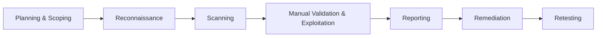
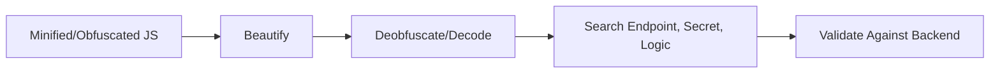
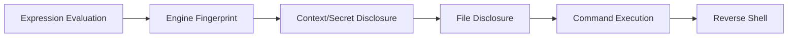
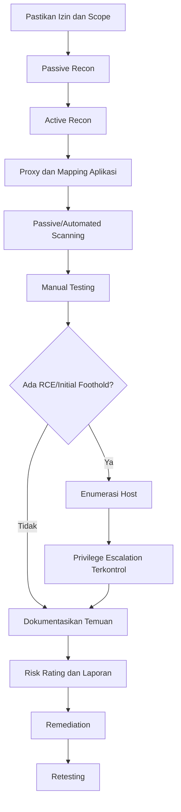

# Ringkasan Materi Pelatihan Penetration Tester

> Ringkasan terpadu materi **Web Application Penetration Testing**, mulai dari perencanaan, reconnaissance, vulnerability scanning, pengujian kerentanan aplikasi web, memperoleh initial foothold, Linux privilege escalation, hingga penyusunan laporan.
>
> **Batas penggunaan:** seluruh teknik hanya boleh digunakan pada laboratorium, sistem milik sendiri, atau target yang telah memberikan izin tertulis dan ruang lingkup pengujian yang jelas.

---

## Daftar Isi

1. [Gambaran Besar Pelatihan](#1-gambaran-besar-pelatihan)
2. [Konsep Security Testing](#2-konsep-security-testing)
3. [Metodologi Penetration Testing](#3-metodologi-penetration-testing)
4. [Reconnaissance](#4-reconnaissance)
5. [Vulnerability Scanning](#5-vulnerability-scanning)
6. [Common Vulnerabilities dan ITSA Top 5](#6-common-vulnerabilities-dan-itsa-top-5)
7. [Burp Suite](#7-burp-suite)
8. [HTML Injection dan XSS](#8-html-injection-dan-xss)
9. [JavaScript Analysis](#9-javascript-analysis)
10. [Open Redirect](#10-open-redirect)
11. [SQL Injection](#11-sql-injection)
12. [Server-Side Request Forgery](#12-server-side-request-forgery)
13. [Cross-Site Request Forgery](#13-cross-site-request-forgery)
14. [JWT Attacks](#14-jwt-attacks)
15. [Server-Side Template Injection](#15-server-side-template-injection)
16. [Command Injection dan Reverse Shell](#16-command-injection-dan-reverse-shell)
17. [Path Traversal dan Local File Inclusion](#17-path-traversal-dan-local-file-inclusion)
18. [File Upload Vulnerability](#18-file-upload-vulnerability)
19. [Linux Privilege Escalation](#19-linux-privilege-escalation)
20. [Pelaporan Kerentanan](#20-pelaporan-kerentanan)
21. [Workflow Pentest Terintegrasi](#21-workflow-pentest-terintegrasi)
22. [Cheat Sheet Perintah](#22-cheat-sheet-perintah)
23. [Checklist Persiapan Ujian dan Praktik](#23-checklist-persiapan-ujian-dan-praktik)

---

# 1. Gambaran Besar Pelatihan

## 1.1 Tujuan

Peserta diharapkan mampu:

- melaksanakan pengujian keamanan aplikasi web secara mandiri;
- menentukan ruang lingkup dan metode pengujian;
- melakukan reconnaissance, scanning, eksploitasi terkontrol, dan retesting;
- membuktikan dampak kerentanan tanpa melampaui tujuan pengujian;
- menyusun laporan yang jelas, terukur, dan dapat ditindaklanjuti;
- memahami jalur dari kerentanan web menuju **Remote Code Execution (RCE)** dan **privilege escalation**;
- mempersiapkan uji kompetensi Penetration Tester.

## 1.2 Ruang Lingkup Materi

| Area | Pokok materi |
|---|---|
| Perencanaan | Scope, Rules of Engagement, NDA, kesiapan objek uji |
| Recon | Passive dan active reconnaissance |
| Scanning | OWASP ZAP, Nuclei, fingerprinting |
| Access control | Broken Access Control, IDOR, privilege escalation horizontal/vertikal |
| Authentication | Brute force, weak password, username enumeration, session abuse |
| Injection | SQLi, HTML Injection, XSS, SSTI, Command Injection |
| Server-side | SSRF, Path Traversal, LFI, File Upload |
| Token | JWT tampering, weak secret, algorithm confusion |
| Foothold | Web shell, RCE, reverse shell, TTY upgrade |
| Privilege escalation | Kernel, SUID, sudo, weak permissions |
| Reporting | Judul, deskripsi, dampak, CVSS, PoC, rekomendasi, retesting |

## 1.3 Etika Utama

> [!IMPORTANT]
> Akses tanpa izin tetap merupakan akses ilegal, walaupun tujuannya belajar atau menguji keamanan.

Prinsip yang wajib diterapkan:

- bekerja hanya pada target dalam **scope**;
- memiliki izin tertulis dan NDA;
- tidak menyimpan atau menyebarkan data sensitif;
- menghentikan eksploitasi ketika bukti dampak sudah cukup;
- mendokumentasikan semua tindakan;
- segera melaporkan temuan kritis;
- menjaga kerahasiaan hasil pengujian.

---

# 2. Konsep Security Testing

## 2.1 Vulnerability Assessment, Penetration Test, dan Red Team

| Aspek | Vulnerability Assessment | Penetration Testing | Red Teaming |
|---|---|---|---|
| Fokus | Cakupan luas | Seimbang antara luas dan dalam | Tujuan/impact organisasi |
| Tujuan | Mengidentifikasi kandidat kerentanan | Memvalidasi dan membuktikan dampak | Menguji ketahanan deteksi dan respons secara menyeluruh |
| Pendekatan | Dominan otomatis | Otomatis dan manual | Simulasi adversary, manual, dan berantai |
| Kedalaman | Rendah-sedang | Sedang-tinggi | Tinggi dan berorientasi sasaran |
| Output | Daftar kerentanan prioritas | Temuan tervalidasi beserta PoC | Pencapaian objective dan evaluasi kontrol pertahanan |

**Tidak ada metode yang selalu paling baik.** Pemilihan bergantung pada tujuan, maturitas, risiko, waktu, anggaran, dan izin yang tersedia.

## 2.2 Acuan dan Standar

Acuan yang digunakan dalam materi:

- OWASP Web Security Testing Guide v4.2;
- OWASP Top 10;
- NIST SP 800-115;
- Penetration Testing Execution Standard (PTES);
- OSSTMM;
- Perpres Nomor 95 Tahun 2018 tentang SPBE;
- Peraturan BSSN Nomor 4 Tahun 2021 mengenai keamanan SPBE.

Peraturan BSSN Nomor 4 Tahun 2021 mengelompokkan fungsi keamanan aplikasi, antara lain autentikasi, manajemen sesi, kontrol akses, validasi input, kriptografi, penanganan error dan log, proteksi data, keamanan komunikasi, logika bisnis, file, API/web service, dan konfigurasi.

---

# 3. Metodologi Penetration Testing



## 3.1 Planning dan Scoping

Tentukan sebelum pengujian dimulai:

- objek dan alamat target;
- fitur yang boleh dan tidak boleh diuji;
- metode black-box, grey-box, atau white-box;
- periode dan jam pelaksanaan;
- batas kecepatan request;
- akun dan role pengujian;
- jenis data yang tidak boleh diakses atau diunduh;
- mekanisme pelaporan temuan kritis;
- prosedur penghentian darurat.

Dokumen penting:

- Non-Disclosure Agreement;
- Rules of Engagement;
- detail teknis dan proses bisnis aplikasi;
- daftar target dan pengecualian;
- kontak PIC teknis dan manajerial;
- bukti backup serta kesiapan environment.

## 3.2 Black Box, Grey Box, dan White Box

| Metode | Informasi awal | Keunggulan | Keterbatasan |
|---|---|---|---|
| Black box | Sangat sedikit | Mirip penyerang eksternal | Waktu banyak terpakai untuk discovery |
| Grey box | Akun/dokumen terbatas | Efisien dan tetap realistis | Cakupan pengetahuan tidak penuh |
| White box | Source code, arsitektur, akun lengkap | Cakupan mendalam | Tidak sepenuhnya menggambarkan serangan eksternal |

---

# 4. Reconnaissance

Reconnaissance adalah proses memetakan **attack surface** sebelum eksploitasi.

## 4.1 Passive vs Active Recon

| Passive Recon | Active Recon |
|---|---|
| Tidak mengirim traffic langsung ke target | Berinteraksi langsung dengan target |
| Memakai data pihak ketiga | Mengirim request dan tercatat di log |
| Risiko operasional lebih rendah | Dapat memicu WAF, IDS, atau rate limit |
| Contoh: Google, GitHub, Wayback, VirusTotal | Contoh: dirsearch, feroxbuster, ffuf, DIRB |

## 4.2 Passive Recon

### Google Dork

Operator dasar:

```text
site:example.test
site:example.test inurl:login
site:example.test filetype:pdf
site:example.test filetype:env
intitle:"index of" example.test
```

Tujuan: menemukan halaman login, file sensitif, dokumen publik, directory listing, dan aset yang terindeks.

### GitHub Dork

```text
"example.test" password
org:example secret
filename:.env
"example" api_key
```

Cari kemungkinan kebocoran:

- API key;
- token;
- credential;
- endpoint internal;
- file konfigurasi;
- source code lama.

### Wayback Machine

Digunakan untuk menemukan:

- endpoint lama yang sudah hilang dari UI;
- parameter historis;
- struktur aplikasi versi terdahulu;
- file dan path yang mungkin masih aktif.

### VirusTotal

Bagian **Relations** dapat membantu memetakan subdomain, URL historis, dan relasi aset.

## 4.3 Active Recon

### Membaca Status Code

| Status | Arti saat recon |
|---|---|
| `200` | Resource tersedia dan dapat diakses |
| `301/302` | Path nyata yang melakukan redirect |
| `401` | Memerlukan autentikasi |
| `403` | Resource ada, tetapi akses ditolak; tetap menarik dianalisis |
| `404` | Resource tidak ditemukan |
| `500` | Error server; mungkin mengungkap informasi internal |

### Directory Brute Force

```bash
# dirsearch
 dirsearch -u https://example.test -e php,bak,old -i 200,301,302,403 -o dirsearch.txt

# feroxbuster
feroxbuster -u https://example.test -w wordlist.txt -t 30

# ffuf - directory
ffuf -u https://example.test/FUZZ -w wordlist.txt

# ffuf - parameter
ffuf -u 'https://example.test/?FUZZ=1' -w parameters.txt

# DIRB
dirb https://example.test /path/to/wordlist.txt
```

Pemilihan tool:

| Tool | Kekuatan utama |
|---|---|
| dirsearch | Mudah, filter extension/status rapi |
| feroxbuster | Cepat dan recursive |
| ffuf | Fleksibel untuk path, file, host, dan parameter |
| DIRB | Sederhana dan cocok untuk fondasi |

## 4.4 Output Recon yang Baik

Hasil akhir reconnaissance sebaiknya berupa:

- domain dan subdomain;
- IP dan port yang diizinkan;
- endpoint dan parameter;
- teknologi dan versi;
- halaman login/admin;
- file backup/configuration;
- fitur sensitif;
- daftar prioritas pengujian.

---

# 5. Vulnerability Scanning

Scanner menjawab **“apa yang mungkin rentan”**, bukan **“apa yang pasti dapat dieksploitasi”**.

## 5.1 Scanning vs Manual Testing

| Scanning | Manual testing |
|---|---|
| Cepat dan repeatable | Memahami konteks aplikasi |
| Menjangkau banyak endpoint | Menemukan logic flaw dan chained exploit |
| Rawan false positive/negative | Lebih lambat dan bergantung kemampuan penguji |

> Setiap temuan scanner harus divalidasi manual sebelum masuk laporan.

## 5.2 OWASP ZAP

Fungsi utama:

- intercepting proxy;
- HTTP history;
- passive scan;
- active scan;
- traditional spider;
- AJAX spider untuk SPA;
- fuzzer dan add-on;
- export report.

Konfigurasi dasar:

1. arahkan proxy browser ke `127.0.0.1:8080`;
2. pasang root certificate ZAP untuk HTTPS;
3. jelajahi aplikasi agar Site Tree terisi;
4. jalankan passive scan terlebih dahulu;
5. active scan hanya dengan izin eksplisit.

### Passive vs Active Scan

- **Passive:** hanya menganalisis traffic yang lewat; relatif aman.
- **Active:** mengirim payload ke target; berpotensi mengubah data dan wajib berizin.

Prioritaskan temuan dengan kombinasi **severity tinggi** dan **confidence tinggi**.

## 5.3 Nuclei

Nuclei adalah scanner CLI berbasis template YAML.

```bash
# update template
nuclei -update-templates

# target tunggal
nuclei -u https://example.test -severity critical,high -o nuclei.txt

# beberapa target
nuclei -l targets.txt -severity critical,high

# folder template tertentu
nuclei -u https://example.test -t http/cves/
```

Alur validasi:

1. reproduksi temuan secara manual;
2. buktikan dampak;
3. singkirkan false positive;
4. dokumentasikan request, response, dan bukti.

---

# 6. Common Vulnerabilities dan ITSA Top 5

Kategori yang sering ditemukan dalam pelaksanaan ITSA:

1. Persyaratan Kontrol Akses;
2. Validasi Input;
3. Autentikasi;
4. Logika Bisnis;
5. Penanganan Error.

## 6.1 Broken Access Control dan IDOR

### Broken Access Control

Aplikasi gagal membatasi akses sesuai role atau kepemilikan.

Contoh:

- user biasa membuka URL admin secara langsung;
- fungsi hanya disembunyikan dari UI tetapi tidak dilindungi backend;
- user melakukan aksi yang seharusnya hanya tersedia untuk role lain.

### IDOR

Aplikasi mengekspos referensi objek dan tidak memverifikasi kepemilikan.

```http
GET /invoice/1001
GET /invoice/1002   # apakah data milik user lain dapat dilihat?
```

**Mitigasi:**

- lakukan authorization di server pada setiap request;
- gunakan least privilege;
- validasi subject, object, dan action;
- jangan mengandalkan tombol tersembunyi atau pemeriksaan di JavaScript.

## 6.2 Validasi Input

Kerentanan yang sering muncul:

- Stored XSS;
- Reflected XSS;
- SQL Injection;
- HTML Injection;
- parameter pollution dan injection lain.

Prinsip umum:

- validasi input menggunakan allowlist;
- gunakan encoding sesuai konteks output;
- pisahkan data dari kode;
- gunakan framework yang melakukan auto-escaping;
- jangan menjadikan WAF sebagai kontrol utama.

## 6.3 Autentikasi

Masalah umum:

- password terlalu pendek atau mudah ditebak;
- tidak ada rate limit;
- password default;
- brute force tidak dibatasi;
- MFA tidak tersedia pada fungsi sensitif.

Rekomendasi:

- password panjang dan kuat;
- blokir password umum dan bocor;
- validasi kebijakan password di sisi server;
- wajib ganti password default;
- terapkan rate limit, lockout terukur, CAPTCHA, dan MFA.

## 6.4 Logika Bisnis

Contoh: **username enumeration** melalui respons yang berbeda.

```text
"Username tidak ditemukan"
"Password salah"
```

Respons tersebut membantu penyerang memvalidasi akun yang tersedia.

Mitigasi:

- gunakan pesan generik;
- samakan status code dan karakteristik respons;
- terapkan rate limit;
- pantau pola enumerasi.

## 6.5 Penanganan Error

**Error Message Disclosure** terjadi saat aplikasi menampilkan stack trace, path, query, library, konfigurasi, atau detail internal.

Mitigasi:

- nonaktifkan debug mode di produksi;
- tampilkan halaman error generik;
- simpan detail teknis hanya di log internal;
- gunakan monitoring dan alerting.

---

# 7. Burp Suite

Burp Suite adalah platform pengujian aplikasi web yang bekerja sebagai **intercepting proxy**.

## 7.1 Setup

1. jalankan Burp dan pilih temporary project;
2. atur proxy browser ke `127.0.0.1:8080`;
3. unduh dan trust CA certificate melalui `http://burp`;
4. aktifkan Intercept;
5. pastikan request HTTP dan HTTPS tertangkap.

## 7.2 Modul Penting

| Modul | Fungsi |
|---|---|
| Proxy | Intercept, modify, forward, drop, dan HTTP history |
| Target | Site map serta definisi scope |
| Repeater | Mengirim ulang dan memodifikasi satu request secara manual |
| Intruder | Fuzzing, enumerasi, dan brute force berbasis payload |
| Decoder | URL/Base64/HTML/hex encode-decode |
| Comparer | Membandingkan response byte-by-byte atau word-by-word |
| Sequencer | Mengukur randomness token |
| Logger | Pencatatan traffic lintas modul |
| Extensions | Menambah fungsi Burp melalui BApp Store |

## 7.3 Attack Type Intruder

| Tipe | Penggunaan |
|---|---|
| Sniper | Satu payload set, menguji posisi satu per satu |
| Battering Ram | Payload sama ke seluruh posisi |
| Pitchfork | Payload paralel dan berpasangan |
| Cluster Bomb | Semua kombinasi antar-payload set |

Extensions yang berguna:

- Autorize untuk pengujian authorization;
- Param Miner untuk hidden parameter/header;
- Logger++ untuk logging lanjutan;
- Retire.js untuk library JavaScript usang;
- JWT Editor untuk analisis JWT;
- Turbo Intruder untuk fuzzing berkecepatan tinggi.

**Prioritas belajar:** kuasai **Proxy**, **HTTP History**, dan **Repeater** terlebih dahulu.

---

# 8. HTML Injection dan XSS

## 8.1 Perbedaan

| HTML Injection | XSS |
|---|---|
| Menyisipkan markup HTML | Menjalankan JavaScript |
| Mengontrol tampilan/konten | Mengontrol perilaku browser |
| Dampak utama: spoofing dan social engineering | Dampak utama: pencurian sesi, data, dan aksi atas nama korban |

Akar masalahnya sama: **input tidak tepercaya diperlakukan sebagai kode**.

## 8.2 Tipe

- **Reflected:** payload berasal dari request dan langsung dipantulkan.
- **Stored:** payload disimpan dan dijalankan ketika halaman dibuka.
- **DOM-based:** source dan sink berada di JavaScript browser.
- **Blind:** payload berjalan pada halaman lain, misalnya panel admin.

Probe dasar di laboratorium:

```html
<b>marker-123</b>

```

## 8.3 DOM XSS

Contoh pola rentan:

```javascript
const value = location.hash.slice(1);
document.getElementById('result').innerHTML = value;
```

- **Source:** `location.hash`, query string, `document.referrer`, message event.
- **Sink berbahaya:** `innerHTML`, `outerHTML`, `document.write`, `eval`, `setTimeout(string)`.

## 8.4 Dampak

HTML Injection:

- defacement;
- fake warning;
- instruksi pembayaran palsu;
- fake login form;
- link injection;
- content spoofing.

XSS:

- session hijacking apabila cookie tidak HttpOnly;
- pencurian token di local storage;
- pembacaan data pada DOM;
- aksi sebagai korban;
- phishing dan defacement;
- chaining menuju account takeover.

## 8.5 Mitigasi

- context-aware output encoding;
- Content Security Policy;
- validasi input berbasis allowlist;
- sanitizer seperti DOMPurify untuk HTML yang memang diperbolehkan;
- cookie `HttpOnly`, `Secure`, dan `SameSite`;
- hindari sink berbahaya;
- gunakan template/framework dengan auto-escaping.

> WAF hanya lapisan tambahan. Kontrol utama tetap pada output encoding dan desain kode yang aman.

---

# 9. JavaScript Analysis

Kode client dapat mengungkap informasi penting, tetapi **tidak boleh dianggap sebagai batas keamanan**.

## 9.1 Workflow



Tools:

- Beautifier;
- deobfuscator;
- CyberChef;
- browser DevTools;
- Burp Suite.

## 9.2 Temuan yang Dicari

- hidden endpoint;
- parameter dan header tersembunyi;
- API key, token, JWT, atau cloud credential;
- client-side authorization;
- hardcoded encryption key;
- algoritma encoding/enkripsi request;
- debug flag dan feature flag.

Kata kunci pencarian:

```text
fetch(
XMLHttpRequest
/api/
token
secret
api_key
Authorization
localStorage
sessionStorage
role
admin
AES
```

## 9.3 Prinsip Penting

- Semua kode yang dikirim ke browser dapat dibaca pengguna.
- Secret tidak boleh disimpan di JavaScript client.
- Authorization harus divalidasi di backend.
- Enkripsi sisi client dengan key yang ikut dikirim ke client bukan perlindungan rahasia.

---

# 10. Open Redirect

Open Redirect terjadi ketika aplikasi menerima tujuan redirect dari input pengguna tanpa validasi memadai.

```http
GET /login?next=https://external.example/
```

## 10.1 Parameter Umum

```text
url, redirect, next, return, to, dest, destination, redir, redirect_uri
```

## 10.2 Dampak

- phishing menggunakan domain resmi sebagai pintu masuk;
- pencurian credential;
- penyalahgunaan reputasi domain;
- pada alur tertentu, pencurian token OAuth;
- chaining dengan kerentanan lain.

## 10.3 Kesalahan Validasi Umum

Validasi berbasis `contains()` atau `endsWith()` dapat menerima domain seperti:

```text
trusted.example.attacker.test
attacker-trusted.example
```

Validasi harus memeriksa hostname yang telah dinormalisasi dan melakukan exact match terhadap allowlist.

## 10.4 Mitigasi

- gunakan relative path seperti `/dashboard`;
- terapkan allowlist tujuan redirect;
- parse URL dengan library standar;
- validasi scheme, hostname, port, dan canonical form;
- tampilkan halaman konfirmasi untuk redirect eksternal yang benar-benar diperlukan.

---

# 11. SQL Injection

SQL Injection muncul saat input pengguna disambungkan langsung ke query sehingga batas antara **data** dan **kode SQL** hilang.

```sql
-- Rentan
SELECT * FROM users WHERE username = '" + input + "';

-- Aman secara konsep
SELECT * FROM users WHERE username = ?;
```

## 11.1 Dampak

- pencurian data;
- bypass autentikasi;
- manipulasi atau penghapusan data;
- kebocoran credential;
- akses file;
- pada kondisi tertentu, RCE.

## 11.2 Lima Tipe SQL Injection

| Tipe | Sinyal utama |
|---|---|
| Boolean-based blind | Response berbeda untuk kondisi benar dan salah |
| Error-based | Pesan error DB mengandung data |
| UNION-based | Data tambahan tampil langsung di response |
| Stacked queries | Beberapa query dapat dijalankan dalam satu request |
| Time-based blind | Kondisi benar ditandai penundaan response |

Probe terkontrol:

```text
?id=1' AND 1=1-- -
?id=1' AND 1=2-- -
?id=1' ORDER BY 3-- -
```

## 11.3 Skenario Pengujian

- login form;
- query string GET;
- body POST/JSON;
- endpoint yang membutuhkan session;
- header atau cookie;
- SQLi menuju file write/RCE apabila hak database terlalu tinggi.

## 11.4 sqlmap

```bash
# deteksi dasar
sqlmap -u 'https://example.test/item?id=1' --batch

# enumerasi database
sqlmap -u 'https://example.test/item?id=1' --dbs

# request lengkap dari Burp
sqlmap -r request.txt --batch

# parameter POST
sqlmap -u 'https://example.test/search' --data='q=test' -p q

# sertakan session
sqlmap -u 'https://example.test/account?id=1' \
  --cookie='SESSION=VALUE' --dbs
```

Gunakan opsi agresif hanya bila diizinkan dan diperlukan. Hindari dumping data berlebihan; cukup ambil bukti minimum.

## 11.5 Mitigasi

1. parameterized query/prepared statement;
2. validasi tipe, panjang, dan format input;
3. least privilege pada akun database;
4. sembunyikan error database dari pengguna;
5. monitoring dan WAF sebagai lapisan tambahan;
6. hindari dynamic SQL bila tidak diperlukan.

---

# 12. Server-Side Request Forgery

SSRF memaksa server melakukan request ke target lain atas nama server tersebut.

## 12.1 Titik Masuk

Cari parameter seperti:

```text
url, src, dest, redirect, feed, callback, image, webhook
```

Fitur yang sering relevan:

- fetch URL;
- import dari link;
- image proxy;
- webhook tester;
- PDF/screenshot generator;
- URL preview.

## 12.2 Dampak

- mengakses layanan internal;
- melakukan internal port probing;
- membaca cloud metadata;
- melewati firewall karena request berasal dari server tepercaya;
- membaca file apabila scheme lain diizinkan;
- chaining menuju credential theft, lateral movement, atau RCE.

## 12.3 Blind SSRF

Jika response tidak ditampilkan, gunakan mekanisme OOB yang disetujui, misalnya Burp Collaborator atau interactsh, untuk membuktikan server melakukan koneksi keluar.

## 12.4 Bypass yang Perlu Diantisipasi

- representasi IP alternatif;
- URL encoding;
- open redirect pada domain yang diizinkan;
- DNS rebinding;
- hostname yang menipu validasi string;
- redirect chain.

## 12.5 Mitigasi

- default-deny dan allowlist domain secara eksplisit;
- hanya izinkan scheme `http`/`https` bila diperlukan;
- blokir loopback, link-local, dan private range pada egress firewall;
- resolve DNS dan validasi IP tujuan pada setiap redirect;
- batasi redirect;
- gunakan IMDSv2 atau proteksi metadata setara;
- jangan mengembalikan raw response kepada client.

---

# 13. Cross-Site Request Forgery

CSRF membuat browser korban mengirim request terautentikasi tanpa persetujuannya. Cookie session ikut terkirim otomatis.

## 13.1 Target Utama

Request yang mengubah state:

- transfer;
- ganti email/password;
- hapus akun/data;
- mengubah role;
- menambah admin;
- mengaktifkan konfigurasi sensitif.

## 13.2 Bentuk Serangan

- GET-based melalui link atau resource tag;
- auto-submit POST form;
- JSON CSRF pada konfigurasi tertentu;
- CSRF yang dirangkai dengan XSS.

## 13.3 Cara Menguji

1. tangkap request state-changing di Burp;
2. hapus token CSRF dan replay;
3. ubah token dengan token sesi lain;
4. periksa apakah token terikat ke user/session;
5. periksa validasi `Origin` dan `Referer`;
6. periksa cookie `SameSite`;
7. buat PoC hanya dalam lingkungan yang disetujui.

## 13.4 Mitigasi

- token CSRF acak, unik, dan terikat session;
- cookie `SameSite=Lax` atau `Strict` sesuai kebutuhan;
- validasi `Origin`/`Referer` dengan exact allowlist;
- re-authentication atau OTP untuk aksi kritis;
- jangan gunakan GET untuk perubahan state;
- gunakan custom header pada API;
- cegah XSS karena XSS dapat melemahkan perlindungan CSRF.

---

# 14. JWT Attacks

JWT biasanya berbentuk:

```text
header.payload.signature
```

Header dan payload hanya **Base64URL encoded**, bukan dienkripsi. Signature menjaga integritas token.

## 14.1 Algoritma

- **HS256:** secret simetris untuk sign dan verify.
- **RS256:** private key untuk sign, public key untuk verify.

## 14.2 Pengujian Utama

### Claim Tampering

Ubah claim seperti `role`, `isAdmin`, atau `user_id`. Berhasil apabila server tidak memverifikasi signature secara benar.

### `alg: none`

Uji apakah server menerima token tanpa signature. Library modern seharusnya menolak.

### Weak HS256 Secret

Secret lemah dapat diuji secara offline pada engagement yang diizinkan.

```bash
hashcat -m 16500 jwt.txt /path/to/authorized-wordlist.txt
hashcat -m 16500 jwt.txt --show
```

### Algorithm Confusion

Terjadi bila server mempercayai algoritma dari header token dan menggunakan material key secara salah, misalnya public key RS256 sebagai HMAC secret.

### Header Parameter Abuse

Periksa dengan hati-hati:

- `kid`;
- `jku`;
- `x5u`;
- lokasi JWKS;
- key rotation dan key reuse.

## 14.3 Tools

- jwt.io;
- jwt_tool;
- CyberChef;
- Burp JWT Editor;
- hashcat;
- John the Ripper.

## 14.4 Mitigasi

- tetapkan algoritma di server, jangan percaya nilai `alg` dari client;
- tolak `none` dan algoritma tidak diizinkan;
- gunakan secret acak dan panjang;
- pisahkan key antaralgoritma dan layanan;
- validasi `iss`, `aud`, `exp`, `nbf`, dan signature;
- batasi sumber JWKS;
- rotasi dan lindungi private key;
- jangan menyimpan data sensitif pada payload JWT.

---

# 15. Server-Side Template Injection

SSTI terjadi saat input pengguna digabung ke **template string** dan dievaluasi oleh template engine di server.

```python
# Aman: input sebagai data
render_template('hello.html', name=user_input)

# Rentan: input menjadi bagian template
render_template_string('Hello ' + user_input)
```

## 15.1 SSTI vs XSS

| SSTI | XSS |
|---|---|
| Dieksekusi di server | Dieksekusi di browser |
| Mengakses process, file, environment | Mengakses DOM dan sesi browser |
| Dapat berkembang ke file disclosure dan RCE | Umumnya berdampak pada pengguna/browser |

## 15.2 Deteksi dan Fingerprinting

Probe awal pada lab:

```text
{{7*7}}
${7*7}
<%= 7*7 %>
```

Indikasi:

| Hasil | Kemungkinan engine |
|---|---|
| `{{7*7}}` menjadi `49` | Jinja2 atau Twig |
| `{{7*'7'}}` menjadi `7777777` | Jinja2 |
| `${7*7}` menjadi `49` | Freemarker atau Velocity |
| `<%= 7*7 %>` menjadi `49` | ERB |

## 15.3 Rantai Dampak



Jangan langsung mengejar shell. Buktikan bertahap dan gunakan dampak minimum yang diperlukan.

## 15.4 Blind SSTI

Jika output tidak muncul, deteksi dapat dilakukan melalui:

- perubahan waktu respons;
- callback OOB;
- error behavior;
- perubahan state yang aman dan terkontrol.

## 15.5 Mitigasi

- jangan menggabungkan input ke template string;
- kirim input hanya sebagai data/context variable;
- gunakan logic-less template bila memungkinkan;
- aktifkan sandbox dan batasi objek konteks;
- hindari mengekspos object graph, environment, dan function berbahaya;
- gunakan allowlist terhadap template yang dapat dipilih;
- update template engine dan dependency.

---

# 16. Command Injection dan Reverse Shell

Command Injection terjadi ketika input pengguna dimasukkan ke perintah shell tanpa pemisahan yang aman.

Contoh konsep rentan:

```text
ping <input-user>
```

Karakter pemisah shell seperti `;`, `|`, `&&`, dan substitusi command dapat mengubah maksud perintah apabila input tidak divalidasi.

## 16.1 Dampak

- menjalankan perintah sebagai user aplikasi;
- membaca file dan konfigurasi;
- mengubah data;
- memperoleh RCE;
- membuat koneksi reverse shell;
- menjadi titik awal privilege escalation.

## 16.2 Reverse Shell

Reverse shell adalah koneksi yang **diinisiasi oleh target menuju listener penguji**. Dalam lab:

```bash
# Listener pada mesin penguji
nc -lvnp 4444
```

Gunakan placeholder `ATTACKER_IP` dan port yang diizinkan. Setelah shell diperoleh, identifikasi user dan lingkungan:

```bash
id
whoami
pwd
uname -a
```

Stabilisasi TTY bila Python tersedia:

```bash
python3 -c 'import pty; pty.spawn("/bin/bash")'
```

## 16.3 Mitigasi

- jangan memanggil shell bila tersedia API/library yang aman;
- gunakan argument array, bukan string command;
- allowlist nilai input;
- tolak metacharacter yang tidak diperlukan;
- least privilege dan sandbox;
- egress filtering;
- logging serta alert terhadap child process abnormal.

---

# 17. Path Traversal dan Local File Inclusion

## 17.1 Perbedaan

| Path Traversal | Local File Inclusion |
|---|---|
| Membaca file di luar direktori yang seharusnya | Menyertakan file melalui `include/require` |
| Output berupa isi file mentah | File dapat diparse sebagai kode |
| Dampak utama: information disclosure | Dampak dapat meningkat menjadi RCE |

Probe dasar:

```text
?file=../../../../etc/passwd
?page=../../../../path/to/file
```

## 17.2 File Bernilai Tinggi

Linux:

```text
/etc/passwd
/etc/shadow
/proc/self/environ
~/.ssh/id_rsa
.env
config.php
```

Windows:

```text
C:\Windows\win.ini
web.config
applicationHost.config
```

## 17.3 Bypass Filter yang Perlu Diuji

- nested traversal seperti `....//`;
- URL encoding;
- double encoding;
- absolute path;
- prefix bypass;
- null byte hanya pada stack lama;
- perbedaan separator Windows/Linux.

## 17.4 PHP Wrappers

`php://filter` dapat digunakan dalam lab untuk membaca source code dalam bentuk Base64 tanpa mengeksekusinya. Wrapper lain dapat meningkatkan dampak bila konfigurasi berbahaya aktif.

## 17.5 LFI menuju RCE

Kemungkinan rantai:

- log poisoning;
- session poisoning;
- include file upload;
- PHP wrapper tertentu;
- file temporary atau environment yang dapat dikontrol.

## 17.6 Mitigasi

- petakan identifier ke file yang telah ditentukan, bukan menerima path mentah;
- canonicalize menggunakan `realpath()` dan verifikasi tetap di base directory;
- hardcode extension;
- nonaktifkan wrapper dan remote include yang tidak diperlukan;
- gunakan `open_basedir`, container, atau chroot;
- batasi permission proses web;
- simpan secret di luar direktori yang dapat dibaca aplikasi bila tidak diperlukan.

---

# 18. File Upload Vulnerability

File upload menjadi sangat berbahaya ketika:

1. file penyerang tersimpan;
2. file dapat diakses kembali;
3. server mengeksekusinya sebagai kode.

## 18.1 Anatomi Request

```http
POST /upload HTTP/1.1
Content-Type: multipart/form-data; boundary=BOUNDARY

--BOUNDARY
Content-Disposition: form-data; name="file"; filename="avatar.png"
Content-Type: image/png

<binary data>
--BOUNDARY--
```

Bagian yang diuji:

- `filename` dan extension;
- `Content-Type`/MIME;
- isi file;
- magic bytes;
- lokasi penyimpanan;
- permission dan handler pada folder upload.

## 18.2 Validasi yang Sering Digunakan

| Mekanisme | Kelemahan bila berdiri sendiri |
|---|---|
| Blacklist extension | Banyak extension alternatif dan case variation |
| Whitelist extension | Salah parsing, double extension, dan server misconfiguration |
| Client-supplied MIME | Mudah dimodifikasi |
| Magic bytes | Polyglot apabila hanya byte awal yang diperiksa |
| Image parser | Metadata atau library rentan |

## 18.3 Metodologi Pengujian

1. petakan seluruh titik upload;
2. upload file normal;
3. temukan nama dan URL penyimpanan;
4. periksa apakah folder executable;
5. uji extension satu per satu;
6. uji MIME secara terpisah;
7. uji magic bytes;
8. gabungkan bypass hanya setelah mengetahui kontrol yang aktif;
9. buktikan dampak minimum;
10. hapus artefak pengujian.

> Ubah satu variabel pada setiap percobaan agar diketahui kontrol mana yang menolak file.

## 18.4 Dampak Selain RCE

- stored XSS melalui SVG;
- path traversal pada filename;
- overwrite file;
- Zip Slip;
- denial of service melalui file besar/decompression bomb;
- eksploitasi library pemrosesan gambar;
- malware distribution.

## 18.5 Mitigasi

- allowlist extension dan MIME di sisi server;
- periksa signature serta decode/re-encode file;
- rename menggunakan UUID;
- simpan di luar webroot atau object storage;
- matikan script execution pada folder upload;
- batasi ukuran, jumlah, dan frekuensi upload;
- set `Content-Disposition: attachment` bila sesuai;
- scan antivirus/sandbox;
- jangan mempertahankan nama path dari user;
- gunakan defense in depth.

---

# 19. Linux Privilege Escalation

Privilege escalation bertujuan meningkatkan akses dari user terbatas, misalnya `www-data`, menjadi user yang lebih tinggi seperti `root`.

## 19.1 Enumeration Awal

```bash
id
whoami
hostname
uname -a
cat /etc/os-release
sudo -l
find / -perm -4000 -type f 2>/dev/null
getcap -r / 2>/dev/null
ps aux
ss -lntup
ls -la /etc/cron* /var/spool/cron 2>/dev/null
```

Tools pendukung:

- linPEAS;
- Linux Smart Enumeration;
- LinEnum;
- GTFOBins.

## 19.2 Kernel Exploit

Tahapan:

1. identifikasi kernel dan distribusi;
2. cek apakah versi benar-benar rentan;
3. cocokkan arsitektur serta mitigasi aktif;
4. uji pada environment yang diizinkan;
5. hindari kernel exploit bila jalur miskonfigurasi yang lebih aman tersedia.

Kernel exploit berisiko menyebabkan crash, sehingga menjadi pilihan terakhir.

## 19.3 SUID

SUID menjalankan binary dengan privilege pemilik file.

```bash
find / -perm -4000 -type f 2>/dev/null
```

Analisis:

- apakah binary standar atau custom;
- apakah binary terdapat di GTFOBins;
- apakah memanggil command tanpa absolute path;
- apakah membaca file konfigurasi yang writable;
- apakah menerima input yang dapat memicu command execution.

## 19.4 Sudo Misconfiguration

```bash
sudo -l
```

Perhatikan:

- `NOPASSWD`;
- wildcard;
- environment variable;
- binary yang dapat membuka shell, menjalankan editor, atau membaca file;
- script yang writable;
- path program yang tidak absolut.

## 19.5 Weak File Permissions

Target penting:

- `/etc/passwd`;
- `/etc/shadow`;
- script cron;
- service unit;
- executable yang dijalankan root;
- backup credential;
- SSH key;
- file konfigurasi aplikasi.

Jenis masalah:

- sensitive file readable;
- root-owned script writable;
- directory pada execution path writable;
- credential tersimpan dalam plaintext.

## 19.6 Kontrol Defensif

- patch kernel dan package;
- audit SUID/SGID serta Linux capabilities;
- least privilege pada sudoers;
- permission dan ownership yang ketat;
- gunakan absolute path dalam cron/script;
- lindungi secret;
- monitoring perubahan file dan eksekusi abnormal;
- hardening service serta container.

---

# 20. Pelaporan Kerentanan

Laporan harus dapat dipahami oleh manajemen sekaligus dapat langsung digunakan developer untuk memperbaiki masalah.

## 20.1 Struktur Temuan

1. Judul;
2. Severity dan CVSS;
3. Deskripsi;
4. Lokasi kerentanan;
5. Prasyarat;
6. Dampak;
7. Langkah reproduksi/PoC;
8. Bukti request-response dan screenshot;
9. Rekomendasi;
10. Referensi;
11. Status retesting.

## 20.2 Formula Judul

```text
[Jenis Kerentanan] at [Endpoint] via [Parameter] ([Method])
that could lead to [Dampak Konkret]
```

Contoh:

```text
Open Redirect at /auth/login via next Parameter (GET)
that could Lead to Phishing
```

## 20.3 Deskripsi yang Baik

Sertakan:

- definisi kerentanan;
- endpoint;
- parameter;
- HTTP method;
- role/akun yang digunakan;
- alasan teknis aplikasi rentan;
- kondisi yang diperlukan.

## 20.4 Dampak

Hindari kalimat umum seperti “dapat disalahgunakan”. Jelaskan:

- siapa korban;
- aset yang terdampak;
- data atau fungsi yang dapat diakses;
- kemungkinan chaining;
- dampak terhadap confidentiality, integrity, dan availability.

## 20.5 Proof of Concept

PoC harus:

- berurutan;
- dapat direproduksi;
- memakai data uji seminimal mungkin;
- menyertakan request dan response;
- menyertakan screenshot yang relevan;
- tidak mengandung secret yang tidak perlu;
- tidak merusak data.

## 20.6 CVSS

Cantumkan:

- versi CVSS;
- vector string;
- skor;
- severity;
- alasan pemilihan setiap metrik.

Skor tidak boleh disalin secara mekanis; sesuaikan dengan kondisi implementasi dan dampak nyata.

## 20.7 Rekomendasi

Rekomendasi harus:

- spesifik pada endpoint/komponen;
- teknis dan actionable;
- mengutamakan root cause;
- tidak hanya menyarankan WAF;
- dapat diverifikasi saat retesting.

## 20.8 Template Singkat Temuan

````markdown
## [Judul Temuan]

- **Severity:** High
- **CVSS:** CVSS:3.1/...
- **Endpoint:** `POST /api/...`
- **Parameter:** `...`
- **Role:** User

### Deskripsi
[Jelaskan definisi, lokasi, dan akar masalah.]

### Dampak
[Jelaskan dampak teknis dan bisnis secara konkret.]

### Langkah Reproduksi
1. ...
2. ...
3. ...

### Bukti
```http
[Request dan response yang sudah disanitasi]
```

### Rekomendasi
[Jelaskan perbaikan spesifik dan kontrol tambahan.]

### Status Retesting
- [ ] Belum diperbaiki
- [ ] Perbaikan parsial
- [ ] Sudah diperbaiki
````

---

# 21. Workflow Pentest Terintegrasi



## Urutan Praktis

1. konfirmasi izin, target, akun, dan batasan;
2. passive recon;
3. active recon dengan rate aman;
4. konfigurasi Burp/ZAP dan definisikan scope;
5. jelajahi seluruh fitur dan role;
6. jalankan passive scan;
7. lakukan scanning terkontrol;
8. uji access control terlebih dahulu;
9. uji input pada seluruh konteks;
10. analisis JavaScript dan token;
11. cari jalur server-side menuju file disclosure atau RCE;
12. setelah foothold, lakukan enumerasi privilege escalation;
13. ambil bukti minimum dan bersihkan artefak;
14. susun laporan dan lakukan retesting.

---

# 22. Cheat Sheet Perintah

> Gunakan hanya pada target laboratorium atau target berizin.

## Recon

```bash
# Directory discovery
dirsearch -u https://example.test -e php,bak,old -i 200,301,302,403
feroxbuster -u https://example.test -w wordlist.txt -t 30
ffuf -u https://example.test/FUZZ -w wordlist.txt -fc 404
```

## Nuclei

```bash
nuclei -update-templates
nuclei -u https://example.test -severity critical,high
nuclei -l targets.txt -severity critical,high -o nuclei.txt
```

## SQL Injection

```bash
sqlmap -u 'https://example.test/item?id=1' --batch
sqlmap -r request.txt --batch
sqlmap -u 'https://example.test/search' --data='q=test' -p q
```

## JWT

```bash
# Decode/tamper menggunakan jwt_tool pada token dari lab
python3 jwt_tool.py TOKEN -T

# Uji weak secret secara offline
hashcat -m 16500 jwt.txt /path/to/authorized-wordlist.txt
```

## Linux Enumeration

```bash
id
uname -a
sudo -l
find / -perm -4000 -type f 2>/dev/null
getcap -r / 2>/dev/null
find / -writable -type f 2>/dev/null
ps aux
ss -lntup
```

## Shell Stabilization

```bash
python3 -c 'import pty; pty.spawn("/bin/bash")'
export TERM=xterm
```

---

# 23. Checklist Persiapan Ujian dan Praktik

## 23.1 Sebelum Pengujian

- [ ] Scope dan izin tertulis tersedia.
- [ ] Target, port, akun, dan role telah dikonfirmasi.
- [ ] Proxy browser berfungsi untuk HTTP dan HTTPS.
- [ ] Wordlist dan tools tersedia.
- [ ] Direktori kerja dan format pencatatan telah disiapkan.
- [ ] Listener hanya dibuka bila diperlukan dan diizinkan.

## 23.2 Recon dan Mapping

- [ ] Passive recon selesai.
- [ ] Endpoint lama dan hidden path diperiksa.
- [ ] Directory brute force dilakukan dengan rate aman.
- [ ] Semua role dan fitur telah dipetakan di Site Map.
- [ ] JavaScript bundle telah dianalisis.

## 23.3 Pengujian Kerentanan

- [ ] Broken Access Control dan IDOR.
- [ ] Weak password, brute force, dan username enumeration.
- [ ] HTML Injection serta XSS reflected/stored/DOM/blind.
- [ ] Open Redirect.
- [ ] SQL Injection pada GET, POST, JSON, header, dan cookie.
- [ ] SSRF pada fitur pemrosesan URL.
- [ ] CSRF pada seluruh aksi state-changing.
- [ ] JWT signature, algorithm, secret, claim, dan key handling.
- [ ] SSTI pada input yang dirender server-side.
- [ ] Command Injection.
- [ ] Path Traversal dan LFI.
- [ ] File Upload beserta lokasi simpan dan execution behavior.

## 23.4 Setelah Initial Foothold

- [ ] Identifikasi user dan host.
- [ ] Periksa sudo, SUID, capabilities, cron, permission, dan credential.
- [ ] Pilih jalur privilege escalation dengan risiko terendah.
- [ ] Hentikan ketika dampak telah terbukti.
- [ ] Jangan melakukan persistence atau covering tracks kecuali secara eksplisit diminta.

## 23.5 Reporting

- [ ] Judul spesifik.
- [ ] Endpoint, parameter, method, role, dan prasyarat jelas.
- [ ] Dampak teknis dan bisnis konkret.
- [ ] PoC dapat direproduksi.
- [ ] Screenshot dan request-response telah disanitasi.
- [ ] CVSS beserta alasan metrik tersedia.
- [ ] Rekomendasi memperbaiki akar masalah.
- [ ] Artefak pengujian telah dibersihkan.
- [ ] Temuan siap untuk retesting.

---

## Kesimpulan Utama

1. **Recon yang baik menentukan kualitas seluruh pentest.**
2. **Scanner hanya memberikan kandidat; validasi manual memberikan kepastian.**
3. **Kontrol akses harus selalu ditegakkan di backend.**
4. **Sebagian besar injection terjadi karena data diperlakukan sebagai kode.**
5. **RCE bukan akhir pengujian; setelah foothold, risiko privilege escalation harus dinilai secara terkontrol.**
6. **Laporan yang baik sama pentingnya dengan kemampuan eksploitasi, karena hasil akhir pentest adalah perbaikan keamanan.**
7. **Seluruh pengujian harus legal, terukur, terdokumentasi, dan berada dalam scope.**

